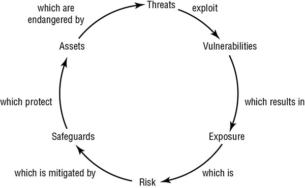

## Personnel Security Policies and Procedures

Humans are the weakest element in any security solution. No matter what physical or logical controls are deployed, humans can discover ways to avoid them, circumvent or subvert them, or disable them. Thus, it is important to take into account the humanity of your users when designing and deploying security solutions for your environment. To understand and apply security governance, you must address the weakest link in your security chain—namely, people.

Crafting `job descriptions` is the first step in defining security needs related to personnel and being able to seek out new hires.  `Roles` typically align to a `rank or level of privilege`, while `job description`s map to specifically assigned `responsibilities and tasks`. While creating job description consider if its required to handle sensitive material or have access to classified information. 

Some organizations must craft job descriptions to be in compliance with `Service Organization Control (SOC) 2`, while others following `ISO 27001` require annual reviews of job descriptions.

Important elements in constructing job descriptions that are in line with organizational processes include separation of duties, job responsibilities, and job rotation.

**Separation of Duties** Separation of duties is the security concept in which critical, significant, and sensitive work tasks are divided among several individual administrators or high-level operators. This prevents any one person from having the ability to undermine or subvert vital security mechanisms.


Separation of duties is also a protection against collusion. *Collusion* is the occurrence of negative activity undertaken by two or more people, often for the purposes of fraud, theft, or espionage.

**Job Responsibilities** Job responsibilities are the specific work tasks an employee is required to perform on a regular basis. Depending on their responsibilities, employees require access to various objects, resources, and services. Access should be assigned according to the principle of least privilege. The *principle of least privilege* states that in a secured environment, users should be granted the `minimum amount of access necessary` for them to complete their required work tasks or job responsibilities

**Job Rotation** rotating employees among multiple job positions. serves two functions - first, have knowledge redundancy and second, reduces the risk of fraud, data modification, theft, sabotage, and misuse of information.

The assignment of privileges, permissions, rights, access, and so on, should be periodically reviewed to check for privilege creep or misalignment with job responsibilities. `Privilege creep` occurs when workers accumulate privileges over time as their job responsibilities change

*Cross-training* the workers are just prepared to perform the other job positions; they are not rotated through them on a regular basis.

### CANDIDATE SCREENING AND HIRING

* Thoroughness of the screening process should reflect the security of the position to be filled.

* Employment candidate screening, background checks, reference checks, education verification, and security clearance validation are essential elements.

* *Background checks* include obtaining a candidate’s work and educational history; checking references; verifying education; interviewing colleagues, neighbors, and friends; checking police and government records for arrests or illegal activities; verifying identity through fingerprints, driver’s license, and birth certificate; and holding a personal interview. This process could also include a polygraph test, drug testing, and personality testing/evaluation.

* Performing online background checks and reviewing the social networking accounts of applicants has become standard practice for many organizations.

### EMPLOYMENT AGREEMENTS AND POLICIES

* When a new employee is hired, they should sign an employment agreement which include:

- outlines the rules and restrictions of the organization
- the security policy
- the acceptable use and activities policies,
- details of the job description
- violations and consequence
- length of time the position is to be filled by the employee

* Another document could be - *nondisclosure agreement (NDA)*. When a person signs an NDA, they agree not to disclose any information that is defined as confidential to anyone outside the organization. Violations of an NDA are often met with strict penalties.

* The NDA has a common companion contract known as the *noncompete agreement (NCA)*. It is used to prevent workers from jumping from one company to another competing company just because of salary increases or other incentives. Often NCAs have a time limit, such as six months, one year, or even three years. NCA at times wont up hold in the courts due to fair wage of employee trumping company interest. But NCA act is good deterrent. 

* Regularly reviewing the boundaries of each job description in relation to what is actually occurring aids in keeping security violations to a minimum. A key part of this review process is enforcing `mandatory vacations`. 

### ONBOARDING AND TERMINATION PROCESSES

* *Onboarding* is the process of adding new employees to the identity and access management (IAM) system of an organization. The onboarding process is also used when an employee’s role or position changes or when that person is awarded additional levels of privilege or access.

* *Offboarding* is the reverse of this process. It is the removal of an employee’s identity from the IAM system once that person has left the organization. This can include disabling and/or deleting the user account, revoking certificates, canceling access codes, and terminating other specifically granted privileges. 

* Onboarding can also refer to organizational socialization. This is the process by which new employees are trained in order to be properly prepared for performing their job Responsibilities. 

* For terminated or offboarded security department and human resources (HR) should work togather. 

* Termination of a employ should be done in a respectful manner. Have aleast one witness, best time to terminate an employee is at the end of their shift midweek (easy to job search + natural exist from the premises):


* *Exit interview* should be performed - review the liabilities and restrictions based on employment agreement, nondisclosure agreement, and any other security-related documentation.

### VENDOR, CONSULTANT, AND CONTRACTOR AGREEMENTS AND CONTROLS

* Vendor, consultant, and contractor controls are used to define the levels of performance, expectation, compensation, and consequences for entities, persons, or organizations that are external to the primary organization. Often these controls are defined in a document or policy known as a *service-level agreement (SLA)*.

* The following issues are commonly addressed in SLAs:

	* System uptime (as a percentage of overall operating time)
	* Maximum consecutive downtime (in seconds/minutes/and so on)
	* Peak load
	* Average load
	* Responsibility for diagnostics
	* Failover time (if redundancy is in place)

* SLAs also commonly include financial and other contractual remedies that kick in if the agreement is not maintained. You should ensure that an SLA supports the tenets of your security policy and infrastructure rather than being in conflict with it, which could introduce weak points, vulnerabilities, or exceptions.

### COMPLIANCE POLICY REQUIREMENTS

Compliance is the act of conforming to or adhering to rules, policies, regulations, standards, or requirements. Compliance is an important concern to *security governance*. On a personnel level, compliance is related to whether individual employees follow company policy and perform their job tasks in accordance to defined procedures. Stay in line with company standards as defined in the security policy and remain in compliance with any contractual obligations such as Payment Card Industry Data Security Standard (PCI DSS) to maintain the ability to perform credit card processing. 

### PRIVACY POLICY REQUIREMENTS

Here are some partial definitions of privacy:

* Active prevention of unauthorized access to information that is personally identifiable (that is, data points that can be linked directly to a person or organization)
* Freedom from unauthorized access to information deemed personal or confidential
* Freedom from being observed, monitored, or examined without consent or knowledge

There are many legislative and regulatory compliance issues in regard to privacy. Many US regulations—such as the `Health Insurance Portability and Accountability Act (HIPAA)`, the `Sarbanes-Oxley Act of 2002 (SOX`), the `Family Educational Rights and Privacy Act (FERPA)`, and the `Gramm-Leach-Bliley Act`—as well as the `EU’s Directive 95/46/EC` (aka the Data Protection Directive), the `General Data Protection Regulation (GDPR)` (Regulation (EU) 2016/679), and the contractual requirement `Payment Card Industry Data Security Standard (PCI DSS)`—include privacy requirements. 

## Security Governance

*Security governance* is the collection of practices related to supporting, defining, and directing the security efforts of an organization. 

*Third-party governance* is the system of oversight that may be mandated by law, regulation, industry standards, contractual obligation, or licensing requirements. it generally involves an outside investigator or auditor. Another aspect of third-party governance is the application of security oversight on third parties that your organization relies on. Outsourced operations can include security guards, maintenance, technical support, and accounting services.

On-site assessment or audits need to follow auditing protocols (such as `Control Objectives for Information and Related Technology [COBIT]`) and have a specific checklist of requirements to investigate. 

In the auditing and assessment process, both the target and the governing body should participate in full and open document exchange and review.

*Documentation review* is the process of reading the exchanged materials and verifying them against standards and expectations. The documentation review is typically performed before any on-site inspection takes place.

In many situations, especially related to government or military agencies or contractors, failing to provide sufficient documentation to meet requirements of third-party governance can result in a loss of or a voiding of *authorization to operate (ATO)*.

A portion of the documentation review is the logical and practical investigation of the business processes and organizational policies. 

## Understand and Apply Risk Management Concepts

*Risk management* is a detailed process of identifying factors that could damage or disclose data, evaluating those factors in light of data value and countermeasure cost, and implementing cost-effective solutions for mitigating or reducing risk.

The primary goal of risk management is to reduce risk to an `acceptable level`. 

The process by which the goals of risk management are achieved is known as *risk analysis*. It includes examining an `environment for risks`, evaluating each threat event as to its likelihood of occurring and the cost of the damage it would cause if it did occur, assessing the `cost` of various `countermeasure`s for each risk, and creating a `cost/benefit report` for safeguards to present to upper management. In addition to these risk-focused activities, risk management requires evaluation, assessment, and the assignment of value for all assets within the organization. Without proper `asset valuations`, it is not possible to prioritize and compare risks with possible losses.

### RISK TERMINOLOGY

**Asset** An asset is anything within an environment that should be protected. It can be a computer file, a network service, a system resource, a process, a program, a product, an IT infrastructure, a database, a hardware device, furniture, product recipes/formulas, intellectual property, personnel, software, facilities, and so on.

**Asset Valuation** Asset valuation is a dollar value assigned to an asset based on actual cost and nonmonetary expenses.These can include costs to develop, maintain, administer, advertise, support, repair, and replace an asset;

**Threats** Any potential occurrence that may cause an undesirable or unwanted outcome for an organization or for a specific asset is a threat.They can be intentional or accidental.

**Vulnerability** The weakness in an asset or the absence or the weakness of a safeguard or countermeasure is a vulnerability.

**Exposure** Exposure is being susceptible to asset loss because of a threat; there is the possibility that a vulnerability can or will be exploited by a threat agent or event. Exposure doesn’t mean that a realized threat (an event that results in loss) is actually occurring (the exposure to a realized threat is called experienced exposure).`“What is the worst that could happen?”` The quantitative risk analysis value of exposure factor (EF) is derived from this concept.

**Risk** Risk is the possibility or likelihood that a threat will exploit a 
vulnerability to cause harm to an asset. It is an assessment of probability, possibility, or chance.

```
risk = threat * vulnerability
```

When a risk is realized, a *threat agent, a threat actor, or a threat event* has taken advantage of a vulnerability and caused harm to or disclosure of one or more assets

**Safeguards**  A *safeguard, security control, or countermeasure* is anything that removes or reduces a vulnerability or protects against one or more specific threats.

**Attack** An attack is the exploitation of a vulnerability by a threat agent. An attack can also be viewed as any violation or failure to adhere to an organization’s security policy.

**Breach** A breach is the occurrence of a security mechanism being bypassed or thwarted by a threat agent. When a breach is combined with an attack, a penetration, or intrusion, can result. A penetration is the condition in which a threat agent has gained access to an organization’s infrastructure through the circumvention of security controls and is able to directly imperil assets.



### IDENTIFY THREATS AND VULNERABILITIES

An essential part of risk management is identifying and examining threats. This involves creating an exhaustive list of all possible threats for the organization’s identified assets. The list should include threat agents as well as threat events. Threats to IT are not limited to IT sources. When compiling a list of threats, be sure to consider the following:

  * Viruses
  * Cascade errors (a series of escalating errors) and dependency faults (caused by relying on events or items that don’t exist)
  * Criminal activities by authorized users (espionage, IP theft, embezzlement, etc.)
  * Movement (vibrations, jarring, etc.)
  * Intentional attacks
  * Reorganization
  * Authorized user illness or epidemics
  * Malicious hackers
  * Disgruntled employees
  * User errors
  * Natural disasters (earthquakes, floods, fire, volcanoes, hurricanes, tornadoes, tsunamis, and so on)
  * Physical damage (crushing, projectiles, cable severing, and so on)
  * Misuse of data, resources, or services
  * Changes or compromises to data classification or security policies
  * Government, political, or military intrusions or restrictions
  * Processing errors, buffer overflows
  * Personnel privilege abuse
  * Temperature extremes
  * Energy anomalies (static, EM pulses, radio frequencies [RFs], power loss, power surges, and so on)
  * Loss of data
  * Information warfare
  * Bankruptcy or alteration/interruption of business activity
  * Coding/programming errors
  * Intruders (physical and logical)
  * Environmental factors (presence of gases, liquids, organisms, and so on)
  * Equipment failure
  * Physical theft
  * Social engineering

### RISK ASSESSMENT/ANALYSIS

Upper management must decide which risks are acceptable and which are not. Determining which risks are acceptable requires detailed and complex asset and risk assessments.

There are two risk assessment methodologies: `quantitative and qualitative`. *Quantitative risk analysis* assigns real dollar figures to the loss of an asset. *Qualitative risk analysis* assigns subjective and intangible values to the loss of an asset. Both methods are necessary for a complete risk analysis. Most environments employ a hybrid of both. 

#### Quantitative Risk Analysis

The quantitative method results in concrete probability percentages. That means the end result is a report that has dollar figures for levels of risk, potential loss, cost of countermeasures, and value of safeguards. 

The six major steps or phases in quantitative risk analysis are as follows: 

* Inventory assets, and assign a value (`asset value`, or AV). 
* Research each asset, and produce a list of all possible threats of each individual asset. For each listed threat, calculate the `exposure factor (EF)` and `single loss expectancy (SLE)`.
* Perform a threat analysis to calculate the likelihood of each threat being realized within a single year—that is, the` annualized rate of occurrence (ARO)`.
* Derive the overall loss potential per threat by calculating the `annualized loss expectancy (ALE)`.
* Research countermeasures for each threat, and then calculate the changes to ARO and ALE based on an applied countermeasure.
* Perform a cost/benefit analysis of each countermeasure for each threat for each asset. Select the most appropriate response to each threat.


**Exposure Factor** The exposure factor (EF) represents the percentage of loss that an organization would experience if a specific asset were violated by a realized risk. The EF can also be called the loss potential. The EF is expressed as a percentage.

**Single Loss Expectancy** The EF is needed to calculate the SLE. The single loss expectancy (SLE) is the cost associated with a single realized risk against a specific asset.

```
SLE = asset value (AV) * exposure factor (EF)

SLE = AV * EF
```

The SLE is expressed in a dollar value. For example, if an asset is valued at $200,000 and it has an EF of 45 percent for a specific threat, then the SLE of the threat for that asset is $90,000 (200,000 x 45%).

**Annualized Rate of Occurrence** The annualized rate of occurrence (ARO) is the expected frequency with which a specific threat or risk will occur (that is, become realized) within a single year. 

The ARO can range from a value of 0.0 (zero), indicating that the threat or risk will never be realized, to a very large number, indicating that the threat or risk occurs often. 

It can be derived from historical records, statistical analysis, or guesswork. ARO calculation is also known as probability determination. 

**Annualized Loss Expectancy** The annualized loss expectancy (ALE) is the possible yearly cost of all instances of a specific realized threat against a specific asset.

```
ALE = single loss expectancy (SLE) * annualized rate of occurrence (ARO)

ALE = SLE * ARO
```

For example, if the SLE of an asset is $90,000 and the ARO for a specific threat (such as total power loss) is .5, then the ALE is $45,000. On the other hand, if the ARO for a specific threat (such as compromised user account) is 15, then the ALE would be $1,350,000.

**Calculating Annualized Loss Expectancy with a Safeguard** If the safeguard fails, how much damage does the asset receive? 

With the pre-safeguard ALE and the post-safeguard ALE calculated, there is yet one more value needed to perform a cost/benefit analysis. This additional value is the annual cost of the safeguard.

**Calculating Safeguard Costs** Numerous factors are involved in calculating the value of a countermeasure:

  * Cost of purchase, development, and licensing
  * Cost of implementation and customization
  * Cost of annual operation, maintenance, administration, and so on
  * Cost of annual repairs and upgrades
  * Productivity improvement or loss
  * Changes to environment
  * Cost of testing and evaluation

The annual costs of safeguards should not exceed the expected annual cost of asset loss.

**Calculating Safeguard Cost/Benefit** One of the final computations in this process is the cost/benefit calculation or cost/benefit analysis to determine whether a safeguard actually improves security without costing too much. 

```
ALE before safeguard – ALE after implementing the safeguard – annual cost of safeguard (ACS) = value of the safeguard to the company
```
If the result is negative, the safeguard is not a financially responsible choice. 

```
(pre-countermeasure ALE – post-countermeasure ALE) – ACS

(ALE1 – ALE2) – ACS
```

Quantitative risk analysis formulas: 

Concept	| Formula
--- | ---
Exposure factor (EF) |	%
Single loss expectancy (SLE) |	SLE = AV * EF
Annualized rate of occurrence (ARO)	| # / year
Annualized loss expectancy (ALE) | ALE = SLE * ARO or ALE = AV * EF * ARO
Annual cost of the safeguard (ACS) | $ / year
Value or benefit of a safeguard | (ALE1 – ALE2) – ACS

#### Qualitative Risk Analysis

Qualitative risk analysis is more scenario based than it is calculator based. Rather than assigning exact dollar figures to possible losses, you rank threats on a scale to evaluate their risks, costs, and effects. Since a purely quantitative risk assessment is not possible, balancing the results of a quantitative analysis is essential.  You can use many techniques to perform qualitative risk analysis:

  * Brainstorming
  * Delphi technique
  * Storyboarding
  * Focus groups
  * Surveys
  * Questionnaires
  * Checklists
  * One-on-one meetings
  * Interviews

##### Scenarios

A scenario is a written description of a single major threat. Generally, the scenarios are limited to `one page` of text to keep them manageable. For each scenario, one or more safeguards are described that would completely or partially protect against the major threat discussed in the scenario. analysis participants then rate scenario - High, Medium, and Low or a basic number scale of 1 to 10. 

For examples of reference ratings and levels, please see Table 3-6 and Table 3-7 in National Institute of Technology (NIST) Special Publication (SP) 800-30:

http://csrc.nist.gov/publications/nistpubs/800-30/sp800-30.pdf


##### Delphi Technique

The Delphi technique is simply an anonymous feedback-and-response process used to enable a group to reach an anonymous consensus. 

Comparison of quantitative and qualitative risk analysis

Characteristic	| Qualitative |	Quantitative
--- | --- | ---
Employs complex functions |	No	| Yes
Uses cost/benefit analysis |	No	| Yes
Results in specific values |	No |	Yes
Requires guesswork |	Yes |	No
Supports automation	| No |	Yes
Involves a high volume of information |	No |	Yes
Is objective |	No	|Yes
Uses opinions | Yes |	No
Requires significant time and effort |	No	| Yes
Offers useful and meaningful results |	Yes |	Yes


### RISK RESPONSES

Once the risk analysis is complete, management must address each specific risk. There are several possible responses to risk:

**Reduce or mitigate** Reducing risk, or risk mitigation, Is the implementation of safeguards and countermeasures to eliminate vulnerabilities or block threats. Reducing risk, or risk mitigation.

**Assign or transfer** Assigning risk or transferring risk is the placement of the cost of loss a risk represents onto another entity or organization. Purchasing insurance and outsourcing are common forms of assigning or transferring risk.

**Accept** Accepting risk, risk tolerance, or acceptance of risk is the result after a cost/benefit analysis shows countermeasure costs would outweigh the possible cost of loss due to a risk. It also means that management has agreed to accept the consequences and the loss if the risk is realized.

**Deter** Risk deterrence is the process of implementing deterrents to would-be violators of security and policy. Some examples include implementation of auditing, security cameras, security guards etc.

**Avoid** Risk avoidance is the process of selecting alternate options or activities that have less associated risk than the default, common, expedient, or cheap option. For example, choosing to fly to a destination instead of driving to it is a form of risk avoidance.

**Reject or ignore**  A final but unacceptable possible response to risk is to reject risk or ignore risk. Denying that a risk exists and hoping that it will never be realized are not valid or prudent due-care responses to risk.

Once countermeasures are implemented, the risk that remains is known as *residual risk*. Residual risk comprises threats to specific assets against which upper management chooses not to implement a safeguard.

*Total risk* is the amount of risk an organization would face if no safeguards were implemented. A formula for total risk is as follows:

```
threats * vulnerabilities * asset value = total risk
```

A formula for residual risk is as follows:

```
total risk – controls gap = residual risk
```

### COUNTERMEASURE SELECTION AND IMPLEMENTATION

Selecting a countermeasure or control (short for security control) within the realm of risk management relies heavily on the cost/benefit analysis results.

Security controls, countermeasures, and safeguards can be implemented administratively, logically/technically, or physically. These three categories of security mechanisms should be implemented in a defense-in-depth manner in order to provide maximum benefit


#### Technical

`Technical or logical controls` involve the hardware or software mechanisms used to manage access and to provide protection for resources and systems. As the name implies, it uses technology. Examples of logical or technical controls include authentication methods etc.

#### Administrative

They are sometimes referred to as management controls. These controls focus on personnel and business practices. Examples of administrative controls include policies, procedures, hiring practices, background checks, data classifications and labeling etc. 

#### Physical

They include physical mechanisms deployed to prevent, monitor, or detect direct contact with systems or areas within a facility. Examples of physical controls include guards, fences, motion detectors, locked door etc.

### APPLICABLE TYPES OF CONTROLS

As you read the control descriptions, notice that some are listed as examples of more than one access-control type. For example, a fence (or perimeter-defining device) placed around a building can be a `preventive control` (physically barring someone from gaining access to a building compound) and/or a `deterrent control` (discouraging someone from trying to gain access).

#### Deterrent 

A deterrent control is deployed to discourage violation of security policies. Some examples include policies, security-awareness training, locks, fences, security badges, guards, mantraps, and security cameras.

#### Preventive

A preventive control is deployed to thwart or stop unwanted or unauthorized activity from occurring. Examples of preventive controls include fences, locks, biometrics, mantraps, lighting, alarm systems, separation of duties, job rotation, data classification, penetration testing, access-control methods, encryption, auditing, presence of security cameras or closed-circuit television (CCTV), smartcards, callback procedures, security policies, security-awareness training, antivirus software, firewalls, and intrusion prevention systems (IPSs).

#### Detective

A detective control is deployed to discover or detect unwanted or unauthorized activity. Examples of detective controls include security guards, motion detectors, recording and reviewing of events captured by security cameras or CCTV, job rotation, mandatory vacations, audit trails, honeypots or honeynets, intrusion detection systems (IDSs), violation reports, supervision and reviews of users, and incident investigations.

#### Compensating

A compensation control is deployed to provide various options to other existing controls to aid in enforcement and support of security policies.  For example, an organizational policy may dictate that all PII must be encrypted. A review discovers that a preventive control is encrypting all PII data in databases, but PII transferred over the network is sent in cleartext. A compensation control can be added to protect the data in transit.

#### Corrective 

A corrective control modifies the environment to return systems to normal after an unwanted or unauthorized activity has occurred. Corrective controls can be simple, such as terminating malicious activity or rebooting a system. The control is deployed to repair or restore resources, functions, and capabilities after a violation of security policies.

#### Recovery

Recovery controls are an extension of corrective controls but have more advanced or complex abilities. Examples of recovery controls include backups and restores, fault-tolerant drive systems, system imaging, server clustering, antivirus software, and database or virtual machine shadowin. 

#### Directive

A directive control is deployed to direct, confine, or control the actions of subjects to force or encourage compliance with security policies. Examples of directive controls include security policy requirements or criteria, posted notifications, escape route exit signs, monitoring, supervision, and procedures.

### SECURITY CONTROL ASSESSMENT

*Security control assessment (SCA)* is the formal evaluation of a security infrastructure’s individual mechanisms against a baseline or reliability expectation. The SCA can be performed in addition to or independently of a full security evaluation, such as a penetration test or vulnerability assessment.

Generally, an SCA is a process implemented by federal agencies based on the `NIST Special Publication 800-53A` titled “Guide for Assessing the Security Controls in Federal Information Systems” (https://csrc.nist.gov/publications/detail/sp/800-53a/rev-4/final).

### MONITORING AND MEASUREMENT

Security controls should provide benefits that can be monitored and measured. If a security control’s benefits cannot be quantified, evaluated, or compared, then it does not actually provide any security. A security control may provide native or internal monitoring, or external monitoring might be required. You should take this into consideration when making initial countermeasure selections.

Measuring the effectiveness of a countermeasure is not always an absolute value. Many countermeasures offer degrees of improvement rather than specific hard numbers as to the number of breaches prevented or attack attempts thwarted. Often to obtain countermeasure success or failure measurements, monitoring and recording of events both prior to and after safeguard installation is necessary

### ASSET VALUATION AND REPORTING

An important step in risk analysis is to appraise the value of an organization’s assets. If an asset has no value, then there is no need to provide protection for it. A primary goal of risk analysis is to ensure that only cost-effective safeguards are deployed. 

The following list includes some of the tangible and intangible issues that contribute to the valuation of assets:

  * Purchase cost
  * Development cost
  * Administrative or management cost
  * Maintenance or upkeep cost
  * Cost in acquiring asset
  * Cost to protect or sustain asset
  * Value to owners and users
  * Value to competitors
  * Intellectual property or equity value
  * Market valuation (sustainable price)
  * Replacement cost
  * Productivity enhancement or degradation
  * Operational costs of asset presence and loss
  * Liability of asset loss
  * Usefulness

### CONTINUOUS IMPROVEMENT

### RISK FRAMEWORKS

A risk framework is a guideline or recipe for how risk is to be assessed, resolved, and monitored. The primary example of a risk framework referenced by the CISSP exam is that defined by `NIST in Special Publication 800-37` (http://nvlpubs.nist.gov/nistpubs/SpecialPublications/NIST.SP.800-37r1.pdf). 

**From NIST SP 800-37**


Other risk management frameworks are:

* Operationally critical threat, asset, and vulnerability evaluation (OCTAVE)
* Factor Analysis of Information Risk (FAIR)
* Threat Agent Risk Assessment (TARA)

## Establish and Maintain a Security Awareness, Education, and Training Program

*Behavior modification* involves some level of learning on the part of the user. 

A prerequisite to security training is *awareness*.  Many tools can be used to create awareness, such as posters, notices, newsletter articles, screen savers, T-shirts, rally speeches by managers, announcements, presentations, mouse pads, office supplies, and memos as well as the traditional instructor-led training courses.

*Training* is teaching employees to perform their work tasks and to comply with the security policy. Training is typically hosted by an organization and is targeted to groups of employees with similar job functions. All new employees require some level of training so they will be able to comply with all standards, guidelines, and procedures mandated by the security policy

*Education* is a more detailed endeavor in which students/users learn much more than they actually need to know to perform their work tasks. Education is most often associated with users pursuing certification or seeking job promotion. 

An assessment of the appropriate levels of awareness, training, and education required within the organization should be revised on a regular basis using periodic content reviews.

## Manage the Security Function

* Security must be cost effective.
* Security should be sufficient to withstand typical or standard threats to the organization but not when such security is more expensive than the assets being protected
* Security must be measurable. `provide a clear benefit`
* Resources will be consumed both by the security mechanisms themselves and by the security governance processes. Obviously, security mechanisms should consume as few resources as possible and impact the productivity or throughput of a system at as low a level as feasible.

