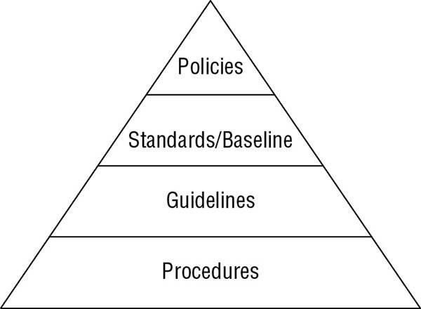

## Understand and Apply Concepts of Confidentiality, Integrity, and Availability

*Confidentiality, integrity, and availability (CIA)* are usually present because these are typically viewed as the primary goals and objectives of a security infrastructure. They are so commonly seen as security essentials that they are referenced by the term *CIA Triad*

Security controls are typically evaluated on how well they address these three core information security tenets. Vulnerabilities and risks are also evaluated based on the threat they pose against one or more of the CIA Triad principles.

### CONFIDENTIALITY

Confidentiality is the concept of the measures used to ensure the protection of the secrecy of data, objects, or resources. The goal of confidentiality protection is to prevent or minimize unauthorized access to data. Example (not an exhaustive list)  encryption, access controls, and steganography.

Numerous `attacks` focus on the violation of confidentiality. These include capturing network traffic and stealing password files as well as social engineering, port scanning, shoulder surfing, eavesdropping, sniffing, escalation of privileges, and so on.  Many instances of unauthorized disclosure of sensitive or confidential information are the result of human error, oversight, or ineptitude.

*Countermeasures*:

Encryption, network traffic padding, strict access control, rigorous authentication procedures, data classification, and extensive personnel training.

`Confidentiality and integrity depend on each other`. Without object integrity (in other words, the inability of an object to be modified without permission), confidentiality cannot be maintained.

Other concepts, conditions, and aspects of confidentiality include the following:

**Sensitivity** refers to the quality of information, which could cause harm or damage if disclosed. 
**Discretion** is an act of decision where an operator can influence or control disclosure in order to minimize harm or damage.
**Criticality** The level to which information is mission critical is its measure of criticality
**Concealment** is the act of hiding or preventing disclosure. `security through obscurity`
**Secrecy** is the act of keeping something a secret or preventing the disclosure of information.
**Privacy** refers to keeping information confidential that is personally identifiable or that might cause harm, embarrassment, or disgrace to someone if revealed.
**Seclusion** involves storing something in an out-of-the-way location.
**Isolation** is the act of keeping something separated from others. Isolation can be used to prevent commingling of information or disclosure of information.

### INTEGRITY

Integrity is the concept of protecting the reliability and correctness of data. Integrity protection prevents unauthorized alterations of data. It ensures that data remains correct, unaltered, and preserved.

Integrity can be examined from three perspectives:

* Preventing `unauthorized subjects` from making modifications
* Preventing authorized subjects from making unauthorized modifications, such as `mistakes`
* Maintaining the internal and external `consistency` of objects so that their data is a correct and true reflection of the real world and any relationship with any child, peer, or parent object is valid, consistent, and verifiable.

Numerous `attacks` focus on the violation of integrity. These include viruses, logic bombs, unauthorized access, errors in coding and applications, malicious modification, intentional replacement, and system back doors. Human error, oversight, or ineptitude accounts for many instances of unauthorized alteration of sensitive information.

*Countermeasures*:

Include strict access control, rigorous authentication procedures, intrusion detection systems, object/data encryption, hash total verifications, interface restrictions, input/function checks, and extensive personnel training.

`Integrity is dependent on confidentiality`

Other concepts, conditions, and aspects of integrity include the following:

* *Accuracy*: Being correct and precise
* *Truthfulness*: Being a true reflection of reality
* *Authenticity*: Being authentic or genuine
* *Validity*: Being factually or logically sound
* *Nonrepudiation*: Not being able to deny having performed an action or activity or being able to verify the origin of a communication or event
* *Accountability*: Being responsible or obligated for actions and results
* *Responsibility*: Being in charge or having control over something or someone
* *Completeness*: Having all needed and necessary components or parts
* *Comprehensiveness*: Being complete in scope; the full inclusion of all needed elements

### AVAILABILITY

The third principle of the CIA Triad is availability, which means authorized subjects are granted timely and uninterrupted access to objects. Often, availability protection controls support sufficient bandwidth and timeliness of processing as deemed necessary by the organization or situation.

Availability includes efficient uninterrupted access to objects and prevention of denial-of-service (DoS) attacks. Availability also implies that the supporting infrastructure—including network services, communications, and access control mechanisms—is functional and allows authorized users to gain authorized access.

There are numerous `threats` to availability. These include device failure, software errors, and environmental issues (heat, static, flooding, power loss, and so on). There are also some forms of `attacks` that focus on the violation of availability, including DoS attacks, object destruction, and communication interruptions. Human error, oversight, or ineptitude - some events that lead to availability breaches include accidentally deleting files, overutilizing a hardware or software component, under-allocating resources, and mislabeling or incorrectly classifying objects. 

*Countermeasures*

Designing intermediary delivery systems properly, using access controls effectively, monitoring performance and network traffic, using firewalls and routers to prevent DoS attacks, implementing redundancy for critical systems, and maintaining and testing backup systems. Most security policies, as well as business continuity planning (BCP), focus on the use of fault tolerance features at the various levels of access/storage/security (that is, disk, server, or site) with the goal of eliminating single points of failure to maintain availability of critical systems.

`Availability depends on both integrity and confidentiality. Without integrity and confidentiality, availability cannot be maintained`

Other concepts, conditions, and aspects of availability include the following:

* *Usability*: The state of being` easy to use or learn` or being able to be understood and controlled by a subject
* *Accessibility*: The assurance that the widest range of subjects can interact with a resource regardless of their capabilities or limitations
* *Timeliness*: Being prompt, on time, within a reasonable time frame, or providing low-latency response

### OTHER SECURITY CONCEPTS

*AAA services*, what is not as clear is that although there are three letters in the acronym, it actually refers to five elements: `identification, authentication, authorization, auditing, and accounting`. These five elements represent the following processes of security:

* *Identification*: Claiming to be an identity when attempting to access a secured area or system
* *Authentication*: Proving that you are that identity
* *Authorization*: Defining the permissions (i.e., allow/grant and/or deny) of a resource and object access for a specific identity
* *Auditing*: Recording a log of the events and activities related to the system and subjects
* *Accounting (aka accountability)*: Reviewing log files to check for compliance and violations in order to hold subjects accountable for their actions

#### Identification

* A *subject* must provide an identity to a system to start the process of authentication, authorization, and accountability (AAA). Providing an identity can involve typing in a username; swiping a smart card; waving a proximity device; speaking a phrase; or positioning your face, hand, or finger for a camera or scanning device. Without an identity, a system has no way to correlate an authentication factor with the subject.

#### Authentication

* The process of verifying or testing that the claimed identity is valid is authentication.
* Authentication verifies the identity of the subject by comparing one or more factors against the database of valid identities (that is, user accounts).
* The *authentication factor* used to verify identity is typically labeled as, or considered to be, private information. The capability of the subject and system to maintain the secrecy of the authentication factors for identities directly reflects the level of security of that system.
* A subject can provide several types of authentication—for example, `something you know` (e.g., passwords, PINs), `something you have` (e.g., keys, tokens, smart cards), `something you are ` (e.g., biometrics, such as fingerprints, iris, or voice recognition), and so on.

#### Authorization

* The process of authorization ensures that the requested activity or access to an object is possible given the rights and *privileges* assigned to the authenticated identity. 
* In most cases, the system evaluates an *access control matrix* that compares the subject, the object, and the intended activity.
* Authorization is usually defined using one of the models of access control, such as Discretionary Access Control (DAC), Mandatory Access Control (MAC), or Role Based Access Control (RBAC or role-BAC)

#### Auditing

* Auditing, or monitoring, is the programmatic means by which a subject’s actions are tracked and recorded for the purpose of holding the subject accountable for their actions while authenticated on a system.
*  It is also the process by which unauthorized or abnormal activities are detected on a system

> Monitoring is a type of watching or oversight, while auditing is a recording of the information into a record or file

#### Accountability

* An organization’s security policy can be properly enforced only if accountability is maintained. In other words, you can maintain security only if subjects are held accountable for their actions. 

> LEGALLY DEFENSIBLE SECURITY: If you are unable to convince a court that your log files are accurate and that no other person other than the subject could have committed the crime, you will not obtain restitution.

### PROTECTION MECHANISMS

#### LAYERING

* Layering, also known as *defense in depth*, is simply the use of multiple controls in a series. Using a multilayered solution allows for numerous, different controls to guard against whatever threats come to pass.
* Using layers in a `series` `rather than in parallel` is important. Performing security restrictions in a series means to perform one after the other in a `linear fashion`.

#### ABSTRACTION

* Abstraction is used for `efficiency`. `Similar elements` are put into `groups, classes, or roles` that are assigned security controls, restrictions, or permissions as a collective.

* Abstraction is used to define what types of data an object can contain, what types of functions can be performed on or by that object, and what capabilities that object has.

#### DATA HIDING

* Data hiding is exactly what it sounds like: preventing data from being discovered or accessed by a subject by positioning the data in a logical storage compartment that is not accessible or seen by the subject.

* The term *security through obscurity* may seem relevant here. Data hiding is the act of intentionally positioning data so that it is not viewable or accessible to an unauthorized subject, while security through obscurity is the idea of not informing a subject about an object being present and thus hoping that the subject will not discover the object. An example of security though obscurity is when a programmer is aware of a flaw in their software code, but they release the product anyway hoping that no one discovers the issue and exploits it.

#### ENCRYPTION

* Encryption is the art and science of hiding the meaning or intent of a communication from unintended recipients.

* There are various strengths of encryption, each of which is designed and/or appropriate for a specific use or purpose. 

* Weak or poor encryption can be considered as nothing more than obfuscation or potentially even security through obscurity.

## Evaluate and Apply Security Governance Principles

*Security governance* is the collection of practices related to supporting, defining, and directing the security efforts of an organization. 

Some aspects of governance are imposed on organizations due to legislative and regulatory compliance needs, whereas others are imposed by industry guidelines or license requirements. All forms of governance, including security governance, must be assessed and verified from time to time. 

Security affects every aspect of an organization. It is no longer just something the IT staff can handle on their own. Security is a business operations issue

Security governance is commonly managed by a governance committee or at least a board of directors. This is the group of influential knowledge experts whose primary task is to oversee and guide the actions of security and operations for an organization.

There are numerous security frameworks and governance guidelines, including `NIST 800-53 or 800-100`

### ALIGNMENT OF SECURITY FUNCTION TO BUSINESS STRATEGY, GOALS, MISSION, AND OBJECTIVES

* Security management planning ensures proper creation, implementation, and enforcement of a *security policy*. Security management planning `aligns` the security functions to the strategy, goals, mission, and objectives of the organization.

* A *business case* is usually a documented argument or stated position in order to define a need to make a decision or take some form of action. 

* One of the most effective ways to tackle security management planning is to use a *top-down approach*:
  
  * `Upper, or senior, management` is responsible for initiating and defining policies for the organization. 
  * It is the responsibility of `middle management` to flesh out the security policy into standards, baselines, guidelines, and procedures.
  * The `operational managers or security professionals` must then implement the configurations prescribed in the security management documentation.
  * The `end users` must comply with all the security policies of the organization.

*  The team or department responsible for security within an organization should be autonomous. *Information security (InfoSec)* team should be led by a designated *chief information security officer (CISO)* who must report directly to senior management. 
* Term *chief security officer (CSO)* is sometimes used as an alternative to CISO, but in many organizations the CSO position is a subposition under the CISO that focuses on physical security. Another potential term for the CISO is *information security officer (ISO)*, but this also can be used as a subposition under the CISO.

* The best security plan is useless without one key factor: approval by senior management. Developing and implementing a security policy is evidence of `due care and due diligence` on the part of senior management.

A security management planning team should develop three types of plans:

**Strategic Plan**
* Long-term plan that is fairly stable.
* Defines the organization’s security purpose
* Helps to understand security function and align it to the goals, mission, and objectives of the organization.
* Mostly likely a five year plan that is updated annually.
* A strategic plan should include a risk assessment.

**Tactical Plan**
* Is a midterm plan developed to provide more details on accomplishing the goals set forth in the strategic plan or can be crafted ad hoc based upon unpredicted events. 
* Likely useful for about a year 
* Example, project plans, acquisition plans, hiring plans, budget plans, maintenance plans, support plans, and system development plans.

**Operational Plan** 
* An operational plan is a short-term, highly detailed plan based on the strategic and tactical plans.
* Valid or useful only for a short time.
* Operational plans spell out how to accomplish the various goals of the organization
* Include resource allotments, budgetary requirements, staffing assignments, scheduling, and step-by-step or implementation procedures.

### ORGANIZATIONAL PROCESSES

Security governance needs to address organizational processes of acquisitions, divestitures, and governance committees. `Acquisitions and mergers` place an organization at an increased level of `risk`. Such risks include inappropriate information disclosure, data loss, downtime, or failure to achieve sufficient return on investment (ROI). 

Similarly, a `divestiture` or any form of asset or employee reduction is another time period of increased risk and thus increased need for focused security governance. `Assets` need to be `sanitized` to prevent data leakage, storage media should be removed and destroyed, employees released from duty need to be debriefed (exit interviews). 

#### Change Control/Management

* Change in a secure environment can introduce loopholes, overlaps, missing objects, and oversights that can lead to new vulnerabilities. 
* The goal of *change management* is to ensure that any change does not lead to reduced or compromised security. 
* Roll back any change to a previous secured state. 
* Make all changes subject to detailed documentation and auditing and thus able to be reviewed and scrutinized by management.
* The change control process of configuration or change management has several goals or requirements:

	* Implement changes in a `monitored and orderly manner`. Changes are always controlled.
	* A formalized `testing process` is included to `verify` that a change produces expected results.
	* All changes `can be reversed` (also known as backout or rollback plans/procedures).
	* Users are `informed of changes before`they occur to prevent loss of productivity.
	* The effects of `changes are systematically analyzed` to determine whether security or business processes are negatively affected.
	* The `negative impact` of changes on capabilities, functionality, and performance is `minimized`.
	* Changes are reviewed and approved by a *Change Advisory Board (CAB)*.

* One example of a change management process is a parallel run, where old and new system operates parallel so new system tested with the new changes. 

#### Data Classification

* Data classification, or categorization, is the primary means by which data is protected based on its need for secrecy, sensitivity, or confidentiality. 

* Data classification, or categorization, is the process of organizing items, objects, subjects, and so on into groups, categories, or collections with similarities. These similarities could include value, cost, sensitivity, risk, vulnerability, power, privilege, possible levels of loss or damage, or need to know.

* The following are benefits of using a data classification scheme:

	* It demonstrates an organization’s commitment to protecting valuable resources and assets.
	* It assists in identifying those assets that are most critical or valuable to the organization.
	* It lends credence (belief) to the selection of protection mechanisms.
	* It is often required for regulatory compliance or legal restrictions.
	* It helps to define access levels, types of authorized uses, and parameters for declassification and/or destruction of resources that are no longer valuable.
	* It helps with data lifecycle management which in part is the storage length (retention), usage, and destruction of the data.

* To implement a classification scheme, you must perform seven major steps, or phases:

	1- Identify the `custodian`, and define their responsibilities.
	2- Specify the `evaluation criteria` of how the information will be classified and labeled.
	3- Classify and label each resource. (The owner conducts this step, but a supervisor should review it.)
	4- `Document` any exceptions to the classification policy that are discovered, and integrate them into the evaluation criteria.
	5- `Select the security controls` that will be applied to each classification level to provide the necessary level of protection.
	6- Specify the `procedures for declassifying resources` and the procedures for transferring custody of a resource to an external entity.
	7- Create an enterprise-wide `awareness` program to instruct all personnel about the classification system.

Levels of government/military classification:

> memorization acronym: U.S. Can Stop Terrorism. Notice that the five uppercase letters represent the five named classification levels, from least secure on the left to most secure on the right (or from bottom to top in the preceding list of items).

* All classified data is exempt from the Freedom of Information Act as well as many other laws and regulations.

* The CISSP exam focuses on four common or possible business classification levels:

**Confidential** This is used for data that is extremely sensitive and for internal use only. `proprietary` `confidential`

**Private** is used for data that is of a private or personal nature and intended for internal use only

> The real difference between the two labels (Confidential vs Private) is that confidential data is company data whereas private data is data related to individuals, such as medical data.

**Sensitive** is used for data that is more classified than public data.

**Public** is used for all data that does not fit in one of the higher classifications. Its disclosure does not have a serious negative impact on the 
organization.

* *Ownership* is the formal assignment of responsibility to an individual or group. Ownership can be made clear and distinct within an operating system where files or other types of objects can be assigned an owner.

### ORGANIZATIONAL ROLES AND RESPONSIBILITIES

The following six roles are presented in the logical order in which they appear in a secured environment:

**Senior Manager**  The organizational owner (senior manager) role is assigned to the person who is ultimately responsible for the security maintained by an organization and who should be most concerned about the protection of its assets.  The senior manager is the person who will be held liable for the overall success or failure of a security solution and is responsible for exercising due care and due diligence in establishing security for an organization.

**Security Professional** *security professional, information security (InfoSec) officer, or computer incident response team (CIRT)* role is assigned to a trained and experienced network, systems, and security engineer who is responsible for following the directives mandated by senior management. `writing the security policy and implementing it`.  they are implementers not decision makers.

**Data Owner**  The data owner role is assigned to the person who is responsible for `classifying information` for placement and protection within the security solution. The data owner is typically a `high-level manager` who is ultimately responsible for data protection. However, the data owner usually `delegates the responsibility` of the actual data management tasks to a `data custodian`.

**Data Custodian** The data custodian role is assigned to the user who is `responsible for the tasks of implementing` the prescribed protection defined by the security policy and senior management. Activities can include performing and testing backups, validating data integrity, deploying security solutions, and managing data storage based on classification.

**User** The user (end user or operator) role is assigned to any person who has access to the secured system `the principle of least privilege` . Follow prescribed operational procedures and operating within defined security parameters.

**Auditor** An auditor is responsible for reviewing and verifying that the security policy is properly implemented and the derived security solutions are adequate. The auditor role may be assigned to a security professional or a trained user. reports that are reviewed by the senior manager. reports are transformed into new directives assigned by the senior manager to security professionals or data custodians.

### SECURITY CONTROL FRAMEWORKS

`planning to plan` 

One of the first and most important security planning steps is to `consider` the overall *security control framework* or structure of the security solution desired by the organization. Most popular option: 

Control Objectives for Information and Related Technology (COBIT) `Most widely used` by the Information Systems Audit and Control Association (ISACA). 

COBIT 5 is based on five key principles for governance and management of enterprise IT:

*Principle 1*: Meeting Stakeholder Needs
*Principle 2*: Covering the Enterprise End-to-End
*Principle 3*: Applying a Single, Integrated Framework
*Principle 4*: Enabling a Holistic Approach
*Principle 5*: Separating Governance From Management

COBIT is used not only to plan the IT security of an organization but also as a `guideline for auditors`

There are many other standards and guidelines for IT security. A few of these are:

* Open Source Security Testing Methodology Manual (OSSTMM) (www.isecom.org/research/): A peer-reviewed guide for the testing and analysis of a security infrastructure

* ISO/IEC 27002 (which replaced ISO 17799) ( https://www.iso.org/standard/54533.html): An international standard that can be the basis of implementing organizational security and related management practices

* Information Technology Infrastructure Library (ITIL) (www.itlibrary.org)

### DUE CARE AND DUE DILIGENCE

Why is planning to plan security so important? One reason is the requirement for *due care and due diligence*. `Due care` is using reasonable care to protect the interests of an organization. `Due diligence` is practicing the activities that maintain the due care effort. 

## Develop, Document, and Implement Security Policy, Standards, Procedures, and Guidelines

Developing and implementing documented security policy, standards, procedures, and guidelines produces a solid and reliable security infrastructure. 

### SECURITY POLICIES

* A *security policy* is a document that defines the scope of security needed by the organization and discusses the assets that require protection and the extent to which security solutions should go to provide the necessary protection

* The security policy is used to assign responsibilities, define roles, specify audit requirements, outline enforcement processes, indicate compliance requirements, and define acceptable risk levels. 

* This document is often used as the proof that senior management has exercised `due care` in protecting itself against intrusion, attack, and disaster. Security policies are compulsory.

* Types:

	* Organizational security policy 
	* Issue-specific security policy
	* System-specific security policy

* Three overall `categories` of security policies: regulatory, advisory, and informative:

	* *Regulatory policy* is required whenever industry or legal standards are applicable to your organization. 
	* *Advisory policy* discusses behaviors and activities that are acceptable and defines consequences of violations. Most policies are advisory.
	* *Informative policy* is designed to provide information or knowledge about a specific subject, such as company goals, mission statements, or how the organization interacts with partners and customers. 

### SECURITY STANDARDS, BASELINES, AND GUIDELINES

*Standards* define compulsory requirements for the homogenous use of hardware, software, technology, and security controls. Standards are tactical documents that `define steps or methods` to accomplish the goals and overall direction defined by security policies.

A *baseline* defines a minimum level of security that every system throughout the organization must meet. All systems not complying with the baseline should be taken out of production until they can be brought up to the baseline. Baselines are usually system specific and often refer to an industry or government standard, like the `Trusted Computer System Evaluation Criteria (TCSEC)` or `Information Technology Security Evaluation and Criteria (ITSEC)` or `NIST (National Institute of Standards and Technology)` standards.

A *guideline* offers recommendations on how standards and baselines are implemented and serves as an operational guide for both security professionals and users. Can be customized for each unique system or condition.

### SECURITY PROCEDURES

A *procedure or standard operating procedure (SOP)* is a detailed, step-by-step how-to document that describes the exact actions necessary to implement a specific security mechanism, control, or solution. In most cases, procedures are system and software specific. 

Keeping these documents as separate entities provides several benefits:

* Not all users need to know the security standards, baselines, guidelines, and procedures for all security classification levels.
* When changes occur, it is easier to update and redistribute only the affected material rather than updating a monolithic policy and redistributing it throughout the organization.

A security policy should not be an afterthought but a key part of establishing an organization.

Comparative relationships of security policy components:

The `security policies` define the `overall structure` of organized security documentation. Then, `standards` are based on those policies as well as mandated by regulations and contracts. From these the `guidelines `are derived. Finally, `procedures` are based on the three other components. The inverted pyramid is used to convey the volume or size of each of these documents.

## Understand and Apply Threat Modeling Concepts and Methodologies

Threat modeling is the security process where potential threats are identified, categorized, and analyzed. *Threat modeling* can be performed as a proactive measure during design and development or as a reactive measure once a product has been deployed.  

It’s common for an organization to begin threat modeling early in the design process of a system and continue throughout its lifecycle. For example, Microsoft uses a Security Development Lifecycle (SDL) process to consider and implement security at each stage of a product’s development

A *proactive approach* to threat modeling takes place during the early stages of systems development, specifically during initial design and specifications establishment. This type of threat modeling is also known as a `defensive approach`.

A *reactive approach* to threat modeling takes place after a product has been created and deployed. This deployment could be in a test or laboratory environment or to the general marketplace. This type of threat modeling is also known as the `adversarial approach`. This technique of threat modeling is the core concept behind ethical hacking, penetration testing, source code review, and fuzz testing

### IDENTIFYING THREATS

Some organizations use one or more of the following three approaches:

**Focused on Assets** This method uses asset `valuation` results and attempts to identify threats to the valuable assets
**Focused on Attackers** Some organizations are able to identify potential attackers and can identify the threats they represent based on the attacker’s goals. 
**Focused on Software**  If an organization develops software, it can consider potential threats against the software

It’s common to pair threats with vulnerabilities to identify threats that can exploit vulnerabilities and represent significant risks to the organization. 

Microsoft developed a threat categorization scheme known as the `STRIDE` threat model. STRIDE is often used in relation to assessing threats against `applications or operating systems`:

*Spoofing*
*Tampering*
*Repudiation*
*Information disclosure*
*Denial of service (DoS)*
*Elevation of privilege* 

*Process for Attack Simulation and Threat Analysis (PASTA)* is a seven-stage threat modeling methodology. PASTA is a `risk-centric` approach that aims at selecting or developing countermeasures in relation to the value of the assets to be protected. The following are the seven steps of PASTA:

Another risk-based approach threat modeling methodology - *Trike*. Trike provides a method of performing a security audit in a reliable and repeatable procedure. It also provides a consistent framework for communication and collaboration among security workers. Trike is used to craft an assessment of an acceptable level of risk for each class of asset that is then used to determine appropriate risk response actions.

*Visual, Agile, and Simple Threat (VAST)* is a threat modeling concept based on Agile project management and programming principles.

### DETERMINING AND DIAGRAMMING POTENTIAL ATTACKS

Next step in threat modeling is to determine the `potential attack concepts` that could be realized. This is often accomplished through the `creation of a diagram` of the elements involved in a `transaction` along with indications of `data flow and privilege boundaries`. 

Such data flow diagrams are useful in gaining a better understanding of the relationships of resources and movement of data through a visual representation.
`crafting an architecture diagram`. Next, identify attacks that could be targeted at each element of the diagram. Keep in mind that all forms of attacks should be considered, including logical/technical, physical, and social

### PERFORMING REDUCTION ANALYSIS

The next step in threat modeling is to perform reduction analysis. *Reduction analysis* is also known as *decomposing* the application, system, or environment. The purpose of this task is to gain a greater understanding of the logic of the product as well as its interactions with external elements. 

In the decomposition process, you must identify five key concepts:

**Trust Boundaries** Any location where the level of trust or security changes
**Data Flow Paths** The movement of data between locations
**Input Points** Locations where external input is received
**Privileged Operations** Any activity that requires greater privileges than of a standard user account or process, typically required to make system changes or alter security
**Details about Security Stance and Approach** The declaration of the security policy, security foundations, and security assumptions

The more you understand exactly how a program, system, or environment operates, the easier it is to identity threats to it.

### PRIORITIZATION AND RESPONSE

Next is to fully `document the threats`. In this documentation, you should define the means, target, and consequences of a threat. Consider including the techniques required to implement an exploitation as well as list potential countermeasures and safeguards.

After documentation, `rank or rate the threats`. This can be accomplished using a wide range of techniques, such as Probability × Damage Potential ranking, high/medium/low rating, or the DREAD system.

The ranking technique of `Probability × Damage Potential` produces a risk severity number on a scale of 1 to 100, with 100 the most severe risk possible.

The `high/medium/low rating` process is even simpler. Each threat is assigned one of these three priority labels based on how soon threat should be addressed.

The `DREAD rating` system is designed to provide a flexible rating solution that is based on the answers to five main questions about each threat:

* *Damage potential*: How severe is the damage likely to be if the threat is realized?
* *Reproducibility*: How complicated is it for attackers to reproduce the exploit?
* *Exploitability*: How hard is it to perform the attack?
* *Affected users*: How many users are likely to be affected by the attack (as a percentage)?
* *Discoverability*: How hard is it for an attacker to discover the weakness?

By asking these and potentially additional customized questions, along with assigning H/M/L or 3/2/1 values to the answers, you can establish a detailed threat prioritization.

## Apply Risk-Based Management Concepts to the Supply Chain

* A secure supply chain is one in which all of the vendors or links in the chain are reliable, trustworthy, reputable organizations that disclose their practices and security requirements to their business partners (although not necessarily to the public). Each link in the chain is responsible and accountable to the next link in the chain

* The goal of a secure supply chain is to ensure that the finished product is of sufficient quality, meets performance and operational goals, and provides stated security mechanisms, and that at no point in the process was any element counterfeited or subjected to unauthorized or malicious manipulation or sabotage

* Considering the cost of a merger/acquisition, it is important to consider the total cost of ownership over the life of the product’s deployment rather than just initial purchase and implementation.

When evaluating a third party for your security integration, consider the following processes:

**On-Site Assessment** 
**Document Exchange and Review**
**Process/Policy Review**
**Third-Party Audit** American Institute of Certified Public Accountants (AICPA), can provide an unbiased review of an entity’s security infrastructure, based on Service Organization Control (SOC) (SOC) reports. Statement on Standards for Attestation Engagements (SSAE) is a regulation that defines how service organizations report on their compliance using the various SOC reports. The `SOC1 and SOC2` auditing frameworks are worth considering for the purpose of a security assessment. The `SOC1` audit focuses on a `description of security mechanisms to assess their suitability`. The `SOC2` audit focuses on `implemented security controls in relation to availability, security, integrity, privacy, and confidentiality`.

Here are some excellent resources related to security integrated with acquisition:

* Improving Cybersecurity and Resilience through Acquisition. Final Report of the Department of Defense and General Services Administration, published November 2013 (www.gsa.gov/portal/getMediaData?mediaId=185371)

* NIST Special Publication 800-64 Revision 2: Security Considerations in the System Development Life Cycle (http://csrc.nist.gov/publications/nistpubs/800-64-Rev2/SP800-64-Revision2.pdf)