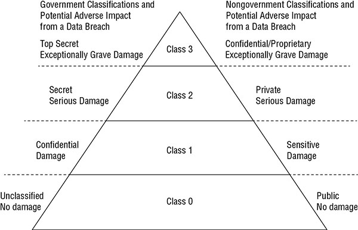
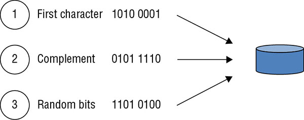

All follow-on actions vary depending on the classification. For example, highly classified data requires stringent security controls. In contrast, unclassified data uses fewer security controls.

## Identify and Classify Assets

Organizations often include classification definitions within a security policy. Personnel then label assets appropriately based on the security policy requirements.

Assets - sensitive data, the hardware used to process it, and the media used to hold it.

### DEFINING SENSITIVE DATA

Sensitive data is any information that `isn’t public or unclassified`. It can include confidential, proprietary, protected, or any other type of data that an organization needs to protect due to its value to the organization, or to comply with existing laws and regulations.

#### Personally Identifiable Information

Personally identifiable information (PII) is any information that can identify an individual. `National Institute of Standards and Technology (NIST) Special Publication (SP) 800-122` provides a more formal definition:

```
Any information about an individual maintained by an agency, including

(1) any information that can be used to distinguish or trace 
an individual’s identity, such as name, social security 
number, date and place of birth, mother’s maiden name,
 or biometric records; and

(2) any other information that is linked or linkable 
to an individual, such as medical, educational, 
financial, and employment information.
```

The key is that organizations have a responsibility to protect PII.

#### Protected Health Information

Protected health information (PHI) is any health-related information that can be related to a specific person. In the United States, the `Health Insurance Portability and Accountability Act (HIPAA)` mandates the protection of PHI.

```
Health information means any information, whether oral
or recorded in any form or medium, that—

(A) is created or received by a health care provider,
 health plan, public health authority, employer, 
 life insurer, school or university, or 
 health care clearinghouse; and

(B) relates to the past, present, or future physical 
or mental health or condition of any individual, 
the provision of health care to an individual, 
or the past, present, or future payment for the 
provision of health care to an individual.
```

Any employer that provides, or supplements, healthcare policies collects and handles PHI.

#### Proprietary Data

Proprietary data refers to any data that helps an organization maintain a competitive edge. It could be software code it developed, technical plans for products, internal processes, intellectual property, or trade secrets. If competitors are able to access the proprietary data, it can seriously affect the primary mission of an organization.

### DEFINING DATA CLASSIFICATIONS

A data classification identifies the value of the data to the organization and is critical to protect data confidentiality and integrity. The policy identifies classification labels used within the organization. It also identifies how data owners can determine the proper classification and how personnel should protect data based on its classification.

Example: government data classifications include top secret, secret, confidential, and unclassified. 

**Top Secret** The top secret label is “applied to information, the unauthorized disclosure of which reasonably could be expected to cause `exceptionally grave damage` to the national security that the original classification authority is able to identify or describe.”

**Secret** The secret label is “applied to information, the unauthorized disclosure of which reasonably could be expected to cause `serious damage` to the national security that the original classification authority is able to identify or describe.”

**Confidential** The confidential label is “applied to information, the unauthorized disclosure of which reasonably could be expected to cause `damage` to the national security that the original classification authority is able to identify or describe.”

**Unclassified** Unclassified refers to any data that doesn’t meet one of the descriptions for top secret, secret, or confidential data. Within the United States, unclassified data is available to anyone, though it often requires individuals to request the information using procedures identified in the Freedom of Information Act (FOIA).

There are additional subclassifications of `unclassified` such as `for official use only (FOUO)` and `sensitive but unclassified (SBU)`. Documents with these designations have strict controls limiting their distribution. As an example, the U.S. Internal Revenue Service (IRS) uses `SBU` for individual tax records, limiting access to these records.

An organization doesn’t just consider the sensitivity of the data but also the criticality of the data.

Data classifications - Government vs Non-Government



> Remember that “sensitive information” typically refers to any information that isn’t public or unclassified.

### DEFINING ASSET CLASSIFICATIONS

Asset classifications should match the data classifications. In other words, if a computer is processing top secret data, the computer should also be classified as a top secret asset.

### DETERMINING DATA SECURITY CONTROLS

After defining data and asset classifications, it’s important to define the security requirements and identify security controls to implement those security requirements. For this example, we’re limiting the type of data to only email. The organization has defined how it wants to protect email in each of the data categories

Securing email data:

Classification | Security requirements for email
--- | ---
Confidential/Proprietary (highest level of protection for any data) | Email and attachments must be encrypted with AES 256. Email and attachments remain encrypted except when viewed. Email can only be sent to recipients within the organization. Email can only be opened and viewed by recipients (forwarded emails cannot be opened). Attachments can be opened and viewed, but not saved. Email content cannot be copied and pasted into other documents.Email cannot be printed.
Private (examples include PII and PHI) | Email and attachments must be encrypted with AES 256. Email and attachments remain encrypted except when viewed. Can only be sent to recipients within the organization.
Sensitive (lowest level of protection for classified data) | Email and attachments must be encrypted with AES 256. 
Public | Email and attachments can be sent in cleartext.

Although it’s possible to meet all of the requirements in above table they require implementing other solutions. For example, these emails pass through a data loss prevention (DLP) server that detects the labels, and applies the required protection.

Additionally, identity and access management (IAM) security controls help ensure that only authorized personnel can access resources.

### UNDERSTANDING DATA STATES

It’s important to protect data in all data states, including while it is at rest, in motion, and in use.

**Data at Rest** Data at rest is any data `stored` on media such as system hard drives, external USB drives, storage area networks (SANs), and backup tapes.

**Data in Transit** Data in transit (sometimes called data in motion) is any data `transmitted over a network`. This includes data transmitted over an internal network using wired or wireless methods and data transmitted over public networks such as the internet.

**Data in Use** Data in use refers to data in memory or temporary storage buffers, while an application is using it. Because an application can’t process encrypted data, it must decrypt it in memory.

The best way to protect the confidentiality of data is to use strong encryption protocols + strong authentication and authorization controls help prevent unauthorized access.

> The Identity Theft Resource Center (ITRC) routinely tracks data breaches. They post reports through their website (www.idtheftcenter.org/) that are free to anyone

### HANDLING INFORMATION AND ASSETS

A key goal of managing sensitive data is to prevent data breaches. A data breach is any event in which an unauthorized entity can view or access sensitive data. 

#### Marking Sensitive Data and Assets

Marking (often called labeling) sensitive information ensures that users can easily identify the classification level of any data. The most important information that a mark or a label provides is the classification of the data. Marking includes both physical and electronic marking and labels.

`Physical labels` indicate the security classification for the data stored on assets such as media or processed on a system. For example, if a backup tape includes secret data, a physical label attached to the tape makes it clear to users that it holds secret data. A computer used to process confidential, secret, and top secret data should be marked with a label indicating that it processes top secret data. Physical labels remain on the system or media throughout its lifetime.

Marking also includes using `digital marks or labels`. A simple method is to include the classification as a header and/or footer in a document, or embed it as a watermark. Headers aren’t limited to files. Backup tapes often include header information, and the classification can be included in this header.

Another benefit of headers, footers, and watermarks is that DLP systems can identify documents that include sensitive information, and apply the appropriate security controls. Some DLP systems will also add metadata tags to the document when they detect that the document is classified. These tags provide insight into the document’s contents and help the DLP system handle it appropriately.

Organizations often identify procedures to `downgrade media`. For example, if a backup tape includes confidential information, an administrator might want to `downgrade` the tape to unclassified. The organization would identify trusted procedures that will purge the tape of all usable data. After administrators purge the tape, they can then downgrade it and replace the labels. However, many organizations prohibit downgrading media at all. The policy might mandate destroying this tape when it reaches the end of its lifecycle.

#### Handling Sensitive Information and Assets

Handling refers to the secure transportation of media through its lifetime. Personnel handle data differently based on its value and classification, and as you’d expect, highly classified information needs much greater protection. 

One occurrence is the loss of control of backup tapes. Backup tapes should be protected with the same level of protection as the data that is backed up. In other words, if confidential information is on a backup tape, the backup tape should be protected as confidential information. However, there are many cases where this just isn’t followed. 

Logging, monitoring, and auditing - these controls verify that sensitive information is handled appropriately before a significant loss occurs. If a loss does occur, investigators use audit trails to help discover what went wrong. 

#### Storing Sensitive Data

Sensitive data should be stored in such a way that it is protected against any type of loss. The obvious protection is encryption. AES 256 provides strong encryption. 

Follow basic physical security practices to prevent losses due to theft. This includes storing these devices in locked safes or vaults and/or within a secure room that includes several additional physical security controls. 

Environmental controls should be used to protect the media. This includes temperature and humidity controls such as heating, ventilation, and air conditioning (HVAC) systems.

#### Destroying Sensitive Data

Highly classified data requires different steps to destroy it than data classified at a lower level. Security policy or data policy should define the acceptable methods of destroying data based on the data’s classification.

`NIST SP 800-88r1, “Guidelines for Media Sanitization,”` provides comprehensive details on different sanitization methods. Sanitization methods (such as clearing, purging, and destroying) ensure that `data cannot be recovered by any means`. When a computer is disposed of, sanitization includes ensuring that all nonvolatile memory has been `removed or destroyed`; the system doesn’t have compact discs (CDs)/digital versatile discs (DVDs) in any drive; and internal drives (hard drives and solid-state drives (SSDs) have been sanitized, removed, and/or destroyed. Sanitization can refer to the destruction of media or using a trusted method to purge classified data from the media without destroying it.

#### Eliminating Data Remanence

*Data remanence* is the data that remains on media after the data was supposedly erased. It typically refers to data on a hard drive as residual magnetic flux.

One way to remove data remanence is with a `degausser` (generates a heavy magnetic field). Good only for traditional hard drives, magnetic tape, and floppy disk drives. Degaussing SSDs won’t remove data. 

Best method of sanitizing SSDs is `destruction`. The U.S. National Security Agency (NSA) requires the destruction of SSDs using an `approved disintegrator`. Approved disintegrators shred the SSDs to a size of 2 millimeters (mm) or smaller. Another method of protecting SSDs is to ensure that all stored data is encrypted. If a sanitization method fails to remove all the data remnants, the remaining data would be unreadable.

The following list includes some of the common terms associated with destroying data:

**Erasing** 
Erasing media is simply performing a delete operation against a file, a selection of files, or the entire media. In most cases, the deletion or removal process removes only the `directory or catalog link to the data`.  system eventually overwrites the erased data. Retrieve the data using widely available undelete tools.

**Clearing** 
Clearing, or *overwriting*, is a process of preparing media for reuse and ensuring that the cleared data cannot be recovered using traditional recovery tools. One method writes a single character, or a specific bit pattern, over the entire media.

A more thorough method writes a single character over the entire media, writes the character’s complement over the entire media, and finishes by writing random bits over the entire media. It repeats this in three separate passes, as shown in



**Purging** 

Purging Purging is a more intense form of clearing that prepares media for reuse in less secure environments. It provides a level of assurance that the original data is not recoverable using any known methods. A purging process will `repeat the clearing process multiple times` and may `combine` it with another method such as `degaussing` to completely remove the data. 

U.S. government doesn’t consider any purging method acceptable to purge top secret data

**Degaussing** 

A degausser creates a strong magnetic field that erases data on some media in a process called degaussing. It is possible to degauss hard disks, but we don’t recommend it. Degaussing a hard disk will normally destroy the electronics used to access the data. Degaussing does not affect optical CDs, DVDs, or SSDs.

**Destruction** 

Most secure method of sanitizing media. When destroying media it’s important to ensure that the media cannot be reused or repaired and that data cannot be extracted from the destroyed media. Methods of destruction include incineration, crushing, shredding, disintegration, and dissolving using caustic or acidic chemicals. 

*Declassification* involves any process that purges media or a system in preparation for reuse in an unclassified environment. Many organizations choose not to declassify any media and instead destroy it when it is no longer needed.

#### Ensuring Appropriate Asset Retention

Retention requirements apply to `data or records`, `media` holding sensitive data, `systems` that process sensitive data, and `personnel` who have access to sensitive data. `Record retention and media retention` is the most important element of asset retention.

*Record retention* involves retaining and maintaining important information as long as it is needed and destroying it when it is no longer needed. Organizations may have to retain the data due to law or regulation requirement or for its own requirement like auditing logs.

Most hardware is on a refresh cycle, where it is replaced every three to five years. Hardware retention primarily refers to retaining it until it has been properly sanitized.

*Personnel retention* in this context refers to the knowledge that personnel gain while employed by an organization. It’s common for organizations to include `nondisclosure agreements (NDAs)` when hiring new personnel. These NDAs prevent employees from leaving the job and sharing proprietary data with others.

### DATA PROTECTION METHODS

One of the primary methods of protecting the confidentiality of data is encryption. However, it’s worth pointing out the differences between algorithms used for data at rest and data in transit.

#### Protecting Data with Symmetric Encryption

* Symmetric encryption uses the same key to encrypt and decrypt data
* Some commonly used symmetric encryption algorithms:

**Advanced Encryption Standard**  AES supports key sizes of `128 bits, 192 bits, and 256 bits`, and the U.S. government has approved its use to protect classified data up to top secret. Larger key sizes add additional security, making it more difficult for unauthorized personnel to decrypt the data.
**Triple DES**  `112-bit or 168-bit keys`. Triple DES is used in some implementations of the MasterCard, Visa (EMV), and Europay standard for smart payment cards. These smart cards include a chip and require users to enter a personal identification number (PIN) when making a purchase. The combination of a `PIN and 3DES` (or another secure algorithm) provides an added layer of authentication that isn’t available without the PIN.
**Blowfish** It can use key sizes of `32 bits to 448 bits` and is a strong encryption protocol. Linux systems use bcrypt to encrypt passwords, and `bcrypt is based on Blowfish`. Bcrypt adds `128 additional bits as a salt` to protect against rainbow table attacks.

#### Protecting Data with Transport Encryption

Transport encryption methods encrypt data before it is transmitted, providing protection of data in transit. ` sniffing attack. `.  Example, web browsers use Hypertext Transfer Protocol Secure (HTTPS) to encrypt e-commerce transactions.

VPNs allow employees to access the organization’s internal network from their home or while traveling. VPNs use encryption protocols such as TLS and Internet Protocol security (IPsec).  IPsec includes an Authentication Header (AH), which provides authentication and integrity, and Encapsulating Security Payload (ESP) to provide confidentiality. 

SSH is a strong encryption protocol included with other protocols such as Secure Copy (SCP) and Secure File Transfer Protocol (SFTP). 


## Determining Ownership

One of the most important concepts here is ensuring that personnel know who owns information and assets. The owners have a primary responsibility of protecting the data and assets.

### DATA OWNERS

The *data owner* is the person who has ultimate organizational responsibility for data. The owner is typically the `chief operating officer (CEO), president, or a department head (DH)`. Data owners `identify the classification` of data and ensure that it is `labeled` properly. They also ensure that it has adequate `security controls` based on the classification and the organization’s security policy requirements. Owners may be `liable for negligence` if they fail to perform `due diligence` in establishing and enforcing security policies to protect and sustain sensitive data.

`NIST SP 800-18` outlines the following responsibilities for the information owner, which can be interpreted the same as the data owner.

* Establishes the rules for appropriate use and protection of the subject data/information (rules of behavior)
* Provides input to information system owners regarding the security requirements and security controls for the information system(s) where the information resides
* Decides who has access to the information system and with what types of privileges or access rights
* Assists in the identification and assessment of the common security controls where the information resides.

> NIST SP 800-18 frequently uses the phrase “rules of behavior,” which is effectively the same as an acceptable use policy (AUP). Both outline the responsibilities and expected behavior of individuals and state the consequences of not complying with the rules or AUP. 

### ASSET OWNERS

The asset owner (or system owner) is the person who `owns the asset or system that processes sensitive data`. NIST SP 800-18 outlines the following responsibilities for the system owner:

* Develops a system security plan in coordination with information owners, the system administrator, and functional end users
* Maintains the system security plan and ensures that the system is deployed and operated according to the agreed-upon security requirements
* Ensures that system users and support personnel receive appropriate security training, such as instruction on rules of behavior (or an AUP)
* Updates the system security plan whenever a significant change occurs
* Assists in the identification, implementation, and assessment of the common security controls

### BUSINESS/MISSION OWNERS

The business/mission owner role is viewed differently in different organizations. NIST SP 800-18 refers to the business/mission owner as a `program manager or an information system owner`. As such, the responsibilities of the business/mission owner can overlap with the responsibilities of the system owner or be the same role.

Business owners might own processes that use systems managed by other entities.

Potential area of conflict in many businesses is the comparison between cost centers and profit centers. The IT department doesn’t generate revenue. Instead, it is a cost center generating costs. In contrast, the business side generates revenue as a profit center

Organizations often implement IT governance methods such as `Control Objectives for Information and Related Technology (COBIT)`. These methods help business owners and mission owners balance security control requirements with business or mission needs.

### DATA PROCESSORS

GDPR defines a *data processor* as “a natural or legal person, public authority, agency, or other body, which processes personal data solely on behalf of the data controller.” In this context, the *data controller* is the person or entity that controls processing of the data.

Example, a company that collects personal information on employees for payroll is a `data controller`. If they pass this information to a third-party company to process payroll, the payroll company is the `data processor`.

The European Commission and the U.S. government developed the EU-US Privacy Shield program to replace a previous program, which was known as the `Safe Harbor program`

The `Privacy Shield principles` have a lot of depth, but as a summary, they are as follows:

* *Notice*: An organization must `inform` individuals about the purposes for which it collects and uses information about them.
* *Choice*: An organization must offer individuals the opportunity to `opt out`.
* *Accountability for Onward Transfer*: Organizations can only transfer data to other organizations that `comply` with the Notice and Choice principles.
* *Security*: Organizations must take `reasonable precautions` to protect personal data.
* *Data Integrity and Purpose Limitation*: Organizations should `only collect` data that is `needed `for processing purposes identified in the Notice principle. Organizations are also responsible for taking reasonable steps to ensure that personal data is accurate, complete, and current.
* *Access*: Individuals must `have access `to personal information an organization holds about them. Individuals must also have the ability to `correct, amend, or delete` information, when it is inaccurate.
* *Recourse, Enforcement, and Liability*: Organizations must implement mechanisms to ensure compliance with the principles and provide mechanisms to handle individual complaints.

#### Pseudonymization

When pseudonymization is performed effectively, it can result in less stringent requirements that would otherwise apply under the GDPR.

*Pseudonymization* refers to the process of using pseudonyms to represent other data. It can be done to prevent the data from directly identifying an entity, such as a person. As an example, consider a medical record held by a doctor’s office. Instead of including personal information such as the patient’s name, address, and phone number, it could just refer to the patient as Patient 23456 in the medical record. 

The GDPR refers to pseudonymization as replacing data with *artificial identifiers*.

> Tokenization is similar to pseudonymization. Pseudonymization uses pseudonyms to represent other data. Tokenization uses tokens to represent other data

#### Anonymization

Anonymization is the process of removing all relevant data so that it is impossible to identify the original subject or person. If done effectively, the GDPR is no longer relevant for the anonymized data. However, it can be difficult to truly anonymize the data. Data inference techniques may be able to identify individuals, even if personal data is removed.

Example of Actors, movies and pay database. If we remove actor information someone can make an educated guess by looking at the moves and figure out who is the active cause an actor would have common movies 

Data masking can be an effective method of anonymizing data. Masking swaps data in individual data columns so that records no longer represent the actual data. 

### ADMINISTRATORS

A data administrator is responsible for granting appropriate access to personnel. They don’t necessarily have full administrator rights and privileges, but they do have the ability to assign permissions. ` principles of least privilege and the need to know``Role Based Access Control model. `

### CUSTODIANS

Data owners often delegate day-to-day tasks to a custodian. A custodian helps protect the integrity and security of data by ensuring that it is properly stored and protected.

In practice, personnel within an IT department or system security administrators would typically be the custodians. They might be the same administrators responsible for assigning permissions to data.

### USERS

A user is any person who accesses data via a computing system to accomplish work tasks. Users have access to only the data they need to perform their work tasks. You can also think of users as employees or end users.

### PROTECTING PRIVACY

Organizations have an obligation to protect data that they collect and maintain. This is especially true for both PII and PHI data. Many laws require organizations to disclose what data they collect, why they collect it, and how they plan to use the information. `prohibit using information  outside the scope of what they intend to use it for`

Some of the entities that require strict adherence to privacy laws include the United States (with HIPAA privacy rules), the state of California (with the California Online Privacy Protection Act of 2003), Canada (with the Personal Information Protection and Electronic Documents Act), and the EU with the GDPR.

Data should be obtained by lawful and fair methods. When appropriate, data should be collected only with the knowledge and/or consent of the individual.

## Using Security Baselines

Baselines provide a starting point and ensure a minimum security standard. One common baseline that organizations use is `imaging`.  Administrators configure a single system with desired settings, capture it as an image, and then deploy the image to other systems. This ensures that all the systems are deployed in a similar secure state, which helps to protect the privacy of data.

Auditing processes periodically check the systems to ensure they remain in a secure. state.

`NIST SP 800-53 Revision 5` discusses security control baselines as a list of *security controls*.  `Appendix D of SP 800-53` includes a comprehensive list of controls and has prioritized them as low-impact, moderate-impact, and high-impact.

worst-case potential impact if a system is compromised and a data breach occurs.

Imagine a system is compromised:

* If the impact is `low`, you would consider adding the security controls identified as `low-impact` controls in your baseline.

* If the impact of this compromise is `moderate`, you would consider adding the security controls identified as `moderate-impact, in addition to the low-impact `controls.

* If the impact is `high`, you would consider adding all the controls listed as `high-impact` in `addition to the low-impact and moderate-impact` controls.

### SCOPING AND TAILORING

*Scoping* refers to reviewing a list of baseline security controls and selecting only those controls that apply to the IT system you’re trying to protect. 

*Tailoring* refers to modifying the list of security controls within a baseline so that they align with the mission of the organization. 

### SELECTING STANDARDS

When selecting security controls within a baseline, or otherwise, organizations need to ensure that the controls comply with certain external security standards. 

Example: the Payment Card Industry Data Security Standard (PCI DSS) defines requirements that businesses must follow to process major credit cards. Similarly, organizations that want to transfer data to and from EU countries must abide by the requirements in the GDPR. If organization does not provide credit card services or transfer data in EU then they do not need to comply with these standards. 

Even if your organization isn’t legally required to comply with a specific standard, using a well-designed community standard can be very helpful. As an example, U.S. government organizations are required to comply with many of the standards published by NIST SP 800 documents. 