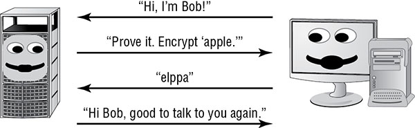
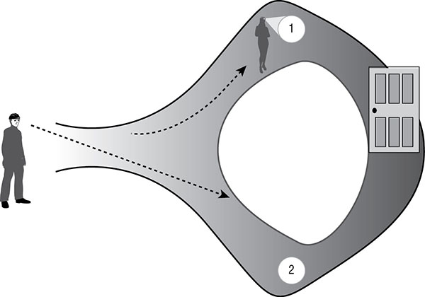
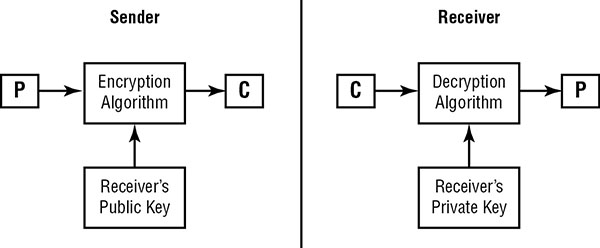
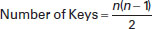
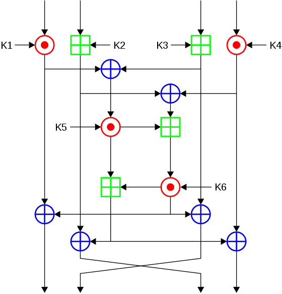

Cryptography provides confidentiality, integrity, authentication, and nonrepudiation for sensitive information while it is stored (at rest), traveling across a network (in transit), and existing in memory (in use). 

## Historical Milestones in Cryptography

### Caesar Cipher

The system is extremely simple. `To encrypt a message, you simply shift each letter of the alphabet three places to the right`. For example, A would become D, and B would become E. If you reach the end of the alphabet during this process, you simply wrap around to the beginning so that X becomes A, Y becomes B, and Z becomes C. For this reason, the Caesar cipher also became known as the ROT3 (or Rotate 3) cipher. The Caesar cipher is a `substitution cipher` that is mono-alphabetic. 

It’s vulnerable to a type of attack known as *frequency analysis*.

### American Civil War

These systems used complex combinations of word substitutions and transposition (see the section “Ciphers,” later in this chapter, for more details) to attempt to defeat enemy decryption efforts.

> Photos of many of the items discussed in this chapter are available at [www.nsa.gov](https://www.nsa.gov/about/cryptologic_heritage/museum/)

### ULTRA VS. ENIGMA

Enigma - This machine used a series of three to six rotors to implement an extremely complicated `substitution cipher`. The only possible way to decrypt the message with contemporary technology was to use a similar machine with the same rotor settings used by the transmitting device. 

Ultra - to attack the Enigma codes. Alan Turing, successfully broke the Enigma code in 1940.

Another example - Japanese Purple Machine

## Cryptographic Basics

### Goal Of Cryptography

Security practitioners use cryptographic systems to meet four fundamental goals: confidentiality, integrity, authentication, and nonrepudiation. 

#### Confidentiality

Confidentiality ensures that data remains private in three different situations: when it is at rest, when it is in transit, and when it is in use.

Two main types of cryptosystems enforce confidentiality.

* *Symmetric cryptosystems* use a shared secret key available to all users of the cryptosystem.
* *Asymmetric cryptosystems* use individual combinations of public and private keys for each user of the system. 

You must think about three different types of data:

* Data at rest, or stored data
* Data in motion, or data on the wire
* Data in use is data that is stored in the active memory of a computer system where it may be accessed by a process running on that system.

#### Integrity

Integrity ensures that data is not altered without authorization. Integrity controls protect against all forms of alteration, including intentional alteration by a third party attempting to insert false information, intentional deletion of portions of the data, and unintentional alteration by faults in the transmission process.

Message integrity is enforced through the use of encrypted message digests, known as *digital signatures*, created upon transmission of a message.

#### Authentication

Authentication verifies the claimed identity of system users and is a major function of cryptosystems. 

Challenge-response protocol would work in action:



#### Nonrepudiation

Nonrepudiation provides assurance to the recipient that the message was originated by the sender and not someone masquerading as the sender. It also prevents the sender from claiming that they never sent the message in the first place (also known as *repudiating* the message).

Nonrepudiation is offered only by public key, or asymmetric. 

Secret key, or symmetric key, cryptosystems (such as simple substitution ciphers) do not provide this guarantee of nonrepudiation. If Jim and Bob participate in a secret key communication system, they can both produce the same encrypted message using their shared secret key.

### Cryptography Concepts

Before a message is put into a coded form, it is known as a *plaintext* message and is represented by the letter *P* when encryption functions are described. The sender of a message uses a cryptographic algorithm to encrypt the plaintext message and produce a *ciphertext* message, represented by the letter *C*.

Every algorithm has a specific *key space*. The key space is the range of values that are valid for use as a key for a specific algorithm. A key space is defined by its *bit size*. The key space is the range of numbers from *0 to 2n*, where *n* is the bit size of the key. 

> THE KERCKHOFFS’S PRINCIPLE

> the Kerckhoffs’s principle (also known as Kerckhoffs’s assumption) is that a cryptographic system should be secure even if everything about the system, except the key, is public knowledge. “*security through obscurity*” and believe that public exposure produces more activity and exposes more weaknesses more readily, leading to the abandonment of insufficiently strong algorithms and quicker adoption of suitable ones.

Cryptographic keys are sometimes referred to as *cryptovariables*.

The art of creating and implementing secret codes and ciphers is known as *cryptography*.*Cryptanalysis* —the study of methods to defeat codes and ciphers. 

Together, cryptography and cryptanalysis are commonly referred to as *cryptology*.

Specific implementations of a code or cipher in hardware and software are known as *cryptosystems*. 

Federal Information Processing Standard (FIPS) 140–2, [Security Requirements for Cryptographic Modules](https://nvlpubs.nist.gov/nistpubs/FIPS/NIST.FIPS.140-2.pdf) defines the hardware and software requirements for cryptographic modules that the federal government uses.

### Cryptographic Mathematics 

#### Boolean Mathematics

The computer’s reliance upon the Boolean system has electrical origins. In an electrical circuit, there are only two possible states— `on` (representing the presence of electrical current) and `off` (representing the absence of electrical current). All computation performed by an electrical device must be expressed in these terms, giving rise to the use of Boolean computation in modern electronics. In general, computer scientists refer to the on condition as a `true` value and the off condition as a `false `value.

#### Logical Operations

**AND**

The AND operation (represented by the ∧ symbol) checks to see whether two values are both true

X |	Y | X ∧ Y
--- | --- | ---
0 |	0 | 0
0 |	1 | 0
1 |	0 | 0
1 |	1 | 1

**OR**

The OR operation (represented by the ∨ symbol) checks to see whether at least one of the input values is true. 

X |	Y |	X ∨ Y
--- | --- | ---
0 | 0 |	0
0 |	1 | 1
1 |	0 | 1
1 |	1 | 1

**NOT**

The NOT operation (represented by the ∼ or ! symbol) simply reverses the value of an input variable.

X |	`~X`
--- | --- 
0 |	1
1 |	0

**Exclusive OR** 

It’s referred to in mathematical literature as the XOR function and is commonly represented by the ⊕ symbol. The XOR function returns a true value when only one of the input values is true. If both values are false or both values are true, the output of the XOR function is false. 

X |	Y |	X ⊕ Y
--- | --- | ---
0 |	0 | 0
0 |	1 | 1
1 |	0 | 1
1 |	1 |	0

**Modulo Function** 

The modulo function is, quite simply, the remainder value left over after a division operation is performed. The modulo function is usually represented in equations by the abbreviation `mod`, although it’s also sometimes represented by the `%` operator. Here are several inputs and outputs for the modulo function:

8 mod 6 = 2
6 mod 8 = 6
10 mod 3 = 1
10 mod 2 = 0
32 mod 8 = 0

```
Modulus Method

To find 6 mod 8 using the Modulus Method, we first find the highest 
multiple of the Divisor (8) that is equal to or less than the 
Dividend (6).

Then, we subtract the highest Divisor multiple from the Dividend 
to get the answer to 6 modulus 8 (6 mod 8):

Multiples of 8 are 0, 8, 16, 24, etc. and the highest multiple 
of 8 equal to or less than 6 is 0. 

Therefore, to get the answer: 6
```

#### One-Way Functions

A one-way function is a mathematical operation that easily produces output values for each possible combination of inputs but makes it impossible to retrieve the input values.

#### Nonce

A nonce is a random number that acts as a placeholder variable in mathematical functions. When the function is executed, the nonce is replaced with a random number generated at the moment of processing for one-time use. The nonce must be a unique number each time it is used. One of the more recognizable examples of a nonce is an *initialization vector (IV)*, a random bit string that is the same length as the block size and is `XORed` with the message. IVs are used to create unique ciphertext every time the same message is encrypted using the same key.

#### Zero-Knowledge Proof

One of the benefits of cryptography is found in the mechanism to prove your knowledge of a fact to a third party without revealing the fact itself to that third party. This is often done with passwords and other secret authenticators.

Example, magic door:



#### Split Knowledge

When the information or privilege required to perform an operation is divided among multiple users, no single person has sufficient privileges to compromise the security of an environment. This separation of duties and two-person control contained in a single solution is called split knowledge.

The best example of split knowledge is seen in the concept of *[key escrow](https://en.wikipedia.org/wiki/Key_escrow)*. 

> escrow: a bond, deed, or other document kept in the custody of a third party and taking effect only when a specified condition has been fulfilled.

`M of N` Control requires that a minimum number of agents (`M`) out of the total number of agents (`N`) work together to perform high-security tasks. So, implementing `three of eight` controls would require `three people out of the eight` with the assigned `work task` of key escrow recovery agent to work together to pull a single key out of the key escrow database (thereby also illustrating that M is always less than or equal to N).

#### Work Function

You can measure the strength of a cryptography system by measuring the effort in terms of cost and/or time using a work function or work factor. Usually the time and effort required to perform a complete brute-force attack against an encryption system is what the work function represents. The security and protection offered by a cryptosystem is directly proportional to the value of the work function/factor. The work function need be only slightly greater than the time value of that asset. Security professionals selecting cryptographic systems must also understand how emerging technologies may impact cipher-cracking efforts.

### Ciphers

#### Codes vs. Ciphers

*Codes*, which are cryptographic systems of symbols that represent words or phrases, are sometimes secret, but they are not necessarily meant to provide confidentiality. For example, a spy might transmit the sentence “The eagle has landed” to report the arrival of an enemy aircraft.

*Ciphers*, on the other hand, are always meant to hide the true meaning of a message. They use a variety of techniques to alter and/or rearrange the characters or bits of a message to achieve confidentiality.

> An easy way to keep the difference between codes and ciphers straight is to remember that codes work on words and phrases, whereas ciphers work on individual characters and bits.


#### Transposition Ciphers

Transposition ciphers use an encryption algorithm to `rearrange` the letters of a plaintext message, forming the ciphertext message. The decryption algorithm simply reverses the encryption transformation to retrieve the original message.

Example: you can use a keyword to perform a *columnar transposition*, encrypt the message “The fighters will strike the enemy bases at noon” using the secret key attacker:
```
A T T A C K E R
1 7 8 2 3 5 4 6
```
Next, the letters of the message are written in order underneath the letters of the keyword:
```
A T T A C K E R
1 7 8 2 3 5 4 6
T H E F I G H T
E R S W I L L S
T R I K E T H E
E N E M Y B A S
E S A T N O O N
```
Finally, the sender enciphers the message by reading down each column; the order in which the columns are read corresponds to the numbers assigned in the first step. This produces the following ciphertext:
```
T E T E E F W K M T I I E Y N H L H A O G L T B O T S E S N H R R N S E S I E A
```
On the other end, the recipient reconstructs the eight-column matrix using the ciphertext and the same keyword and then simply reads the plaintext message across the rows.

#### Substitution Ciphers

Substitution ciphers use the encryption algorithm to replace each character or bit of the plaintext message with a different character. The Caesar cipher discussed in the beginning of this chapter is a good example of a substitution cipher. 

You can express the ROT3 cipher in mathematical terms by converting each letter to its decimal equivalent (where A is 0 and Z is 25).

Caesar cipher is then this:
```
C = (P + 3) mod 26
```
Corresponding decryption function is as follows:
```
P = (C - 3) mod 26
```

*Polyalphabetic substitution* ciphers use multiple alphabets in the same message to hinder decryption efforts. One of the most notable examples of a polyalphabetic substitution cipher system is the *Vigenère cipher*. The Vigenère cipher uses a single encryption/decryption chart, as shown here:

```
A B C D E F G H I J K L M N O P Q R S T U V W X Y Z
A B C D E F G H I J K L M N O P Q R S T U V W X Y Z
B C D E F G H I J K L M N O P Q R S T U V W X Y Z A
C D E F G H I J K L M N O P Q R S T U V W X Y Z A B
D E F G H I J K L M N O P Q R S T U V W X Y Z A B C
E F G H I J K L M N O P Q R S T U V W X Y Z A B C D
F G H I J K L M N O P Q R S T U V W X Y Z A B C D E
G H I J K L M N O P Q R S T U V W X Y Z A B C D E F
H I J K L M N O P Q R S T U V W X Y Z A B C D E F G
I J K L M N O P Q R S T U V W X Y Z A B C D E F G H
J K L M N O P Q R S T U V W X Y Z A B C D E F G H I
K L M N O P Q R S T U V W X Y Z A B C D E F G H I J
L M N O P Q R S T U V W X Y Z A B C D E F G H I J K
M N O P Q R S T U V W X Y Z A B C D E F G H I J K L
N O P Q R S T U V W X Y Z A B C D E F G H I J K L M
O P Q R S T U V W X Y Z A B C D E F G H I J K L M N
P Q R S T U V W X Y Z A B C D E F G H I J K L M N O
Q R S T U V W X Y Z A B C D E F G H I J K L M N O P
R S T U V W X Y Z A B C D E F G H I J K L M N O P Q
S T U V W X Y Z A B C D E F G H I J K L M N O P Q R
T U V W X Y Z A B C D E F G H I J K L M N O P Q R S
U V W X Y Z A B C D E F G H I J K L M N O P Q R S T
V W X Y Z A B C D E F G H I J K L M N O P Q R S T U
W X Y Z A B C D E F G H I J K L M N O P Q R S T U V
X Y Z A B C D E F G H I J K L M N O P Q R S T U V W
Y Z A B C D E F G H I J K L M N O P Q R S T U V W X
Z A B C D E F G H I J K L M N O P Q R S T U V W X Y
```

* Write out the plaintext.
* Underneath, write out the encryption key, repeating the key as many times as needed to establish a line of text that is the same length as the plaintext.
* Convert each letter position from plaintext to ciphertext.
  * Locate the column headed by the first plaintext character (a).
  * Next, locate the row headed by the first character of the key (s).
* Finally, locate where these two items intersect, and write down the letter that appears there (s). This is the ciphertext for that letter position.
* Repeat steps 1 through 3 for each letter in the plaintext version.

```
Plaintext:	a t t a c k a t d a w n
Key:	s e c r e t s e c r e t
Ciphertext:	s x v r g d s x f r a g
```

Vulnerable to *period analysis*, which is an examination of frequency based on the repeated use of the key.

#### One-Time Pads

A one-time pad is an extremely powerful type of `substitution cipher`. 

```
C = (P + K) mod 26
```

> One-time pads are also known as Vernam ciphers(Gilbert Sandford Vernam of AT&T Bell Labs)

Several requirements must be met to ensure the integrity of the algorithm.

* The one-time pad must be `randomly generated`. Using a phrase or a passage from a book would introduce the possibility that cryptanalysts could break the code.
* The one-time pad must be `physically protected against disclosure`. If the enemy has a copy of the pad, they can easily decrypt the enciphered messages.
* Each one-time pad must be `used only once`. If pads are reused, cryptanalysts can compare similarities in multiple messages encrypted with the same pad and possibly determine the key values used.
* The `key must be at least as long as the message to be encrypted`. This is because each character of the key is used to encode only one character of the message.

#### Running Key Ciphers (Book Cipher)

In this cipher, the encryption key is as long as the message itself and is often chosen from a common book. Example: text of a chapter from Moby-Dick, beginning with the third paragraph, as the key.


#### Block Ciphers

Block ciphers operate on “chunks,” or blocks, of a message and apply the encryption algorithm to an entire message block at the same time. The transposition ciphers are examples of block ciphers.

#### Stream Ciphers

Stream ciphers operate on one character or bit of a message (or data stream) at a time. The Caesar cipher is an example of a stream cipher. The one-time pad is also a stream cipher because the algorithm operates on each letter of the plaintext message independently. Stream ciphers can also function as a type of block cipher. In such operations there is a buffer that fills up to real-time data that is then encrypted as a block and transmitted to the recipient.

#### Confusion and Diffusion

*Confusion* occurs when the relationship between the plaintext and the key is so complicated that an attacker can’t merely continue altering the plaintext and analyzing the resulting ciphertext to determine the key

*Diffusion* occurs when a change in the plaintext results in multiple changes spread throughout the ciphertext.

For example, a cryptographic algorithm that first performs a complex substitution and then uses transposition to rearrange the characters of the substituted ciphertext. In this example, the substitution introduces confusion, and the transposition introduces diffusion.

## Modern Cryptography

### Cryptographic Keys

Early Principle - “security through obscurity.” 

Modern cryptosystems Principle - the algorithms for most cryptographic systems are widely available for public review in the accompanying literature and on the internet. Opening algorithms to public scrutiny actually improves their security. 

Modern cryptosystems rely on the secrecy of one or more cryptographic keys used to personalize the algorithm for specific users or groups of users. 

The `length of the key` is still an extremely important factor in determining the strength of the cryptosystem and the likelihood that the encryption will not be compromised through cryptanalytic techniques.

It’s essential that you outpace adversaries by using sufficiently long keys that will defeat contemporary cryptanalysis efforts and outpace the projected increase in cryptanalytic capability during the entire time period the data must be kept safe. Example, use of quantum computing will help break cryptosystems.

### Symmetric Key Algorithms 

Symmetric key algorithms rely on a `shared secret` encryption key that is distributed to all members who participate in the communications. It performs `bulk encryption` and provides only for the security service of `confidentiality`. Symmetric key cryptography can also be called secret key cryptography and private key cryptography.


Symmetric key cryptography has several weaknesses:

**Key distribution is a major problem** - If a secure electronic channel is not available, an offline key distribution method must often be used (that is, out-of-band exchange).

**Symmetric key cryptography does not implement nonrepudiation** - Because any communicating party can encrypt and decrypt messages with the shared secret key, there is no way to prove where a given message originated.

**The algorithm is not scalable** - It is extremely difficult for large groups to communicate using symmetric key cryptography. 

**Keys must be regenerated often** - Each time a participant leaves the group, all keys known by that participant must be discarded.

Strengths:

* Great speed at which it can operate (often 1,000 to 10,000 times faster than asymmetric algorithms)
* Symmetric key cryptography also naturally lends itself to `hardware implementations`

### Asymmetric key algorithms

Also known as - public key algorithms. 

In these systems, each user has two keys: a public key, which is shared with all users, and a private key, which is kept secret and known only to the user. But here’s a twist: opposite and related keys must be used in tandem to encrypt and decrypt.



Number of keys required comparison:

Number of participants | Number of symmetric keys required | Number of asymmetric keys required
--- | --- | ---
2 | 1 | 4
3 | 3 | 6
4 | 6 | 8
5 | 10 | 10
10 | 45 | 20
100 | 4,950 | 200
1,000 | 499,500 | 2,000
10,000 | 49,995,000 | 20,000

Formula of Symmetric Key Algo:



Strengths of asymmetric key cryptography:

* **The addition of new users requires the generation of only one public-private key pair**
* **Users can be removed far more easily from asymmetric system**
* **Key regeneration is required only when a user’s private key is compromised**
* **Key distribution is a simple process**
* **No preexisting communication link needs to exist**

Weakness:
 
Slow speed of operation, many applications that require the secure transmission of large amounts of data use public key cryptography to establish a connection and then exchange a symmetric secret key. 

Comparison of symmetric and asymmetric cryptography systems:

Symmetric |	Asymmetric
--- | --- 
Single shared key | Key pair sets
Out-of-band exchange | In-band exchange
Not scalable | Scalable
Fast | Slow
Bulk encryption | Small blocks of data, digital signatures, digital envelopes, digital certificates
Confidentiality | Confidentiality, integrity, authenticity, nonrepudiation

### Hashing Algorithms

Message digests are summaries of a message’s content (not unlike a file checksum) produced by a hashing algorithm.  Cases where a hash function produces the same value for two different methods are known as *collisions*, and the existence of collisions typically leads to the deprecation of a hashing algorithm.

## Symmetric Cryptography

### Data Encryption Standard 

Five modes of operation:

* Electronic Code Book (ECB) mode
* Cipher Block Chaining (CBC) mode
* Cipher Feedback (CFB) mode
* Output feedback (OFB) mode
* Counter (CTR) mode

**Algo Details** 

* DES modes operate on `64 bits` of `plaintext` at a time to generate `64-bit` `blocks` of ciphertext. The `key` used by DES is `56 bits` long.

* DES uses a long series of `exclusive OR (XOR)` operations to generate the ciphertext. This process is `repeated 16 times` for each encryption/decryption operation. Each repetition is commonly referred to as a round of encryption, explaining the statement that DES performs 16 rounds of encryption.

>  The DES specification calls for a 64-bit key. However, of those 64 bits, only 56 actually contain keying information. The remaining 8 bits are supposed to contain parity information to ensure that the other 56 bits are accurate. 

**Electronic Code Book (ECB)Mode** 


It simply encrypts the block using the chosen secret key.

How to break: If an enemy were eavesdropping on the communications, they could simply build a “code book” of all the possible encrypted values.

Usage: ECB is used only for exchanging small amounts of data, such as keys and parameters used to initiate other DES modes as well as the cells in a database.

**Cipher Block Chaining (CBC) Mode**

Each block of unencrypted text is XORed with the block of ciphertext immediately preceding it before it is encrypted using the DES algorithm. The decryption process simply decrypts the ciphertext and reverses the XOR operation. CBC implements an IV and XORs it with the first block of the message, producing a unique output every time the operation is performed. The IV must be sent to the recipient, perhaps by tacking the IV onto the front of the completed ciphertext in plain form or by protecting it with ECB mode encryption using the same key used for the message. 


**Cipher Feedback (CFB) Mode**

Cipher Feedback (CFB) mode is the streaming cipher version of CBC. Instead of breaking a message into blocks, it uses memory buffers of the same block size. As the buffer becomes full, it is encrypted and then sent to the recipients. CFB operates in the same fashion as CBC. It uses an IV, and it uses chaining.


**Output Feedback (OFB) Mode**

DES XORs the plaintext with a seed value. For the first encrypted block, an initialization vector is used to create the seed value. Future seed values are derived by running the DES algorithm on the previous seed value. The major advantages of OFB mode are that there is no chaining function and transmission errors do not propagate to affect the decryption of future blocks.


**Counter (CTR) Mode** 

Stream cipher similar to that used in CFB and OFB modes. For seed value it uses a simple counter that increments for each operation. As with OFB mode, errors do not propagate in CTR mode.

> CTR mode allows you to break an encryption or decryption operation into multiple independent steps. This makes CTR mode well suited for use in parallel computing.


### Triple DES (3DES)

There are four versions of 3DES:

**DES-EEE3**

The first simply encrypts the plaintext three times, using three different keys: K1, K2, and K3. It is known as DES-EEE3 mode (the Es indicate that there are three encryption operations, whereas the numeral 3 indicates that three different keys are used)

```
E(K1,E(K2,E(K3,P)))
```

DES-EEE3 has an effective key length of `168 bits` (56x3).

**DES-EDE3**

It also uses three keys but replaces the second encryption operation with a decryption operation.

```
E(K1,D(K2,E(K3,P)))
```

**DES-EEE2**

It uses only two keys, K1 and K2:

```
E(K1,E(K2,E(K1,P)))
```

Effective key length `112 bits` (56x2). 

**DES-EDE2**

It also uses two keys but uses a decryption operation in the middle.

```
E(K1,D(K2,E(K1,P)))
```

Effective key length `112 bits` (56x2)

### International Data Encryption Algorithm (IDEA)

  * `Block cipher` was developed in response to complaints about the insufficient key length of the DES algorithm. 
  * IDEA operates on `64-bit blocks` of plaintext/ciphertext. However, it begins its operation with a `128-bit key`. This key is broken up in a series of operations into `52` `16-bit subkeys`.
  * The subkeys then act on the input text using a combination of `XOR and modulus operations` to produce the encrypted/decrypted version of the input message. 

  

One popular implementation of IDEA is found in Phil Zimmerman’s popular Pretty Good Privacy (PGP) secure email package

### Blowfish

  * Block cipher
  * Operates on 64-bit blocks of text
  * Variable-length keys ranging from a relatively insecure `32 bits` to an extremely strong `448 bits`
  * Time trials have established Blowfish as a much faster algorithm than both IDEA and DES

### Skipjack

  * Was approved for use by the U.S. government in Federal Information Processing Standard (FIPS) 185, the Escrowed Encryption Standard (EES)
  * 64-bit blocks of text
  * 80-bit key
  * Same four modes of operation supported by DES
  * Skipjack has an added twist—it supports the escrow of encryption keys. Two government agencies, the National Institute of Standards and Technology (NIST) and the Department of the Treasury, hold a portion of the information required to reconstruct a Skipjack key.
  * Skipjack and the Clipper chip were not embraced by the cryptographic community at large because of its mistrust of the escrow procedures in place within the U.S. government.

### Rivest Cipher 5 (RC5)

RC5 is a block cipher of variable block sizes (32, 64, or 128 bits) that uses key sizes between 0 (zero) length and 2,040 bits. RC5 is an improvement on an older algorithm called RC2 that is no longer considered secure. RC5 is the subject of brute-force cracking attempts. 

### Advanced Encryption Standard

  * National Institute of Standards and Technology announced that the Rijndael (pronounced “rhine-doll”) block cipher had been chosen as the replacement for DES. In November 2001, NIST released FIPS 197.
  * Three key strengths: 128 bits, 192 bits, and 256 bits
  * AES only allows the processing of 128-bit blocks, but Rijndael exceeded this specification, allowing cryptographers to use a block size equal to the key length. The number of encryption rounds depends on the key length chosen:

    * 128-bit keys require 10 rounds of encryption.
    * 192-bit keys require 12 rounds of encryption.
    * 256-bit keys require 14 rounds of encryption.

### Twofish

  * Twofish is a block cipher.
  * Operates on 128-bit blocks of data
  * Key size upto 256 bits in length
  * Twofish uses two techniques not found in other algorithms:

     * *Prewhitening* involves XORing the plaintext with a separate subkey before the first round of encryption.
     * *Postwhitening* uses a similar operation after the 16th round of encryption.

> Important

Symmetric memorization chart

Name |	Block size | Key size
--- | --- | --- 
Advanced Encryption Standard (AES)	| 128 |	128, 192, 256
Rijndael |	Variable | 128, 192, 256
Blowfish (often used in SSH) | 64 | 32–448
Data Encryption Standard (DES) | 64 | 56
IDEA (used in PGP) |64 | 128
Rivest Cipher 2 (RC2) | 64 | 128
Rivest Cipher 5 (RC5) | 32, 64, 128 | 0–2,040
Skipjack | 64 | 80
Triple DES (3DES) | 64 | 112 or 168
Twofish | 128 | 1–256

### Symmetric Key Management

Key management practices - includes safeguards surrounding the creation, distribution, storage, destruction, recovery, and escrow of secret keys.

#### Creation and Distribution of Symmetric Keys

The three main methods used to exchange secret keys securely are offline distribution, public key encryption, and the Diffie–Hellman key exchange algorithm.

**Offline Distribution**
**Public Key Encryption** 

Many people use public key encryption to set up an initial communications link. Once the link is successfully established and the parties are satisfied as to each other’s identity, they exchange a secret key over the secure public key link. 

**Diffie-Hellma** 

The algorithm works as follows:

1) The communicating parties (we’ll call them Richard and Sue) agree on two large numbers: `p` (which is a prime number) and `g` (which is an integer) such that `1 < g < p`.
2) Richard chooses a random large integer `r` and performs the following calculation:
`R = gr mod p`
3) Sue chooses a random large integer `s` and performs the following calculation:
`S = gs mod p`
4) Richard sends R to Sue and Sue sends S to Richard.
5) Richard then performs the following calculation:
`K = Sr mod p`
6) Sue then performs the following calculation:
`K = Rs mod p`

At this point, Richard and Sue both have the same value, K, and can use this for secret key communication between the two parties.

#### Storage and Destruction of Symmetric Keys

This includes following best practices surrounding the storage of encryption keys:

* Never store an encryption key on the same system where encrypted data resides
* Consider providing two different individuals with half of the key. They then must collaborate to re-create the entire key. This is known as the principle of *split knowledge* .
* A user with knowledge of a secret key leaves the organization the keys must be changed, and all encrypted materials must be reencrypted with the new keys.

#### Key Escrow and Recovery

* Governments around the world have floated ideas to implement key escrow systems. These systems allow the government, under limited circumstances such as a court order, to obtain the cryptographic key used for a particular communication from a central storage facility.

There are two major approaches to key escrow that have been proposed over the past decade.

**Fair Cryptosystems** Divide secret keys used in a communication into two or more pieces, each of which is given to an independent third party. When the government obtains legal authority to access a particular key, it provides evidence of the court order to each of the third parties and then reassembles the secret key.

**Escrowed Encryption Standard** Provides the government with a technological means to decrypt ciphertext. This standard is the basis behind the Skipjack algorithm discussed earlier in this chapter.

## Cryptographic Lifecycle

With the exception of the one-time pad, all cryptographic systems have a limited life span. 

Moore’s law:

Processing capabilities of a state-of-the-art microprocessor will double approximately every two years.

Security professionals must keep this cryptographic lifecycle in mind. Security professionals can use the following algorithm and protocol governance controls:

* Specifying the cryptographic algorithms (such as AES, 3DES, and RSA) acceptable for use in an organization
* Identifying the acceptable key lengths for use with each algorithm based on the sensitivity of information transmitted
* Enumerating the secure transaction protocols (such as SSL and TLS) that may be used

