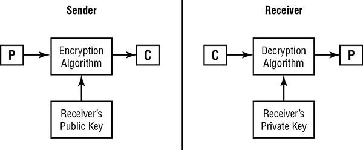

## Asymmetric Cryptography

The security of these systems relies on the difficulty of reversing a one-way function.

Three of the more common public key cryptosystems in use today: Rivest–Shamir–Adleman (RSA), El Gamal, and the elliptic curve cryptography (ECC):

### Public and Private Keys

  * Private key is never shared with any other cryptosystem user.

  

  * Once the sender encrypts the message with the recipient’s public key, no user (including the sender) can decrypt that message without knowing the recipient’s private key (the second half of the public-private key pair used to generate the message).

  * Keys used within public key systems must be longer than those used in private key systems to produce cryptosystems of equivalent strengths.

### RSA

  * Ronald Rivest, Adi Shamir, and Leonard Adleman proposed the RSA public key algorithm that remains a worldwide standard today. 

  * The RSA algorithm depends on the computational difficulty inherent in `factoring large prime numbers`.

  * Algorithm described in the following steps:

	1) Choose two large prime numbers (approximately 200 digits each), labeled `p` and `q`.
	2) Compute the product of those two numbers: `n = p * q`.
	3) Select a number, `e`, that satisfies the following two requirements:
	`e` is less than `n`.
	4) `e` and `(p – 1)(q – 1)` are relatively prime—that is, the two numbers have no common factors other than 1.
	5) Find a number, `d`, such that `(ed – 1) mod (p – 1)(q – 1) = 1`.
	
	Distribute `e` and `n` as the public key to all cryptosystem users. Keep `d` secret as the private key.

  > MERKLE-HELLMAN KNAPSACK
  > Its based on `super-increasing sets` rather than on large prime numbers

Cryptosystem | Key length
--- | ---
RSA | 1,024 bits
DSA | 1,024 bits
Elliptic curve | 160 bits

### EL GAMAL

Dr. T. El Gamal published an article describing how the mathematical principles behind the Diffie–Hellman key exchange algorithm could be extended to support an entire public key cryptosystem used for encrypting and decrypting messages.

Major disadvantage—the algorithm doubles the length of any message it encrypts. 

### ELLIPTIC CURVE

  * Based on *elliptic curve cryptography (ECC)* theory.
  * Based on *discrete logarithm problem* 

  * More details about the also is mentioned in good details here:

  https://www.esat.kuleuven.be/cosic/elliptic-curves-are-quantum-dead-long-live-elliptic-curves/

  https://blog.cloudflare.com/a-relatively-easy-to-understand-primer-on-elliptic-curve-cryptography/

## Hash Functions

Hash functions have a very simple purpose—they take a potentially long message and generate a unique output value derived from the content of the message. This value is commonly referred to as the *message digest*.

Use case:

* The recipient can use the same hash function to recompute the message digest from the full message. They can then compare the computed message digest to the transmitted one to ensure that the message sent by the originator is the same one received by the recipient.

* The message digest can be used to implement a digital signature algorithm. 

According to RSA Security, there are five basic requirements for a cryptographic hash function:

* The `input` can be of `any length`.
* The `output` has a `fixed length`.
* The hash function is relatively easy to compute for any input.
* The hash function is `one-wa`y (meaning that it is extremely hard to determine the input when provided with the output). 
* The hash function is `collision free` (meaning that it is extremely hard to find two messages that produce the same hash value).

### SHA

Secure Hash Algorithm (SHA) and its successors, *SHA-1, SHA-2, and SHA-3*, are government standard hash functions promoted by the National Institute of Standards and Technology (NIST) and are specified in an official government publication—the Secure Hash Standard (SHS), also known as `Federal Information Processing Standard (FIPS) 180`.

SHA-1 takes an `input` of virtually `any length` (in reality, there is an upper bound of approximately 2,097,152 terabytes on the algorithm) and produces a `160-bit message digest`. The SHA-1 algorithm `processes` a message in `512-bit blocks`. Therefore, if the message length is not a multiple of 512, the SHA algorithm `pads` the message with additional data until the length reaches the next highest multiple of 512.

SHA-2 has four variants:

* SHA-256 produces a `256-bit` message digest using a `512-bit` block size.
* SHA-224 uses a truncated version of the SHA-256 hash to produce a `224-bit` message digest using a `512-bi`t block size.
* SHA-512 produces a `512-bit` message digest using a `1,024-bit` block size.
* SHA-384 uses a truncated version of the SHA-512 hash to produce a `384-bit` digest using a `1,024-bit` block size.

### MD2

  * Secure hash function for 8-bit processors.
  * Pads the message so that its length is a multiple of `16 bytes`
  * Then computes a 16-byte checksum and appends it to the end of the message
  * `128-bit` message digest is then generated by using the entire original message along with the appended checksum

### MD4

  * For 32-bit processors
  * It first pads the message to ensure that the message length is `64 bits smaller than a multiple of 512 bits`. 16 bit message + 432 padding (448 which is 64 bit smaller then 512)
  * Then processes `512-bit blocks` of the message in three rounds of computation.
  * Output is 128-bit message digest.
  * Issue: Find `collisions` for MD4 message digests in less than one minute.

### MD5

  * Processes `512-bit` blocks of the message, but it uses `four` distinct rounds of computation to produce a digest of the same length (128).
  * The message length must be 64 bits less than a multiple of 512 bits- Same as MD4
  * MD5 implements additional security features that reduce the speed of message digest production significantly. 
  * Subject to collisions, exmaple: Arjen Lenstra and others demonstrated in 2005 that it is possible to create two digital certificates from different public keys that have the same MD5 hash.

Hash algorithm memorization chart

Name | Hash value length
--- | ---
Hash of Variable Length (HAVAL)—an MD5 variant | 128, 160, 192, 224, and 256 bits
Hash Message Authenticating Code (HMAC) | Variable
Message Digest 2 (MD2) | 128
Message Digest 4 (MD4) | 128
Message Digest 5 (MD5) | 128
Secure Hash Algorithm (SHA-1) | 160
SHA2-224/SHA3-224 | 224
SHA2-256/SHA3-256 | 256
SHA2-384/SHA3-384 | 384
SHA2-512/SHA3-512 | 512

## Digital Signatures

Digital signature infrastructures have two distinct goals:

* Digitally signed messages assure the recipient that the message truly came from the claimed sender. They enforce nonrepudiation.

* Digitally signed messages assure the recipient that the message was not altered while in transit between the sender and recipient. 

> Digital signature algorithms rely on a combination of the two major concepts already covered — public key cryptography and hashing functions.

* Note that the digital signature process does not provide any privacy/confidentiality in and of itself. It only ensures that the cryptographic goals of integrity, authentication, and nonrepudiation are met.  

### HMAC

The hashed message authentication code (HMAC) algorithm implements a partial digital signature—it guarantees the integrity of a message during transmission, but it does not provide for nonrepudiation. HMAC can be combined with any standard message digest generation algorithm, such as SHA-3, by using a shared secret key. 

> WHICH KEY SHOULD I USE?
> * If you want to encrypt a message, use the recipient’s public key.
  * If you want to decrypt a message sent to you, use your private key.
  * If you want to digitally sign a message you are sending to someone else, use your private key.
  * If you want to verify the signature on a message sent by someone else, use the sender’s public key.

### Digital Signature Standard

The National Institute of Standards and Technology specifies the digital signature algorithms acceptable for federal government use in `Federal Information Processing Standard (FIPS) 186-4`, also known as the *Digital Signature Standard (DSS)*.  This document specifies that all federally approved digital signature algorithms must use the `SHA-3` hashing functions.

* The Digital Signature Algorithm (`DSA`) as specified in `FIPS 186-4`
* The Rivest–Shamir–Adleman (`RSA`) algorithm as specified in `ANSI X9.31`
* The Elliptic Curve DSA (`ECDSA`) as specified in `ANSI X9.62`

> Two other digital signature algorithms you should recognize, at least by name, are Schnorr’s signature algorithm and Nyberg-Rueppel’s signature algorithm.

## Public Key Infrastructure

The major strength of public key encryption is its ability to facilitate communication between parties previously unknown to each other. This is made possible by the public key infrastructure (PKI) hierarchy of trust relationships.

### Certificates

Digital certificates provide communicating parties with the assurance that the people they are communicating with truly are who they claim to be. Digital certificates are essentially endorsed copies of an individual’s public key. When users verify that a certificate was signed by a trusted certificate authority (CA), they know that the public key is legitimate.

Certificates that conform to X.509 (version 3) contain the following data:

* Version of X.509 to which the certificate conforms
* Serial number (from the certificate creator)
* Signature algorithm identifier (specifies the technique used by the certificate authority to digitally sign the contents of the certificate)
* Issuer name (identification of the certificate authority that issued the certificate)
* Validity period (specifies the dates and times—a starting date and time and an ending date and time—during which the certificate is valid)
* Subject’s name (contains the distinguished name, or DN, of the entity that owns the public key contained in the certificate)
* Subject’s public key (the meat of the certificate—the actual public key the certificate owner used to set up secure communications)

### Certificate authorities (CAs)

These neutral organizations offer notarization services for digital certificates. To obtain a digital certificate from a reputable CA, you must prove your identity to the satisfaction of the CA. The following list includes some of the major CAs that provide widely accepted digital certificates:

* Symantec
* GoDaddy
* Amazon Web Services etc

If you configure your browser to trust a CA, it will automatically trust all of the digital certificates issued by that CA. Browser developers preconfigure browsers to trust the major CAs to avoid placing this burden on users.

*Registration authorities (RAs)* assist CAs with the burden of verifying users’ identities prior to issuing digital certificates. They do not directly issue certificates themselves, but they play an important role in the certification process, allowing CAs to remotely validate user identities.

> *Certificate path validation (CPV)* - CPV means that each certificate in a certificate path from the original start or root of trust down to the server or client in question is valid and legitimate.

### Certificate Generation and Destruction

#### Enrollment

  * You must first prove your identity to the CA in some manner; this process is called enrollment.

  * Once you’ve satisfied the certificate authority regarding your identity, you provide them with `your public key`. The CA next creates an X.509 digital certificate containing your identifying information and `a copy of your public key`. The CA then `digitally signs` the certificate using the `CA’s private key` and provides you with a copy of your signed digital certificate. You may then safely distribute this certificate to anyone with whom you want to communicate securely.

#### Verification

  * You *verify* the certificate by checking the CA’s digital signature using the CA’s public key. Next, you must check and ensure that the certificate was not revoked using a *certificate revocation list (CRL) or the Online Certificate Status Protocol (OCSP)*. 

  * Client validation:

    * The digital signature of the CA is authentic.
    * You trust the CA.
    * The certificate is not listed on a CRL.
    * The certificate actually contains the data you are trusting.
    * Identity mentioned in the certificate is what you are looking for, for example, email address or name or serial number

#### Revocation

  * A certificate authority needs to *revoke* a certificate. This might occur for one of the following reasons:

    * The certificate was compromised (for example, the certificate owner accidentally gave away the private key).
    * The certificate was erroneously issued (for example, the CA mistakenly issued a certificate without proper verification).
    * The details of the certificate changed (for example, the subject’s name changed).
    * The security association changed (for example, the subject is no longer employed by the organization sponsoring the certificate).

> Certificate Practice Statement (CPS) - CPS states the practices a CA employs when issuing or managing certificates.

You can use two techniques to verify the authenticity of certificates and identify revoked certificates:

**Certificate revocation lists (CRLs)**
**Online Certificate Status Protocol (OCSP)** 

## Asymmetric Key Management

Several best practice requirements to maintain the security of your communications:

* Choose your encryption system wisely - Choose an encryption system with an algorithm in the public domain that has been thoroughly vetted by industry experts
* Use a key length that balances your security requirements with performance considerations. 
* When using public key encryption, keep your private key secret!
* Retire keys when they’ve served a useful life.
* Back up your key!
* Hardware security modules (HSMs) also provide an effective way to manage encryption keys. - USB based YubiKey and/or Cloud providers, such as Amazon and Microsoft, provide cloud-based HSM as IaaS services.

## Applied Cryptography

### Portable Devices
  
  * Many organizations turn to encryption to protect the data on these devices in the event they are misplaced.
  
  * Disk encryption capabilities - Microsoft Windows includes the BitLocker and Encrypting File System (EFS) technologies, Mac OS X includes FileVault encryption, and the VeraCrypt open-source package allows the encryption of disks on Linux, Windows, and Mac systems.

  > TRUSTED PLATFORM MODULE

  > Trusted Platform Module (TPM) - is a chip that resides on the motherboard of the device. The TPM serves a number of purposes, including the storage and management of keys used for full disk encryption (FDE) solutions. The TPM provides the operating system with access to the keys, preventing someone from removing the drive from one device and inserting it into another device to access the drive’s data.

### Email

Here are some simple rules about encrypting email:

* If you need `confidentiality` when sending an email message, `encrypt` the message.
* If your message must maintain `integrity`, you must `hash` the message.
* If your message needs `authentication, integrity and/or nonrepudiation`, you should `digitally sign` the message.
* If your message requires `confidentiality, integrity, authentication, and nonrepudiation`, you should `encrypt and digitally sign` the message.

Some of the secure email standards in widespread use today:

#### Pretty Good Privacy

  * You must become trusted by one or more PGP users to begin using the system - CA
  * PGP is available in two versions. The `commercial version` uses RSA for key exchange, IDEA for encryption/decryption, and MD5 for message digest production. The `freeware` version (based on the extremely similar `OpenPGP` standard) uses Diffie-Hellman key exchange, the Carlisle Adams/Stafford Tavares (CAST) 128-bit encryption/decryption algorithm, and the SHA-1 hashing function.
  * Some products in this category include StartMail, Mailvelope, SafeGmail, and Hushmail.

#### S/MIME

Secure/Multipurpose Internet Mail Extensions (S/MIME). S/MIME uses the `RSA encryption algorithm` and has received the backing of major industry players, including RSA Security. S/MIME relies on the use of X.509 certificates for exchanging cryptographic keys. AES and 3DES symmetric encryption algorithms.

### Web Application

Encryption is widely used to protect web transactions. We’ll look at the two technologies that are responsible for the small lock icon within web browsers—Secure Sockets Layer (SSL) and Transport Layer Security (TLS).

#### Steganography and Watermarking

*Steganography* is the art of using cryptographic techniques to embed secret messages within another message. Steganographic algorithms work by making alterations to the least significant bits of the many bits that make up image files.

Steganography can also be used for legitimate purposes, however. Adding *digital watermarks* to documents to protect intellectual property is accomplished by means of steganography

### Digital rights management (DRM) 

Digital rights management (DRM) software uses encryption to enforce copyright restrictions on digital media.

#### Music DRM

Music distribution companies attempted to use a variety of DRM schemes, but most backed away from the technology under pressure from consumers. Apple rolled back their use of FairPlay DRM for music sold through the iTunes Store. Apple co-founder Steve Jobs foreshadowed this move when, in 2007, he issued an open letter to the music industry calling on them to allow Apple to sell DRM-free music. 

Currently, the major use of DRM technology in music is for subscription-based services such as Napster and Kazaa, which use DRM to revoke a user’s access to downloaded music when their subscription period ends.

#### Movie DRM

Two of the major technologies used to protect mass-distributed media are as follows:

**High-Bandwidth Digital Content Protection (HDCP)**

Protection for content sent over digital connections including HDMI, DisplayPort, and DVI interfaces. 

**Advanced Access Content System (AACS)** 

Protects the content stored on Blu-Ray and HD DVD media. 

#### E-book DRM

Perhaps the most successful deployment of DRM technology is in the area of book and document publishing.

Adobe Systems offers the Adobe Digital Experience Protection Technology (ADEPT) to provide DRM technology for e-books sold in a variety of formats. ADEPT uses a combination of `AES technology to encrypt the media content` and `RSA encryption to protect the AES key`.

Amazon’s Kindle e-readers use a variety of formats for book distribution, and each contains its own encryption technology.

#### Video Game DRM

Many video games implement DRM technology that depends on consoles using an active internet connection to verify the game license with a cloud-based service.  If a player lost connection, the game would cease functioning.

#### Document DRM

Commercial DRM products, such as Vitrium and FileOpen, use encryption to protect source content and then enable organizations to carefully control document rights.

### Networking

#### Circuit Encryption

Two types of encryption techniques to protect data traveling over networks:

*Link encryption* `secure tunnel between two points` `two offices connected via a data circuit`
*End-to-end encryption* `two parties (for example, a client and a server) and is performed independently of link encryption.`

When encryption happens at the higher OSI layers, it is usually end-to-end encryption, and if encryption is done at the lower layers of the OSI model, it is usually link encryption.

#### IPsec

Internet Protocol Security (IPsec) standard -  set forth by the Internet Engineering Task Force (IETF). IPsec does not dictate all implementation details but is an open, modular framework that allows many manufacturers and software developers to develop IPsec solutions that work well with products from other vendors.

Authentication Header (AH)
Encapsulating Security Payload (ESP) 

transport mode
tunnel mode, 

At runtime, you set up an IPsec session by creating a *security association (SA)*. The SA represents the communication session and records any configuration and status information about the connection. The SA represents a simplex connection. If you want a two-way channel, you need two SAs, one for each direction. Also, if you want to support a bidirectional channel using both AH and ESP, you will need to set up four SAs.

#### ISAKMP

Internet Security Association and Key Management Protocol (ISAKMP) - provides background security support services for IPsec by negotiating, establishing, modifying, and deleting security associations. There are four basic requirements for ISAKMP, as set forth in Internet RFC 2408:

* Authenticate communicating peers
* Create and manage security associations
* Provide key generation mechanisms
* Protect against threats (for example, replay and denial-of-service attacks)

#### Wireless Networking

Wireless networks transmit data through the air, leaving them extremely vulnerable to interception. There are two main types of wireless security:

**Wired Equivalent Privacy (WEP)**
  * 64- and 128-bit encryption options to protect communications 
  * Defined in IEEE 802.11 as an optional component 

**WiFi Protected Access(WPA)**
  * Improves on WEP encryption by implementing the Temporal Key Integrity Protocol (TKIP)
  * Further improvement in WPA2, adds AES cryptography. WPA2 provides secure algorithms appropriate for use on modern wireless networks.

## Cryptographic Attacks

It’s important that you understand the threats posed by various cryptographic attacks to minimize the risks posed to your systems:

**Analytic Attack** Analytic attacks focus on the logic of the algorithm itself.

**Implementation Attack** exploits weaknesses in the implementation

**Statistical Attack** statistical weaknesses in a cryptosystem, such as floating-point errors and inability to produce truly random numbers.

**Brute Force**  attempts every possible valid combination for a key or password.

>  The average amount of time required to discover the key through a brute-force attack is directly proportional to the length of the key.

There are two modifications that attackers can make to enhance the effectiveness of a brute-force attack:

* `Rainbow tables` provide precomputed values for cryptographic hashes. These are commonly used for cracking passwords stored on a system in hashed form.
* Specialized, scalable computing hardware designed specifically for the conduct of brute-force attacks may greatly increase the efficiency of this approach. GPUs 

To help combat the use of brute-force attacks, including those aided by dictionaries and rainbow tables, cryptographers make use of a technology known as *cryptographic salt*. The cryptographic salt is a random value that is added to the end of the password before the operating system hashes the password. Specialized password hashing functions, such as `PBKDF2, bcrypt, and scrypt`, allow for the creation of hashes using salts and also incorporate a technique known as *key stretching* that makes it more computationally difficult to perform a single password guess.

**Frequency Analysis and the Ciphertext Only Attack** Frequency analysis—counting the number of times each letter appears in the ciphertext.

Using your knowledge that the letters `E, T, A, O, I, N` are the most common in the English language, you can then test several hypotheses:

* If these letters are also the `most common` in the ciphertext, the cipher was likely a `transposition cipher`, which rearranged the characters of the plain text without altering them.
* If `other letters are the most common` in the ciphertext, the cipher is probably some form of `substitution cipher` that replaced the plaintext characters.

**Known Plaintext**  the attacker has a copy of the encrypted message along with the plaintext message used to generate the ciphertext (the copy).

**Chosen Ciphertext** the attacker has the ability to decrypt chosen portions of the ciphertext message and use the decrypted portion of the message to discover the key.

**Chosen Plaintext**  the attacker has the ability to encrypt plaintext messages of their choosing and can then analyze the ciphertext output of the encryption algorithm.

**Meet in the Middle** The plain text is then encrypted using every possible key (k1), and the equivalent ciphertext is decrypted using all possible keys (k2). When a match is found, the corresponding pair (k1, k2) represents both portions of the double encryption.

**Man in the Middle** a malicious individual sits between two communicating parties and intercepts all communications (including the setup of the cryptographic session). 

**Birthday** also known as *collision attack or reverse hash matching*.  the malicious individual seeks to substitute in a digitally signed communication a different message that produces the same message digest, thereby maintaining the validity of the original digital signature.

**Replay** the malicious individual intercepts an encrypted message between two parties (often a request for authentication) and then later “replays” the captured message to open a new session. This attack can be defeated by incorporating a time stamp and expiration period into each message.