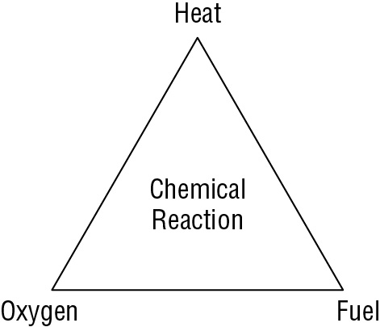
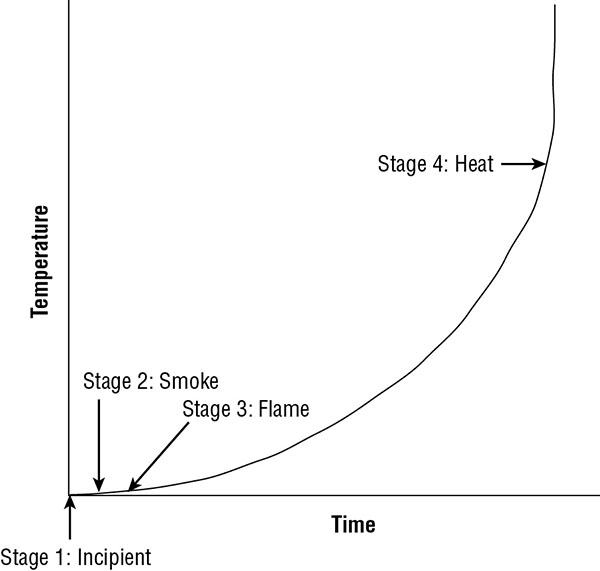

The purpose of physical security is to protect against physical threats. The following physical threats are among the most common: 

* fire and smoke, water (rising/falling)
* earth movement (earthquakes, landslides, volcanoes)
* storms (wind, lightning, rain, snow, sleet, ice)
* sabotage/vandalism
* explosion/destruction
* building collapse
* toxic materials
* utility loss (power, heating, cooling, air, water)
* equipment failure
* theft
* personnel loss (strikes, illness, access, transport).

## Apply Security Principles to Site and Facility Design

Physical controls are your first line of defense, and people are your last. A core element is selecting or designing the facility to house your information technology (IT) infrastructure and your organization’s operations. 

### SECURE FACILITY PLAN

A *secure facility plan* outlines the security needs of your organization and emphasizes methods or mechanisms to employ to provide security. Such a plan is developed through a process known as critical path analysis. *Critical path analysis* is a systematic effort to identify relationships between mission-critical applications, processes, and operations and all the necessary supporting elements. For example, an e-commerce server used to sell products over the web relies on internet access, computer hardware, electricity, temperature control, storage facility, and so on.

Once critical path analysis is complete, its results serve as a list of items to secure. 

Its important to evaluate completed or potential technology convergence. *Technology convergence* is the tendency for various technologies, solutions, utilities, and systems to evolve and merge over time. Often this results in multiple systems performing similar or redundant tasks or one system taking over the feature and abilities of another - it can also represent a single point of failure and become a more valuable target for hackers and intruders. . For example, if voice, video, fax, and data traffic all share a single connection path rather than individual paths.

Security staff should participate in site and facility design considerations.

### SITE SELECTION

Site selection should be based on the security needs of the organization. Cost, location, and size are important, but addressing the requirements of security should always take precedence. `situational elements`. Proximity to other buildings and businesses is another crucial consideration. Proximity to emergency-response personnel is another consideration, along with other elements. 

At a minimum, ensure that the building is designed to `withstand` fairly` extreme weather conditions` and that it can `deter or fend off` overt `break-in attempts`. Vulnerable entry points such as windows and doors tend to dominate such analysis, but you should also evaluate objects (trees, shrubs, or man-made items) that can obscure break-in attempts.

### VISIBILITY

Visibility is important. What is the surrounding terrain? Another element of visibility is related to the area monitored by a security camera. 

### NATURAL DISASTERS

Another concern is the potential impact that natural disasters could make in the area. Is it prone to earthquakes, mudslides, sinkholes, fires, floods, hurricanes, tornadoes, falling rocks, snow, rainfall, ice, humidity, heat, extreme cold, and so on? You must prepare for natural disasters and equip your IT environment to either survive an event or be replaced easily.

### FACILITY DESIGN

A proper level of security must be planned and designed before construction begins. There’s also a well-established school of thought on “secure architecture” that’s often called Crime Prevention through Environmental Design (CPTED). The guiding idea is to structure the physical environment and surroundings to influence individual decisions that potential offenders make before committing any criminal acts. 

## Implement Site and Facility Security Controls

Physical security can be divided into three groups: administrative, technical, and physical.

* *Administrative physical security controls* include facility construction and selection, site management, personnel controls, awareness training, and emergency response and procedures. 
* *Technical physical security controls* include access controls; intrusion detection; alarms; closed-circuit television (CCTV); monitoring; heating, ventilation, and air conditioning (HVAC) power supplies; and fire detection and suppression.
* *Physical controls for physical security* include fencing, lighting, locks, construction materials, mantraps, dogs, and guards.

When designing physical security for an environment, focus on the functional order in which controls should be used. The order is as follows:

* Deterrence (boundary restrictions accomplish this)
* Denial (for example, locked vault doors)
* Detection (for example, using motion sensors)
* Delay (for example, a cable lock on the asset)

### EQUIPMENT FAILURE

Preparing for equipment failure can take many forms. In some non-mission-critical situations, simply knowing where you can purchase replacement parts for a 48-hour replacement timeline is sufficient. In other situations, maintaining onsite replacement parts is mandatory. 

In some cases, maintaining onsite replacements is not feasible. For those cases, establishing a service-level agreement (SLA) with the hardware vendor is essential. An SLA clearly defines the response time a vendor will provide in the event of an equipment failure emergency.

Aging hardware should be scheduled for replacement and/or repair.  MTTF (*mean time to failure*) is the expected typical functional lifetime of the device given a specific operating environment. MTTR (*mean time to repair*) is the average length of time required to perform a repair on the device.  An additional measurement is that of the mean time between failures (MTBF). This is an estimation of the time between the first and any subsequent failures. An additional measurement is that of the *mean time between failures (MTBF)*. This is an estimation of the time between the first and any subsequent failures. 

### WIRING CLOSETS

Wiring closets used to be a small closet where the telecommunications cables were organized for the building using punch-down blocks. A modern wiring closet is where the networking cables for a whole building or just a floor are connected to other essential equipment, such as patch panels, switches, routers, local area network (LAN) extenders, and backbone channels. Also called *premises wire distribution room and intermediate distribution facilities (IDF)*. 

Wiring closet security is extremely important. Most of the security for a wiring closet focuses on preventing physical unauthorized access. Security policy for the wiring closet should include a few ground rules, such as the following:

* Never use the wiring closet as a general storage area.
* Have adequate locks, which might include biometric elements.
* Keep the area tidy.
* Do not store flammable items in the area.
* Set up video surveillance to monitor activity inside the wiring closet.
* Use a door open sensor to log entries.
* Do not give keys to anyone except the authorized administrator.
* Perform regular physical inspections of the wiring closet’s security and contents.
* Include the wiring closet in the organization’s environmental management and monitoring, in order to ensure appropriate environmental control and monitoring, as well as detect damaging conditions such as flooding or fire.
* It is also important to notify your building management of your wiring closet security policy and access restrictions.

Wiring closets are just one element of a *cable plant management policy*. A cable plant is the collection of interconnected cables and intermediary devices (such as cross-connects, patch panels, and switches) that establish the physical network. Elements of a cable plant include the following:

* Entrance facility - the cable from the provider connects the internal cable plant.
* Equipment room - main wiring closet for the building, often connected to or adjacent to the entrance facility
* Backbone distribution system - provides wired connections between the equipment room and the telecommunications rooms, including cross-floor connections.
* Telecommunications room - his serves the connection needs of a floor or a section of a large building by providing space for networking equipment and cabling systems.  interconnection point between the backbone distribution system and the horizontal distribution system.
* Horizontal distribution system -  provides the connection between the telecommunication room and work areas.

### SERVER ROOMS/DATA CENTERS

* Server rooms, data centers, communications rooms, wiring closets, server vaults, and IT closets are enclosed, restricted, and protected rooms where your mission-critical servers and network devices are housed. 

* Centralized server rooms `need not be human compatible`. Human incompatibility can be accomplished by including Halotron, PyroGen, or other halon-substitute oxygen-displacement fire detection and extinguishing systems, low temperatures, little or no lighting, and equipment stacked with little room to maneuver.

* Server rooms should be located at the core of the building. 

* The server room should be located away from water, gas, and sewage lines. 

* The walls of your server room should also have a one-hour minimum fire rating.

* A datacenter might be owned and managed exclusively by your organization, or it could be a leased service from a datacenter provider. 

* Access control mechanisms include smart/dumb cards, proximity readers, biometrics, intrusion detection systems (IDSs), and a design based around defense in depth.

#### Smartcards

* Smartcards are credit-card-sized IDs, badges, or security passes with an embedded magnetic strip, bar code, or integrated circuit chip.

* Smartcard may be known by several phrases or terms:

	* An identity token containing integrated circuits (ICs)
	* A processor IC card
	* An IC card with an ISO 7816 interface

* Smartcards can fall prey to physical attacks, logical attacks, Trojan horse attacks, or social-engineering attacks. 

* *Memory cards* are machine-readable ID cards with a magnetic strip. Like a credit card, debit card, or ATM card, memory cards can retain a small amount of data but are unable to process data like a smartcard. Memory cards often function as a type of two-factor control: the card is “something you have” and its personal identification number (PIN) is “something you know.” However, memory cards are easy to copy or duplicate and are insufficient for authentication purposes in a secure environment.

#### Proximity Readers

* A proximity reader can be a passive device, a field-powered device, or a transponder. The proximity device is worn or held by the authorized bearer.

* The `passive device` has no active electronics; it is just a small magnet with specific properties (like antitheft devices commonly found on DVDs). A `field-powered device` has electronics that activate when the device enters the electromagnetic field that the reader generates. Such devices actually generate electricity from an EM field to power themselves (such as card readers that require only that the access card be waved within inches of the reader to unlock doors). A `transponder device `is self-powered and transmits a signal received by the reader. This can occur consistently or only at the press of a button (like a garage door opener or car alarm key fob).

* Physical access can be managed with *radio-frequency identification (RFID) or biometric* access control devices. 

#### Intrusion Detection Systems

* Intrusion detection systems (IDSs) are systems—automated or manual—designed to detect an attempted intrusion, breach, or attack; the use of an unauthorized entry/point; or the occurrence of some specific event at an unauthorized or abnormal time.

* Intrusion detection systems used to monitor physical activity may include security guards, automated access controls, and motion detectors as well as other specialty monitoring techniques. 

* Physical intrusion detection systems, also called *burglar alarms*, detect unauthorized activities and notify the authorities. The most common type of system uses a `simple circuit` (aka dry contact switches) consisting of foil tape in entrance points to detect when a door or window has been opened.

* An intrusion detection mechanism is useful only if it is connected to an intrusion alarm

* There are two aspects of any intrusion detection and alarm system that can cause it to fail: `how it gets its power and how it communicates`.

* Reliable detection and alarm system incorporates a `heartbeat sensor` for line supervision. A heartbeat sensor is a mechanism by which the communication pathway is either `constantly or periodically` checked with a `test signal`. If the receiving station detects a `failed heartbeat signal, the alarm triggers automatically`. 

#### Access Abuses

* No matter what form of physical access control is used, a security guard or other monitoring system must be deployed to prevent abuse, masquerading, and piggybacking.

* *Masquerading* is using someone else’s security ID to gain entry into a facility. 

* *Piggybacking* is following someone through a secured gate or doorway without being identified or authorized personally. 

* Detecting abuses like these can be done by `creating audit trails and retaining access logs`. In addition to using the electronic or paper trail, consider monitoring entry points with *closed circuit television* (CCTV) or security cameras. 

#### Emanation Security

* Many electrical devices emanate electrical signals or radiation that can be intercepted by unauthorized individuals. With the right equipment, unauthorized users can intercept electromagnetic or radio frequency signals (collectively known as emanations) from these devices and interpret them to extract confidential data.

* `TEMPEST countermeasures`:

**Faraday Cage**

A Faraday cage is a box, mobile room, or entire building designed with an external `metal skin`, often a wire mesh that fully surrounds an area on all sides (in other words, front, back, left, right, top, and bottom). This metal skin acts as an electromagnetic interference (EMI)-absorbing capacitor (which is why it’s named after Michael Faraday, a pioneer in the field of electromagnetism) that prevents electromagnetic signals (emanations) from exiting or entering the area that the cage encloses

**White Noise**

White noise simply means broadcasting false traffic at all times to mask and hide the presence of real emanations. It can be randomly variable signal (such as the white noise heard between radio stations or television stations), or even a jam signal that causes interception equipment to fail

**Control Zone**

It is simply the implementation of either a Faraday cage or white noise generation or both to protect a specific area in an environment; the rest of the environment is not affected.  Control zones are those areas where emanation signals are supported and used by necessary equipment, such as wireless networking, mobile phones, radios, and televisions. Outside the control zones, emanation interception is blocked or prevented through the use of various TEMPEST countermeasures.

### MEDIA STORAGE FACILITIES

* Media storage facilities should be designed to securely store blank media, reusable media, and installation media. 

* *Data remnants* are the remaining data elements left on a storage device after a standard deletion or formatting process. 

* Here are some means of implementing secure media storage facilities:

	* Store media in a `locked cabinet or safe`.
	* Have a librarian or `custodian` who manages access to the locked media cabinet.
	* Use a check-in/check-out process to `track who` retrieves, uses, and returns media from storage.
	* For reusable media, when the device is returned, `run a secure drive sanitization or zeroization` (a procedure that erases data by replacing it with meaningless data such as zeroes) process to remove all data remnants.
	* Media can also be verified using a `hash-based integrity` check mechanism to ensure either that valid files remain valid or that a media has been properly and fully sanitized to retain no remnants of previous use.

* For more security-intensive organizations, it may be necessary to place a security notification label on media to indicate its use classification or employ RFID/NFC asset tracking tags on media. 

### EVIDENCE STORAGE

* Evidence storage is quickly becoming a necessity for all businesses, not just law enforcement–related organizations. As cybercrime events continue to increase, it is important to retain logs, audit trails, and other records of digital events. 

*  It also may be necessary to retain image copies of drives or snapshots of virtual machines for future comparison. 

* Secure evidence storage is likely to involve the following:

	* A `dedicated storage` system distinct from the production network
	* Potentially keeping the `storage system offline` when not actively having new datasets transferred to it
	* `Blocking Internet` connectivity to and from the storage system
	* `Tracking all activities` on the evidence storage system
	* `Calculating hashes` for all datasets stored on the system
	* `Limiting access` to the security administrator and legal counsel
	* `Encrypting all` datasets stored on the system

### RESTRICTED AND WORK AREA SECURITY

* There should not be equal access to all locations within a facility. Areas that contain assets of higher value or importance should have more restricted access
* You should focus on deploying concentric circles of physical protection. 
* Walls or partitions can be used to separate similar but distinct work areas. Which deter shoulder surfing.
* Floor-to-ceiling walls (no false ceiling) should be used to separate areas with differing levels of sensitivity and confidentiality. 
* Authorized people with clearance should be allowed based on classification of work area. 
* You should address visitors and visitor control.
* An example of a secure or restricted work area is that of the `Sensitive Compartmented Information Facility (SCIF)`.
* The purpose of a SCIF is to store, view, and update `sensitive compartmented information (SCI)`, which is a type of classified information.

### UTILITIES AND HVAC CONSIDERATIONS

* Most electronic equipment demands clean power to function properly. Equipment damage from power fluctuations is a common occurrence.

* An *uninterruptible power supply (UPS)* is a type of self-charging battery that can be used to supply consistent clean power to sensitive equipment. `double conversion UPS` - backup power and fluctuations resistance as UPS use battery to deliver power. 

* Another form of UPS is the `line-interactive UPS`. This type of system has a surge protector, battery charger/inverter, and voltage regulator positioned between the grid power source and the Equipment. The battery is not in-line under normal conditions. If the grid fails, the power is pulled from the battery inverter and voltage regulator to provide uninterrupted power to the equipment.

* Another means to ensure that equipment is not harmed by `power fluctuations` requires use of power strips with `surge protectors`. A surge protector includes a fuse that will blow before power levels change enough to cause damage to equipment.

* If maintaining operations for a considerable time in spite of a brownout or blackout is a necessity, `onsite electric generators are required`. 

* The problems with power are numerous. Here is a list of terms associated with power issues you should know:

	* *Fault*: A momentary loss of power
	* *Blackout*: A complete loss of power
	* *Sag*: Momentary low voltage
	* *Brownout*: Prolonged low voltage
	* *Spike*: Momentary high voltage
	* *Surge*: Prolonged high voltage
	* *Inrush*: An initial surge of power usually associated with connecting to a power source, whether primary or alternate/secondary
	* *Noise*: A steady interfering power disturbance or fluctuation
	* *Transient*: A short duration of line noise disturbance
	* *Clean*: Nonfluctuating pure power
	* *Ground*: The wire in an electrical circuit that is grounded

#### Noise

*A steady interfering power disturbance or fluctuation*

There are two types of *electromagnetic interference (EMI)*: common mode and traverse mode. *Common mode* noise is generated by a difference in power between the `hot and ground wires` of a power source or operating electrical equipment. *Traverse mode* noise is generated by a difference in power between the `hot and neutral wires `of a power source or operating electrical equipment.

*Radio-frequency interference (RFI)* is another source of noise and interference that can affect many of the same systems as EMI - Example  fluorescent lights, electrical cables, electric space heaters, computers, elevators, motors, and electric magnets, so it’s important to locate all such equipment when deploying IT systems and infrastructure elements.

**Safeguard**

Steps to take for this kind of protection include providing for sufficient power conditioning, establishing proper grounding, shielding all cables, and limiting exposure to EMI and RFI sources.

#### Temperature, Humidity, and Static

* Maintaining the environment involves control over the HVAC mechanisms. 

* Rooms intended primarily to house computers should generally be kept between 60 and 75 degrees Fahrenheit (`15 and 23 degrees Celsius`). Humidity in a computer room should be maintained between `40 and 60 percent`. Too much humidity can cause corrosion. Too little humidity causes static electricity

* Static voltage and damage

Static voltage |	Possible damage
--- | ---
40	| Destruction of sensitive circuits and other electronic components
1,000 |	Scrambling of monitor displays
1,500 |	Destruction of data stored on hard drives
2,000 |	Abrupt system shutdown
4,000 |	Printer jam or component damage
17,000 |	Permanent circuit damage

#### Water Issues (e.g., Leakage, Flooding)

* Water issues, such as leakage and flooding, should be addressed in your environmental safety policy and procedures. Water and electricity don’t mix. If your computer systems come in contact with water, especially while they are operating, damage is sure to occur. 

* Serious risk of electrocution for nearby personnel. 

* Whenever possible, locate server rooms, datacenters, and critical computer equipment away from any water source or transport pipes. Water-detection circuits will sound an alarm and alert you if water is encroaching upon the equipment.

### FIRE PREVENTION, DETECTION, AND SUPPRESSION

* Protecting personnel from harm should always be the most important goal of any security or protection system.

* In addition to protecting people, fire detection and suppression is designed to keep damage caused by fire, smoke, heat, and suppression materials to a minimum, especially as regards the IT infrastructure.

* Fire Triangle:

* The point of the `fire triangle` is to illustrate that if you can remove any one of the four items from the fire triangle, the fire can be extinguished. Different suppression mediums address different aspects of the fire:

	* Water suppresses the temperature.
	* Soda acid and other dry powders suppress the fuel supply.
	* CO2 suppresses the oxygen supply.
	* Halon substitutes and other nonflammable gases interfere with the chemistry of combustion and/or suppress the oxygen supply.

* The four primary stages of fire:

*Stage 1*: The Incipient Stage At this stage, there is only air ionization but no smoke.

*Stage 2*: The Smoke Stage In Stage 2, smoke is visible from the point of ignition.

*Stage 3*: The Flame Stage This is when a flame can be seen with the naked eye.

*Stage 4*: The Heat Stage At Stage 4, the fire is considerably further down the timescale to the point where there is an intense heat buildup and everything in the area burns.

* proper personnel awareness training. fire suppression mechanisms in their facility.  least two evacuation routes.  training include cardiopulmonary resuscitation (CPR), emergency shutdown procedures, and a pre-established rendezvous location or safety verification mechanism (such as voicemail).

> Most fires in a datacenter are caused by overloaded electrical distribution outlets.

#### Fire Extinguishers

Fire extinguisher classes:

Class | Type | Suppression material
--- | --- | ---
A| Common combustibles | Water, soda acid (a dry powder or liquid chemical)
B|	Liquids|	CO2, halon*, soda acid
C	|Electrical|	CO2, halon*
D	|Metal|	Dry powder

	* Halon or an EPA-approved halon substitute

> Water cannot be used on Class B fires because it splashes the burning liquids and such liquids usually float on water. Water cannot be used on Class C fires because of the potential for electrocution. Oxygen suppression cannot be used on metal fires because burning metal produces its own oxygen.

#### Fire Detection Systems

* To properly protect a facility from fire requires installing an automated detection and suppression system.

* *Fixed-temperature detection* systems trigger suppression when a specific temperature is reached.

* *Rate-of-rise detection* systems trigger suppression when the speed at which the temperature changes reaches a specific level. 

* *Flame-actuated* systems trigger suppression based on the infrared energy of flames. 

* *Smoke-actuated* systems use photoelectric or radioactive ionization sensors as triggers.

* Most fire-detection systems can be linked to fire response service notification mechanisms. When suppression is triggered, such linked systems will contact the local fire response team and request aid using an automated message or alarm.

#### Water Suppression Systems

There are four main types of water suppression systems:

* A *wet pipe system* (also known as a closed head system) is always full of water. Water discharges immediately when suppression is triggered.
* A *dry pipe system* contains compressed air. Once suppression is triggered, the air escapes, opening a water valve that in turn causes the pipes to fill and discharge water into the environment.
* A *deluge system* is another form of dry pipe system that uses larger pipes and therefore delivers a significantly larger volume of water. Deluge systems are inappropriate for environments that contain electronics and computers.
* A *preaction system* is a combination dry pipe/wet pipe system. The system exists as a dry pipe until the initial stages of a fire (smoke, heat, and so on) are detected, and then the pipes are filled with water. The water is released only after the sprinkler head activation triggers are melted by sufficient heat. If the fire is quenched before sprinklers are triggered, pipes can be manually emptied and reset. This also allows manual intervention to stop the release of water before sprinkler triggering occurs.

#### Gas Discharge Systems

* Gas discharge systems are usually more effective than water discharge systems. . However, gas discharge systems `should not be used in environments in which people` are located as it removes oxygen from the air. They employ a pressurized gaseous suppression medium, such as CO2, halon, or FM-200 (a halon replacement).

*  EPA-approved substitutes for halon:

		FM-200 (HFC-227ea)
		CEA-410 or CEA-308
		NAF-S-III (HCFC Blend A)
		FE-13 (HCFC-23)
		Argon (IG55) or Argonite (IG01)
		Inergen (IG541)
		Aero-K (microscopic potassium compounds in aerosol form)

#### Damage

* Smoke is damaging to most storage devices.
* Heat can damage any electronic or computer component
* Suppression media can cause short circuits, initiate corrosion, or otherwise render equipment useless. All these issues must be addressed when designing a fire response system.

## Implement and Manage Physical Security

Many types of physical access control mechanisms can be deployed in an environment to control, monitor, and manage access to a facility. These range from deterrents to detection mechanisms. 

### PERIMETER SECURITY CONTROLS

* The accessibility to the building or campus location is also important. Single entrances are great for providing security, but multiple entrances are better for evacuation during emergencies.

* Keep in mind that accessibility is also constrained by the need for perimeter security. 

#### Fences, Gates, Turnstiles, and Mantraps

A *fence* is a perimeter-defining device. Fences are used to clearly differentiate between areas that are under a specific level of security protection and those that aren’t. 

A *gate* is a controlled exit and entry point in a fence. The deterrent level of a gate must be equivalent to the deterrent level of the fence to sustain the effectiveness of the fence as a whole.

They can be monitored by guards. When they’re not protected by guards, use of dogs or CCTV is recommended.

A *turnstile* is a form of gate that prevents more than one person at a time from gaining entry and often restricts movement in one direction

A *mantrap* is a double set of doors that is often protected by a guard or some other physical layout that prevents piggybacking and can trap individuals at the discretion of security personnel.

#### Lighting

Lighting is a commonly used form of perimeter security control. The primary purpose of lighting is to discourage casual intruders, trespassers, prowlers, or would-be thieves who would rather perform their misdeeds in the dark. However, lighting is not a strong deterrent. It should not be used as the primary or sole protection mechanism except in areas with a low threat level.

It should be combined with guards, dogs, CCTV, or some other form of intrusion detection or surveillance mechanism.

#### Security Guards and Dogs

All physical security controls, whether static deterrents or active detection and surveillance mechanisms, ultimately rely on personnel to intervene and stop actual intrusions and attacks. Security guards exist to fulfill this need. They are able to adapt and react to various conditions or situations.

Guard dogs can be an alternative to security guards. They can often be deployed as a perimeter security control. As a detection and deterrent, dogs are extremely effective. However, dogs are costly, require a high level of maintenance, and impose serious insurance and liability requirements.

### INTERNAL SECURITY CONTROLS

#### Keys and Combination Locks
A lock is a crude form of an identification and authorization mechanism. If you possess the correct key or combination, you are considered authorized and permitted entry. 

Programmable or combination locks offer a broader range of control than preset locks.  Some programmable locks can be configured with multiple valid access combinations or may include digital or electronic controls employing keypads, smartcards, or cipher devices. For instance, an *electronic access control (EAC)* lock incorporates three elements: an `electromagnet` to keep the door closed, a `credential reader` to authenticate subjects and to disable the electromagnet, and a `sensor to reengage` the electromagnet when the door is closed.

#### Badges

Badges, identification cards, and security IDs are forms of physical identification and/or electronic access control devices. name tag, smartcard or token device. When a badge is used for identification, it is swiped in a device, and then the badge owner must provide one or more authentication factors, such as a password, passphrase, or biological trait (if a biometric device is used). 

#### Motion Detectors

Senses movement or sound in a specific area. 

Many types of motion detectors exist, including infrared, heat, wave pattern, capacitance, photoelectric, and passive audio.

* An *infrared motion detector* monitors for significant or meaningful changes in the infrared lighting pattern of a monitored area.
* A *heat-based motion detector* monitors for significant or meaningful changes in the heat levels and patterns in a monitored area.
* A *wave pattern motion detector* transmits a consistent low ultrasonic or high microwave frequency signal into a monitored area and monitors for significant or meaningful changes or disturbances in the reflected pattern.
* A *capacitance motion detector* senses changes in the electrical or magnetic field surrounding a monitored object.
* A *photoelectric motion detector* senses changes in visible light levels for the monitored area. Photoelectric motion detectors are usually deployed in internal rooms that have no windows and are kept dark.
* A *passive audio motion detector* listens for abnormal sounds in the monitored area.

#### Intrusion Alarms

Whenever a motion detector registers a significant or meaningful change in the environment, it triggers an alarm. An alarm is a separate mechanism that triggers `a deterrent, a repellent, and/or a notification`.

Alarms are also categorized by where they are located: `local, centralized or proprietary, or auxiliary`

**Local Alarm System** Local alarm systems must broadcast an audible (up to 120 decibel [db]) alarm signal that can be easily heard up to 400 feet away.

**Central Station System** The alarm is usually silent locally, but offsite monitoring agents are notified so they can respond to the security breach.

**Auxiliary Station** Auxiliary alarm systems can be added to either local or centralized alarm systems. When the security perimeter is breached, emergency services are notified to respond to the incident and arrive at the location. This could include fire, police, and medical services..

#### Secondary Verification Mechanisms

When motion detectors, sensors, and alarms are used, secondary verification mechanisms should be in place. As the sensitivity of these devices increases, false triggers occur more often. Innocuous events such as the presence of animals, birds, bugs, or authorized personnel can trigger false alarms. Deploying two or more detection and sensor systems and requiring two or more triggers in quick succession to occur before an alarm is issued may significantly reduce false alarms and increase the likelihood that alarms indicate actual intrusions or attacks.

#### Environment and Life Safety

An important aspect of physical access control and maintaining the security of a facility is protecting the basic elements of the environment and protecting human life. In all circumstances and under all conditions, the most important aspect of security is protecting people. Thus, preventing harm to people is the most important goal for all security solutions.

People should always be your top priority. Only after personnel are safe can you consider addressing business continuity. Many organizations adopt `occupant emergency plans (OEPs)` to guide and assist with sustaining personnel safety in the wake of a disaster. 

#### Privacy Responsibilities and Legal Requirements

The security policy must conform to the regulatory requirements of the industry and jurisdictions in which it is active.

Privacy means protecting personal information from disclosure to any unauthorized individual or entity.  personally identifiable information (PII), as described in the National Institute of Standards and Technology (NIST) publication Guide to Protecting the Confidentiality of Personally Identifiable Information (PII), available online at https://csrc.nist.gov/publications/detail/sp/800-122/final.  Protection of privacy should be a core mission or goal set forth in the security policy for any organization.
The General Data Protection Regulation (GDPR) Regulation (EU) 2016/679 is an EU regulation focused on the protection of citizens and their rights and control over their personal data. 

#### Regulatory Requirements

Every organization operates within a certain industry and jurisdiction. Both of these entities (and possibly additional ones) impose legal requirements, restrictions, and regulations on the practices of organizations that fall within their realm. 

These legal requirements can apply to licensed use of software, hiring restrictions, handling of sensitive materials, and compliance with safety regulations.

Complying with all applicable legal requirements is a key part of sustaining security. The legal requirements for an industry and a country (and often also a state and city) must be considered a baseline or foundation on which the remainder of the security infrastructure is built.