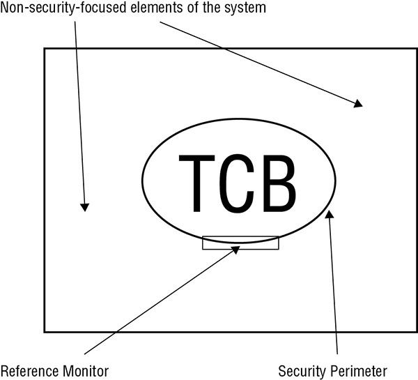
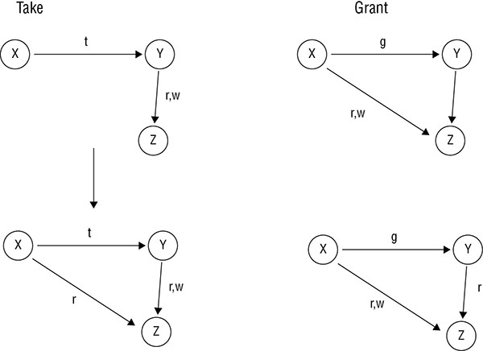
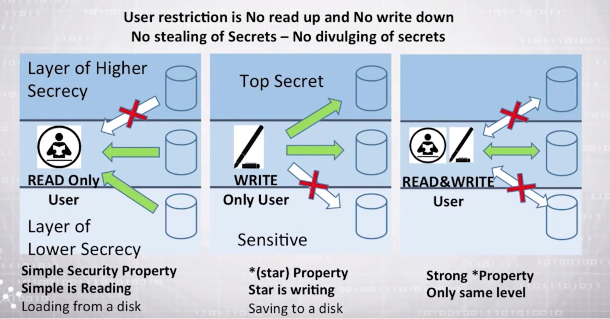
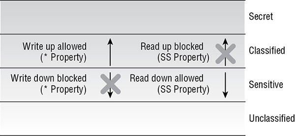
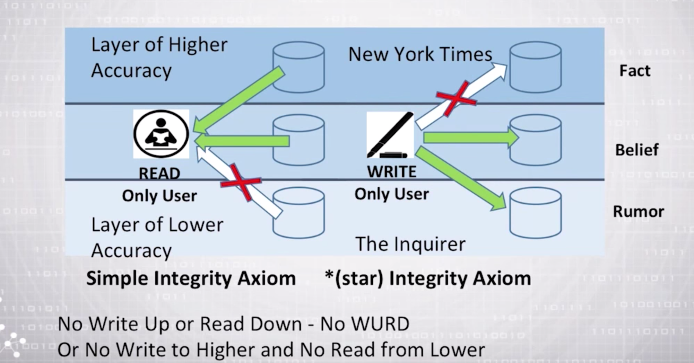
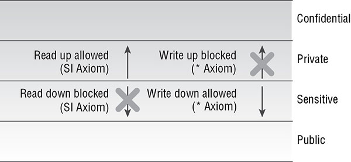
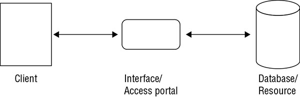
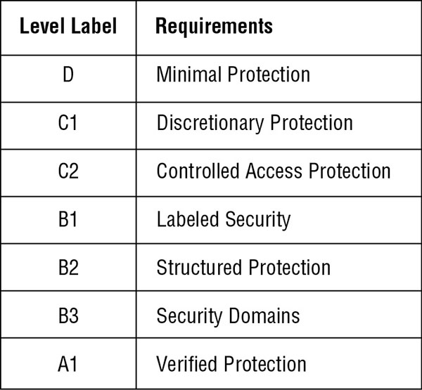
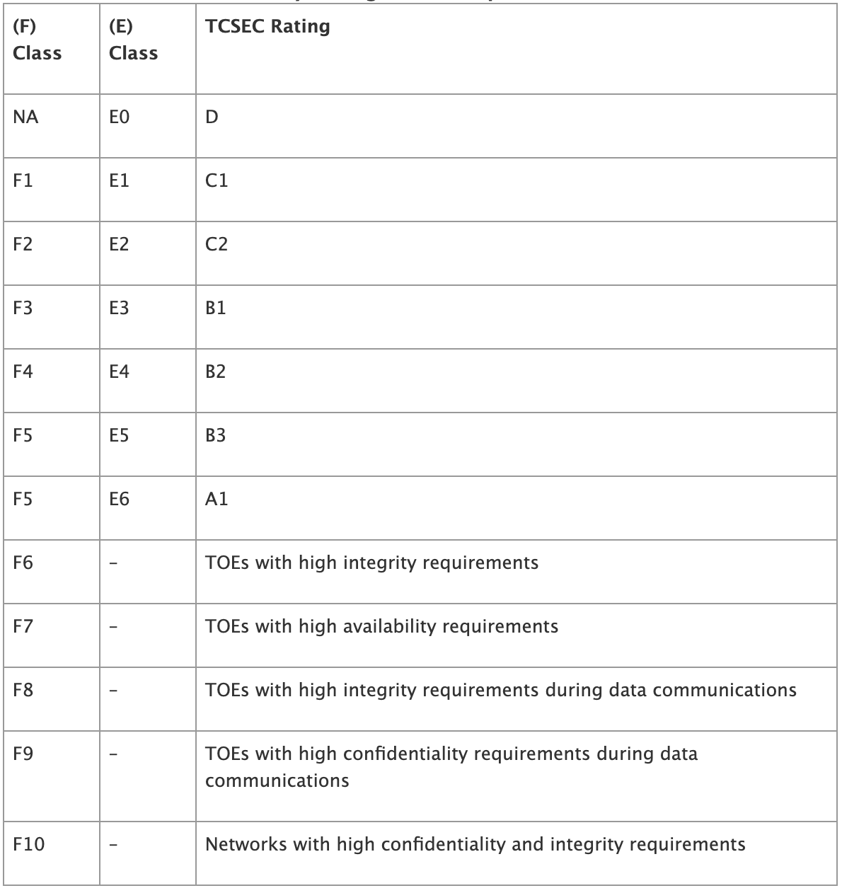

## Implement and Manage Engineering Processes Using Secure Design Principles

It’s much easier to build security into a system than it is to add security onto an existing system

### Objects And Subjects

The *subject* is the user or process that makes a request to access a resource. Access can mean reading from or writing to a resource. 

The *object* is the resource a user or process wants to access.

For example, process A may ask for data from process B. To satisfy process A’s request, process B must ask for data from process C. In this example, process B is the object of the first request and the subject of the second request:

First request - process A (subject)	process B (object)
Second request - process B (subject)	process C (object)

This also serves as an example of *transitive trust*. Transitive trust is the concept that if A trusts B and B trusts C, then A inherits trust of C through the transitive property—which works like it would in a mathematical equation: if a = b, and b = c, then a = c. Transitive trust can be used to bypass restrictions. Real world example, user use VPN to bypass network restriction in the office. 

### Closed and Open Systems

A *closed system* is designed to work well with a narrow range of other systems, generally all from the same manufacturer. The standards for closed systems are often proprietary and not normally disclosed. 

*Open systems*, on the other hand, are designed using agreed-upon industry standards. Open systems are much easier to integrate with systems from different manufacturers that support the same standards.

### Techniques For Ensuring Confidentiality, Integrity And Availability

Suppose a program writes to and reads from an area of memory that is being used by another program. The first program could potentially violate all three security tenets: confidentiality, integrity, and availability. If an affected program is `processing sensitive or secret data`, that data’s confidentiality is no longer guaranteed. If that data is `overwritten or altered` in an unpredictable way (a common problem when multiple readers and writers inadvertently access the same shared data), there is no guarantee of integrity. And, if data modification `results in corruption or outright loss`, it could become unavailable for future use. 

#### Confinement

Process *confinement* allows a process to read from and write to only certain memory locations and resources. This is also known as *sandboxing*. Confinement can be implemented in the operating system itself (such as through process isolation and memory protection), through the use of a confinement application or service (for example, [Sandboxie](www.sandboxie.com)), or through a virtualization or hypervisor solution (such as VMware or Oracle’s VirtualBox).

#### Bounds

In simple systems, there may be only two authority levels: user and kernel. The authority level tells the operating system how to set the bounds for a process. The bounds of a process consist of limits set on the memory addresses and resources it can access. it can logical bounds or physical bounds. 

#### Isolation

Process isolation ensures that any behavior will affect only the memory and resources associated with the isolated process. Isolation is used to protect the operating environment, the kernel of the operating system (OS), and other independent applications. 

### Controls

A control uses access rules to limit the access of a subject to an object. Access rules state which objects are valid for each subject. Further, an object might be valid for one type of access and be invalid for another type of access. One common control is for file access.

Mandatory access control (MAC) and discretionary access control (DAC), 

MAC: subject attribute + objects classification 

MAC Example: subject A is granted access to object B if the security system can find a rule that allows a subject with subject A’s clearance to access an object with object B’s classification.

DAC: Subject has some ability to define the objects to access.

The primary goal of controls is to ensure the confidentiality and integrity of data by disallowing unauthorized access by authorized or unauthorized subjects.

### TRUST AND ASSURANCE

A *trusted system* is one in which all protection mechanisms work together to process sensitive data for many types of users while maintaining a stable and secure computing environment.

*Assurance* is simply defined as the degree of confidence in satisfaction of security needs. Assurance must be continually maintained, updated, and reverified. 

Trust can be built into a system by implementing specific security features, whereas assurance is an assessment of the reliability and usability of those security features in a real-world situation.

## Understand the Fundamental Concepts of Security Models

A *security model* provides a way for designers to map abstract statements into a security policy that prescribes the algorithms and data structures necessary to build hardware and software. Thus, a security model gives software designers something against which to measure their design and implementation. That model, of course, must support each part of the security policy. In this way, developers can be sure their security implementation supports the security policy.

> *Security token* is a separate object that is associated with a resource and describes its security attributes. This token can communicate security information about an object prior to requesting access to the actual object. 

> *Capabilities list* maintains a row of security attributes for each controlled object.

> *Security label*, which is generally a permanent part of the object to which it’s attached. Once a security label is set, it usually cannot be altered.

### TRUSTED COMPUTING BASE

Orange Book/Trusted Computer System Evaluation Criteria (TCSEC) describes a *trusted computing base (TCB)* as a combination of hardware, software, and controls that work together to form a trusted base to enforce your security policy. 

  * TCB components in a system are responsible for `controlling access` to the system.
  * TCB must `provide methods` to access resources both inside and outside the TCB itself
  * TCB components `commonly restrict the activities` of components `outside the TCB`.
  * It is the responsibility of TCB components to ensure that a system behaves properly in all cases and that it `adheres to the security policy under all circumstances`.


#### Security Perimeter



  * Security perimeter of your system is an imaginary boundary that separates the TCB from the rest of the system. This boundary ensures that no insecure communications or interactions occur between the TCB and the remaining elements of the computer system.

  * For the TCB to communicate with the rest of the system, it must create secure channels, also called *trusted paths*. According to the TCSEC guidelines, trusted paths are required for high-trust-level systems such as those at `level B2 or higher of TCSEC`.

#### Reference Monitors and Kernels

  * The part of the TCB that validates access (access control via Discretionary, Mandatory, Role Based, or some other form of access control) to every resource prior to granting access requests is called the *reference monitor* 

  * The collection of components in the TCB that work together to implement reference monitor functions is called the *security kernel*. The reference monitor is a concept or theory that is put into practice via the implementation of a security kernel in software and hardware.

  * The reference monitor requires descriptive information about each resource that it protects (see above for - Tokens, Capabilities, and Labels).

### STATE MACHINE MODEL

The state machine model describes a system that is always secure no matter what state it is in. It’s based on the computer science definition of a *finite state machine (FSM)*.

A *state* is a snapshot of a system at a specific moment in time.  A *transition* occurs when accepting input or producing output.  If each possible state transition results in another secure state, the system can be called a *secure state machine*. 

A secure state machine model system always boots into a secure state, maintains a secure state across all transitions, and allows subjects to access resources only in a secure manner compliant with the security policy. 

### INFORMATION FLOW MODEL

The information flow model focuses on the flow of information. Information flow models are `based on a state machine model`. Not only the direction of information flow; they can also address the type of flow.

Two models are Bell-LaPadula and Biba models.

Bell-LaPadula is concerned with `preventing information flow from a high security level to a low security level`. Biba is concerned with `preventing information flow from a low security level to a high security level`.  

Information flow can be based on Classification level of subject or object, it may be same or different levels.

Another interesting perspective on the information flow model is that it is used to establish a relationship between two versions or states of the same object when those two versions or states exist at different points in time. 

The information flow model also `addresses covert channels` by specifically excluding all nondefined flow pathways.

### NONINTERFERENCE MODEL

The noninterference model is `loosely based on the information flow model`. This model is concerned with how the `actions of a subject at a higher security level affect the system state or the actions of a subject at a lower security level.` Basically, the actions of subject A (high) should not affect the actions of subject B (low) or even be noticed by subject B. 

Thus, the noninterference model can be imposed to provide a form of protection against damage caused by malicious programs such as Trojan horses (which is B in this case)

### COMPOSITION THEORIES

Some other models that fall into the information flow category build on the notion of `how inputs and outputs between multiple systems relate to one another`—which follows how information flows between systems rather than within an individual system. These are called *composition theories* because they explain how outputs from one system relate to inputs to another system. There are three recognized types of composition theories:

* *Cascading*: Input for one system comes from the output of another system.
* *Feedback*: One system provides input to another system, which reciprocates by reversing those roles (so that system A first provides input for system B and then system B provides input to system A).
* *Hookup*: One system sends input to another system but also sends input to external entities.

### TAKE-GRANT MODEL

The Take-Grant model employs a directed graph to dictate how rights can be passed from one subject to another or from a subject to an object. The key to this model is that using these rules allows you to `figure out when rights in the system can change and where leakage` (that is, unintentional distribution of permissions) can occur.



* A subject with the `grant right` can grant another subject or another object `any other right they possess`. 
* A subject with the `take right` can `take a right from another subject`

Take rule - Allows a subject to take rights over an object
Grant rule - Allows a subject to grant rights to an object
Create rule - Allows a subject to create new rights
Remove rule	- Allows a subject to remove rights it has

### ACCESS CONTROL MATRIX

An access control matrix is a table of subjects and objects that indicates the actions or functions that each subject can perform on each object. Each column of the matrix is an `access control list (ACL)`. Each row of the matrix is a *capabilities list*.

An ACL is tied to the object; it lists valid actions each subject can perform. A capability list is tied to the subject; it lists valid actions that can be taken on each object.

Below is a discretionary access control system. A mandatory or rule-based matrix can be constructed simply by replacing the subject names with classifications or roles.

Subjects | Document file | Printer | Network folder share
--- | --- | --- | --- 
Bob	| Read  | No Access | No Access
Mary |	No Access |	No Access |	Read
Amanda | 	Read, Write| 	Print|	No Access
Mark |	Read, Write|	Print	| Read, Write
Kathryn|	Read, Write	Print, |Manage Print Queue|	Read, Write, Execute
Colin|	Read, Write, Change Permissions	| Print, Manage Print Queue, Change Permissions |	Read, Write, Execute, Change Permissions

### BELL-LAPADULA MODEL

  * Classification Levels -  unclassified, sensitive but unclassified, confidential, secret, and top secret

  * By design, the Bell-LaPadula model prevents the leaking or transfer of classified information to less secure clearance levels.

  * Focused on maintaining the `confidentiality` of objects

  * This model is built on a state machine concept and the information flow model. 

  * Employs mandatory access controls and the lattice concept. 

  * There are three basic properties of this state machine:

      * The *Simple Security Property* states that a subject may not read information at a higher sensitivity level (`no read up`).
      * The *`*` (star) Security Property* states that a subject may not write information to an object at a lower sensitivity level (`no write down`). This is also known as the Confinement Property.
      * The *Discretionary Security Property* states that the system uses an access matrix to enforce discretionary access control.

  
  

> An exception in the Bell-LaPadula model states that a “trusted subject” is not constrained by the * Security Property. A trusted subject is defined as “a subject that is guaranteed not to consummate a security-breaching information transfer even if it is possible.” 

### BIBA MODEL
  
  * Biba model addresses `integrity`
  * built on a state machine concept, is based on information flow, and is a multilevel model.
  * Here are the basic properties or axioms of the Biba model state machine:

     * The *Simple Integrity Property* states that a subject cannot read an object at a lower integrity level (`no read-down`).
     * The *`*` (star) Integrity Property* states that a subject cannot modify an object at a higher integrity level (`no write-up`).

> What you should focus on is the `simple` and `star` designations. Take note that `simple` is always about `reading`, and `star` is always about `writing`. Also, in both cases, simple and star are rules that define what cannot or should not be done.

  
  

```
Useful Videos:
```
Security Models Pt. 1 - [Link](https://www.youtube.com/watch?v=SfryxGRXoVg)

Security Models Pt. 2 - [Link](https://www.youtube.com/watch?v=FRi73kodf_c)

### CLARK-WILSON MODEL

  * Clark-Wilson model uses a multifaceted approach to `enforcing data integrit`. 
  
  * It uses a three-part relationship of subject/program/object (or subject/transaction/object) known as a *triple or an access control triple*. Subjects do not have direct access to objects. Objects can be accessed only through programs. Through the use of two principles— `well-formed transactions and separation of duties—the` Clark-Wilson model provides an effective means to protect integrity.

  

  * Following items and procedures:
    * *Constrained data item (CDI)* is any data item whose integrity is protected by the security model.
    * *Unconstrained data item (UDI)* is any data item that is not controlled by the security model
    * *Integrity verification procedure (IVP)* is a procedure that scans data items and confirms their integrity.
    * *Transformation procedures (TPs)* are the only procedures that are allowed to modify a CDI. 

  * The Clark-Wilson model uses security labels to grant access to objects, but only through transformation procedures and a *restricted interface model*.

  * One subject at one classification level will see one set of data and have access to one set of functions, whereas another subject at a different classification level will see a different set of data and have access to a different set of functions.

### BREWER AND NASH MODEL (AKA CHINESE WALL)

  * The Brewer and Nash model was created to permit access controls to change dynamically based on a user’s previous activity. 

  * It seeks to create security domains that are sensitive to the notion of `conflict of interest` (for example, someone who works at Company C who has access to proprietary data for Company A should not also be allowed access to similar data for Company B if those two companies compete with each other). 

  * This model is known as the *Chinese Wall model* because it `creates a class of data` that defines which security domains are `potentially in conflict` and prevents any subject with access to one domain that belongs to a specific conflict class from accessing any other domain that belongs to the `same conflict class`.

### GOGUEN-MESEGUER MODEL

  * Goguen-Meseguer model is an `integrity model`
  * When someone refers to a noninterference model, they are actually referring to the Goguen-Meseguer model.
  * Subjects are allowed only to perform predetermined actions against predetermined objects.

### SUTHERLAND MODEL

  * Sutherland model is an integrity model
  * Focuses on preventing interference in support of integrity.
  * Model is based on the idea of defining a set of system states, initial states, and state transitions. Through the use of only these predetermined secure states, integrity is maintained and interference is prohibited.

### GRAHAM-DENNING MODEL

  * Graham-Denning model is focused on the secure creation and deletion of both subjects and objects. 
  *  Graham-Denning is a collection of `eight primary protection rules or actions` that define the boundaries of certain secure actions:

	* Securely create an object.
	* Securely create a subject.
	* Securely delete an object.
	* Securely delete a subject.
	* Securely provide the read access right.
	* Securely provide the grant access right.
	* Securely provide the delete access right.
	* Securely provide the transfer access right.

## Select Controls Based On Systems Security Requirements

Buyers want to know what they’re buying and, usually, what steps they must take to keep such systems as secure as possible.

The three main product evaluation models or classification criteria models addressed here are TCSEC, Information Technology Security Evaluation Criteria (ITSEC), and Common Criteria.

### RAINBOW SERIES

  * The first such set of standards resulted in the creation of the `Trusted Computer System Evaluation Criteria (TCSEC)` in the 1980s, as the U.S. Department of Defense (DoD) worked to develop and impose security standards for the systems it purchased and used. In turn, this led to a whole series of such publications through the mid-1990s. Since these publications were routinely identified by the color of their covers, they are known collectively as the *rainbow series*.

  * Following in the DoD’s footsteps, other governments or standards bodies created computer security standards that built and improved on the rainbow series elements. Significant standards in this group include a European model called the `Information Technology Security Evaluation Criteria (ITSEC)`, which was developed in 1990 and used through 1998. Eventually TCSEC and ITSEC were replaced with the so-called `Common Criteria`, adopted by the United States, Canada, France, Germany, and the United Kingdom in 1998 but more formally known as the “`Arrangement on the Recognition of Common Criteria Certificates in the Field of IT Security.`” 

  * In 1985, the National Computer Security Center (NCSC) developed the TCSEC, usually called the *Orange Book* because of the color of this publication’s covers.

#### TCSEC Classes and Required Functionality

  * Applicable systems are stand-alone systems that are not networked.
  * Checked functionality and assurance rating of the confidentiality protection.
  * Four major categories and  sub-categorized by numbers such as C1 and C2 etc

    **Category A** Verified protection. The highest level of security.
    **Category B** Mandatory protection.
    **Category C** Discretionary protection.
    **Category D** Minimal protection. Reserved for systems that have been evaluated but do not meet requirements to belong to any other category.
  
  

  * Levels vs MAC or DAC
  
  Level | Items to Remember
  --- | --- 
  A1 (Verified Protection) | Built, installed, and delivered in a secure manner (MAC)
  B1 (Labeled Security) | Security labels (MAC)
  B2 (Structured Protection) | Security labels and verification of no covert channels (MAC)
  B3 (Security Domains)|  Security labels, verification of no covert channels, and must stay secure during startup (MAC)
  C1 (Discretionary Access Control) | Weak protection mechanisms (DAC)
  C2 (Controlled Access Protection) | Strict login procedures (DAC)
  D1 (Minimum Protection) | Failed or was not tested

#### The Red Book: Trusted Network Interpretation

The Red Book’s official name is the *Trusted Network Interpretation (TNI)*. The purpose of the TNI is to examine security for `network and network components`. Whereas the Orange Book addresses only confidentiality, the Red Book examines `integrity and availability`. It also is tasked with examining the operation of networked devices. Three areas of reviews of the Red Book include

* DoS prevention — Management and continuity of operations.
* Compromise protection — Data and traffic confidentiality, selective routing.
* Communications integrity — Authentication, integrity, and nonrepudiation.

### ITSEC CLASSES AND REQUIRED ASSURANCE AND FUNCTIONALITY

  * Evaluate confidentiality, integrity, and availability of an entire system.
  * ITSEC designates the target system as the *Target of Evaluation (TOE)*
  * The evaluation is actually divided into two parts: One part evaluates functionality and the other evaluates assurance. There are 10 functionality (F) classes and 7 assurance (E) classes. 

  

  F1 to F10 rates for functionality and E0 to E6 for assurance

### COMMON CRITERIA
  
  * In 1997, the ISO released the Common Criteria (`ISO 15408`), which is an amalgamated version of TCSEC, ITSEC, and the CTCPEC.
  * Common Criteria is designed around `TCB` entities. These entities include physical and logical controls, startup and recovery, reference mediation, and privileged states.
  * Common Criteria categorizes assurance into one of `seven` increasingly strict levels of assurance. These are referred to as *Evaluation Assurance Levels (EALs)*.
  *  A description of each of the seven levels of assurance follows:

	* **EAL 0** —Inadequate assurance
	* **EAL 1** —Functionality tested
	* **EAL 2** —Structurally tested
	* **EAL 3** —Methodically checked and tested
	* **EAL 4** —Methodically designed, tested, and reviewed
	* **EAL 5** —Semiformally designed and tested
	* **EAL 6** —Semiformally verified designed and tested
	* **EAL 7** —Formally verified designed and tested 

  * Common Criteria defines two types of security requirements: *functional and assurance*. Functional requirements define what a product or system does. They also define the security capabilities of a product. The assurance requirements and specifications to be used as the basis for evaluation are known as the *Security Target (ST)* . A protection profile defines the system and its controls. The protection profile is divided into the following five sections:

	* Rationale
	* Evaluation assurance requirements
	* Descriptive elements
	* Functional requirements
	* Development assurance requirements

  * Assurance requirements define how well a product is built. Assurance requirements give confidence in the product and show the correctness of its implementation.

```
Useful Article:
http://www.pearsonitcertification.com/articles/article.aspx?p=1998558&seqNum=5
```

### INDUSTRY AND INTERNATIONAL SECURITY IMPLEMENTATION GUIDELINES

In addition to overall security access models, such as Common Criteria, there are many other more specific or focused security standards for various aspects of storage, communication, transactions, and the like. Two of these standards you should be familiar with are *Payment Card Industry Data Security Standard (PCI DSS)* and *International Organization for Standardization (ISO)*.

### CERTIFICATION AND ACCREDITATION

The formal evaluation process is divided into two phases, called *certification and accreditation*.

#### Certification

* First, you must choose evaluation criteria.
* You can evaluate the results to determine the security level the system supports in its current environment
* You complete the certification phase when you have evaluated all factors and determined the level of security for the system. Remember that the certification is valid only for a system in a specific environment and configuration.

#### Accreditation

* In the certification phase, you test and document the security capabilities of a system in a specific configuration.
* Management reviews the certification information and decides whether the system satisfies the security needs of the organization.
* If management decides the certification of the system satisfies their needs, the system is *accredited*. 
* Accreditation is the formal declaration by the *designated approving authority (DAA)* that an IT system is approved to operate in a particular security mode using a prescribed set of safeguards at an acceptable level of risk.

> The process of certification and accreditation is often iterative. 

#### Certification and Accreditation Systems

* Two government standards are currently in place for the certification and accreditation of computing systems: 
  * The current DoD standard is *Risk Management Framework (RMF)*
  * *Committee on National Security Systems (CNSS)*

* Four phases:
  * Phase 1: Definition - Assigned required resouced need and create System Security Authorization Agreement (SSAA) that guides the entire certification and accreditation process.
  * Phase 2: Verification
  * Phase 3: Validation
  * Phase 4: Post Accreditation

## Understand Security Capabilities of Information Systems

The security capabilities of information systems include memory protection, virtualization, Trusted Platform Module (TPM), interfaces, and fault tolerance.

### MEMORY PROTECTION

  * Designed and implemented into an operating system
  * It is used to prevent an active process from interacting with an area of memory that was not specifically assigned or allocated to it.

### VIRTUALIZATION
  
   * Virtualization technology is used to host one or more operating systems within the memory of a single host computer
   * Benefits:
     * Able to launch individual instances of servers or services as needed, real-time scalability, and being able to run the exact OS version needed for a specific application.
     * Recovery from damaged, crashed, or corrupted virtual systems is often quick, simply consisting of replacing the virtual system’s main hard drive file with a clean backup version and then relaunching it.

### TRUSTED PLATFORM MODULE

  * The Trusted Platform Module (TPM) is both a specification for a cryptoprocessor chip on a mainboard and the general name for implementation of the specification.
  * A TPM chip is used to store and process cryptographic keys for the purposes of a hardware supported/implemented hard drive encryption system
  * *Hardware security module (HSM)* is a cryptoprocessor used to manage/store digital encryption keys, accelerate crypto operations, support faster digital signatures, and improve authentication.

### INTERFACES

  * A constrained or restricted interface is implemented within an application to restrict what users can do or see based on their privileges.
  * The purpose of a constrained interface is to limit or restrict the actions of both authorized and unauthorized users. The use of such an interface is a practical implementation of the Clark-Wilson model of security.

### FAULT TOLERANCE

  * Fault tolerance is the ability of a system to suffer a fault but continue to operate. 
  * Fault tolerance is achieved by adding redundant components such as additional disks within a redundant array of inexpensive disks (RAID) array, or additional servers within a failover clustered configuration.
  * Used avoiding single points of failure and the implementation of redundancy.