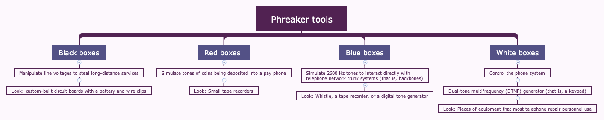

Communications security is designed to detect, prevent, and even correct data transportation errors (that is, it provides integrity protection as well as confidentiality). This is done to sustain the security of networks while supporting the need to exchange and share data.

## Network and Protocol Security Mechanisms

Focus would be on Transmission Control Protocol/Internet Protocol (TCP/IP) protocol suite.

### Secure Communications Protocols

Protocols that provide security services for application-specific communication channels are called secure communication protocols. The following list includes a small sampling of some of the options available:

**IPsec**

Uses public key cryptography to provide encryption, access control, nonrepudiation, and message authentication, all using IP-based protocols. The primary use of IPsec is for virtual private networks (VPNs), so IPsec can operate in either transport or tunnel mode

**Kerberos**

Provide reliable authentication protection

**SSH**

Used to encrypt numerous plaintext utilities (such as rcp, rlogin, rexec), serve as a protocol encrypter (such as with SFTP), and function as a VPN.

**Signal Protocol**

Provides end-to-end encryption for voice communications, videoconferencing, and text message services.

**Secure Remote Procedure Call (S-RPC)**

This is an authentication service and is simply a means to prevent unauthorized execution of code on remote systems.

**Secure Sockets Layer (SSL)**

SSL can be used to secure web, email, File Transfer Protocol (FTP) or even Telnet traffic. Provides confidentiality and integrity.

**Transport Layer Security (TLS)**

TLS functions in the same general manner as SSL, but it uses stronger authentication and encryption protocols.

### Authentication Protocols

After a connection is initially established between a remote system and a server or a network, the first activity that should take place is to verify the identity of the remote user. This activity is known as authentication.

**Challenge Handshake Authentication Protocol (CHAP)**:

  * Used over Point-to-Point Protocol (PPP) links
  * CHAP encrypts usernames and passwords. 
  * It performs authentication using a challenge-response dialogue that cannot be replayed.
  * CHAP also periodically reauthenticates the remote system throughout an established communication session to verify a persistent identity of the remote client.

**Password Authentication Protocol (PAP)**
  
  * PAP transmits usernames and passwords in cleartext. 
  * It offers no form of encryption

**Extensible Authentication Protocol (EAP)**

  * This is a framework for authentication instead of an actual protocol.
  * Example: EAP, PEAP, AND LEAP

    * Protected Extensible Authentication Protocol (PEAP) encapsulates EAP in a TLS tunnel. PEAP is also preferred over Cisco’s proprietary EAP known as Lightweight Extensible Authentication Protocol (LEAP).

## Secure Voice Communications

Normal *private branch exchange (PBX)* or POTS/*public switched telephone network (PSTN)* voice communications are vulnerable to interception, eavesdropping, tapping, and other exploitations. Often, physical security is required to maintain control over voice communications within the confines of your organization’s physical locations. Security of voice communications outside your organization is typically the responsibility of the phone company from which you lease services. If voice communication vulnerabilities are an important issue for sustaining your security policy, you should deploy an encrypted communication mechanism and use it exclusively

### Voice Over Internet Protocol

Hackers can wage a wide range of potential attacks against a VoIP solution:

* *Caller ID* can be falsified easily using any number of VoIP tools, so hackers can perform *vishing (VoIP phishing)* or *Spam over Internet Telephony (SPIT)* attacks.

* Call manager systems and the VoIP phones are vulnerable host OS attacks and DOS.

* Perform *man-in-the-middle* (MitM) attacks by spoofing call managers or endpoint connection negotiations and/or responses.

* There are also risks associated with deploying VoIP phones off the same switches as desktop and server systems. This could allow for 802.1X authentication falsification as well as virtual local area network (VLAN) and VoIP hopping (i.e., jumping across authenticated channels).

* It is often possible to listen in on VoIP communications by decoding the VoIP traffic when it isn’t encrypted.

**SafeGuard** Use *Secure Real-Time Transport Protocol or SecureRTP (SRTP)* which aims to minimize the risk of VoIP DoS through robust encryption and reliable authentication.

### Social Engineering

Social engineering is a means by which an unknown, untrusted, or at least unauthorized person gains the trust of someone inside your organization. Social engineering is the art of using an organization’s own people against it. The only way to protect against social engineering attacks is to teach users how to respond and interact with any form of communications, whether voice-only, face to face, IM, chat, or email.

Here are some guidelines:

* Always err on the side of caution whenever voice communications seem odd, out of place, or unexpected.
* Always request proof of identity.
* Require `callback` authorizations on all voice-only requests for network alterations or activities. A callback authorization occurs when the initial client connection is disconnected, and a person or party would call the client on a predetermined number that would usually be stored in a corporate directory in order to verify the identity of the client.
* Classify information (usernames, passwords, IP addresses, manager names, dial-in numbers, and so on), and clearly indicate which information can be discussed or even confirmed using voice communications.
* If privileged information is requested over the phone by an individual who should know that giving out that particular information over the phone is against the company’s security policy, ask why the information is needed and verify their identity again. This incident should also be reported to the security administrator.
* Never give out or change passwords via voice-only communications.
* When disposing of office documentation (according to policy and regulation compliance) always use a secure disposal or destruction process, especially for any paperwork or media that contains information about the IT infrastructure or its security mechanisms.

### Fraud and Abuse

  * Its a threat to private branch exchange (PBX) commnication.
  * These attackers are called - *phreakers*, they are like attacker in networks.
  * phreakers may get access to personal voice mailboxes, redirect messages, block access, and redirect inbound and outbound calls.

  

  * *Direct Inward System Access (DISA)* system is designed to help manage external access and external control of a PBX by assigning access codes to users. Although great in concept, this system is being compromised and abused by phreakers. Once an outside phreaker learns the PBX access codes, they can often fully control and abuse the company’s telephone network. 

  

  * **Cell phone security** is a growing concern. Captured *electronic serial numbers (ESNs)* and *mobile identification numbers (MINs)* can be burned into blank phones to create clones (even *subscriber identity modules*—SIMs—can be duplicated). When a clone is used, the charges are billed to the original owner’s cell phone account. Furthermore, conversations and data transmission can be intercepted using radio frequency scanners. Also, anyone in the immediate vicinity can overhear at least one side of the conversation. So don’t talk about confidential, private, or sensitive topics in public places.

## Multimedia Collaboration

Collaboration can incorporate email, chat, VoIP, videoconferencing, use of a whiteboard, online document editing, real-time file exchange, versioning control, and other tools. It is often a feature of advanced forms of remote meeting technology.

### Remote Meeting
  
  * Remote meeting technology is used for any product, hardware, or software that allows for interaction between remote parties.
  * Digital collaboration, virtual meetings, videoconferencing, software or application collaboration, shared whiteboard services, virtual training solutions, and so on
  * **Security**:

    * Does the service use strong authentication techniques?
    * Does the communication occur across an open protocol or an encrypted tunnel?
    * Does the solution allow for true deletion of content?
    * Are activities of users audited and logged? 

### Instant Messaging

  * Instant messaging (IM) is a mechanism that allows for real-time text-based chat between two users located anywhere on the internet.
  * Some forms of IM are based on a peer-to-peer service while others use a centralized controlling server. Where Peer-to-peer-based IM is generatlly easy to deploy but insecure. 
  * There are several modern instant messaging solutions to consider for both person-to-person interactions and collaboration and communications among a group. Some are public services, such as Twitter, Facebook Messenger, and Snapchat. Others are designed for private or internal use, such as Slack, Google Hangouts, Cisco Spark, Workplace by Facebook, and Skype. Most of these messaging services are designed with security as a key feature, often employing multifactor authentication and transmission encryption.

## Manage Email Security

Protocols in play:

* Simple Mail Transfer Protocol (SMTP) - Server accept message from Clients and send them recipient which may be on the same server or some other server. 
* Post Office Protocol version 3 (POP3) or Internet Message Access Protocol (IMAP) - Clients retrieve email from their server-based inboxes
* Many internet-compatible email systems rely on the X.400 standard for addressing and message handling.

Common Deployment software/methods for SMTP server:

* Sendmail (Unix)
* Exchange (Windows)
* SaaS email solution (Gmail (Google Apps for Business) and Outlook/Exchange Online)

Security:

* Configure authentication for both inbound and outbound mail. 
* Avoid turning your SMTP server into an open relay (also known as an open relay agent or relay agent).

### Email Security Goals

Objectives of email security:

* Provide for `nonrepudiation`
* Restrict access to messages to their intended recipients (i.e., `privacy and confidentiality`)
* Maintain the `integrity` of messages
* `Authenticate` and verify the source of messages
* Verify the `delivery` of messages
* Classify `sensitive` content within or attached to messages

Email security specific content in security policy:

* Acceptable use policies for email
* Access control
* Privacy
* Email management
* Email backup and retention policies

### Understanding Email Security Issues

  * The standard protocols used to support email (i.e., SMTP, POP, and IMAP) do not employ encryption natively. 
  * The proliferation (rapid increase in the number or amount of something) of support for various scripting languages, autodownload capabilities, and autoexecute features has transformed hyperlinks within the content of email and attachments into a serious threat to every system.
  * Spoofing the source address of email is a simple process for even a novice attacker.
  * Speaking of in-transit modification, there are no native integrity checks to ensure that a message was not altered between its source and destination.
  * Mail-bombing - Is simply a DoS performed by inundating a system with messages. The DoS can be the result of storage capacity consumption or processing capability utilization. Either way, the result is the same: Legitimate messages cannot be delivered.
  * Unwanted email can be considered an attack - Spamming

### Email Security Solution

You can use several protocols, services, and solutions to add security to email without requiring a complete overhaul of the entire internet-based SMTP infrastructure. These include S/MIME, MOSS, PEM, and PGP

**Secure Multipurpose Internet Mail Extensions (S/MIME)** 
  
  * Offers authentication and confidentiality
  * Authentication is provided through X.509 digital certificates. 
  * Privacy is provided through the use of Public Key Cryptography Standard (PKCS) encryption. 
  * Two types of messages can be formed using S/MIME: signed messages and secured enveloped messages. A signed message provides integrity, sender authentication, and nonrepudiation. An enveloped message provides integrity, sender authentication, and confidentiality.

**MIME Object Security Services (MOSS)** 

  * Provides authentication, confidentiality, integrity, and nonrepudiation for email messages

**Privacy Enhanced Mail (PEM)** 

  * Provides authentication, integrity, confidentiality, and nonrepudiation

**DomainKeys Identified Mail (DKIM)** 

  * DKIM is a means to assert that valid mail is sent by an organization through verification of domain name identity. [Link](http://www.dkim.org/).

**Pretty Good Privacy (PGP)**

  * Pretty Good Privacy (PGP) is a public-private key system that uses a variety of encryption algorithms to encrypt files and email messages. 

**Opportunistic TLS for SMTP Gateways (RFC 3207)**

  *  Opportunistic TLS for SMTP will attempt to set up an encrypted connection with every other email server in the event that it is supported. Otherwise, it will downgrade to plaintext. [Link](https://tools.ietf.org/html/rfc3207).

**Sender Policy Framework (SPF)** 

  * Protect against spam and email spoofing.
  * For example, if I receive a message from mark.nugget@abccorps.com, then SPF checks with the administrators of smtp.abccorps.com that mark.nugget is authorized to send messages through their system before the inbound message is accepted and sent into a recipient inbox.

Few other solution:

  * Have 100 percent no-attachments policy if your organization allows it. 
  * If thats not possible then train your users and use antivirus tools for protection.
  * Blacklist services offer a subscription system to a list of known email abuse sources.
  * Another option is to use a challenge/response filter (Spammers and auto-emailers will not respond to these requests, but valid humans will).
  * Email reputation filtering - senderscore.org, senderbase.org, ReputationAuthority.org, trustedsource.org, Barracuda Central Apache SpamAssassin and spamd.

## Remote Access Security Management

Use cases:

* Using a modem to dial up directly to a remote access server
* Connecting to a network over the internet through a VPN
* Connecting to a terminal server system through a thin-client connection
* Connecting to an office-located personal computer (PC) using a remote desktop service, such as Microsoft’s Remote Desktop, TeamViewer, GoToMyPC, Citrix’s XenDesktop, or VNC
* Using cloud-based desktop solutions, such as Amazon’s Workspaces

There are four main types of remote access techniques:

* Service Specific
* Remote Control 
* Screen Scraper/Scraping
* Remote Node Operation 

Security Consideration:

* Stringently authenticated 
* Users who need remote access should be the only one granted remote access
* All remote communications should be protected from interception and eavesdropping. - Encryption for both authentication traffic as well as all data transmission.

What bad can happen: 

* Physical security mechanism does not come into play or they are bypassed 
* Sensitive data exposure it to greater risk of loss, compromise, or disclosure.
* Remote systems might be exposed to `malicious code` and could be used as a carrier to `bring malware into the private LAN`.
* Remote systems might be `less physically secure` and thus be at risk of being used by `unauthorized entities or stolen`.
* Remote systems might be `more difficult to troubleshoot`, especially if the issues revolve around remote connection.
* Remote systems might `not be as easy to upgrade or patch` due to their potential infrequent connections or slow throughput links

### Plan Remote Access Security

When outlining your remote access security management strategy, be sure to address the following issues:

* Remote Connectivity Technology 
* Transmission Protection ` VPNs, SSL, TLS, Secure Shell (SSH), IPsec, and Layer 2 Tunneling Protocol (L2TP)`
* Authentication Protection `Password Authentication Protocol (PAP), Challenge Handshake Authentication Protocol (CHAP), Extensible Authentication Protocol (EAP, or its extensions PEAP or LEAP), Remote Authentication Dial-In User Service (RADIUS), and Terminal Access Controller Access-Control System Plus (TACACS+)`
* Remote User Assistance 

### Dial-UP Protocols

The two primary examples of dial-up protocols, PPP and SLIP, provide link governance, not only for true dial-up links but also for some VPN links:

**Point-to-Point Protocol (PPP)** This is a full-duplex protocol used for transmitting TCP/IP packets over various non-LAN connections, such as modems, ISDN, VPNs, Frame Relay, and so on. PPP authentication is protected through the use of various protocols, such as CHAP and PAP. 

**Serial Line Internet Protocol (SLIP)** Older technology developed to support TCP/IP communications over asynchronous serial connections, such as serial cables or modem dial-up

### Centralized Authentication Services

**Remote Authentication Dial-In User Service (RADIUS)** RADIUS operates over several ports; you should recognize the original UDP 1812 port as well as that used by RADIUS over TLS, which is TCP 2083. The TCP version of RADIUS was designed in 2012 to take advantage of TLS encryption (see [RFC 6614](https://tools.ietf.org/html/rfc6614)).

**Terminal Access Controller Access-Control System (TACACS+)** TACACS is available in three versions: original TACACS, Extended TACACS (XTACACS), and TACACS+. TACACS+ is the most current and relevant version of this product line. The primary port for TACACS+ is TCP 49.

## Virtual Private Network

A virtual private network (VPN) is a communication tunnel that provides point-to-point transmission of both authentication and data traffic over an intermediary untrusted network.

VPNs can provide confidentiality and integrity over insecure or untrusted intermediary networks. They do not provide or guarantee availability. 

### Tunneling

Tunneling is the network communications process that protects the contents of protocol packets by encapsulating them in packets of another protocol. If two networks are connected by a network employing a different protocol, the protocol of the separated networks can often be encapsulated within the intermediary network’s protocol to provide a communication pathway. If the act of encapsulating a protocol involves encryption, tunneling can provide a means to transport sensitive data across untrusted intermediary networks without fear of losing confidentiality and integrity.

Issues with Tunneling:

Tunneling creates either larger packets or additional packets that in turn consume additional network bandwidth.. Tunneling is a point-to-point communication mechanism and is not designed to handle broadcast traffic. Tunneling also makes it difficult, if not impossible, to monitor the content of the traffic in some circumstances, creating issues for security practitioners.

### How VPNs Work

A VPN link acts just like a typical direct LAN cable connection; the only possible difference would be speed based on the intermediary network and on the connection types between the client system and the server system.

VPN links through the internet for connecting to distant networks are often inexpensive alternatives to direct links or leased lines.

### Common VPN Protocols

There are four common VPN protocols: PPTP, L2F, L2TP, and IPsec. 

* PPTP, L2F, and L2TP operate at the Data Link layer (layer 2) of the OSI model. 
* PPTP and IPsec are limited for use on IP networks, 
* Whereas L2F and L2TP can be used to encapsulate any LAN protocol.

#### Point-to-Point Tunneling Protocol

It is encapsulation protocol developed from the dial-up `Point-to-Point` Protocol. It operates at the Data Link layer (`layer 2`) of the OSI model and is used on IP networks. PPTP creates a point-to-point tunnel between two systems and encapsulates PPP packets. It offers protection for authentication traffic through the same authentication protocols supported by PPP:

* Microsoft Challenge Handshake Authentication Protocol (MS-CHAP)
* Challenge Handshake Authentication Protocol (CHAP)
* Password Authentication Protocol (PAP)
* Extensible Authentication Protocol (EAP)
* Shiva Password Authentication Protocol (SPAP)

The initial tunnel negotiation process used by PPTP is not encrypted. Most modern uses of PPTP have adopted the Microsoft customized implementation which supports data encryption using Microsoft Point-to-Point Encryption (MPPE) and which supports various secure authentication options.

PPTP does not support TACACS+ and RADIUS.

#### Layer 2 Forwarding Protocol and Layer 2 Tunneling Protocol

Layer 2 Forwarding (L2F), which is a mutual authentication tunneling mechanism. However, L2F does not offer encryption. L2TP creates a point-to-point tunnel between communication endpoints. It lacks a built-in encryption scheme, but it typically relies on IPsec as its security mechanism. L2TP also supports TACACS+ and RADIUS. IPsec is commonly used as a security mechanism for L2TP.

#### IP Security Protocol

IP Security (IPsec) is both a stand-alone VPN protocol and the security mechanism for L2TP, and it can be used only for IP traffic.  IPsec works only on IP networks and provides for secured authentication as well as encrypted data transmission. IPsec has two primary components, or functions:

**Authentication Header (AH)** AH provides authentication, integrity, and nonrepudiation.

**Encapsulating Security Payload (ESP)** ESP provides encryption to protect the confidentiality of transmitted data, but it can also perform limited authentication. It operates at the Network layer (layer 3) and can be used in `transport mode or tunnel mode`. In transport mode, the IP packet data is encrypted but the header of the packet is not. In tunnel mode, the entire IP packet is encrypted and a new header is added to the packet to govern transmission through the tunnel.

VPN Protocol | Native Authentication Protection | Native Data Encryption | Protocols Supported | Dial-Up Links Supported | Number of Simultaneous Connections
--- | --- | --- | --- | --- | ---
PPTP |	Yes|	No|	PPP|	Yes|	Single point-to-point
L2F|	Yes|	No|	PPP/SLIP|	Yes	| Single point-to-point
L2TP|	Yes|	No (can use IPsec)|	PPP|	Yes|	Single point-to-point
IPsec|	Yes|	Yes|	IP only|	No|	Multiple

### Virtual LAN

Virtual local area network (VLAN) is a hardware-imposed network segmentation created by switches. By default, all ports on a switch are part of VLAN 1. But as the switch administrator changes the VLAN assignment on a port-by-port basis, various ports can be grouped together and kept distinct from other VLAN port designations.

Communications between members of the same VLAN occur without hindrance, but communications between VLANs require a routing function, which can be provided either by an external router or by the switch’s internal software (one reason for the terms L3 switch and multilayer switch).

> Any network segment that does not need to communicate with another to accomplish a work task/function should not be able to do so. Use VLANs to allow what is necessary, but block/deny anything not necessary. Remember, “deny by default; allow by exception” is not just a guideline for firewall rules but for security in general. 

As networks are being crafted in virtual environments or in the cloud, software switches are often used. In these situations, VLANs are not hardware-based but instead are switch-software-based implementations.

Switch blocks Ethernet broadcasts between VLANs and so helps protect against broadcast storms. A broadcast storm is a flood of unwanted Ethernet broadcast network traffic.

Private VLANs that are configured to use a dedicated or reserved uplink port. The members of a private VLAN or a port-isolated VLAN can interact only with each other and over the predetermined exit port or uplink port. 

## Virtualization

Virtualization technology is used to host one or more operating systems within the memory of a single host computer.  Such an OS is also known as a guest operating system. Common examples include VMware/vSphere, Microsoft’s Hyper-V, VirtualBox, XenServer, and Apple’s Parallels.

From security perspective:

* Easier and faster to make backups of entire virtual systems than the equivalent native hardware-installed system.
* When there is an error or problem, the virtual system can be replaced by a backup in minutes.
* Malicious code compromise or infection of virtual systems rarely affects the host OS

*VM escaping* occurs when software within a guest OS is able to breach the isolation protection provided by the hypervisor in order to violate the container of other guest OSs or to infiltrate a host OS.

### Virtual Software

A virtual (or virtualized) application has been packaged or encapsulated to make it portable and able to operate without the full installation of its original host OS. Example: running a Windows application within a Linux OS, portal apps on USB etc

### Virtual Networking

A virtualized network or network virtualization is the combination of hardware and software networking components into a single integrated entity. 

*Software-defined networking (SDN)* is a unique approach to network operation, design, and management. SDN aims at separating the infrastructure layer (i.e., hardware and hardware-based settings) from the control layer (i.e., network services of data transmission management). This also removes the traditional networking concepts of IP addressing, subnets, routing, and the like from needing to be programmed into or be deciphered by hosted applications.

Another way of thinking about SDN is that it is effectively network virtualization. It allows data transmission paths, communication decision trees, and flow control to be virtualized in the SDN control layer rather than being handled on the hardware on a per-device basis.

*Virtual SAN (storage area network)* - A SAN is a network technology that combines multiple individual storage devices into a single consolidated network-accessible storage container. A virtual SAN or a software-defined shared storage system is a virtual re-creation of a SAN on top of a virtualized network or an SDN.

## Network Address Translation

The goals of hiding the identity of internal clients, masking the design of your private network, and keeping public IP address leasing costs to a minimum are all simple to achieve through the use of network address translation (NAT).

NAT offers numerous benefits, including the following:

* You can connect an entire network to the internet using only a single (or just a few) leased public IP addresses.
* You can use the private IP addresses defined in RFC 1918 in a private network and still be able to communicate with the internet.
* NAT hides the IP addressing scheme and network topography from the internet.
* NAT restricts connections so that only traffic stemming from connections originating from the internal protected network is allowed back into the network from the internet. Thus, most intrusion attacks are automatically repelled.

*Port address translation (PAT)* or *NAT overloading* maps one internal IP address to an external IP address and port number combination. 

> Single-to-Multiple IP ratio can be 1000:1, one public address. More practical ratio is 4000:1

### Private IP Addresses

Defined in RFC 1918. They are as follows:

10.0.0.0–10.255.255.255 (a full Class A range)
172.16.0.0–172.31.255.255 (16 Class B ranges)
192.168.0.0–192.168.255.255 (256 Class C ranges)

The private IP addresses are not routed by default. Using private IP addresses in conjunction with NAT greatly reduces the cost of connecting to the internet by allowing fewer public IP addresses to be leased from an ISP.

### Stateful NAT

Stateful NAT - it maintains information about the communication sessions between clients and external systems.

### Static and Dynamic NAT

**Static NAT** Use static mode NAT when a specific internal client’s IP address is assigned a permanent mapping to a specific external public IP address. 

**Dynamic NAT** Use dynamic mode NAT to grant multiple internal clients access to a few leased public IP addresses. Thus, a large internal network can still access the internet without having to lease a large block of public IP addresses. This keeps public IP address usage abuse to a minimum and helps keep internet access costs to a minimum.

NAT is not directly compatible with IPsec because it modifies packet headers, which IPsec relies on to prevent security violations. However, there are versions of NAT proxies designed to support IPsec over NAT. Specifically, NAT-Traversal (RFC 3947) was designed to support IPsec VPNs through the use of UDP encapsulation of IKE (port 4500). IP Security (IPsec) is a standards-based mechanism for providing encryption for point-to-point TCP/IP traffic.

### Automatic Private IP Addressing

Automatic Private IP Addressing (APIPA), aka link-local address assignment (defined in RFC 3927), assigns an IP address to a system in the event of a Dynamic Host Configuration Protocol (DHCP) assignment failure.  APIPA assigns each failed DHCP client with an IP address from the range of 169.254.0.1 to 169.254.255.254 along with the default Class B subnet mask of 255.255.0.0. This allows the system to communicate with other APIPA-configured clients within the same broadcast domain but not with any system across a router or with a correctly assigned IP address.

*Loopback Address* is purely a software entity. It is an IP address used to create a software interface that connects to itself via TCP/IP. Technically, the entire 127.x.x.x network is reserved for loopback use. However, only the 127.0.0.1 address is widely used.

## Switching Technologies

### Circuit Switching

Circuit switching was originally developed to manage telephone calls over the public switched telephone network. A dedicated physical pathway is created between the two communicating parties. Once a call is established, the links between the two parties remain the same throughout the conversation. During a single conversation, the same physical or electronic path is used throughout the communication and is used only for that one communication. Example: plain old telephone service (POTS)—also called public switched telephone network (PSTN)

### Packet switching 

Packet switching occurs when the message or communication is broken up into small segments (usually fixed-length packets, depending on the protocols and technologies employed) and sent across the intermediary networks to the destination. Each segment of data has its own header that contains source and destination information. 

Circuit Switching vs. Packet Switching

Circuit Switching | Packet Switching
--- | --- 
Constant traffic | Bursty traffic
Fixed known delays | Variable delays
Connection oriented | Connectionless
Sensitive to connection loss | Sensitive to data loss
Used primarily for voice	| Used for any type of traffic

Security: 

A packet-switching system places data from different sources on the same physical connection. This could lend itself to disclosure, corruption, or eavesdropping. Proper connection management, traffic isolation, and usually encryption are needed to protect against shared physical pathway concerns.

### Virtual Circuits

A *virtual circuit* (also called a communication path) is a logical pathway or circuit created over a packet-switched network between two specific endpoints. Within packet-switching systems are two types of virtual circuits:

* Permanent virtual circuits (PVCs) - A PVC is like a dedicated leased line; the logical circuit always exists and is waiting for the customer to send data.

Switched virtual circuits (SVCs) - An SVC is more like a dial-up connection because a virtual circuit has to be created using the best paths currently available before it can be used and then disassembled after the transmission is complete. 

A PVC is like a two-way radio or walkie-talkie. Whenever communication is needed, you press the button and start talking; the radio reopens the predefined frequency automatically (that is, the virtual circuit). An SVC is more like a shortwave or ham radio. You must tune the transmitter and receiver to a new frequency every time you want to communicate with someone.

## WAN Technologies

WAN links and long-distance connection technologies can be divided into two primary categories:

* A *dedicated line* (also called a *leased line or point-to-point link*) is one that is indefinably and continually reserved for use by a specific customer. 

Examples of dedicated lines:

Technology | Connection Type | Speed
--- | --- | ---
Digital Signal Level 0 (DS-0) | Partial T1 | 64 Kbps up to 1.544 Mbps
Digital Signal Level 1 (DS-1) | T1 | 1.544 Mbps
Digital Signal Level 3 (DS-3) | T3 | 44.736 Mbps
European digital transmission format 1 | El | 2.108 Mbps
European digital transmission format 3 | E3 | 34.368 Mbps
Cable modem or cable routers |		| 10+ Mbps

* A *nondedicated line* is one that requires a connection to be established before data transmission can occur. A nondedicated line can be used to connect with any remote system that uses the same type of nondedicated line. Standard modems, DSL, and ISDN are examples of nondedicated lines.

*Digital subscriber line (DSL)* is a technology that exploits the upgraded telephone network to grant consumers speeds from 144 Kbps to 20 Mbps (or more). There are numerous formats of DSL, such as ADSL, xDSL, CDSL, HDSL, SDSL, RASDSL, IDSL, and VDSL. Each format varies as to the specific downstream and upstream bandwidth provided. The maximum distance a DSL line can be from a central office (that is, a specific type of distribution node of the telephone network) is approximately 5,000 meters.

*Integrated Services Digital Network (ISDN)* is a fully digital telephone network that supports both voice and high-speed data communications. There are two standard classes, or formats, of ISDN service:

  * Basic Rate Interface (BRI)
  * Primary Rate Interface (PRI)

> When considering connection options, don’t forget about satellite connections

### WAN Connection Technologies

A WAN switch, specialized router, or border connection device provides all the interfacing needed between the network carrier service and a company’s LAN. The border connection device is called the *channel service unit/data service unit (CSU/DSU)*. These devices convert LAN signals into the format used by the WAN carrier network and vice versa. 

The CSU/DSU contains *data terminal equipment/data circuit-terminating equipment* (DTE/DCE), which provides the actual connection point for the LAN’s router (the DTE) and the WAN carrier network’s switch (the DCE). The CSU/DSU acts as a translator, a store-and-forward device, and a link conditioner. A WAN switch is simply a specialized version of a LAN switch that is constructed with a built-in CSU/DSU for a specific type of carrier network. There are many types of carrier networks, or WAN connection technologies, such as X.25, Frame Relay, ATM, and SMDS.

#### X.25 WAN Connections

It uses permanent virtual circuits to establish specific point-to-point connections between two systems or networks. X.25 use is declining because of its lower performance and throughput rates when compared to Frame Relay or ATM.

#### Frame Relay Connections

Frame Relay is a packet-switching technology that also uses PVCs. Frame Relay is a layer 2 connection mechanism that uses packet-switching technology to establish virtual circuits between communication endpoints. Frame Relay’s cost is primarily based on the amount of data transferred. 

A key concept related to Frame Relay is the *committed information rate (CIR)*. The CIR is the guaranteed minimum bandwidth a service provider grants to its customers

Frame Relay requires the use of DTE/DCE at each connection point

#### ATM

Asynchronous transfer mode (ATM) is a cell-switching WAN communication technology, as opposed to a packet-switching technology like Frame Relay. It fragments communications into fixed-length 53-byte cells. The use of fixed-length cells allows ATM to be very efficient and offer high throughputs. ATM can use either PVCs or SVCs

#### SMDS

Switched Multimegabit Data Service (SMDS) is a connectionless packet-switching technology. Often, SMDS is used to connect multiple LANs to form a metropolitan area network (MAN) or a WAN.

#### Synchronous Digital Hierarchy and Synchronous Optical Network

Synchronous Digital Hierarchy (SDH) and Synchronous Optical Network (SONET) are fiber-optic high-speed networking standards. SDH was standardized by the International Telecommunications Union (ITU) and SONET by the American National Standards Institute (ANSI).

Bandwidth levels of SDH and SONET

SONET |	SDH Data | Rate
--- | --- | --- 
STS-1 / OC-1 | STM-0 | 51.84 Mbps
STS-3 / OC-3 | STM-1 | 155.52 Mbps
STS-12 / OC-12 | STM-4 | 622.08 Mbps
STS-48 / OC-48 | STM-16 | 2.488 Gbps
STS-96 / OC-96 | STM-32 | 4.876 Gbps
STS-192 / OC-192 | STM-64 | 9.953 Gbps
STS-768 / OC-768 | STM-256 | 39.813 Gbps

SDH and SONET both support mesh and ring topologies. These fiber solutions are often implemented as the backbone of a telco service and divisions or fractions of the capacity are subscribed out to customers. 

#### Specialized Protocols

Some WAN connection technologies require additional specialized protocols to support various types of specialized systems or devices. Three of these protocols are SDLC, HDLC, and HSSI:

**Synchronous Data Link Control (SDLC)**

**High-Level Data Link Control (HDLC)** 

### Dial-UP Encapsulation Protocols 

The Point-to-Point Protocol (PPP) is an encapsulation protocol designed to support the transmission of IP traffic over dial-up or point-to-point links. PPP was originally designed to support CHAP and PAP for authentication. Also support MS-CHAP, EAP, and SPAP for authentication. 

## Miscellaneous Security Control Characteristics

### Transparency

  * Unseen by users
  * Transparent a security mechanism is, the less likely a user will be able to circumvent it or even be aware that it exists.

### Verify Integrity 

  * You can use a checksum called a hash total.
  * Hash totals are similar to cyclic redundancy checks (CRCs) in that they both act as integrity tools.
  * Record sequence checking is similar to a hash total check; however, instead of verifying content integrity, it verifies packet or message sequence integrity. To verify that no portions of a message were lost and that all elements of the message are in their proper order.

### Transmission Mechanism

  * Transmission logging is a form of auditing focused on communications. 
  * Transmission error correction is a capability built into connection- or session-oriented protocols and services.

## Security Boundaries

A security boundary is the line of intersection between any two areas, subnets, or environments that have different security requirements or needs.  A security boundary exists between a high-security area and a low-security one, such as between a LAN and the internet. Once you identify a security boundary, you need to deploy mechanisms to control the flow of information across those boundaries.

Security boundaries also exist between the physical environment and the logical environment. To provide logical security, you must provide security mechanisms that are different from those used to provide physical security. 

## Prevent or Mitigate Network Attacks

Understanding the threats and possible countermeasures is an important part of securing an environment.

### DOS AND DDOS

A denial-of-service (DoS) attack is a resource consumption attack that has the primary goal of preventing legitimate activity on a victimized system. A DoS attack renders the target unable to respond to legitimate traffic.

There are two basic forms of denial of service:

* Attacks exploiting a vulnerability in hardware or software.
* Attacks that flood the victim’s communication pipeline with garbage network traffic.

In either case, the victim has been denied the ability to perform normal operations (services).

Some attacks exploit flaws in operating system software, whereas others focus on installed applications, services, or protocols. Some attacks exploit specific protocols, including Internet Protocol (IP), Transmission Control Protocol (TCP), Internet Control Message Protocol (ICMP), and User Datagram Protocol (UDP).

Many DoS attacks begin by compromising or infiltrating one or more intermediary systems that then serve as launch points or attack platforms. The attacker installs remote-control tools, often called *bots, zombies, or agents*, onto these systems.  Attacks involving zombie systems are known as *distributed denial-of-service (DDoS)*attacks. Deployments of numerous bots or zombies across numerous unsuspecting secondary victims have become known as *botnets*.

Here are some countermeasures and safeguards against these attacks:

* Add firewalls, routers, and intrusion detection systems (IDSs) that detect DoS traffic and automatically block the port or filter out packets based on the source or destination address.
* Maintain good contact with your service provider in order to request filtering services when a DoS occurs.
* Disable echo replies on external systems.
* Disable broadcast features on border systems.
* Block spoofed packets from entering or leaving your network.
* Keep all systems patched with the most current security updates from vendors.
* Consider commercial DoS protection/response services like CloudFlare’s DDoS mitigation or Prolexic. These can be expensive, but they are often effective.

### Eavesdropping

Eavesdropping is simply listening to communication traffic for the purpose of duplicating it. Once a copy of traffic content is in the hands of an attacker, they can often extract many forms of confidential information, such as usernames, passwords, process procedures, data, and so on.

Eavesdropping usually requires physical access to the IT infrastructure to connect a physical recording device to an open port or cable splice or to install a software-recording tool onto the system.

You can combat eavesdropping by maintaining physical access security to prevent unauthorized personnel from accessing your IT infrastructure. As for protecting communications that occur outside your network or for protecting against internal attackers, using encryption (such as IPsec or SSH) and onetime authentication methods (that is, onetime pads or token devices) on communication traffic will greatly reduce the effectiveness and timeliness of eavesdropping.

### Impersonation, or Masquerading

Impersonation, or masquerading, is the act of pretending to be someone or something you are not to gain unauthorized access to a system. This usually implies that authentication credentials have been stolen or falsified in order to satisfy (i.e., successfully bypass) authentication mechanisms. 

Some solutions to prevent impersonation are using onetime pads and token authentication systems, using Kerberos, and using encryption to increase the difficulty of extracting authentication credentials from network traffic.

### Replay attacks

Replay attacks are an offshoot of impersonation attacks and are made possible through capturing network traffic via eavesdropping. Replay attacks attempt to reestablish a communication session by replaying captured traffic against a system. You can prevent them by using onetime authentication mechanisms and sequenced session identification.

### Modification Attacks

In modification attacks, captured packets are altered and then played against a system. Modified packets are designed to bypass the restrictions of improved authentication mechanisms and session sequencing. Countermeasures to modification replay attacks include using digital signature verifications and packet checksum verification.

### Address Resolution Protocol (ARP) Spoofing

ARP spoofing provides false MAC addresses for requested IP-addressed systems to redirect traffic to alternate destinations.

You can take measures to fight ARP attacks, such as defining static ARP mappings for critical systems, monitoring ARP caches for MAC-to-IP-address mappings, or using an IDS to detect anomalies in system traffic and changes in ARP traffic.

### DNS Poisoning, Spoofing and Hijacking

DNS poisoning and DNS spoofing are also known as resolution attacks. DNS spoofing occurs when an attacker sends false replies to a requesting system, beating the real reply from the valid DNS server. This is also technically an exploitation of race conditions. Protections against false DNS results caused by poisoning and spoofing include allowing only authorized changes to DNS, restricting zone transfers, and logging all privileged DNS activity.

Another DNS concern is that of the Homograph attack. These attacks leverage similarities in character sets to register phony international domain names (IDNs) that to the naked eye appear legitimate, For example, some letters in Cyrillic look like Latin characters; for example, the p in Latin looks like the Palochka Cyrillic letter. 

The only real solution to this DNS hijacking vulnerability is to upgrade DNS to Domain Name System Security Extensions (DNSSEC). For details, please visit dnssec.net.

### Hyperlink Spoofing

Hyperlink spoofing can take the form of DNS spoofing or can simply be an alteration of the hyperlink URLs in the HTML code of documents sent to clients.

Protections against hyperlink spoofing include the same precautions used against DNS spoofing as well as keeping your system patched and using the internet with caution.