## OSI Model

*International Organization for Standardization* (ISO) developed the *Open Systems Interconnection (OSI)* Reference Model for protocols in the early 1980s. *ISO 7498* defines the OSI Reference Model. 

### History of the OSI Model

Most widely used protocol today, TCP/IP (which is based on the *DARPA model*, also known now as the TCP/IP model), was developed in the early 1970s. The OSI model was not developed until the late 1970s. The actual OSI protocol was never widely adopted, but the theory behind the OSI protocol, the OSI model, was readily accepted. 

### OSI Functionality

The OSI model divides networking tasks into seven distinct layers. Each layer is responsible for performing specific tasks or operations for the ultimate goal of supporting data exchange (in other words, network communication) between two computers. 

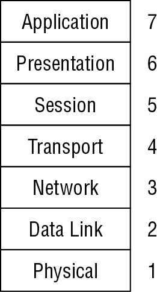

### Encapsulation/De-encapsulation

*Encapsulation* is the addition of a header, and possibly a footer, to the data received by each layer from the layer above before it’s handed off to the layer below. Encapsulation occurs as the data moves down through the OSI model layers from Application to Physical. The inverse action occurring as data moves up through the OSI model layers from Physical to Application is known as *deencapsulation*.

Header and Footer:

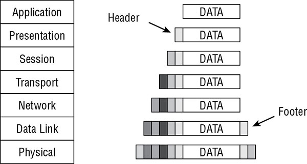

OSI model data names

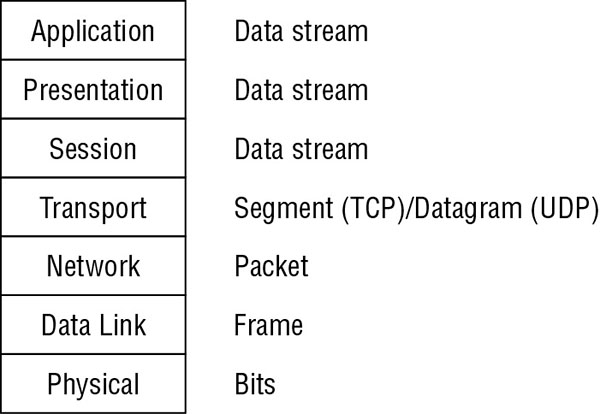

### OSI Layers

**Physical Layer**

  * Accepts frames and convert them into bits.
  * Receiving bits from the physical connection medium and converting them into a frame.
  * Electrical specifications, protocols, and interface standards such as the following:
      * EIA/TIA-232 and EIA/TIA-449
      * X.21
      * High-Speed Serial Interface (HSSI)
      * Synchronous Optical Networking (SONET)
      * V.24 and V.35
  * Network hardware devices that function at layer 1, the Physical layer, are network interface cards (NICs), hubs, repeaters, concentrators, and amplifiers. 

**Data Link Layer**

  * Responsible for formatting the packet from the Network layer
  * Ethernet (IEEE 802.3), Token Ring (IEEE 802.5), asynchronous transfer mode (ATM), Fiber Distributed Data Interface (FDDI), and Copper DDI (CDDI).
  * Protocols found within the Data Link layer:

      * Serial Line Internet Protocol (SLIP)
      * Point-to-Point Protocol (PPP)
      * Address Resolution Protocol (ARP)
      * Layer 2 Forwarding (L2F)
      * Layer 2 Tunneling Protocol (L2TP)
      * Point-to-Point Tunneling Protocol (PPTP)
      * Integrated Services Digital Network (ISDN)

  *  Hardware source and destination addresses to the frame. The hardware address is the Media Access Control (MAC) address, which is a 6-byte (48-bit) binary address written in hexadecimal notation (for example, 00-13-02-1F-58-F5). The first 3 bytes (24 bits) of the address denote the vendor or manufacturer of the physical network interface. This is known as the Organizationally Unique Identifier (OUI). OUIs are registered with the Institute of Electrical and Electronics Engineers (IEEE).
  * The Data Link layer contains two sublayers: the Logical Link Control (LLC) sublayer and the MAC sublayer
  * Network hardware devices that function at layer 2, the Data Link layer, are switches and bridges. 

**Network Layer**

  * Responsible for adding routing and addressing information to the data.
  * The routing protocols are located at this layer and include the following:

      * Internet Control Message Protocol (ICMP)
      * Routing Information Protocol (RIP)
      * Open Shortest Path First (OSPF)
      * Border Gateway Protocol (BGP)
      * Internet Group Management Protocol (IGMP)
      * Internet Protocol (IP)
      * Internet Protocol Security (IPSec)
      * Internetwork Packet Exchange (IPX)
      * Network Address Translation (NAT)
      * Simple Key Management for Internet Protocols (SKIP)

  * Routers and bridge routers (brouters) are among the network hardware devices that function at layer 3. 

**Transport Layer**

  * Responsible for managing the integrity of a connection and controlling the session.
  * The following protocols operate within the Transport layer:

      * Transmission Control Protocol (TCP)
      * User Datagram Protocol (UDP)
      * Sequenced Packet Exchange (SPX)
      * Secure Sockets Layer (SSL)
      * Transport Layer Security (TLS)

**Session Layer**
  
  * Responsible for establishing, maintaining, and terminating communication sessions between two computers.
  * The following protocols operate within the Session layer:

      * Network File System (NFS)
      * Structured Query Language (SQL)
      * Remote Procedure Call (RPC)
  
  * Communication sessions can operate in one of three different discipline or control modes:

      * Simplex One-way communication
      * Half-Duplex Two-way communication, but only one direction can send data at a time
      * Full-Duplex Two-way communication, in which data can be sent in both directions simultaneously

**Presentation Layer**
  
  * Responsible for transforming data received from the Application layer into a format that any system following the OSI model can understand.
  * Also responsible for encryption and compression
  * The following list includes some of the format standards that exist within the Presentation layer:

      * American Standard Code for Information Interchange (ASCII)
      * Extended Binary-Coded Decimal Interchange Mode (EBCDICM)
      * Tagged Image File Format (TIFF)
      * Joint Photographic Experts Group (JPEG)
      * Moving Picture Experts Group (MPEG)
      * Musical Instrument Digital Interface (MIDI)

**Application Layer**

  * Responsible for interfacing user applications, network services, or the operating system with the protocol stack.
  * Numerous application-specific protocols are found within this layer, such as the following:

      * Hypertext Transfer Protocol (HTTP)
      * File Transfer Protocol (FTP)
      * Line Print Daemon (LPD)
      * Simple Mail Transfer Protocol (SMTP)
      * Telnet
      * Trivial File Transfer Protocol (TFTP)
      * Electronic Data Interchange (EDI)
      * Post Office Protocol version 3 (POP3)
      * Internet Message Access Protocol (IMAP)
      * Simple Network Management Protocol (SNMP)
      * Network News Transport Protocol (NNTP)
      * Secure Remote Procedure Call (S-RPC)
      * Secure Electronic Transaction (SET)

## TCP/IP Model

The TCP/IP model (also called the DARPA or the DOD model) consists of only four layers, as opposed to the OSI Reference Model’s seven. The four layers of the TCP/IP model are Application (also known as Process), Transport (also known as Host-to-Host), Internet (sometimes Internetworking), and Link (although Network Interface and sometimes Network Access are used).

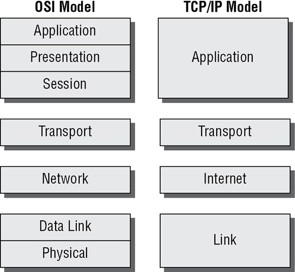

### TCP/IP Protocol Suite Overview

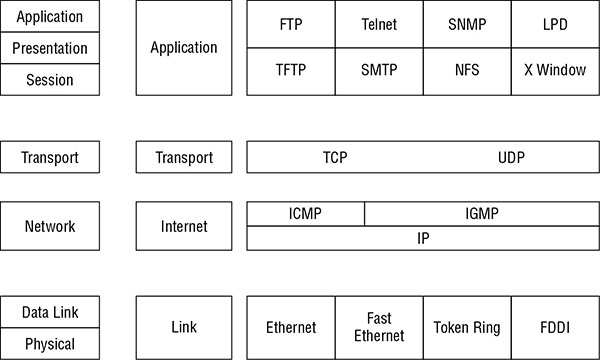

#### Transport Layer Protocols

The two primary Transport layer protocols of TCP/IP are TCP and UDP. *Transmission Control Protocol (TCP)* is a full-duplex connection-oriented protocol, whereas *User Datagram Protocol (UDP)* is a simplex connectionless protocol. The combination of an IP address and a port number is known as a *socket*.

The first 1,024 of these ports (0–1,023) are called the *well-known ports* or the service ports. Ports 1,024 to 49151 are known as the *registered software ports* with  International Assigned Numbers Authority ([IANA](www.iana.org)). Ports 49152 to 65535 are known as the *random, dynamic, or ephemeral ports* because they are often used randomly and temporarily by clients as a source port. 

TCP three-way handshake:

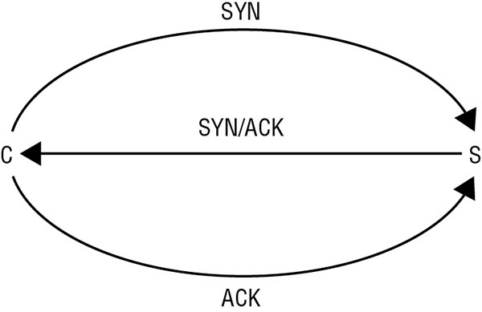

The TCP header is relatively complex when compared to the other common Transport layer protocol, UDP. A TCP header is 20 to 60 bytes long:

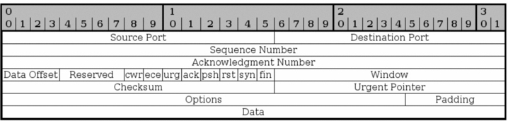

TCP header flag field values

Flag bit designator	| Name |Description
--- | --- | --- |
CWR	| Congestion Window Reduced | Used to manage transmission over congested links; see RFC 3168
ECE	| ECN-Echo (Explicit Congestion Notification) | Used to manage transmission over congested links; see RFC 3168
URG	| Urgent | Indicates urgent data
ACK	| Acknowledgment | Acknowledges synchronization or shutdown request
PSH	| Push | Indicates need to push data immediately to application
RST	| Reset | Causes immediate disconnect of TCP session
SYN	| Synchronization | Requests synchronization with new sequencing numbers
FIN	| Finish | Requests graceful shutdown of TCP session

User Datagram Protocol (UDP) also operates at layer 4 (the Transport layer) of the OSI model. It is a connectionless “best-effort” communications protocol. UDP header is relatively simple in comparison with the TCP header. A UDP header is 8 bytes (64 bits) long. This header is divided into four sections, or fields (each 16 bits long):

* Source port
* Destination port
* Message length
* Checksum

#### Network Layer Protocols and IP Networking Basics

**IPv4** is the version of Internet Protocol that is most widely used around the world. However, a version known as IPv6 is being adopted both for private and public network use. IPv4 uses a 32-bit addressing scheme, while IPv6 uses 128 bits for addressing. For a glimpse into the status of IPv4 to IPv6 conversion on the internet, see the IPv6 statistics at https://www.google.com/intl/en/ipv6/statistics.html.

IP classes:

Class |	First binary digits	| Decimal range of first octet
--- | --- | --- 
A |	0 |	1–126
B |	10 | 128–191
C | 110 | 192–223
D |	1110 | 224–239
E | 1111 | 240–255

**ICMP** Internet Control Message Protocol (ICMP) is used to determine the health of a network or a specific link. ICMP is utilized by ping, traceroute, pathping, and other network management tools.

Common ICMP type field values

Type |	Function
---  | --- 
0 | 	Echo reply
3 | 	Destination unreachable
5 | 	Redirect
8 | 	Echo request
9 | 	Router advertisement
10 | 	Router solicitation
11 | 	Time exceeded

**IGMP** Internet Group Management Protocol (IGMP) allows systems to support multicasting. Multicasting is the transmission of data to multiple specific recipients. (RFC 1112 discusses the requirements to perform IGMP multicasting.)

**ARP** Address Resolution Protocol (ARP) is essential to the interoperability of logical and physical addressing schemes. ARP is used to resolve IP addresses (32-bit binary number for logical addressing) into Media Access Control (MAC) addresses (48-bit binary number for physical addressing)—or EUI-48 or even EUI-64. 

#### Common Application Layer Protocols

* Telnet, TCP Port 23
* File Transfer Protocol (FTP), TCP Ports 20 (Passive Data)/Ephemeral (Active Data) and 21 (Control Connection) 
* Trivial File Transfer Protocol (TFTP), UDP Port 69
* Simple Mail Transfer Protocol (SMTP), TCP Port 25
* Post Office Protocol (POP3), TCP Port 110 
* Internet Message Access Protocol (IMAP), TCP Port 143
* Dynamic Host Configuration Protocol (DHCP), UDP Ports 67 and 68
* Hypertext Transfer Protocol (HTTP), TCP Port 80
* Secure Sockets Layer (SSL), TCP Port 443 (for HTTP Encryption) 
* Line Print Daemon (LPD), TCP Port 515 
* X Window, TCP Ports 6000–6063
* Network File System (NFS), TCP Port 2049 
* Simple Network Management Protocol (SNMP), UDP Port 161 (UDP Port 162 for Trap Messages) 

#### Implications of Multilayer Protocols

For example, when communicating between a web server and a web browser over a typical network connection, HTTP is encapsulated in TCP, which in turn is encapsulated in IP, which is in turn encapsulated in Ethernet. This could be presented as follows:

`[ Ethernet [ IP [ TCP [ HTTP ] ] ] ]`

SSL/TLS:

`[ Ethernet [ IP [ TCP [ SSL [ HTTP ] ] ] ] ]`

IPSec:

`[ Ethernet [ IPSec [ IP [ TCP [ SSL [ HTTP ] ] ] ] ] ]`

For example, if a network blocks the use of FTP but allows HTTP, then tools such as HTTP Tunnel can be used to bypass this restriction. This could result in an encapsulation structure such as this:

`[ Ethernet [ IP [ TCP [ HTTP [ FTP ] ] ] ]`

With utilities such as Loki, ICMP is transformed into a tunnel protocol to support TCP communications. The encapsulation structure of Loki is as follows:

`[ Ethernet [ IP [ ICMP [ TCP [ HTTP ] ] ] ] ]`

Double-encapsulated IEEE 802.1Q VLAN tag:

`[ Ethernet [ VLAN1 [ VLAN2 [ IP [ TCP [ HTTP ] ] ] ] ] ]`

#### DNP3

DNP3 (Distributed Network Protocol) is primarily used in the electric and water utility and management industries. It is used to support communications between data acquisition systems and the system control equipment. This includes substation computers, RTUs (remote terminal units) (devices controlled by an embedded microprocessor), IEDs (Intelligent Electronic Devices), and SCADA master stations (i.e., control centers). DNP3 is an open and public standard. DNP3 is a multilayer protocol that functions similarly to that of TCP/IP, in that it has link, transport, and transportation layers.

#### TCP/IP Vulnerabilities

TCP/IP’s vulnerabilities are numerous. Improperly implemented TCP/IP stacks in various operating systems are vulnerable to buffer overflows, SYN flood attacks, various denial-of-service (DoS) attacks, fragment attacks, oversized packet attacks, spoofing attacks, man-in-the-middle attacks, hijack attacks, and coding error attacks.

TCP/IP (as well as most protocols) is also subject to passive attacks via monitoring or sniffing. 

#### Domain Name System

Basic ideas of addressing and numbering as used on TCP/IP-based networks:

* The third, or bottom, layer is the MAC address. The MAC address, or hardware address, is a “*permanent*” physical address.
* The second, or middle, layer is the IP address. The IP address is a “*temporary*” logical address assigned over or onto the MAC address.
* The top layer is the domain name. The domain name or computer name is a “*temporary*” human-friendly convention assigned over or onto the IP address.

DNS is the hierarchical naming scheme used in both public and private networks. DNS links IP addresses and human-friendly fully qualified domain names (FQDNs) together. An FQDN consists of three main parts:

Top-level domain (TLD)—The com in www.google.com
Registered domain name—The google in www.google.com
Subdomain(s) or hostname—The www in www.google.com

The TLD can be any number of official options, including six of the original seven TLDs—com, org, edu, mil, gov, and net—as well as many newer ones, such as info, museum, telephone, mobi, biz, and so on.

The total length of an FQDN can’t exceed 253 characters (including the dots). Any single section can’t exceed 63 characters. FQDNs can only contain letters, numbers, and hyphens.

DNS operates over TCP and UDP port 53. TCP port 53 is used for zone transfers. These are zone file exchanges between DNS servers, for special manual queries, or when a response exceeds 512 bytes. UDP port 53 is used for most typical DNS queries.

*Domain Name System Security Extensions (DNSSEC)* is a security improvement to the existing DNS infrastructure. The primary function of DNSSEC is to provide reliable authentication between devices during DNS operations. Each DNS server is issued a digital certificate, which is then used to perform mutual certificate authentication. 

#### DNS Poisoning

DNS poisoning is the act of falsifying the DNS information used by a client to reach a desired system. There are many ways to attack or exploit DNS. An attacker might use one of these techniques:

**Deploy a rogue DNS server (also known as DNS spoofing or DNS pharming)** DNS queries are not authenticated, but they do contain a 16-bit value known as the query ID (QID). The DNS response must include the same QID as the query to be accepted. Thus, a rogue DNS server must include the requesting QID in the false reply.

**Perform DNS poisoning** `poisoning resource records of real DNS server`

**Alter the HOSTS file** 

**Corrupt the IP configuration** 

**Use proxy falsification**  `only against web communications` `rogue proxy server`

**Safeguard**:
  
  * Limit zone transfers from internal DNS servers to external DNS servers. This is accomplished by blocking inbound TCP port 53 (zone transfer requests) and UDP port 53 (queries).
  * Limit the external DNS servers from which internal DNS servers pull zone transfers.
  * Deploy a network intrusion detection system (NIDS) to watch for abnormal DNS traffic.
  * Properly harden all DNS, server, and client systems in your private network.
  * Use DNSSEC to secure your DNS infrastructure.
  * Require internal clients to resolve all domain names through the internal DNS. This will require that you block outbound UDP port 53 (for queries) while keeping open outbound TCP port 53 (for zone transfers).

#### Domain Hijacking

Domain hijacking, or domain theft, is the malicious action of changing the registration of a domain name without the authorization of the valid owner. This may be accomplished by stealing the owner’s logon credentials, using XSRF, hijacking a session, using MitM, or exploiting a flaw in the domain registrar’s systems.

### Converged Protocols

Converged protocols are the merging of specialty or proprietary protocols with standard protocols, such as those from the TCP/IP suite. Example:

**Fibre Channel over Ethernet (FCoE)** `requires 10 Gbps Ethernet`
**MPLS (Multiprotocol Label Switching)** `directs data across a network based on short path labels rather than longer network addresses`
**Internet Small Computer System Interface (iSCSI)** `networking storage standard based on IP`
**Voice over IP (VoIP)** `transport voice and/or data over a TCP/IP network. VoIP has the potential to replace or supplant PSTN `
**Software-Defined Networking (SDN)** `SDN aims at separating the infrastructure layer (i.e., hardware and hardware-based settings) from the control layer (i.e., network services of data transmission management).`

#### Content Distribution Networks

A content distribution network (CDN), or content delivery network, is a collection of resource services deployed in numerous data centers across the internet in order to provide low latency, high performance, and high availability of the hosted content. There are many CDN service providers, including CloudFlare, Akamai, Amazon CloudFront, CacheFly, and Level 3 Communications.

While most CDNs focus on the physical distribution of servers, client-based CDN is also possible. This is often referred to by the term P2P (peer-to-peer). The most widely recognized P2P CDN is BitTorrent.

## Wireless Networks

Wireless technology brought freedom but with it come additional vulnerabilities. Wireless networking has been fairly insecure, mainly because of a lack of knowledge by end users and organizations as well as insecure default configurations set by device manufacturers. Wireless networks are subject to the same vulnerabilities, threats, and risks as any cabled network in addition to distance eavesdropping, packet sniffing, and new forms of DoS and intrusion.

*Data emanation* is the transmission of data across electromagnetic signals. Almost all activities within a computer or across a network are performed using some form of data emanation.

### Securing Wireless Access Points

  * *Wireless cells* are the areas within a physical environment where a wireless device can connect to a wireless access point. They can leak outside a secured environment and cause a security risk. So a unique placement of wireless access points, shielding, and noise transmission. 

  * 802.11 is the IEEE standard for wireless network communications:

  Amendment	| Speed |	Frequency
  --- | --- | --- 
802.11 | 2 Mbps | 2.4 GHz
802.11a | 54 Mbps | 5 GHz
802.11b | 11 Mbps | 2.4 GHz
802.11g | 54 Mbps | 2.4 GHz
802.11n | 200+ Mbps | 2.4 GHz or 5 GHz
802.11ac | 1 Gbps | 5 GHz
  
  * *Ad hoc* mode means that any two wireless networking devices, including two wireless network interface cards (NICs), can communicate without a centralized control authority. *Infrastructure mode* means that a wireless access point is required, wireless NICs on systems can’t interact directly, and the restrictions of the wireless access point for wireless network access are enforced.

  * infrastructure mode concept are several variations:
    * *Stand-alone*: Wireless access point connecting wireless clients to each other but not to any wired resource. wireless hub 
    * *Wired extension*: Wireless access point acts as a connection point to link the wireless clients to the wired network. 
    * *Enterprise extended*: Multiple wireless access points (WAPs) are used to connect a large physical area to the same wired network. Each wireless access point will use the same *extended service set identifier (ESSID)* so clients can roam the area while maintaining network connectivity, even while their wireless NICs change associations from one wireless access point to another. 
    * *Bridge*: Wireless connection is used to link two wired networks.

> Technically there are two types of SSIDs, namely *extended service set identifier (ESSID)* and *basic service set identifier (BSSID)*. An ESSID is the name of a wireless network when a wireless base station or WAP is used (i.e., infrastructure mode). *Independent service set identifier (ISSID)* is the name of a wireless network when in ad hoc or peer-to-peer mode (i.e., when a base station or WAP is not used). However, when operating in infrastructure mode, the BSSID is the MAC address of the base station hosting the ESSID in order to differentiate multiple base stations supporting a single extended wireless network.

### Securing the SSID

  * Default SSIDs are well known, standard security practice dictates that the SSID should be changed to something unique before deployment.
  * SSID is broadcast by the WAP via a special transmission called a *beacon frame*. Default broadcasting of the SSID should be disabled to keep the wireless network secret. Even so, attackers can still discover the SSID with a wireless sniffer since the SSID must still be used in transmissions between wireless clients and the WAP. Thus, disabling SSID broadcasting is not a true mechanism of security. Instead, use WPA2 as a reliable authentication and encryption solution rather than trying to hide the existence of the wireless network.

### Conducting a site survey

  * A site survey is the process of investigating the presence, strength, and reach of wireless access points deployed in an environment.
  * Site surveys should be conducted to ensure that sufficient signal strength is available at all locations that are likely locations for wireless device usage, while at the same time minimizing or eliminating the wireless signal from locations where wireless access shouldn’t be permitted.

### Using Secure Encryption Protocols

IEEE 802.11 defines two method for authentication:

* Open system authentication (OSA) - Means no authentication, radios single should reach the client to connect. And communication is in clear text.

* Shared key authentication (SKA) - Means some from of authentication should be take place before client can connect to WAP.

**WEP**

  * Wired Equivalent Privacy (WEP) is defined by the IEEE 802.11 standard.
  * Uses a predefined shared secret key for both authentication and encryption
  * Used Rivest Cipher 4 (RC4)
  * WEP is weak in several areas, two of which are the use of a static common key and poor implementation of IVs (initiation vectors). Can be cracked within 60 seconds.

**WPA**

  * Wi-Fi Protected Access (WPA) was designed as the replacement for WEP
  * Based on the LEAP and Temporal Key Integrity Protocol (TKIP) cryptosystems and often employs a secret passphrase for authentication.
  * Both the techniques (LEAP and TKIP) are now crackable using a variety of cracking techniques

**WPA2**

  * This is the amendment known as 802.11i or Wi-Fi Protected Access 2 (WPA2).
  * It is a new encryption scheme known as the Counter Mode Cipher Block Chaining Message Authentication Code Protocol (CCMP), which is based on the AES encryption scheme. 
  * WAP attack called KRACK (Key Reinstallation AttaCKs) [link](https://www.krackattacks.com/)

**802.1X/EAP**

  * Both WPA and WPA2 support the enterprise authentication known as 802.1X/EAP, a standard port-based network access control that ensures that clients cannot communicate with a resource until proper authentication has taken place

  * Through the use of 802.1X, other techniques and solutions such as Remote Authentication Dial-In User Service (RADIUS), Terminal Access Controller Access Control System (TACACS), certificates, smart cards, token devices, and biometrics can be integrated into wireless networks providing techniques for both mutual and multifactor authentication.

  * *Extensible Authentication Protocol (EAP)* is not a specific mechanism of authentication; rather it is an `authentication framework`. Effectively, EAP allows for new authentication technologies to be compatible with existing wireless or point-to-point connection technologies. More than 40 different EAP methods of authentication are widely supported. These include the wireless methods of LEAP, EAP-TLS, EAP-SIM, EAP-AKA, and EAP-TTLS. Not all EAP methods are secure. For example, EAP-MD5 and a pre-release EAP known as LEAP are also crackable.

**PEAP**

  * *Protected Extensible Authentication Protocol (PEAP)* encapsulates EAP methods within a TLS tunnel that provides authentication and potentially encryption. 

**LEAP**
 
  * *Lightweight Extensible Authentication Protocol (LEAP)* is a Cisco proprietary alternative to TKIP for WPA. 

  * LEAP should be avoided when possible; use of EAP-TLS as an alternative is recommended, but if LEAP is used, a complex password is strongly recommended.

**MAC Filter**
 
  * A MAC filter is a list of authorized wireless client interface MAC addresses that is used by a wireless access point to block access to all nonauthorized devices.
  * Hacker can spoof MAC address and bypass this filter

**TKIP**
  
  * Temporal Key Integrity Protocol (TKIP) was designed as the replacement for WEP

  * TKIP improvements include a key-mixing function that combines the initialization vector (IV) (i.e., a random number) with the secret root key before using that key with RC4 to perform encryption; a sequence counter is used to prevent packet replay attacks; and a strong integrity check named Michael is used.

**CCMP**
  
  * CCMP uses AES (Advanced Encryption Standard) with a 128-bit key. CCMP is the preferred standard security protocol of 802.11 wireless networking indicated by 802.11i. To date, no attacks have yet been successful against the AES/CCMP encryption.

### Determining Antenna Placement

* Do not fixate on a specific location before a proper site survey has been performed. 
* Consider the following guidelines when seeking optimal antenna placement:

  * Use a central location.
  * Avoid solid physical obstructions.
  * Avoid reflective or other flat metal surfaces.
  * Avoid electrical equipment.

* If a base station has external omnidirectional antennas, typically they should be positioned pointing straight up vertically. If a directional antenna is used, point the focus toward the area of desired use

### Antenna Types

* *Omnidirectional antenna* - can send and receive signals in all directions perpendicular to the line of the antenna itself. They are also called base antenna or a rubber duck antenna

* *Directional antennas* - they focus their sending and receiving capabilities in one primary direction. Example - Yagi (rootTV antennas), cantenna, panel, and parabolic

### Adjusting Power Level Controls

Some wireless access points provide a physical or logical adjustment of the antenna power levels. Power level controls are typically set by the manufacturer to a setting that is suitable for most situations. It is important to keep in mind that some wireless access points are capable of providing higher power levels than are allowed by regulations in countries where they are available.

### WPS 

*Wi-Fi Protected Setup (WPS)* is a security standard for wireless networks. It is intended to simplify the effort involved in adding new clients to a well-secured wireless network. It operates by autoconnecting the first new wireless client to seek the network once the administrator triggered the feature by pressing the `WPS button on the base station`. However, the standard also calls for a code or personal identification number (`PIN`) that can be sent to the base station remotely in order to trigger WPS negotiation without the need to physically press the button.

WPS is a feature that is enabled by default on most wireless access points because it is a requirement for device Wi-Fi Alliance certification. It’s important to disable it as part of a security-focused predeployment process.

### Using Captive Portals

A captive portal is an authentication technique that redirects a newly connected wireless web client to a portal access control page. Captive portals are most often located on wireless networks implemented for public use, such as at hotels, restaurants, bars, airports, libraries, and so on. However, they can be used on cabled Ethernet connections as well.

### General Wi-Fi Security Procedure 

Here are the steps:

* Change the default administrator password.
* Decide whether to disable the SSID broadcast based on your deployment requirements.
* Change the SSID to something unique.
* Enable MAC filtering if the pool of wireless clients is relatively small (usually less than 20) and static.
* Consider using static IP addresses, or configure DHCP with reservations (applicable only for small deployments).
* Turn on the highest form of authentication and encryption supported, which is currently WPA2 and may soon be WPA3 (a new security mode in development as of the start of 2018: https://www.networkworld.com/article/3247658/wi-fi/wi-fi-alliance-announces-wpa3-to-secure-modern-networks.html). If WPA2 or a newer/stronger solution is not available on your device, then you need to obtain new wireless equipment.
* Treat wireless as remote access, and manage access using 802.1X.
* Treat wireless as external access, and separate the WAP from the wired network using a firewall.
* Treat wireless as an entry point for attackers, and monitor all WAP-to-wired-network communications with an intrusion detection system (IDS).
* Require all transmissions between wireless clients and WAPs to be encrypted; in other words, require a VPN link.

### Wireless Attacks

**War Driving**
  * War driving is the act of using a detection tool to look for wireless networking signals.
  * Can be performed with a dedicated handheld detector, with a personal electronic device (PED) or mobile device with Wi-Fi capabilities, or with a notebook that has a wireless network card.
  * Once a wireless network is detected, the next step is to determine whether the network is open or closed

**War Chalking** 

  * It’s a way to physically mark an area with information about the presence of a wireless network. A closed circle indicated a closed or secured wireless network, and two back-to-back half circles indicated an open network.

**Replay**

  * A replay attack is the retransmission of captured communications in the hope of gaining access to the targeted system. Replay attacks in relation to wireless environments specifically may continue to focus on initial authentication abuse. 

  * Wireless replay attacks can also focus on DoS by retransmitting connection requests or resource requests of the base station in order to keep it busy focusing on managing new connections rather than maintaining and providing service for existing connections.

  * Wireless replay attacks can be mitigated by keeping the firmware of the base station updated as well as operating a wireless-focused network intrusion detection system (NIDS). A W-IDS or W-NIDS will be able to detect such abuses and inform the administrators promptly about the situation.

**IV**

  *  IV attack is an exploitation of how the IV is handled (or mishandled). One example of an IV attack is that of cracking Wireless Equivalent Privacy (WEP) encryption.

  * WEP IV is only 24 bits long and is transmitted in plaintext. This, coupled with the fact that WEP doesn’t check for packet freshness, allows a live WEP crack to be successful in less than 60 seconds. Tool - [Wesside-ng](https://www.aircrack-ng.org/doku.php?id=wesside-ng)

**Rogue Access Points** 
 
  *  A rogue WAP may be planted by an employee for convenience, or it may be operated externally by an attacker.
  * Rogue WAP be configured to duplicate the SSID, MAC address, and wireless channel of the valid WAP, although operating at a higher power rating.
  * Setting the SSID to an alternate name that appears legitimate or even preferred over the original valid wireless network’s SSID

**Evil Twin** 

  * Each time a device successfully connects to a wireless network, it retains a wireless profile in its history.

  * Each time the wireless adapter is enabled on a device, it wants to connect to a network, so it sends out reconnection requests to each of the networks in its wireless profile history. These reconnect requests include the original base station’s MAC address and the network’s SSID.

  *  The evil twin attack system eavesdrops on the wireless signal for these reconnect requests. Once the evil twin sees a reconnect request, it spoofs its identity with those parameters and offers a plaintext connection to the client. The client accepts the request and establishes a connection with the false evil twin base station. 

  * You should also prune unnecessary and old wireless profiles from your history list to give attackers fewer options to target.

## Secure Network Components

Because of the nature of internet with all its inheritance security issues many of its technologies were adapted or integrated into the private business network. This created two new forms of network segments: *intranets* and *extranets*.

*Intranets* provide users with access to the web, email, and other services on internal servers that are not accessible to anyone outside the private network.

An *extranet* is a cross between the internet and an intranet. An extranet is a section of an organization’s network that has been sectioned off so that it acts as an intranet for the private network but also serves information to the public internet. Example demilitarized zone (DMZ).

Smaller units, grouping, segments, or subnetworks (i.e., subnets) can be used to improve various aspects of the network: boosting performance, reducing communication problems (reduces congestion) and providing security (isolating traffic and users).

### Network Access Control (NAC)

Goals of NAC are as follows:

* Prevent/reduce zero-day attacks
* Enforce security policy throughout the network
* Use identities to perform access control

Basic example or one component of NAC is 802.1X.

NAC can be implemented with a preadmission philosophy (patch application and antivirus updates before connecting) or a postadmission philosophy (after connecting authorize actions by user).

### Firewalls

A firewall is a network device used to filter traffic. It is typically deployed between a private network and a link to the internet, but it can be deployed between departments within an organization.  Only authorized traffic is allowed to cross the security barrier provided by the firewall. Firewalls provide protection only against traffic that crosses the firewall from one subnet to another. They offer no protection against traffic within a subnet (in other words, behind the firewall).

There are several basic types of firewalls, including static packet-filtering firewalls, application-level gateway firewalls, circuit-level gateway firewalls, and stateful inspection firewalls.

**Static Packet-Filtering Firewalls**:
  * the rules are concerned with source, destination, and port addresses 
  * also called screening routers
  * also called first-generation firewalls
  * Operate on Layer-3 (network layer)

**Application-Level Gateway Firewalls** 
  * also called proxy firewall
  * copies packets from one network into another
  * also called second-generation firewalls
  * Operate on Layer-7 (application layer)

**Circuit-Level Gateway Firewalls**
  * Used to establish communication sessions between trusted partners
  * Operate on layer-5 (Session layer)
  * also called circuit proxies
  * Use 4 tuples (src, dst, service ports)

**Stateful Inspection Firewalls**
  * also called dynamic packet filtering firewalls
  * evaluate the state or the context of network traffic
  * relationship between current packets and the previous packets of the same session
  * Operate on Network and Transport layers (layers 3 and 4)

**Deep Packet Inspection Firewalls**
  * Operate on Layer-7 (application layer)
  * Not only examine header, but look into the payload contents of a communication
  * DPI is often integrated with application layer firewalls and/or stateful inspection firewalls.

**Next-Gen Firewalls**
  * Multifunction device (MFD) composed of several security features in addition to a firewall
  * Features - IDS,IPS, TLS/SSL proxy, web filtering, QoS management, bandwidth throttling, NATing, VPN anchoring, and antivirus.

#### Multihomed Firewalls

  * Some firewall systems have more than one interface. For instance, a multihomed firewall must have at least two interfaces to filter traffic (they’re also known as dual-homed firewalls).

  *  A *bastion host* is a computer or appliance that is exposed on the internet and has been hardened by removing all unnecessary elements, such as services, programs, protocols, and ports

  * A *screened host* is a firewall-protected system logically positioned just inside a private network. All inbound traffic is routed to the screened host, which in turn acts as a proxy for all the trusted systems within the private network. It is responsible for filtering traffic coming into the private network as well as for protecting the identity of the internal client.

#### Firewall Deployment Architectures

There are three commonly recognized firewall deployment architectures: single tier, two tier, and three tier (also known as multitier).

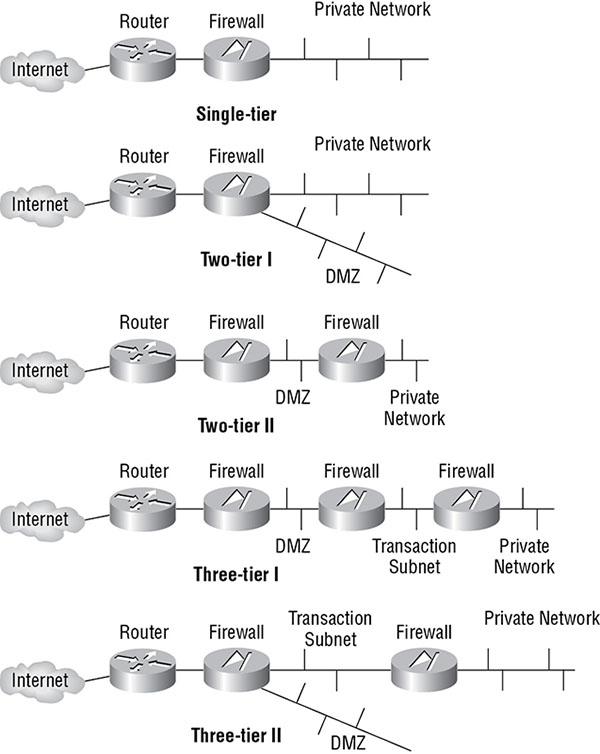

#### Endpoint Security

Endpoint security is the concept that each individual device must maintain local security whether or not its network or telecommunications channels also provide or offer security. 

Endpoint security should be viewed as an aspect of the effort to provide sufficient security on each individual host. Every system should have an appropriate combination of a local host firewall, anti-malware scanners, authentication, authorization, auditing, spam filters, and IDS/IPS services.

#### Secure Operation Of Hardware

> A *collision domain* is a group of networked systems that could cause a collision if any two (or more) of the systems in that group transmitted simultaneously. Any system outside the collision domain cannot cause a collision with any member of that collision domain.

> A *broadcast domain* is a group of networked systems in which all other members receive a broadcast signal when one of the members of the group transmits it. Any system outside a broadcast domain would not receive a broadcast from that broadcast domain.

> Collision domains are divided by using any layer 2 or higher device, and broadcast domains are divided by using any layer 3 or higher device. 

**Repeaters, Concentrators, and Amplifiers**

  * Strengthen the communication signal 
  * Operate at OSI layer 1
  * Systems on either side of a repeater, concentrator, or amplifier are part of the same collision domain and broadcast domain.

**Hubs**

  * It is a multiport repeater
  * Operate at OSI layer 1
  * Systems on either side of a hub are part of the same collision and broadcast domains
  * All members of the same collision domain and broadcast domain will receive the communication.

**Modems**

  * Modem (modulator-demodulator) is a communications device that covers or modulates between an analog carrier signal and digital information in order to support computer communications of public switched telephone network (PSTN) lines.
  * The term modem is used incorrectly on any device that does not actually perform modulation. Most modern devices labeled as modems (cable, DSL, ISDN, wireless, etc.) are routers, not modems.

**Bridges**
  
  * A bridge forwards traffic from one network to another. 
  * Bridges that connect networks using different transmission speeds may have a buffer to store packets until they can be forwarded to the slower network. This is known as a *store-and-forward* device. 
  * Operate at OSI layer 2. 
  * Systems on either side of a bridge are part of the same broadcast domain but are in different collision domains.

**Switches**
  
  * Switches know the addresses of the systems connected on each outbound port. Instead of repeating traffic on every outbound port, a switch repeats traffic only out of the port on which the destination is known to exist. 
  * Switches operate primarily at OSI layer 2 but can operate in layer3 as well.
  * Switches can also create separate broadcast domains when used to create VLANs.
  * Systems on either side of a switch operating at layer 2 are part of the same broadcast domain but are in different collision domains. Systems on either side of a switch operating at layer 3 are part of different broadcast domains and different collision domains 

**Routers**
  * Used to connect similar networks and control traffic flow between the two  
  * Routers operate at OSI layer 3
  * Systems on either side of a router are part of different broadcast domains and different collision domains.

**Brouters**
  
  * Combination devices comprising a router and a bridge
  * Primarily at layer 3 but can operate at layer 2 when necessary.
  * Systems on either side of a brouter operating at layer 3 are part of different broadcast domains and different collision domains. Systems on either side of a brouter operating at layer 2 are part of the same broadcast domain but are in different collision domains

**Gateways**
  
  * A gateway connects networks that are using different network protocols
  * Transform the traffic from a compatible protocol or transport method used by each network. 
  * Also known as *protocol translators* 
  * Systems on either side of a gateway are part of different broadcast domains and different collision domains.
  * Gateways typically operate at OSI layer 7.

**Proxies**
  
  * A proxy is a form of gateway that does not translate across protocols.
  * Serve as mediators, filters, caching servers, and even NAT/PAT servers for a network.

**LAN Extenders**

  * A LAN extender is a remote access, multilayer switch used to connect distant networks over WAN links.

## Cabling, Wireless, Topology, Communications, and Transmission Media Technology

Establishing security on a network involves more than just managing the operating system and software. You must also address physical issues, including cabling, wireless, topology, and communications technology.

### Transmission Media

Each cable type has unique useful lengths, throughput rates, and connectivity requirements.

**Twisted Pair** Pair of copper wires are twisted together to reduce electromagnetic interference and cross talk. Quality of cable is determined by the number of twists per inch, type of insulation and conductive material.

**Unshielded Twisted Pair** Since UTP does not have a shield, it is susceptible to interference. Interception on this wire can be done by installing tap on the cable.

**Shielded Twisted Pair** STP uses electronically grounded shield to protect he signal from any interception.

**Coaxial Cable** A non-conducting layer is placed between 2 layers to insulate them. Also it supports greater bandwidth and linger cable lengths. It also makes hard for an intruder to intercepts the signals.

**Fiber Optic** They uses light pulses to transmit information. In this at one end there is a transmitter which accepts coded electronic pulse information from copper wire. The information is then processed and translated into equivalently coded light pulses. It all works on the principle of total internal reflection. According to this principle, when the angle of incidence is greater than a defined value, then the light bounces back in and travels till the end in the same fashion. There are 3 types of fiber optic cables commonly used:

  * *Single Mode:* This mode has small diameter which decreases number of light reflections within the cable.
  * *Multimode:* This mode uses a larger distance thus light reflections subsequently increases.
  * *Plastic Optical Fiber:* It uses a plastic core and has a larger diameter. However with plastic as a core, distortion of signal increases and the signal range is reduces significantly.

### Network Topology

The mapping of a LAN design is called Topology. There are four categories: Star topology, Bus topology, Ring topology and Mesh topology. Hybrid combinations of these topologies also exist.

**Star topology** – all computers and devices are connected to a main hub or switch. The hub or switch amasses and disburses the flow of data within the network. Star topology is the most common type of network and follows the Ethernet standard.

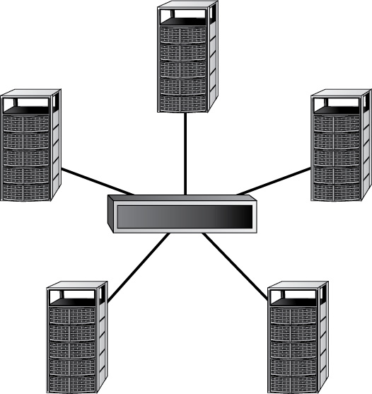

**Bus topology** – in this arrangement computers and devices are connected to a single linear cable called a trunk. The trunk is also referred to as the backbone or a segment. Each end of the trunk must be discharged to prevent the signal from rebounding back up the cable.

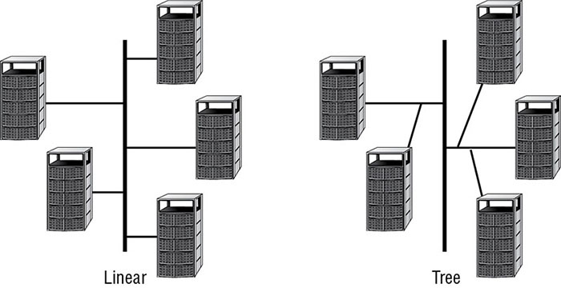

**Ring topology** – computers and devices are connected to a closed loop cable. Here there are no terminating ends so if one system crashes the entire network goes down. Each computer functions as a repeater and charges the signal before sending it to the next station.

In Ring topology data is sent through the network by way of a token. If the token isn’t carrying any data, a computer waiting to send data seizes it, attaches the data and the electronic address to the token and sends it on. Once the token is received by the destination computer it strips the data and the token is sent on. This is why it’s named a token ring network.

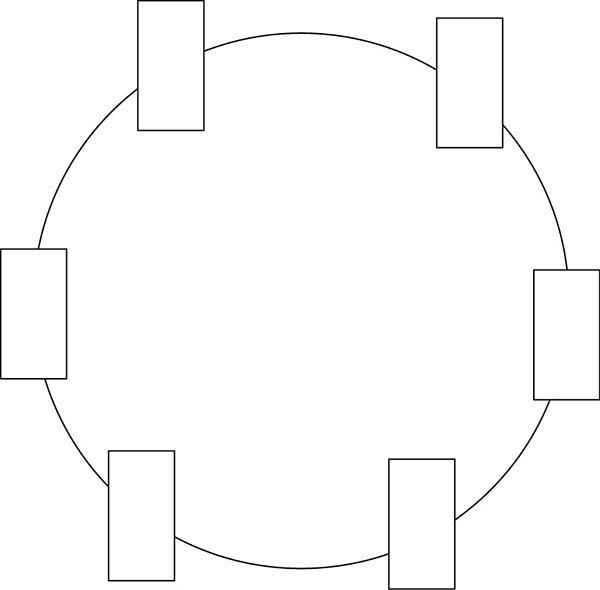

**Mesh topology** – all computers and devices are connected with many repeated interconnections between network nodes.

There are two types: *full mesh* and *partial mesh*.

With *full mesh* topology every computer or device has a link that connects it to every other computer or device in a network. This form of mesh topology is expensive but offers a high amount of redundancy should one of the nodes fail. If this occurs network traffic can be redirected to any of the other nodes. Full mesh is usually reserved for backbone networks.

*Partial mesh* topology takes some of the devices and configures them in a full mesh scheme while other devices are connected to only one or two other devices in the network. Partial mesh topology is less expensive to put in place and offers less redundancy than full mesh topology. Partial mesh is typically found in sub networks connected to a fully meshed backbone.

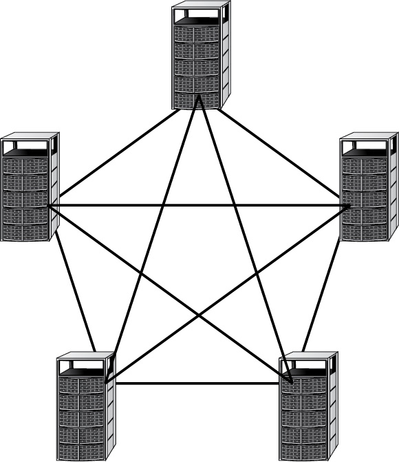

### Wireless Communication and Security

There are literally thousands of protocols, standards, and techniques that can be labeled as wireless. These include cell phones, Bluetooth, cordless phones, and wireless networking

**General Wireless Concepts** 

Radio waves have a frequency between 3 Hz and 300 GHz. Different ranges of frequencies have been designated for specific uses, such as AM and FM radio, VHF and UHF television, and so on. Currently, the 900 MHz, 2.4 GHz, and 5 GHz frequencies are the most commonly used in wireless products because of their unlicensed categorization. To manage the simultaneous use of the limited radio frequencies, several spectrum-use techniques were developed. These included spread spectrum, FHSS, DSSS, and OFDM.

*Spread spectrum* means that communication occurs over multiple frequencies at the same time. Thus, a message is broken into pieces, and each piece is `sent at the same time but using a different frequency`. Effectively this is a `parallel communication` rather than a serial communication.

*Frequency Hopping Spread Spectrum (FHSS)* was an early implementation of the spread spectrum concept. However, instead of sending data in a parallel fashion, `it transmits data in a series while constantly changing the frequency in use`.

*Direct Sequence Spread Spectrum (DSSS)* employs all the available frequencies simultaneously in parallel. This provides a higher rate of data throughput than FHSS. 

*Orthogonal Frequency-Division Multiplexing (OFDM)* is yet another variation on frequency use. OFDM employs a digital multicarrier modulation scheme that allows for a more tightly compacted transmission

**Cell Phones** 

There are a few key issues to keep in mind with regard to cell phone wireless transmissions. First, not all cell phone traffic is voice; often cell phone systems are used to transmit text and even computer data. Second, communications over a cell phone provider’s network, whether voice, text, or data, are not necessarily secure. Third, with specific wireless-sniffing equipment, your cell phone transmissions can be intercepted. In fact, your provider’s towers can be simulated to conduct man-in-the-middle attacks. Fourth, using your cell phone connectivity to access the internet or your office network provides attackers with yet another potential avenue of attack, access, and compromise. Many of these devices can potentially act as bridges, creating unsecured access into your network.

**Bluetooth (802.15)**

Bluetooth, or IEEE 802.15, personal area networks (PANs) are another area of wireless security concern. Headsets for cell phones, mice, keyboards, Global Positioning System (GPS) devices, and many other interface devices and peripherals are connected via Bluetooth. `Pairing with PIN`

There are attacks against Bluetooth-enabled devices. One technique, known as `bluejacking`, allows an attacker to transmit Short Message Service (SMS)-like messages to your device. `Bluesnarfing` allows hackers to connect with your Bluetooth devices without your knowledge and extract information from them. `Bluebugging` is an attack that grants hackers remote control over the feature and functions of a Bluetooth device.

Bluetooth devices sometimes employ encryption, but it is not dynamic and can usually be cracked with modest effort. Use Bluetooth for those activities that are not sensitive or confidential. Whenever possible, change the default PINs on your devices. Do not leave your devices in discovery mode, and always turn off Bluetooth when it’s not in active use.

**RFID**

Radio Frequency Identification (RFID) is a tracking technology based on the ability to power a radio transmitter using current generated in an antenna when placed in a magnetic field. 

If you are in possession of a device with an RFID chip, then anyone with an RFID reader can take note of the signal from your chip.

**NFC**

Near-field communication (NFC) is a standard that establishes radio communications between devices in close proximity (like a few inches versus feet for passive RFID). NFC is commonly found on smartphones and many mobile device accessories.

**Cordless Phones** 

Cordless phones represent an often-overlooked security issue. Cordless phones are designed to use any one of the unlicensed frequencies, in other words, 900 MHz, 2.4 GHz, or 5 GHz. The issue that is often overlooked is that someone could easily eavesdrop on a conversation on a cordless phone since its signal is rarely encrypted. With a frequency scanner, anyone can listen in on your conversations.

**Mobile Devices** 

* Mobile devices often support memory cards and can be used to smuggle malicious code into or confidential data out of organizations. 
* The loss or theft of a mobile device could mean the compromise of personal and/or corporate secrets.
* Keep nonessential information off portable devices, run a firewall and antivirus product (if available), and keep the system locked and/or encrypted (if possible).
* Employees should be coached to be discreet about what they discuss over mobile phones in public spaces.

### LAN Technologies

There are three main types of LAN technologies: Ethernet, Token Ring, and FDDI. A handful of other LAN technologies are available, but they are not as widely used.

**Ethernet**
**Token Ring** 
**Fiber Distributed Data Interface (FDDI)** 
**Subtechnologies** 
  * Analog and Digital
  * Synchronous and Asynchronous
  * Baseband and Broadband
  * Broadcast, Multicast, and Unicast
  * LAN Media Access
    * Carrier-Sense Multiple Access (CSMA)
    * Carrier-Sense Multiple Access with Collision Avoidance (CSMA/CA)
    * Carrier-Sense Multiple Access with Collision Detection (CSMA/CD)
    * Token Passing
    * Polling

