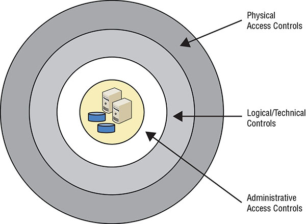
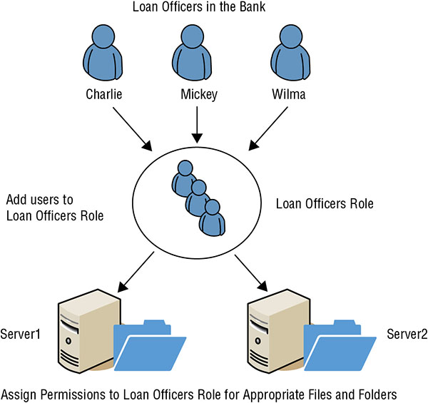
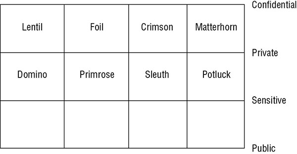

## Comparing Access Control Models

The method of authorizing subjects to access objects varies depending on the access control method used by the IT system.

### Comparing Permissions, Rights and Privileges  

**Permissions** In general, permissions refer to the access granted for an object and determine what you can do with it. If you have read permission for a file, you’ll be able to open it and read it. You can grant user permissions to create, read, edit, or delete a file on a file server.

**Rights** A right primarily refers to the ability to take an action on an object. For example, a user might have the right to modify the system time on a computer or the right to restore backed-up data.

**Privileges** Privileges are the combination of rights and permissions. For example, an administrator for a computer will have full privileges, granting the administrator full rights and permissions on the computer. The administrator will be able to perform any actions and access any data on the computer.

### Understanding Authorization Mechanisms

Access control models use many different types of authorization mechanisms, or methods, to control who can access specific objects.

**Implicit Deny** `access to an object is denied unless access has been explicitly granted to a subject`

**Access Control Matrix** `table that includes subjects, objects, and assigned privileges` `subject has the appropriate privileges to perform the action`

**Capability Tables** `identify privileges assigned to subjects` 

> ACLs are object focused and identify access granted to subjects for any specific object. Capability tables are subject focused and identify the objects that subjects can access.

**Constrained Interface** `Applications use constrained interfaces or restricted interfaces to restrict what users can do or see based on their privileges`

**Content-Dependent Control** `restrict access to data based on the content within an object` `A database view is a content-dependent control (A view retrieves specific columns from one or more tables, creating a virtual table)`

**Context-Dependent Control** `require specific activity before granting users access`

*Example:* of downloading a digital produce. Users add products to a shopping cart and begin the checkout process. The first page in the checkout flow shows the products in the shopping cart, the next page collects credit card data, and the last page confirms the purchase and provides instructions for downloading the digital products.

`It’s also possible to use date and time controls as context-dependent controls`

**Need to Know** `subjects are granted access only to what they need to know for their work tasks and job functions` *Example*, even subject with required clearance may be denied access if access is not required to do a job function.

**Least Privilege** `subjects are granted only the privileges they need to perform their work tasks and job functions`

**Separation of Duties and Responsibilities** `sensitive functions are split into tasks performed by two or more employees` `prevent fraud and errors by creating a system of checks and balances`

### Defining Requirements with Security Policy

Security policies help personnel within the organization understand what security requirements are important. Senior leadership approves the security policy. Security policy usually does not go into details about how to fulfill the security needs or how to implement the policy.

### Implementing Defense in Depth

The concept of defense in depth highlights several important points:

* An organization’s *security policy*, which is one of the administrative access controls, provides a layer of defense for assets by *defining security requirements*.

* *Personnel* are a key component of defense. However, they *need proper training and education* to implement, comply with, and support security elements defined in an organization’s security policy.

* A combination of administrative, technical, and physical access controls provides a much stronger defense. Using only administrative, only technical, or only physical controls results in weaknesses that attackers can discover and exploit.

### Summarizing Access Control Models

Below section describe five access control models:

**Discretionary Access Control (DAC)**

  * Every object has an owner and the owner can grant or deny access to any other subjects. 
  * New Technology File System (NTFS), used on Microsoft Windows operating systems, uses the DAC model.

**Role Based Access Control (RBAC)** 

  * Privileges are assigned to roles or groups, more like job functions.
  * And user accounts are placed in roles.

**Rule-based access control (sometime called - restrictions or filters)** 

  * It applies global rules that apply to all subjects
  * Example: a firewall uses rules that allow or block traffic to all users equally

**Attribute Based Access Control (ABAC)**

  * Use of rules that can include multiple attributes
  * Many software-defined networks use the ABAC model
  * Can be in plaintext - “Allow Managers to access the WAN using a mobile device.”

**Mandatory Access Control (MAC) (sometime referred as lattice-based model)**

  * Use of labels applied to both subjects and objects
  * Example: User has a label of top secret, the user can be granted access to a top-secret document. In this example, both the subject and the object have matching labels

### Discretionary Access Controls

Every object has an owner (or data custodian), and owners have full control over their objects. Permissions (such as read and modify for files) are maintained in an ACL, and owners can easily change permissions. This makes the model very flexible.

### Non-discretionary Access Controls

The major difference between discretionary and nondiscretionary access controls is in how they are controlled and managed. Administrators centrally administer nondiscretionary access controls and can make changes that affect the entire environment. A static set of rules governing the whole environment manages access. Any model that isn’t a discretionary model is a nondiscretionary model.

#### Role Based Access Control

Systems that employ role based or task-based access controls define a subject’s ability to access an object based on the subject’s role or assigned tasks. Role Based Access Control (RBAC) is often implemented using groups.

This helps enforce the principle of least privilege by preventing privilege creep. *Privilege creep* is the tendency for users to accrue privileges over time as their roles and access needs change. Ideally, administrators revoke user privileges when users change jobs within an organization. In many cases, this follows the organization’s hierarchy documented in an organizational chart. Users who occupy management positions will have greater access to resources than users in a temporary job.

Microsoft operating systems implement RBAC with the use of groups.

Another method related to RBAC is task-based access control (TBAC). 

#### Rule-Based Access Controls

Uses a set of rules, restrictions, or filters to determine what can and cannot occur on a system. It includes granting a subject access to an object, or granting the subject the ability to perform an action. 

For example, the last rule might be deny all all to indicate the firewall should block all traffic in or out of the network that wasn’t previously allowed by another rule. 

#### Attribute Based Access Controls

Traditional rule-based access control models include global rules that apply to all subjects (such as users) equally. However, an advanced implementation of a rule-based access control is an Attribute Based Access Control (ABAC) model. ABAC models use policies that include multiple attributes for rules. Many software-defined networking applications use ABAC models.

#### Mandatory Access Controls

Use of classification labels. Each classification label represents a security domain, or a realm of security. A security domain is a collection of subjects and objects that share a common security policy. For example, a security domain could have the label Secret, and the MAC model would protect all objects with the Secret label in the same manner. Subjects are only able to access objects with the Secret label when they have a matching Secret label. Additionally, the requirement for subjects to gain the Secret label is the same for all subjects.

The MAC model is often referred to as a lattice-based model. 

The horizontal lines labeled Confidential, Private, Sensitive, and Public mark the upper bounds of the classification levels

Classifications within a MAC model use one of the following three types of environments:

  * A ***hierarchical environment*** relates various classification labels in an ordered structure from low security to medium security to high security, such as Confidential, Secret, and Top Secret, respectively.  Clearance in one level grants the subject access to objects in that level as well as to all objects in lower levels but prohibits access to all objects in higher levels. For example, someone with a Top Secret clearance can access Top Secret data and Secret data.

  * In a ***compartmentalized environment***, there is no relationship between one security domain and another. Each domain represents a separate isolated compartment. To gain access to an object, the subject must have specific clearance for its security domain.

  * A ***hybrid environment*** combines both hierarchical and compartmentalized concepts so that each hierarchical level may contain numerous subdivisions that are isolated from the rest of the security domain. A subject must have the correct clearance and the need to know data within a specific compartment to gain access to the compartmentalized object.

### Understanding Access Control Attacks

