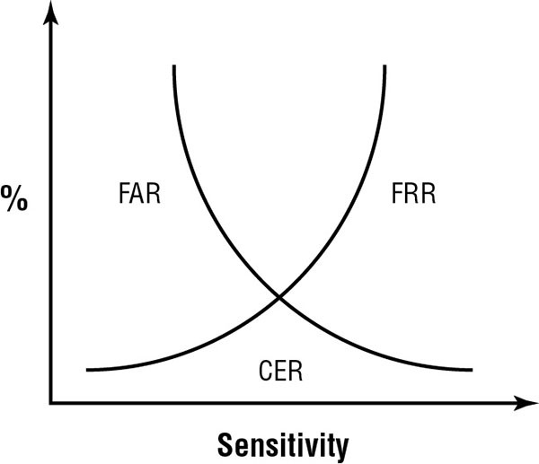

## Controlling Access to Assets

An asset includes information, systems, devices, facilities, and personnel.

**Information** `all of organization data` `Data stored in simple files on servers, computers, and smaller devices or huge databases within a server farm`

**Systems** `any information technology (IT) systems` 

**Devices** `computing system, including servers, desktop computers, portable laptop computers, tablets, smartphones, and external devices such as printers` `BYOD devices to`
**Facilities** `any physical location that it owns or rents`

**Personnel** 


### Comparing Subject and Object

Access control addresses more than just controlling which users can access which files or services. It is about the relationships between entities (that is, subjects and objects). Access is the transfer of information from an object to a subject, which makes it important to understand the definition of both subject and object.

**Subject** – (Active) Most often users, but can also be programs – Subjects manipulate object.

**Object** – (Passive) Any passive data (both physical paper and data) – Objects are manipulated by subject.

> You can often simplify the access control topics by substituting the word user for subject and the word file for object. 

Programs, services, and computers, at times listed as subject or object as roles are interchangeable.

As an example, consider a common web application that provides dynamic web pages to users. Users query the web application to retrieve a web page, so the application starts as an *object*. The web application then switches to a *subject* role as it queries the user’s computer to retrieve a cookie and then queries a database to retrieve information about the user based on the cookie. Finally, the application switches back to an *object* as it sends dynamic web pages back to the user.

### The CIA Triad and Access Control

**Confidentiality** Access controls help ensure that only `authorized subjects can access objects`. When unauthorized entities can access systems or data, it results in a loss of confidentiality.

**Integrity** Integrity ensures that data or system configurations are `not modified without authorization`, or if unauthorized changes occur, security controls detect the changes. If unauthorized or unwanted changes to objects occur, it results in a loss of integrity.

**Availability** Authorized requests for objects must be granted to subjects within a `reasonable amount of time`. In other words, systems and data should be available to users and other subjects when they are needed. If the systems are not operational or the data is not accessible, it results in a loss of availability.

### Type of Access Control

Access control includes the following overall steps:

* Identify and authenticate users or other subjects attempting to access resources.
* Determine whether the access is authorized.
* Grant or restrict access based on the subject’s identity.
* Monitor and record access attempts.

Three primary control types are `preventive, detective, and corrective`.

Four other access control types, commonly known as `deterrent, recovery, directive, and compensating` access controls.


Access controls are also categorized by how they are implemented:

* **Administrative Access Controls**
* **Logical/Technical Controls**
* **Physical Controls**


## Comparing Identification and Authentication

*Identification* is the process of a subject claiming, or professing, an identity. A subject must provide an identity to a system to start the authentication, authorization, and accountability processes. Example, username. A core principle with authentication is that all subjects must have unique identities.

*Authentication* verifies the identity of the subject by comparing one or more factors against a database of valid identities, such as user accounts.


### Registration and Proofing of Identity

  * The registration process occurs when a user is first given an identity. Example, a new employee is given userid by HR.

  * Identity proofing normally entails asking the user to provide information that is known to the user and the bank (for example) such as account numbers and personal information about the user such as a national identification number or social security number.

### Authorization and Accountability

  * **Authorization** Subjects are granted access to objects based on proven identities. For example, administrators grant users access to files based on the user’s proven identity.

  * **Accountability** Users and other subjects can be held accountable for their actions when auditing is implemented. Auditing tracks subjects and records when they access objects, creating an audit trail in one or more audit logs. For example, auditing can record when a user reads, modifies, or deletes a file. Auditing provides accountability. Additionally, assuming the user has been properly authenticated, audit logs provide *nonrepudiation*. The user cannot believably deny taking an action recorded in the audit logs.

### Authentication Factor

Three basic methods of authentication are also known as types or factors. They are as follows:

* **Type 1** A Type 1 authentication factor is *something you know*. Examples include a password, personal identification number (PIN), or passphrase.

* **Type 2** A Type 2 authentication factor is *something you have*. Physical devices that a user possesses can help them provide authentication. Examples include a smartcard, hardware token, memory card, or Universal Serial Bus (USB) drive.

* **Type 3** A Type 3 authentication factor is *something you are or something you do*. It is a physical characteristic of a person identified with different types of biometrics. Examples in the something-you-are category include fingerprints, voice prints, retina patterns, iris patterns, face shapes, palm topology, and hand geometry. Examples in the something-you-do category include signature and keystroke dynamics, also known as behavioral biometrics.


In addition to the three primary authentication factors, there are some others.

**Somewhere You Are** subject’s location based on a specific computer, a geographic location identified by an Internet Protocol (IP) address, or a phone number identified by caller ID.

**Context-Aware Authentication** Many mobile device management (MDM) systems use context-aware authentication to identify mobile device users. It can identify multiple elements such as the location of the user, the time of day, and the mobile device. If the user meets all the requirements (location, time, and type of device in this example), it allows the user to log on using the other methods such as with a username and password.

### Passwords

A *static password* stays the same for a length of time such as 30 days, but static passwords are the weakest form of authentication. Passwords are weak security mechanisms for several reasons:

* Users often choose passwords that are easy to remember and therefore easy to guess or crack.
* Randomly generated passwords are hard to remember; thus, many users write them down.
* Users often share their passwords, or forget them.
* Attackers detect passwords through many means, including observation, sniffing networks, and stealing security databases.
* Passwords are sometimes transmitted in clear text or with easily broken encryption protocols. Attackers can capture these passwords with network sniffers.
* Password databases are sometimes stored in publicly accessible online locations.
* Brute-force attacks can quickly discover weak passwords.


> **PASSWORD STORAGE** Most OS use HASH (SHA-3) to store the password instead of storing it in plaintext. Many systems use more sophisticated hashing functions such as Password-Based Key Derivation Function 2 (PBKDF2) or bcrypt to add bits to the password before hashing it. These additional bits are referred to as a salt, and salting helps thwart rainbow table attacks.

#### Creating Strong Passwords

Organizations often include a written password policy in the overall security policy. IT security professionals then enforce the policy with technical controls such as a technical *password policy* that enforces the *password restriction* requirements. The following list includes some common password policy settings:

* **Maximum Age** change their password periodically, such as every 45 days.
* **Password Complexity** An eight-character password using uppercase characters, lowercase characters, symbols, and numbers. National Institute of Standards and Technology (NIST) special publication (SP) **800-63B**, “Digital Identity Guidelines,” states that authentication systems should support the use of any printable American Standard Code for Information Interchange (ASCII) characters and the space character.
* **Password Length** NIST SP **800-63B** states that passwords should be at least eight characters long, and systems should support passwords as long as 64 characters. Many organizations require privileged account passwords to be longer, such as at least 15 characters long.

> NIST SP 800-63B says that passwords should be at least eight characters long and support the use of any printable ASCII characters, and systems should support passwords of at least 64 characters long. It also recommends hashing the password using random salts of at least 32 bits in length and storing the salted hash of the password plus use additional authentication factor, such as a smart card 

* **Password History** A password history remembers a certain number of previous passwords and prevents users from reusing a password in the history. Minimum password age is often set to one day.

The following suggestions can help them create strong passwords:

* *Do not* use any part of your name, logon name, email address, employee number, national identification number or social security number, phone number, extension, or any other identifying name or code.
* *Do not* use information available from social network profiles such as a family member’s name, a pet’s name, or your birth date.
* *Do not* use dictionary words (including words in foreign dictionaries), slang, or industry acronyms.
* *Do use* nonstandard capitalization and spelling, such as stRongsecuRitee instead of strongsecurity.
* *Do replace* letters with special characters and numbers, such as stR0ng$ecuR1tee instead of strongsecurity.

#### Password Phrases

A password mechanism that is more effective than a basic password is a *passphrase*. A passphrase is a string of characters similar to a password but that has unique meaning to the user. Example, IPassedTheCISSPExam then replace with specials characters 1P@ssedTheC1SSPEx@m.

#### Cognitive Passwords

A cognitive password is a series of challenge questions about facts or predefined responses that only the subject should know. Example:

* What is your birth date?
* What is your mother’s maiden name?
* What is the name of your first boss?
* What is the name of your first pet?
* What is your favorite sport?

Example: If users forget their original password, they can ask for help. The password management system then challenges the user with one or more of these cognitive password questions, presumably known only by the user.

### Smartcards And Tokens

Smartcards and hardware tokens are both examples of a Type 2, or something you have, factor of authentication. They are rarely used by themselves but are commonly combined with another factor of authentication, providing multifactor authentication.

#### Smartcards

A smartcard is a credit card–sized ID or badge and has an integrated circuit chip embedded in it. Most current smartcards include a microprocessor and one or more certificates. Personnel within the US government use either *Common Access Cards (CACs) or Personal Identity Verification (PIV)* cards.

#### Tokens

A token device, or hardware token, is a password-generating device that users can carry with them. A common token used today includes a display that shows a six- to eight-digit number.

Hardware token devices use dynamic onetime passwords, making them more secure than static passwords. A static password remains the same over a long period of time, such as for 60 days.

The two types of tokens are *synchronous dynamic password tokens* and *asynchronous dynamic password tokens*.

**Synchronous Dynamic Password Tokens** Hardware tokens that create synchronous dynamic passwords are `time-based` and synchronized with an authentication server. They generate a new password periodically, such as every 60 seconds. This does require the token and the server to have accurate time.

**Asynchronous Dynamic Password Tokens** An asynchronous dynamic password does not use a clock. Instead, the hardware token generates passwords based on an `algorithm and an incrementing counter`. When using an incrementing counter, it creates a dynamic onetime password that stays the same until used for authentication. Example: A user would first submit a username and password to a web page. After validating the user’s credentials, the authentication system uses the token’s identifier and incrementing counter to create a challenge number and sends it back to the user. The challenge number changes each time a user authenticates, so it is often called a nonce (short for “number used once”).

#### Two-Step Authentication

A trend that many online organizations are using is two-step authentication. As an example, bank online authentication with one-time-password on our cell phones.

This process typically takes advantage of one of the following standards.

**HOTP** The hash message authentication code (HMAC) includes a hash function used by the *HMAC-based One-Time Password (HOTP)* standard to create onetime passwords. It typically creates HOTP values of six to eight numbers. This is similar to the *asynchronous dynamic passwords* created by tokens. The HOTP value remains valid until used.

**TOTP** The *Time-based One-Time Password* standard is similar to HOTP. However, it uses a timestamp and remains valid for a certain timeframe, such as 30 seconds. The TOTP password expires if the user doesn’t use within the timeframe. This is similar to the *synchronous dynamic passwords* used by tokens.

> **Standard/Guideline** SP 800-63B recommends that code sent to users cell phone should not be visible to unlocked screen but most of the code always appear on the locked screen.

```
As discussed in this section, a numeric code sent to a smartphone is a secure method. The reason is that the smartphone has a subscriber identify module (SIM) card that uniquely identifies the device. Devices with a SIM card receive messages over the public switched telephone network (PSTN).

In contrast, if the message containing the numeric code is sent to an email address or a phone using Voice over Internet Protocol (VoIP), it isn’t possible to uniquely identify the device receiving the message. SP 800.63B recommends against using a device if it isn’t possible to prove possession of the device, such as when it sent as an email or using VoIP.

SP 800.63B has noted some risks with sending codes using the Short Message Service (SMS). SMS messages can sometimes be intercepted, and they can also be sent to VoIP devices.

As a better alternative, SP 800.63B recommends the use of push notifications. A push notification first establishes an authenticated protected channel. Once the channel is established, it sends the notification to the receiving device.
```

### Biometrics 

Biometric factors fall into the Type 3, something you are, authentication category.
Biometric factors can be used as an identifying (one-to-many search) or authentication (one-to-one search) technique, or both.

Biometric characteristics are often defined as either *physiological or behavioral*. Physiological biometric methods include fingerprints, face scans etc. Behavioral biometric methods include signature dynamics and keystroke patterns (keystroke dynamics). These are sometimes referred to as something-you-do authentication.

**Fingerprints** Fingerprints are the visible patterns on the fingers and thumbs of people.
**Face Scans** Face scans use the geometric patterns of faces for detection and recognition.
**Retina Scans** Retina scans focus on the pattern of blood vessels at the `back of the eye`. They are the `most accurate` form of biometric authentication and can differentiate between identical twins. However, some privacy proponents object to their use because they can reveal medical conditions, such as high blood pressure and pregnancy.
**Iris Scans** Focusing on the `colored area around the pupil`, iris scans are the `second most accurate` form of biometric authentication. Like the retina, the iris remains relatively unchanged throughout a person’s life (barring eye damage or illness).
**Palm Scans** Palm scanners scan the palm of the hand for identification. They use near-infrared light to measure vein patterns in the palm, which are as unique as fingerprints
**Hand Geometry** Hand geometry recognizes the physical dimensions of the hand. This includes the width and length of the palm and fingers.
**Heart/Pulse** Patterns Measuring the user’s pulse or heartbeat ensures that a real person is providing the biometric factor. It is often employed as a secondary biometric to support another type of authentication. a reliable method has not been created or fully tested.
**Voice Pattern Recognition** This type of biometric authentication relies on the characteristics of a person’s speaking voice, known as a voiceprint.
**Signature Dynamics** This recognizes how a subject writes a string of characters. Signature dynamics examine both how a subject performs the act of writing and features in a written sample.
**Keystroke Patterns** Keystroke patterns (also known as keystroke dynamics) measure how a subject uses a keyboard by analyzing *flight time and dwell time*. *Flight time* is how long it takes between key presses, and *dwell time* is how long a key is pressed. 

#### Biometric Factor Error Ratings

Biometric devices are rated for performance by examining the different types of errors they produce.

**False Rejection Rate or Type I error** A false rejection occurs when a valid subject is not authenticated
**False Acceptance Rate or Type II error** A false acceptance occurs when an invalid subject is authenticated.

Most biometric devices have a *sensitivity adjustment*. When a biometric device is too sensitive, false rejections (false negatives) are more common. When a biometric device is not sensitive enough, false acceptance (false positives) are more common.

You can compare the overall quality of biometric devices with the *crossover error rate (CER)*, also known as the *equal error rate (ERR)*



The point where the FRR and FAR percentages are equal is the CER, and the CER is used as a standard assessment value to compare the accuracy of different biometric devices. Devices with lower CERs are more accurate than devices with higher CERs.

It’s not necessary, and often not desirable, to operate a device with the sensitivity set at the CER level. For example, an organization may use a facial recognition system to allow or deny access to a secure area because they want to ensure that unauthorized individuals are never granted access. In this case, the organization would set the sensitivity very high so there is very little chance of a false acceptance (false positive). This may result in more false rejections (false negatives), but a false rejection is more acceptable than a false acceptance in this scenario.

#### Biometric Registration

Biometric devices can be ineffective or unacceptable due to factors known as enrollment time, throughput rate, and acceptance.

During enrollment, a subject’s biometric factor is sampled and stored in the device’s database. This stored sample of a biometric factor is the reference profile (also known as a reference template).

Enrollment times over 2 minutes are unacceptable. 

The throughput rate is the amount of time the system requires to scan a subject and approve or deny access. Subjects typically accept a throughput rate of about 6 seconds or faster.

### Multi-Factor Authentication

Multifactor authentication is any authentication using two or more factors. Two-factor authentication requires two different factors to provide authentication.

> Multifactor authentication must use multiple types or factors, such as the something-you-know factor and the something-you-have factor. In contrast, requiring users to enter a password and a PIN is not multifactor authentication because both methods are from a single authentication factor (something you know).

When two or more different factors are employed, two or more different methods of attack must succeed to collect all relevant authentication elements.

### Device Authentication 

Examples:

* A PC in Windows Domain setup cannot login if connection to the controller is broken
* Device fingerprinting for BYOD where user register a device and attach it to a user. Register device characteristics like  operating system and version, web browser, browser fonts, browser plug-ins, time zone, data storage etc.
* Many MDM systems use context-aware authentication methods to identify devices. It typically works with network access control (NAC) to grant or restrict access.
* 802.1x is another method used for device authentication - router, switches, wireless APs. 
* All controls can work together 802.1x + MDM + NAC

#### Service Authentication

* A service account is simply a user account that is created for a service instead of a person.
* It’s common to set the properties of the account so that the password never expires.
* strong, complex password that is changed more often than regular users
* Account to be non-interactive, so traditional users cannot login
* Services can be configured to use certificate-based authentication.