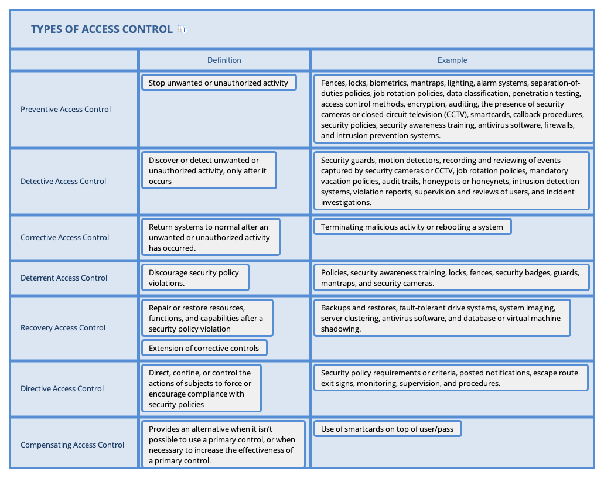
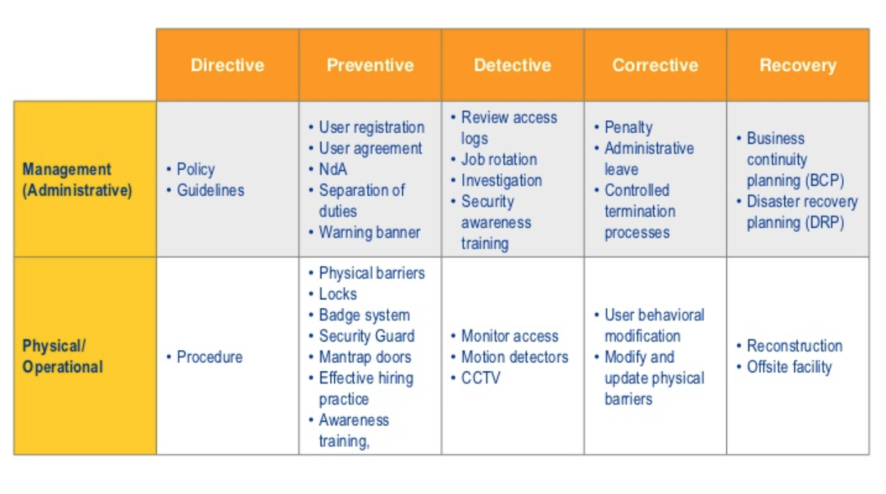
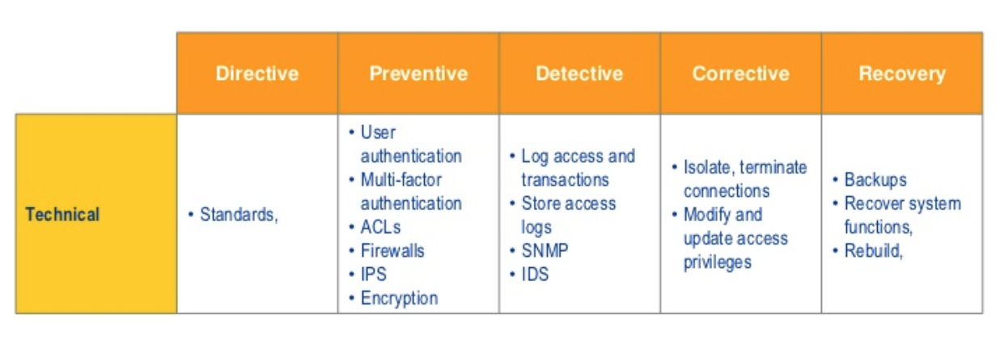

## Controlling Access to Assets

An asset includes information, systems, devices, facilities, and personnel.

**Information** `all of organization data` `Data stored in simple files on servers, computers, and smaller devices or huge databases within a server farm`

**Systems** `any information technology (IT) systems` 

**Devices** `computing system, including servers, desktop computers, portable laptop computers, tablets, smartphones, and external devices such as printers` `BYOD devices to`
**Facilities** `any physical location that it owns or rents`

**Personnel** 

### Comparing Subject and Object

Access control addresses more than just controlling which users can access which files or services. It is about the relationships between entities (that is, subjects and objects). Access is the transfer of information from an object to a subject, which makes it important to understand the definition of both subject and object.

**Subject** – (Active) Most often users, but can also be programs – Subjects manipulate object.

**Object** – (Passive) Any passive data (both physical paper and data) – Objects are manipulated by subject.

> You can often simplify the access control topics by substituting the word user for subject and the word file for object. 

Programs, services, and computers, at times listed as subject or object as roles are interchangeable.

As an example, consider a common web application that provides dynamic web pages to users. Users query the web application to retrieve a web page, so the application starts as an *object*. The web application then switches to a *subject* role as it queries the user’s computer to retrieve a cookie and then queries a database to retrieve information about the user based on the cookie. Finally, the application switches back to an *object* as it sends dynamic web pages back to the user.

### The CIA Triad and Access Control

**Confidentiality** Access controls help ensure that only `authorized subjects can access objects`. When unauthorized entities can access systems or data, it results in a loss of confidentiality.

**Integrity** Integrity ensures that data or system configurations are `not modified without authorization`, or if unauthorized changes occur, security controls detect the changes. If unauthorized or unwanted changes to objects occur, it results in a loss of integrity.

**Availability** Authorized requests for objects must be granted to subjects within a `reasonable amount of time`. In other words, systems and data should be available to users and other subjects when they are needed. If the systems are not operational or the data is not accessible, it results in a loss of availability.

### Type of Access Control

Access control includes the following overall steps:

* Identify and authenticate users or other subjects attempting to access resources.
* Determine whether the access is authorized.
* Grant or restrict access based on the subject’s identity.
* Monitor and record access attempts.

Three primary control types are `preventive, detective, and corrective`.

Four other access control types, commonly known as `deterrent, recovery, directive, and compensating` access controls.

Access controls are also categorized by how they are implemented:

* **Administrative Access Controls**
* **Logical/Technical Controls**
* **Physical Controls**

## Comparing Identification and Authentication

*Identification* is the process of a subject claiming, or professing, an identity. A subject must provide an identity to a system to start the authentication, authorization, and accountability processes. Example, username. A core principle with authentication is that all subjects must have unique identities.

*Authentication* verifies the identity of the subject by comparing one or more factors against a database of valid identities, such as user accounts.

### Registration and Proofing of Identity

  * The registration process occurs when a user is first given an identity. Example, a new employee is given userid by HR.

  * Identity proofing normally entails asking the user to provide information that is known to the user and the bank (for example) such as account numbers and personal information about the user such as a national identification number or social security number.

### Authorization and Accountability

  * **Authorization** Subjects are granted access to objects based on proven identities. For example, administrators grant users access to files based on the user’s proven identity.

  * **Accountability** Users and other subjects can be held accountable for their actions when auditing is implemented. Auditing tracks subjects and records when they access objects, creating an audit trail in one or more audit logs. For example, auditing can record when a user reads, modifies, or deletes a file. Auditing provides accountability. Additionally, assuming the user has been properly authenticated, audit logs provide *nonrepudiation*. The user cannot believably deny taking an action recorded in the audit logs.

