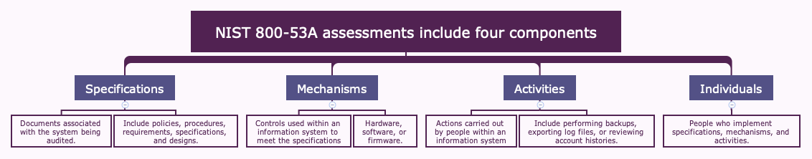
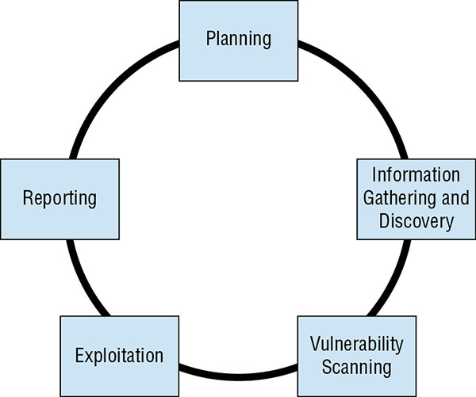
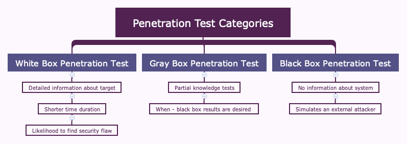
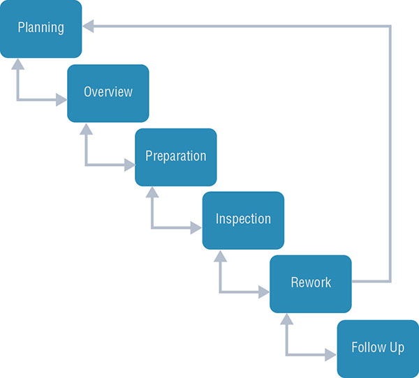
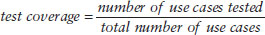

Once security professionals build and configure these controls, they must regularly test them to ensure that they continue to properly safeguard information.

## Building a Security Assessment and Testing Program

Security assessment and testing program includes tests, assessments, and audits that regularly verify that an organization has adequate security controls and that those security controls are functioning properly and effectively safeguarding information assets.

### Security Testing

Security tests verify that a control is functioning properly. These tests include automated scans, tool-assisted penetration tests, and manual attempts to undermine security. Test factor includes:

* Availability of security testing resources
* Criticality of the systems and applications protected by the tested controls
* Sensitivity of information contained on tested systems and applications
* Likelihood of a technical failure of the mechanism implementing the control
* Likelihood of a misconfiguration of the control that would jeopardize security
* Risk that the system will come under attack
* Rate of change of the control configuration
* Other changes in the technical environment that may affect the control performance
* Difficulty and time required to perform a control test
* Impact of the test on normal business operations

`frequent automated tests supplemented by infrequent manual tests` `manual test may occur on annual basis to minimize costs and disruption to the business`

Security professionals must also carefully review the results of those tests to ensure that each test was successful. Reviews can be manual or automated.

### Security assessments 

Security assessments are comprehensive reviews of the security of a system, application, or other tested environment. A trained information security professional performs a risk assessment that identifies vulnerabilities in the tested environment that may allow a compromise and makes recommendations for remediation, as needed.

It goes beyond automated scanning and manual penetration tests. They also include a thoughtful review of the threat environment, current and future risks, and the value of the targeted environment.

Main output - Assessment in nontechnical language and concludes with specific recommendations for improving the security of the tested environment.

`internal team, or they may be outsourced to a third-party `

**Standard/Guideline** NIST Special Publication 800-53A: Assessing Security and Privacy Controls in Federal Information Systems and Organizations - [Link](https://nvlpubs.nist.gov/nistpubs/SpecialPublications/NIST.SP.800-53Ar4.pdf)

They may also interview individuals and perform direct tests to determine the effectiveness of controls.

### Security audits

Security audits use many of the same techniques followed during security assessments but must be performed by independent auditors. Assessment and testing results are meant for internal use only and are designed to evaluate controls with an eye toward finding potential improvements. Audits, on the other hand, are evaluations performed with the purpose of demonstrating the effectiveness of controls to a third party. There are three main types of audits: internal audits, external audits, and third-party audits.

#### Internal Audits

  * Internal audits are performed by an organization’s internal audit staff and are typically intended for internal audiences.

  * Normally the reporting line of internal auditor is separate from staff that implemented the controls. Chief audit executive may also have reporting responsibility directly to the organization’s governing board.

#### External Audits

  * External audits are performed by an outside auditing firm.

  * Theoretically auditors have no conflict of interest with the organization itself. 

  * Highest credibility with the so-called Big Four audit firms: Ernst & Young, Deloitte & Touche, PricewaterhouseCoopers and KPMG

#### Third-Party Audits

  * Third-party audits are conducted by, or on behalf of, another organization. For example, a regulatory body might have the authority to initiate an audit of a regulated firm under contract or law. In the case of a third-party audit, the organization initiating the audit generally selects the auditors and designs the scope of the audit.
  
  * Statement on Standards for Attestation Engagements document 16 (SSAE 16), titled Reporting on Controls, provides a common standard to be used by auditors performing assessments of service organizations with the intent of allowing the organization to conduct an external assessment instead of multiple third-party assessments and then sharing the resulting report with customers and potential customers.

  * SSAE 16 engagements produce two different types of reports.

    * Type I reports provide a description of the controls provided by the audited organization as well as the auditor’s opinion based upon that description. Type I audits cover a single point in time and do not involve actual testing of the controls by the auditor.

    * Type II reports cover a minimum six-month time period and also include an opinion from the auditor on the effectiveness of those controls based upon actual testing performed by the auditor.

#### Auditing Standards

**Standards/Guidelines** 

  * One common framework for conducting audits and assessments is the **Control Objectives for Information and related Technologies (COBIT)**. COBIT describes the common requirements that organizations should have in place surrounding their information systems.

  * **International Organization for Standardization (ISO)**

    * ISO 27001: Standard approach for setting up an information security management system.

    * ISO 27002: Detail on the specifics of information security controls

### Performing Vulnerability Assessments

Vulnerability scans and penetration tests provide security professionals with a perspective on the weaknesses in a system or application’s technical controls.

#### Describing Vulnerability

NIST provides the community with the **Security Content Automation Protocol (SCAP)** to define common language for describing and evaluating vulnerabilities. 

The components of SCAP include the following:

* **Common Vulnerabilities and Exposures (CVE)** provides a naming system for describing security vulnerabilities.

* **Common Vulnerability Scoring System (CVSS)** provides a standardized scoring system for describing the severity of security vulnerabilities.

* **Common Configuration Enumeration (CCE)** provides a naming system for system configuration issues.

* **Common Platform Enumeration (CPE)** provides a naming system for operating systems, applications, and devices.

* **Extensible Configuration Checklist Description Format (XCCDF)** provides a language for specifying security checklists.

* **Open Vulnerability and Assessment Language (OVAL)** provides a language for describing security testing procedures.

#### Vulnerability Scans

Vulnerability scans automatically probe systems, applications, and networks, looking for weaknesses that may be exploited by an attacker. `without requiring manual intervention` `scheduled scanning` `offering administrators a view into changes in their security risk environment`

There are four main categories of vulnerability scans:

* network discovery scans
* network vulnerability scans
* web application vulnerability scans
* database vulnerability scans.

> Attacker have access to the same tools, so they can focus there attack on exposed vulnerability 

**Network Discovery Scanning** 

  * Search open network ports in the system
  * It does not do not actually probe systems for vulnerabilities but generate reports with the list of IP address and open ports (services)
  * Technique include:

    * TCP SYN Scanning - Just SYN packet, half-open connection 
    * TCP Connect Scanning - Complete 3-way handshake, 
    * TCP ACK Scanning - Send ACK packet, to test firewall in the path.
    * Xmas Scanning - Sends a packet with the FIN, PSH, and URG flags set. Packet with so many flags set is said to be “lit up like a Christmas tree,” leading to the scan’s name.

  * Example: nmap, results will show one of the following:

    * *Open* The port is open on the remote system and there is an application that is actively accepting connections on that port.

    * *Closed* The port is accessible on the remote system, meaning that the firewall is allowing access, but there is no application accepting connections on that port.

    * *Filtered* Nmap is unable to determine whether a port is open or closed because a firewall is interfering with the connection attempt.

**Network Vulnerability Scanning**

  * This tool don’t stop with detecting open ports but continue on to probe a targeted system or network for the presence of known vulnerabilities.

  * This tool has a database of thousands of vulnerabilities and tests to identify if system is susceptible to vulnerabilities.

  * Tools at time may produce *false positive* report and *false negative* report.

  * By default these scanners run unauthenticated scans (no user/pass), but sometime admins can provide a read-only user/pass and run authenticated scans of systems to perform better scanning.

  * Example: Nessus vulnerability scanner, Qualys’s QualysGuard,  Rapid7’s NeXpose and open source OpenVAS scanner. For wirelesss networks - Aircrack

  * Common ports:
  
  | Protocol | Port |
  | --- | --- |
  |FTP |20/21|
  |SSH|22|
  |Telnet|23|
  |SMTP|25|
  |DNS|53|
  |HTTP|80|
  |POP3|110|
  |NTP|123|
  |Windows File Sharing|135, 137–139, 445|
  |HTTPS|443|
  |LPR/LPD|515|
  |Microsoft SQL Server|1433/1434|
  |Oracle|1521|
  |H.323|1720|
  |PPTP|1723|
  |RDP|3389|
  |HP JetDirect printing|9100|

**Web Vulnerability Scanning**
 
  * Attackers often try to exploit these circumstances using Structured Query Language (SQL) injection and other attacks that target flaws in the security design of web applications.

  * Web vulnerability scanners are special-purpose tools that scour web applications for known vulnerabilities.

  * They may discover flaws not visible to network vulnerability scanners.

  * It’s a good practice to run scans in the following circumstances:

    * Scan all applications when you begin performing web vulnerability scanning for the `first time`. This will detect issues with legacy applications.
    * Scan any `new application` `before` moving it into a `production` environment for the first time.
    * Scan any `modified application` before the code changes move into production.
    * Scan all applications on a `recurring basis`. 
    * Web application scanning may be required to meet compliance requirements, example, Payment Card Industry Data Security Standard (PCI DSS) required to run scan atleast annually or install dedicated web application firewalls.

  * Example, Nessus, commercial Acunetix scanner, the open-source Nikto and Wapiti scanners, and the Burp Suite proxy tool.

**Database Vulnerability Scanning** 

  * Database vulnerability scanners are tools that allow security professionals to scan both databases and web applications for vulnerabilities that may affect database security.

  * Example, *sqlmap*

#### Vulnerability Management Workflow

Basic steps in this workflow should include the following:

* *Detection*: The initial identification of a vulnerability normally takes place as the result of a vulnerability scan.
* *Validation*: Once a scanner detects a vulnerability, administrators should confirm the vulnerability to determine that it is not a false positive report.
* *Remediation*: Validated vulnerabilities should then be remediated. This may include applying a vendor-supplied security patch, modifying a device configuration, implementing a workaround to avoid the vulnerability, or installing a web application firewall or other control that prevents the exploitation of the vulnerability.

### Penetration Testing

  * It beyond vulnerability testing techniques because it actually attempts to exploit systems. Security professionals performing penetration tests tries to defeat security controls and break into a targeted system or application to demonstrate the flaw.
  
  * Process normally consists of the following phases:

  

    * *Planning* `scope` `rules of engagement`
    * *Information gathering and discovery* `manual and automated` `basic reconnaissance`
    * *Vulnerability scanning* `probes for system weaknesses` - used tools discussed earlier - network, web and database scanners
    * *Exploitation* `exploit tools to attempt to defeat system security`
    * *Reporting* `results` `recommendations for improvements`

  * Penetration testers commonly use a tool called *Metasploit*

  * PenTest categories include:

  

  * **Standard/Guidelines** OWASP Testing Guide, OSSTMM, NIST 800-115, FedRAMP Penetration Test Guidance, or PCI DSS Information Supplement on Penetration Testing as references.

### Testing Your Software

Many types of software testing that you may integrate into your organization’s software development lifecycle:

#### Code Review and Testing

**Code Review** 

  * Code review is the foundation of software assessment programs.

  * Also known as *peer review* developers other than the one who wrote the code review it for defects.

  * The most formal code review processes, known as *Fagan inspections*, follow a rigorous review and testing process with six steps:

  1) Planning
  2) Overview
  3) Preparation
  4) Inspection
  5) Rework
  6) Follow-up
 
  

  *  Most organizations use less rigorous processes using code peer review measures that include the following:

    * Developers walking through their code in a meeting with one or more other team members
    * A senior developer performing manual code review and signing off on all code before moving to production
    * Use of automated review tools to detect common application flaws before moving to production

**Static Testing** 

  * Evaluates without running the software for common software flaws such as buffer overflow

**Dynamic Testing**

  * Runtime environment testing and often the only test available to tester when they don't have underline code access, when mostly application is devleped by third-party. Example, web application testing, for SQLi, XSS etc.

  * Dynamic testing may include the use of *synthetic transactions* to verify system performance. Scripted transactions with known expected results, tester compare actual and expected results. 

**Fuzz Testing** 

  * Fuzz testing is a specialized dynamic testing technique that provides many different types of input to software to stress its limits and find previously undetected flaws. 

  * It supplies invalid input to the software, either randomly generated or specially crafted to trigger known software vulnerabilities.

  * Watch out for software crashes, buffer overflows etc

  * Two main categories of fuzz testing:

    * *Mutation (Dumb) Fuzzing* Takes previous input values from actual operation of the software and manipulates (or mutates) it to create fuzzed input. It might alter the characters of the content, append strings to the end of the content, or perform other data manipulation techniques.

    * *Generational (Intelligent)*  Fuzzing Develops data models and creates new fuzzed input based on an understanding of the types of data used by the program.
 
  * Example, *zzuf* tool, slightly manipulating the input is known as *bit flipping*

#### Interface testing

Modern application handoffs between separately developed modules and use well-defined interfaces so that the teams may work independently.

Three types of interfaces should be tested during the software testing process:

**Application Programming Interfaces (APIs)**
**User Interfaces (UIs)** `GUIs` `CLI`
**Physical Interfaces**

#### Misuse Case Testing

  * Also known as *abuse case testing*

  * Testers first enumerate the known misuse cases, then attempt to exploit those use cases with manual and/or automated attack techniques.

#### Test Coverage Analysis

Software testing professionals often conduct a test coverage analysis to estimate the degree of testing conducted against the new software. The test coverage is computed using the following formula:

The test coverage analysis formula may be adapted to use many different criteria. Here are five common criteria:

* *Branch coverage*: Has every `if` statement been executed under all `if` and `else` conditions?
* *Condition coverage*: Has every logical test in the code been executed under all sets of inputs?
* *Function coverage*: Has every function in the code been called and returned results?
* *Loop coverage*: Has every loop in the code been executed under conditions that cause code execution multiple times, only once, and not at all?
* *Statement coverage*: Has every line of code been executed during the test?

#### Website Monitoring

Two different forms:

* *Passive monitoring* analyzes actual network traffic sent to a website by capturing it as it travels over the network or reaches the server. *Real user monitoring (RUM)*is a variant of passive monitoring where the monitoring tool reassembles the activity of individual users to track their interaction with a website.

* *Synthetic monitoring (or active monitoring)* performs artificial transactions against a website to assess performance. This may be as simple as requesting a page from the site to determine the response time, or it may execute a complex script designed to identify the results of a transaction.

Two techniques are often used in conjunction with each other because they achieve different results. Passive monitoring detect issues after they occur where as synthetic monitoring may miss issues experienced by real users if they are not included in the testing scripts, but it is capable of detecting issues before they actually occur.

### Implementing Security Management Processes

Variety of management processes are designed to oversee the effective operation of the information security program. These processes are a critical feedback loop in the security assessment process because they provide management oversight and have a deterrent effect against the threat of insider attacks.

#### Log Reviews
  
  * Security information and event management (SIEM) packages play an important role in these processes, automating much of the routine work of log review.

  * Devices collect information using the syslog functionality present in many devices, operating systems, and applications. Windows may required an agent to be installed to make use of syslog. 

  * Logging systems should also make use of the Network Time Protocol (NTP) to ensure that clocks are synchronized on systems sending log entries to the SIEM as well as the SIEM itself. This ensures that information from multiple sources has a consistent timeline.

  * `periodically conduct log reviews` `not abusing their privileges`

#### Account Management

  * Account management reviews ensure that users only retain authorized permissions and that unauthorized modifications do not occur. 

  * Function of information security management personnel or internal auditors

  * Complete accounts audit which is time consuming which include privileged account checking, verifying that terminated users, checking paper trail for specific accounts etc.

  * Organizations that do not have time to conduct this thorough process may use sampling instead. `random sample of accounts and perform a full verification`

#### Backup Verification 

  * Managers should periodically inspect the results of backups to ensure that the process functions effectively and meets the organization’s data protection needs. This may involve reviewing logs, inspecting hash values, or requesting an actual restore of a system or file.

#### Key Performance and Rick Indicators 

  * The exact metrics they monitor will vary from organization to organization but may include the following:

     * Number of open vulnerabilities
     * Time to resolve vulnerabilities
     * Vulnerability/defect recurrence
     * Number of compromised accounts
     * Number of software flaws detected in preproduction scanning
     * Repeat audit findings
     * User attempts to visit known malicious sites