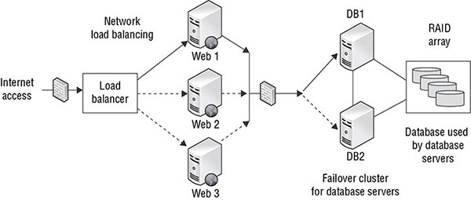
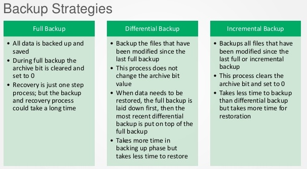
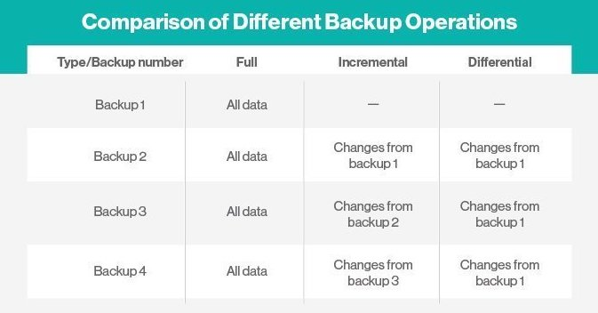
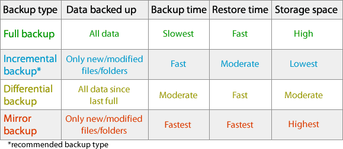

Disaster recovery planning (DRP) is the technical complement to the business-focused BCP exercise. It includes the technical controls that prevent disruptions and facilitate the restoration of service as quickly as possible after a disruption occurs.

## The Nature of Disaster

A disaster recovery plan should be set up so that it can almost run on `autopilot`. The DRP should also be designed to `reduce decision-making` activities during a disaster as much as possible. Essential personnel should be `well trained` in their duties and responsibilities in the wake of a disaster and also know the steps they need to take to get the organization up and running as soon as possible. We’ll begin by analyzing some of the possible disasters that might strike your organization and the particular threats that they pose.

### Natural Disaster

A disaster recovery plan should provide mechanisms for responding to both types of disasters, either with a gradual buildup of response forces or as an immediate reaction to a rapidly emerging crisis.

> Note: Ensure that your organization has sufficient insurance in place to protect it from the financial impact of a flood under FEMA’s National Flood Insurance Program.

#### Earthquakes

  * More likely to occur along known fault lines that exist in many areas of the world. A well-known example is the San Andreas Fault (Wester US).

  * If you live in a region along a fault line where earthquakes are likely, your DRP should address the procedures your business will implement should a seismic event interrupt your normal activities.

#### Floods

  * Some flooding results from the `gradual accumulation` of rainwater in rivers, lakes, and other bodies of water that then overflow their banks and flood the community. Other floods, known as `flash floods`, strike when a sudden severe storm dumps more rainwater on an area than the ground can absorb in a short period of time. Floods can also occur when `dams are breached`. Large waves caused by seismic activity, or `tsunamis`, combine the awesome power and weight of water with flooding, as we saw during the 2011 tsunami in Japan ([Fukushima](http://www.world-nuclear.org/information-library/safety-and-security/safety-of-plants/fukushima-accident.aspx)).

#### Storms

  * `Prolonged` periods of intense `rainfall` bring the risk of `flash flooding` described in the previous section. `Hurricanes and tornadoes` come with the threat of winds exceeding 100 miles per hour that undermine the structural integrity of buildings and turn everyday objects such as trees, lawn furniture, and even vehicles into deadly missiles. `Hailstorms` bring a rapid onslaught of destructive ice chunks falling from the sky. Many storms also bring the `risk of lightning`, which can cause severe damage to `sensitive electronic component`s. For this reason, your business continuity plan should detail appropriate mechanisms to `protect against lightning-induced damage`, and your disaster recovery plan should include adequate `provisions for power outages and equipment damage that might result from a lightning strike`. 

  > National Weather Service’s [National Hurricane Center](https://www.nhc.noaa.gov/)

#### Fires

  * Fires can start for a variety of reasons, both natural and man-made, but both forms can be equally devastating. During the BCP/DRP process, you should evaluate the risk of fire and implement at least basic measures to mitigate that risk and prepare the business for recovery from a catastrophic fire in a critical facility.

  > National Interagency Fire Center posts daily fire updates and forecasts on its [website](https://www.nifc.gov/fireInfo/nfn.htm)

#### Other Regional Events

  * Some regions of the world are prone to localized types of natural disasters. During the BCP/DRP process, your assessment team should analyze all of your organization’s operating locations and gauge the impact that such events might have on your business. For example, many parts of the world are subject to `volcanic eruptions`.

### Man-Made Disasters

#### Fires

  * Many smaller-scale fires result from human action—be it carelessness, faulty electrical wiring, improper fire protection practices, or other reasons

#### Acts of Terrorism

  * Since the terrorist attacks on September 11, 2001, businesses are increasingly concerned about risks posed by terrorist threats. These attacks caused many small businesses to fail because they did not have business continuity/disaster recovery plans in place that were adequate to ensure their continued viability. Many larger businesses experienced significant losses that caused severe long-term damage. 

#### Bombings/Explosions

  * Explosions can result from a variety of man-made occurrences. Explosive gases from leaks might fill a room/building and later ignite and cause a damaging blast. In many areas, bombings are also cause for concern. From a disaster planning perspective, the effects of bombings and explosions are like those caused by a large-scale fire. However, planning to avoid the impact of a bombing is much more difficult and relies on physical security measures 

#### Power Outages

  * Even the most basic disaster recovery plan contains provisions to deal with the threat of a short power outage. Critical business systems are often protected by uninterruptible power supply (UPS) devices to keep them running at least long enough to shut down or long enough to get emergency generators up and working. 

  > Check your UPSs regularly

  * Your BCP/DRP team should consider provisioning alternative power sources that can run business systems indefinitely. An adequate backup generator could make a huge difference when the survival of your business is at stake.

#### Network, Utility, and Infrastructure Failures
  
  *  Many businesses depend on one or more of these infrastructure elements to move people or materials. Their failure can paralyze your business’s ability to continue functioning.

  * You must also think about your internet connectivity as a utility service. Do you have sufficient redundancy in your connectivity options to survive or recover quickly from a disaster? If you have redundant providers, do they have any single points of failure?

#### Hardware/Software Failures

  * Like it or not, computer systems fail. Hardware components simply wear out and refuse to continue performing, or they suffer physical damage. Software systems contain bugs or fall prey to improper or unexpected inputs. For this reason, BCP/DRP teams must provide adequate redundancy in their systems. If zero downtime is a mandatory requirement, the best solution is to use fully redundant failover servers in separate locations attached to separate communications links and infrastructures (also designed to operate in a failover mode). 

  > Lessons learned during this blackout ( NYC BLACKOUT ) offer insight for BCP/DRP teams around the world and include the following:
  * Ensure that alternate processing sites are far enough away from your main site that they are unlikely to be affected by the same disaster.
  * Remember that threats to your organization are both internal and external. Your next disaster may come from a terrorist attack, a building fire, or malicious code running loose on your network. Take steps to ensure that your alternate sites are segregated from the main facility to protect against all of these threats.
  * Disasters don’t usually come with advance warning. If real-time operations are critical to your organization, be sure that your backup sites are ready to assume primary status at a moment’s notice.

#### Strikes/Picketing
 
  * Don’t forget about the importance of the human factor in emergency planning. One form of man-made disaster that is often overlooked is the possibility of a strike or other labor crisis.

#### Theft/Vandalism
 
  * Earlier, we talked about the threat that terrorist activities pose to an organization. Theft and vandalism represent the same kind of threat on a much smaller scale. In most cases, however, there’s a far greater chance that your organization will be affected by theft or vandalism than by a terrorist attack.

  > Keep the impact that theft may have on your operations in mind when planning your parts inventory. It’s a good idea to keep extra inventory of items with a high pilferage rate, such as random-access memory (RAM) chips and laptops. It’s also a good idea to keep such materials in secure storage and to require employees to sign such items out whenever they are used.

## Understand System Resilience and Fault Tolerance

Technical controls that add to system resilience and fault tolerance directly affect `availability`, one of the core goals of the CIA security triad (confidentiality, integrity, and availability). 

A *single point of failure (SPOF)* is any component that can cause an entire system to fail. If a computer has data on a single disk, failure of the disk can cause the computer to fail, so the disk is a single point of failure. 

*Fault tolerance* is the ability of a system to suffer a fault but continue to operate. Fault tolerance is achieved by adding redundant components such as additional disks within a redundant array of inexpensive disks (RAID) array, or additional servers within a failover clustered configuration.

*System resilience* refers to the ability of a system to maintain an acceptable level of service during an adverse event. This could be a hardware fault managed by fault-tolerant components, or it could be an attack managed by other controls such as effective intrusion detection and prevention systems.

> For example, if a primary server in a failover cluster fails, `fault tolerance` ensures that the system fails over to another server. `System resilience` implies that the cluster can fail back to the original server after the original server is repaired.

### Protecting Hard Drives

A common way that fault tolerance and system resilience is added for computers is with a RAID array. 

> Redundant Array of Inexpensive Disks (RAID) 

**RAID-0** This is also called striping. It uses two or more disks and improves the disk subsystem performance, but it does not provide fault tolerance.

**RAID-1** This is also called mirroring. It uses two disks, which both hold the same data. If one disk fails, the other disk includes the data so a system can continue to operate after a single disk fails.

**RAID-5** This is also called striping with parity. It uses three or more disks with the equivalent of one disk holding parity information. If any single disk fails, the RAID array will continue to operate, though it will be slower.

**RAID-10** This is also known as RAID 1 + 0 or a stripe of mirrors, and is configured as two or more mirrors (RAID-1) configured in a striped (RAID-0) configuration. It uses at least four disks but can support more as long as an even number of disks are added. It will continue to operate even if multiple disks fail, as long as at least one drive in each mirror continues to function.

Software-based RAID is inexpensive to implement, but can reduce overall system performance.

### Protecting Servers

Fault tolerance can be added for critical servers with *failover* clusters. Below images shows multiple components put together to provide reliable web access for a heavily accessed website that uses a database.

Above failover mechanism's like *load balancer* can be used in almost all Cloud provider. When designing cloud environments, be sure to consider the availability of data centers in different regions of the world. If you are already load balancing multiple servers, you may be able to place those servers in different geographic regions and availability zones within those regions to add resiliency in addition to scalability.

> Similarly, some systems provide automatic fault tolerance for servers, allowing a server to fail without losing access to the provided service. *Example* domain controllers and databases that replicate among multiple data.

### Protecting Power Sources

Fault tolerance can be added for power sources with an *uninterruptible power supply (UPS),* a generator, or both. In general, a UPS provides battery-supplied power for a short period of time between 5 and 30 minutes, and a generator provides long-term power. The goal of a UPS is to provide power long enough to complete a logical shutdown of a system, or until a generator is powered on and providing stable power.

Fluctuations in commercial power is problem, which include:

*Spike* is a quick instance of an increase in voltage.
*Sag* is a quick instance of a reduction in voltage. 
*Surge* is when power stays high for a long period of time.
*Brownout* is when power remains low for a long period of time.
*Transients* is when occasionally power lines have noise on them.

*Useful*: `very basic UPS` for surge protection and battery backup. `Line-interactive UPS` includes variable-voltage transformer and battery backup.

### Trusted Recovery

Trusted recovery provides assurances that after a failure or crash, the system is just as secure as it was before the failure or crash occurred

Systems can be designed so that they fail in a fail-secure state or a fail-open state. A *fail-secure* system will default to a secure state in the event of a failure, blocking all access. A *fail-open* system will fail in an open state, granting all access. The choice is dependent on whether *security or availability* is more important after a failure. Example is a firewall in fail-open with everything allowed when its recovering, whereas firewall blocking everything when its recovering - fail-secure.

Two elements of the recovery process are addressed to implement a trusted solution:

* Failure preparation - system resilience and fault-tolerant methods in addition to a reliable backup solution
* Process of system recovery - reboot into a single-user, nonprivileged state. restore all affected files and service activity.

Common Criteria defines four types of system recovery:

* Manual Recovery 
* Automated Recovery - `atleast one type of failure` - eg. RAID takes care of storage but not the server recovery itself.
* Automated Recovery without Undue Loss - `automated recovery` `recover data`
* Function Recovery - `recover specific functions` 

### Quality of Service

Quality of service (QoS) controls protect the integrity of data networks under load.

Some of the factors contributing to QoS are as follows:

* *Bandwidth*
* *Latency* 
* *Jitter* - The variation in latency between different packets.
* *Packet Loss* 
* *Interference* - Electrical noise, faulty equipment etc

In addition to controlling these factors, QoS systems often prioritize certain traffic types that have low tolerance for interference and/or have high business requirements.

### Recovery Strategy

*Insurance* (Many insurance provide cybersecurity insurance for CIA assurance)

  * Actual cash value (ACV) clause: compensation based on the fair market value of the items on the date of loss less all accumulated depreciation since the time of their purchase. 

#### Business Unit and Functional Priorities

  * You must identify and prioritize critical business functions as well so you can define which functions you want to restore after a disaster or failure and in what order.

  * Business impact assessment (BIA): ` identifies vulnerabilities, develops strategies to minimize risk` `costs related to failures`

#### Crisis Management

  * Crisis management is a science and an art form. If your training budget permits, investing in crisis training for your key employees is a good idea. This ensures that at least some of your employees know how to handle emergency situations properly and can provide all-important “on-the-scene” leadership to panic-stricken co-workers.

#### Emergency Communication

  * When a disaster strikes, it is important that the organization be able to communicate internally as well as with the outside world.

  * Communicate internally during a disaster so that employees know what is expected of them—whether they are to return to work or report to another location, for instance.

  * Disaster damaged some or all normal means of communications, at that point, it’s too late to try to figure out other means of communicating both internally and externally.

#### Workgroup Recovery

  * Goal: restoration of workgroups to the point that they can resume their activities in their usual work locations.

  * To facilitate this effort, it’s sometimes best to develop separate recovery facilities for different workgroups. For example, if you have several subsidiary organizations that are in different locations and that perform tasks similar to the tasks that workgroups at your office perform, you may want to consider temporarily relocating those workgroups to the other facility and having them communicate electronically and via telephone with other business units until they’re ready to return to the main operations facility.

#### Alternative Processing Sites

  * One of the most important elements of the disaster recovery plan is the selection of alternate processing sites to be used when the primary sites are unavailable.

  * ***Cold Site*** are standby facilities large enough to handle the processing load of an organization and equipped with appropriate electrical and environmental support systems, *example* large warehouse. A cold site has no computing facilities (hardware or software) pre-installed and also has no active broadband communications links beside few copper telephone link lines and/or standby links.

    * Advantages: Relatively low cost
    * Disadvantages: The time to activate a cold site is often measured in weeks, making timely recovery close to impossible and often yielding a false sense of security. It’s also worth observing that the substantial time, effort, and expense required to activate and transfer operations to a cold site make this approach the most difficult to test.

  * ***Hot Site*** is the exact opposite of the cold site. In this configuration, a backup facility is maintained in constant working order, with a full complement of servers, workstations, and communications links ready to assume primary operations responsibilities. The servers and workstations are all preconfigured and loaded with appropriate operating system and application software. If the replication between sites is instantaneous then operators could move operations to the hot site at a moment’s notice. 

  > If you use a hot site, never forget that it has copies of your production data. Be sure to provide that site with the same level of technical and physical security controls you provide at your primary site.

    * Advantages: Level of protection is high
    * Disadvantages: the cost is extremely high (double the cost)
    * How to reduce:
      * Outsource it to contractors (shared hot site). 
      * Use hot site as development/test environment which is in use when it not actings as the backup site. 

  * ***Warm sites*** occupy the middle ground between hot and cold sites for disaster recovery specialists. They always contain the equipment and data circuits necessary to rapidly establish operations. As with hot sites, this equipment is usually preconfigured and ready to run appropriate applications to support an organization’s operations. Unlike hot sites, however, warm sites do not typically contain copies of the client’s data. The main requirement in bringing a warm site to full operational status is the transportation of appropriate backup media to the site and restoration of critical data on the standby servers. Takes at least 12 hours from the time a disaster is declared to activate this site, this does not mean that anything less than 12 hours is hot site, hot site switchover is in few seconds or mins . 

  * ***Mobile sites*** are nonmainstream alternatives to traditional recovery sites. They typically consist of self-contained trailers or other easily relocated units.

  * A ***service bureau*** is a company that leases computer time. Service bureaus own large server farms and often fields of workstations. Any organization can purchase a contract from a service bureau to consume some portion of their processing capacity. Access can be on site or remote. *Drawback* is that they oversell their actual capacity by gambling that not all their contracts will be exercised at the same time.

  * ***Cloud Computing*** as disaster recovery option option. Use infrastructure as a service (IaaS) as a backup service providers. 

#### Mutual Assurance Agreements

  * Mutual assistance agreements (MAAs), also called *reciprocal agreements*

  * Under an MAA, two organizations pledge to assist each other in the event of a disaster by sharing computing facilities or other technological resources.

  * Rarely implemented in real-world practice

  * Drawbacks:

    * Difficult to enforce, if a party backs-off from the agreement, then legal discourse is an option but that does not help during immediate DR.

    * Orgs should be in close proximity, which makes this method ineffective in case of regional disaster like earthquake. 

    * Confidentiality is always a major concern.

#### Database Recovery

We’ll cover the three main techniques used to create offsite copies of database content: electronic vaulting, remote journaling, and remote mirroring. 

***Electronic Vaulting***

  * Database backups are moved to a remote site using *bulk transfers*
  * Entire database backup files are transferred
  * Due to this you can notice significant delay between the time you declare a disaster and the time your database is ready for operation with current data.

***Remote Journaling***

  * With remote journaling, data transfers are performed in a more expeditious manner. Data transfers still occur in a bulk transfer mode, but they occur on a more frequent basis, usually once every hour and sometimes more frequently.
  * Remote journaling setups transfer copies of the database transaction logs containing the transactions that occurred since the previous bulk transfer.

***Remote Mirroring*** 

  * A live database server is maintained at the backup site. So most expensive.
  * Good method to implement in hot site.

### Recovery Plan Development

Plan document should satisfies the operational needs of critical business units and falls within the resource, time, and expense constraints of the disaster recovery budget and available personnel.

Multiple types of plan documents, intended for different audiences:

* Executive summary providing a high-level overview of the plan
* Department-specific plans
* Technical guides for IT personnel responsible for implementing and maintaining critical backup systems
* Checklists for individuals on the disaster recovery team
* Full copies of the plan for critical disaster recovery team members

**Standards/Guideline:**

[Professional Practices](https://drii.org/resources/professionalpractices/EN)
[BCI Good Practices Guideline](https://www.thebci.org/training-qualifications/good-practice-guidelines.html)
[ISO 27001](https://www.iso.org/isoiec-27001-information-security.html)
[NIST SP 800-34](https://csrc.nist.gov/publications/sp)

#### Emergency Response

  * A disaster recovery plan should contain simple yet comprehensive instructions for essential personnel to follow immediately upon recognizing that a disaster is in progress or is imminent. 

  * Emergency-response plans are often put together in the form of checklists provided to responders. 

  * Arrange the checklist tasks in order of priority, with the most important task first!

#### Personnel and Communications

  * A disaster recovery plan should also contain a list of personnel to contact in the event of a disaster. DRP team + personnel who execute critical disaster recovery tasks t

  * Response checklist should include alternate means of contact (that is, pager numbers, mobile phone numbers, and so on) as well as backup contacts for each role should the primary contact be incommunicado or unable to reach the recovery site for one reason or another.

#### Assessment

  * When the disaster recovery team arrives on site, one of their first tasks is to assess the situation

  * More detailed assessments will take place to gauge the effectiveness of disaster recovery efforts and prioritize the assignment of resources.

#### Backup and Offsite Storage

  *  There are three main types of backups:

  

  

  

  *  A common strategy is to perform full backups over the weekend and incremental or differential backups on a nightly basis. 

  * **Backup Tape Formats** 

  Physical characteristics (defines the physical wear placed on the media) and the rotation cycle (frequency of backups and retention length) are two factors that a worthwhile backup solution should track and manage.

  * **Disk-to-Disk (D2D) Backup** 

  *Virtual tape libraries (VTL)* support the use of disks with this model by using software to make disk storage appear as tapes to backup software.

  `managed service provider` `cloud provider`

  * **Backup Best Practices**

    - backups should be scheduled during the low peak periods (for example, at night)
    - build sufficient capacity to handle a reasonable amount of growth over a reasonable amount of time
    - deploy some form of real-time continuous backup, such as RAID, clustering, or server mirroring
    - test your organization’s recovery processes

  * **Tape Rotation**

  Tape rotation strategies for backups: the Grandfather-Father-Son (GFS) strategy, the Tower of Hanoi strategy, and the Six Cartridge Weekly Backup strategy. 

  To reduce manual effort implement using commercial backup software or a fully automated hierarchical storage management (HSM) system.

#### Software Escrow Arrangements

  * Developer provides copies of the application source code to an independent third-party organization. 
  * This third party then maintains updated backup copies of the source code in a secure fashion. 
  * The agreement between the end user and the developer specifies “trigger events,” such as the failure of the developer to meet terms of a service-level agreement (SLA) or the liquidation of the developer’s firm. 
  * When a trigger event takes place, the third party releases copies of the application source code to the end user. The end user can then analyze the source code to resolve application issues or implement software updates.

#### External Communication

  * Contact vendors to provide supplies for DR
  * Your clients wants to contact for reassurance.
  * Public relations officials may need to contact the media or investment firms, and managers may need to speak to governmental authorities.

#### Utilities

  * Your disaster recovery plan should contain contact information and procedures to troubleshoot these services if problems arise during a disaster. 

#### Logistics and Supplies 

  * It’s also possible that the people will be living at those sites for an extended period of time and that the disaster recovery team will be responsible for providing them with food, water, shelter, and appropriate facilities. 

#### Recovery vs Restoration

  * *Recovery* involves bringing business operations and processes back to a working state. *Restoration* involves bringing a business facility and environment back to a workable state.

  * Salvage team for restoration.

### Training, Awareness, and Documentation

When designing a training plan, consider including the following elements:

* Orientation training for all new employees
* Initial training for employees taking on a new disaster recovery role for the first time
* Detailed refresher training for disaster recovery team members
* Brief awareness refreshers for all other employees (can be accomplished as part of other meetings and through a medium like email newsletters sent to all employees)

#### Testing and Maintenance

The five main test types—checklist tests, structured walk-throughs, simulation tests, parallel tests, and full-interruption tests

**Read Through Test** 

You distribute copies of disaster recovery plans to the members of the disaster recovery team for review. This lets you accomplish three goals simultaneously:

* Key personnel are aware of their responsibilities and have that knowledge refreshed periodically.
* It provides individuals with an opportunity to review the plans for obsolete information and update any items that require modification because of changes within the organization.
* In large organizations, it helps identify situations in which key personnel have left the company and nobody bothered to reassign their disaster recovery responsibilities. This is also a good reason why disaster recovery responsibilities should be included in job descriptions.

**Structured Walk-Through(table-top exercise)**

* Role-play a disaster scenario
* Test moderator, who presents the details to the team at the meeting. 
* The team members then refer to their copies of the disaster recovery plan and discuss the appropriate responses to that particular type of disaster.

**Simulation Test**

* Same as structured walk-through.
* some of these response measures are then tested. This may involve the interruption of noncritical business activities and the use of some operational personnel.

**Parallel Test**

* Relocating personnel to the alternate recovery site and implementing site activation procedure
* The only difference is that operations at the main facility are not interrupted.

**Full-interruption tests**

* Full-interruption tests operate like parallel tests, but they involve actually shutting down operations at the primary site and shifting them to the recovery site. 

**Maintenance** 

* Disaster recovery plan is a living document
* As your organization’s needs change, you must adapt the disaster recovery plan to meet those changed needs to follow suit. 

