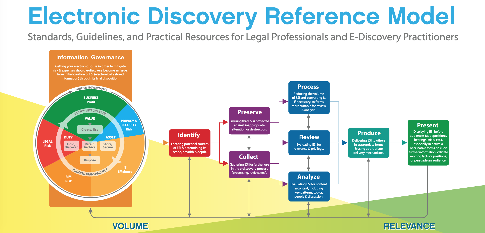

## Investigations

In many cases, this investigation will be a brief, informal determination that the matter is not serious enough to warrant further action or the involvement of law enforcement authorities. However, in some cases, the threat posed or damage done will be severe enough to require a more formal inquiry

Failure to abide by the correct procedures may violate the civil rights of those individual(s) being investigated and could result in a failed prosecution or even legal action against the investigator.

### Investigation Type

#### Administrative Investigation

  * Administrative investigations are internal investigations that examine either operational issues or a violation of the organization’s policies.

  * *Operational investigations* examine issues related to the organization’s computing infrastructure and have the primary goal of resolving operational issues. Example. IT investigation performance issue for a web server. `not intended to produce evidence` 

  * Operational investigations also often conduct a root cause analysis that seeks to identify the reason that an operational issue occurred. The root cause analysis often highlights issues that require remediation to prevent similar incidents in the future.

  * Administrative investigations that are not operational in nature may require a stronger standard of evidence, especially if they may result in sanctions against an individual. `no set guideline` `consult - sponsor or legal team for determine appropriate evidence collection, handling, and retention guidelines for administrative investigations`

#### Criminal Investigations

  * Criminal investigations, typically conducted by law enforcement personnel, investigate the alleged violation of criminal law.

  * Most criminal cases must meet the *beyond a reasonable doubt* standard of evidence.

  * Prosecution must demonstrate that the defendant committed the crime by presenting facts from which there are no other logical conclusions. 

  * Very strict evidence collection and preservation processes.

#### Civil Investigations

  * Civil investigations typically `do not` involve law enforcement but rather involve internal employees and outside consultants working on behalf of a legal team. They prepare the evidence necessary to present a case in civil court resolving a `dispute between two parties`.

  * `Do not` follow the beyond-a-reasonable-doubt standard of proof. Instead, they use the weaker *preponderance (the quality or fact of being greater in number, quantity, or importance.) of the evidence* standard.

  * Evidence collection standards for civil investigations are not as rigorous as those used in criminal investigations.

#### Regulatory Investigations

  * Government agencies may conduct regulatory investigations when they believe that an individual or corporation has violated administrative law. 

  * Regulators typically conduct these investigations with a standard of *proof commensurate (corresponding in size or degree; in proportion)* with the venue where they expect to try their case.

  * Some regulatory investigations may not involve government agencies. These are based upon industry standards, such as the Payment Card Industry Data Security Standard (PCI DSS). `contractual obligations` `Failure to participate in these investigations or negative investigation results may lead to fines or other sanctions` 

#### Electronic Discovery

Electronic Discovery Reference Model describes a standard process for conducting eDiscovery with nine steps:

Source: [EDRM-eDiscovery](https://www.edrm.net/frameworks-and-standards/edrm-model/)

Conducting eDiscovery is a complex process and requires careful coordination between information technology professionals and legal counsel.

### Evidence

To successfully prosecute a crime, the prosecuting attorneys must provide sufficient evidence to prove an individual’s guilt beyond a reasonable doubt.

> The National Institute of Standards and Technology’s Guide to Integrating Forensic Techniques into Incident Response ([SP 800-86](https://www.nist.gov/publications/guide-integrating-forensic-techniques-incident-response)) is a great reference and is available at .

#### Admissible Evidence

Three of these requirements, as determined by the judge, prior to being discussed in open court:

  * The evidence must be *relevant* to determining a fact.
  * The fact that the evidence seeks to determine must be *material (that is, related)* to the case.
  * The evidence must be *competent*, meaning it must have been obtained legally. 

#### Types of Evidence

  * ***Real Evidence*** 

    * Real evidence (also known as *object evidence*)
    * Example: murder weapon, clothing, or other physical objects
    * Example, computer crime case: seized computer equipment, such as a keyboard with fingerprints on it or a hard drive from a hacker’s computer system. 
    * Real evidence may also be *conclusive evidence*, such as deoxyribonucleic acid (DNA), that is incontrovertible(not able to be denied or disputed).

  * ***Documentary Evidence***

    * Documentary evidence includes any written items brought into court to prove a fact at hand. This type of evidence must also be authenticated.
    * For Example, the system administrator may need to confirm if the computer logs are indeed from the system of interest. 
    * Two additional evidence rules apply specifically to documentary evidence:

      * *best evidence rule* original document must be introduced.
      * *parol evidence rule* written agreement between parties, no verbal agreements may modify the written agreement.

  > Sometime *chain of evidence* (chain of custody) - everything should be logged, who came in contact of the evidence.

  * ***Testimonial Evidence***

    * Evidence consisting of the testimony of a witness, either verbal testimony in court or written testimony in a recorded deposition. `under oath` 

    * Normally it should be *direct evidence* - own direct observation, exception, *expert opinion* based on the other facts presented and their personal knowledge of the field.

    * Testimonial evidence must not be *hearsay evidence*. 

#### Evidence Collection and Forensic Procedures

*International Organization on Computer Evidence* (IOCE) outlines six principles to guide digital evidence technicians as they perform media analysis, network analysis, and software analysis in the pursuit of forensically recovered evidence:

* When dealing with digital evidence, all of the general forensic and procedural principles must be applied.
* Upon seizing digital evidence, `actions taken should not change` that evidence.
* When it is necessary for a person to access original digital evidence, that person should be `trained` for the purpose.
* All activity relating to the seizure, access, storage, or transfer of digital evidence must be `fully documented`, preserved, and available for review.
* An individual is `responsible for all actions taken` with respect to digital evidence while the digital evidence is in their possession.
* Any agency that is responsible for seizing, accessing, storing, or transferring digital evidence is `responsible for compliance` with these principles.

> For example, when conducting an investigation into the contents of a hard drive, make an image of that drive, seal the original drive in an evidence bag, and then use the disk image for your investigation.

  * ***Media Analysis*** - its for storage media - Magnetic media (e.g., hard disks, tapes), Optical media (e.g., compact discs (CDs), digital versatile discs (DVDs), Blu-ray discs), and Memory (e.g., random-access memory (RAM), solid-state storage). Recovery of deleted files from unallocated sectors of the physical disk, the live analysis of storage media connected to a computer system (especially useful when examining encrypted media), and the static analysis of forensic images of storage media.

  * ***Network Analysis*** - This is often difficult to reconstruct due to the volatility of network data—if it isn’t deliberately recorded at the time it occurs, it generally is not preserved. Logs include:

    * Intrusion detection and prevention system logs
    * Network flow data captured by a flow monitoring system
    * Packet captures deliberately collected during an incident
    * Logs from firewalls and other network security devices

  * ***Software Analysis*** - malicious insiders are suspected, the forensic analyst may be asked to conduct a review of software code, looking for back doors, logic bombs, or other security vulnerabilities. review and interpret the log files from application or database servers, seeking other signs of malicious activity, such as SQL injection attacks, privilege escalations, or other application attacks.

  * ***Hardware/Embedded Device Analysis*** This may include a review of Personal computers, Smartphones, Tablet computers, Embedded computers in cars, security systems, and other devices.

### Investigation Process

When you initiate a computer security investigation, you should first assemble a team of competent analysts to assist with the investigation. Operate under incident response policy. Should be told scope of the investigation; the authority, roles, and responsibilities of the investigators; and any rules of engagement that they must follow while conducting the investigation.

#### Gathering Evidence

The confiscation of evidence must be carried out in a proper fashion. There are three basic alternatives. 
  
  * First, the person who owns the evidence could *voluntarily surrender* it
  * Second, you could get a court to issue a *subpoena*, or court order. But this give sufficient notice for someone to alter the evidence and render it useless in court.
  * The last option is a *search warrant*. You must have a strong suspicion with credible reasoning to convince a judge to pursue this course of action.

It is common to have all new employees sign an agreement that provides consent to search and seize any necessary evidence during an investigation. In this manner, consent is provided as a term of the employment agreement. 

#### Calling in Law Enforcement

  * This is a relatively complicated decision that should involve senior management officials. 

  * Many factors in favor of calling in the experts fro FBI or United States (U.S.) Secret Service.

  * Two major factors may cause a company to shy away from calling in the authorities:

    * First, the investigation will more than likely become public and may embarrass the company.

    * Law enforcement authorities are bound to conduct an investigation that complies with the Fourth Amendment (U.S. Constitution outlines the burden placed on investigators to have a valid search warrant before conducting certain searches and the legal hurdle they must overcome to obtain a warrant) and other legal requirements that may not apply if the organization conducted its own private investigation.

#### Conducting the Investigation

It is important to remember a few key principles:

* Never conduct your investigation on an actual system that was compromised. Take the system offline, make a backup, and use the backup to investigate the incident.
* Never attempt to “hack back” and avenge a crime. You may inadvertently attack an innocent third party and find yourself liable for computer crime charges.
* If in doubt, call in expert assistance. If you don’t want to call in law enforcement, contact a private investigations firm with specific experience in the field of computer security investigations.

**Interviewing Individuals**

If you seek only to gather information to assist with your investigation, this is called an *interview*. If you suspect the person of involvement in a crime and intend to use the information gathered in court, this is called an *interrogation*.

**Data Integrity and Retention** 

Make sure you can prove that you maintained the integrity of all evidence. Simple archiving policy can help ensure that key evidence is available upon demand no matter how long ago the incident occurred. Because many log files can contain valuable evidence, attackers often attempt to sanitize them after a successful attack. `protect the integrity of log files and to deter their modification.` One technique is to implement *remote logging*. Administrators also often use *digital signatures* to prove that log files were not tampered with after initial capture. 

**Reporting and Documenting Investigations** 

Final report that documents the goals of the investigation, the procedures followed, the evidence collected, and the final results of the investigation. Preparing formal documentation is very important because it lays the foundation for escalation and potential legal action. It’s a good idea to establish a relationship with your corporate legal personnel and the appropriate law enforcement agencies. 

> One great way to establish technical contacts with law enforcement is to participate in the FBI’s InfraGard program. InfraGard exists in most major metropolitan areas in the United States and provides a forum for law enforcement and business security professionals to share information in a closed environment. For more information, visit www.infragard.org.

## Major Categories of Computer Crime

Each of the categories of computer crimes represents the purpose of an attack and its intended result. Understanding the goals helps to clarify the different types of attacks. It is important to understand the differences among the categories of computer crime to best understand how to protect a system and react when an attack occurs.

## Ethics

The rules that govern personal conduct are collectively known as rules of ethics.

### (ISC)2 Code Of Ethics

It is a simple code with a preamble and four canons. 

**Code of Ethics Preamble**

* The safety and welfare of society and the common good, duty to our principals, and to each other requires that we adhere, and be seen to adhere, to the highest ethical standards of behavior.

* Therefore, strict adherence to this Code is a condition of certification.

**Code of Ethics Canons**

* **Protect society, the common good, necessary public trust and confidence, and the infrastructure.** Security professionals have great social responsibility. We are charged with the burden of ensuring that our actions benefit the common good.

* **Act honorably, honestly, justly, responsibly, and legally. Integrity is essential to the conduct of our duties.** We cannot carry out our duties effectively if others within our organization, the security community, or the general public have doubts about the accuracy of the guidance we provide or the motives behind our actions.

* **Provide diligent and competent service to principals.**  Although we have responsibilities to society as a whole, we also have specific responsibilities to those who have hired us to protect their infrastructure. We must ensure that we are in a position to provide unbiased, competent service to our organization.

* **Advance and protect the profession.** Our chosen profession changes on a continuous basis. As security professionals, we must ensure that our knowledge remains current and that we contribute our own knowledge to the community’s common body of knowledge.

> Source - [ISC2 Ethics](https://www.isc2.org/ethics)

### Ethics and the internet

* In January 1989, Internet Advisory Board (IAB) published [RFC1087](https://tools.ietf.org/html/rfc1087)

* RFC 1087 states that any activity with the following purposes is unacceptable and unethical:

  * Seeks to gain unauthorized access to the resources of the internet
  * Disrupts the intended use of the internet
  * Wastes resources (people, capacity, computer) through such actions
  * Destroys the integrity of computer-based information
  * Compromises the privacy of users

