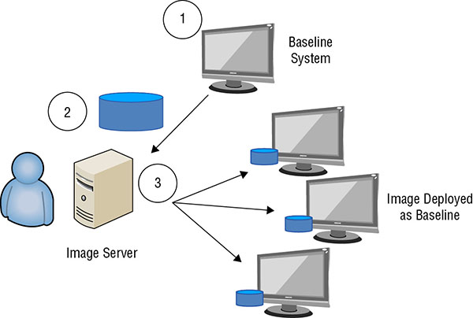

# Table of Content
------------------
   * [Applying Security Operations Concepts](#applying-security-operations-concepts)
        * [Need-to-know And Least Privilege](#need-to-know-and-least-privilege)
           * [Need-to-Know Access](#need-to-know-access)
           * [The Principle of Least Privilege](#the-principle-of-least-privilege)
        * [Separation of duties and responsibilities](#separation-of-duties-and-responsibilities)
           * [Separation of Privilege](#separation-of-privilege)
           * [Segregation of Duties](#segregation-of-duties)
           * [Two-Person Control](#two-person-control)
        * [Job Rotation](#job-rotation)
        * [Mandatory Vacations](#mandatory-vacations)
        * [Privileged Account Management](#privileged-account-management)
        * [Managing the Information Cycle](#managing-the-information-cycle)
        * [Service-Level Agreements](#service-level-agreements)
        * [Addressing Personnel Safety and Security](#addressing-personnel-safety-and-security)
           * [Duress](#duress)
           * [Travel](#travel)
        * [Emergency Management](#emergency-management)
        * [Security Training and Awareness](#security-training-and-awareness)
   * [Securely Provisioning Resources](#securely-provisioning-resources)
        * [Managing Hardware and Software Assets](#managing-hardware-and-software-assets)
           * [Hardware Inventories](#hardware-inventories)
           * [Software Licensing](#software-licensing)
        * [Protecting Physical Assets](#protecting-physical-assets)
        * [Managing Virtual Assets](#managing-virtual-assets)
        * [Managing Cloud-Based Assets](#managing-cloud-based-assets)
        * [Media Management](#media-management)
           * [Tape Media](#tape-media)
           * [Mobile Devices](#mobile-devices)
           * [Managing Media Lifecycle](#managing-media-lifecycle)
   * [Managing Configuration](#managing-configuration)
        * [Baselining](#baselining)
        * [Using images for Baselining](#using-images-for-baselining)
   * [Managing Change](#managing-change)
        * [Security Impact Analysis](#security-impact-analysis)
        * [Versioning](#versioning)
        * [Configuration Documentation](#configuration-documentation)
   * [Managing Patches and Reducing Vulnerabilities](#managing-patches-and-reducing-vulnerabilities)
        * [Systems to Manage](#systems-to-manage)
        * [Patch Management](#patch-management)
        * [Vulnerability Management](#vulnerability-management)
           * [Vulnerability Scans](#vulnerability-scans)
           * [Vulnerability Assessments](#vulnerability-assessments)
        * [Common Vulnerability And Exposures](#common-vulnerability-and-exposures)

## Applying Security Operations Concepts

The primary purpose for security operations practices is to safeguard assets including information, systems, devices, and facilities. *Purpose:* `reduce the overall risk` `identify threats and vulnerabilities.`. Security operations are part of *due care* and *due diligence* responsibility of Senior executives.

### Need-to-know And Least Privilege

It is a common mechanism to provide protection for valuable assets by limiting access to these assets.  Need-to-know focuses on permissions and the ability to access information, whereas least privilege focuses on privileges.

#### Need-to-Know Access

The primary purpose is to keep secret information secret. Limit the people who know and you increase the chances of keeping it secret. Need-to-know is commonly associated with security clearances.

#### The Principle of Least Privilege

The principle of least privilege states that subjects are granted only the privileges necessary to perform assigned work tasks and no more. The principle of least privilege relies on the assumption that all users have a well-defined job description that personnel understand. Privileges applies to user, system, data, application etc. 

Additional concepts personnel should consider when implementing need-to-know and least privilege are entitlement, aggregation, and transitive trusts:

**Entitlement** Entitlement refers to the amount of privileges granted to users, typically when first provisioning an account. Proper user provisioning processes follow the principle of least privilege.

**Aggregation** In the context of least privilege, aggregation refers to the amount of privileges that users collect over time. To avoid access aggregation problems such as this, administrators should revoke privileges when users move to a different department and no longer need the previously assigned privileges.

**Transitive Trust** There is a trust relationship between parent security domain (*primary* and *training*), with transitive trust, the trust relationship extends to child domain (eg. *training.cissp*). From least privileges perspective admin should exmain allow or deny these trust relationship in other words make it **non-transitive**.

### Separation of duties and responsibilities

Separation of duties and responsibilities ensures that no single person has total control over a critical function or system. This is necessary to ensure that no single person can compromise the system or its security. Instead, two or more people must conspire or collude against the organization, which increases the risk for these people. Its an `effective deterrent`. 

Organizational *example*, divide the security or administrative capabilities and functions among multiple trusted individuals. When the organization divides administration and security responsibilities among several users, no single person has sufficient access to circumvent or disable security mechanisms.

#### Separation of Privilege

It builds on the principle of least privilege and applies it to applications and processes. A separation-of-privilege policy requires the use of granular rights and permissions. 

#### Segregation of Duties

When duties are properly segregated, no single employee will have the ability to commit fraud or make a mistake and have the ability to cover it up. 

**Standard/Guideline:** Sarbanes–Oxley Act (SOX) of 2002 which is used by all public companies that deals with Securities and Exchange Commission (SEC).

*Example:* Personnel responsible for auditing, monitoring, and reviewing security do not have other operational duties related to what they are auditing, monitoring, and reviewing.

*Another Example:* The programmer can make unauthorized modifications to an application, but auditing or reviews by a security administrator would detect the unauthorized modifications. However, if a single person had the duties (and the privileges) of both jobs, this person could modify the application and then cover up the modifications to prevent detection.

#### Two-Person Control

Two-person control (often called the two-man rule) requires the approval of two individuals for critical tasks. *Example*, safe deposit boxes in banks often require two keys. A bank employee controls one key and the customer holds the second key.

***Split knowledge*** combines the concepts of separation of duties and two-person control into a single solution. The basic idea is that the information or privilege required to perform an operation be divided among two or more users. This ensures that no single person has sufficient privileges to compromise the security of the environment.

### Job Rotation

Job rotation (sometimes called rotation of duties) means simply that employees are rotated through jobs, or at least some of the job responsibilities are rotated to different employees. 

It is both `deterrent` and a `detection mechanism`.

If employees know that someone else will be taking over their job responsibilities at some point in the future, they are less likely to take part in fraudulent activities.

### Mandatory Vacations

Many organizations require employees to take mandatory vacations in one-week or two-week increments. Another employee takes over an individual’s job responsibilities for at least a week. If an employee is involved in fraud, the person taking over the responsibilities is likely to discover it.

It is both`deterrent` and a `detection mechanism`.

### Privileged Account Management

Privileged account management ensures that personnel do not have more privileges than they need and that they do not misuse these privileges. *Special privilege operations* includes creating new user accounts, adding new routes to a router table, altering the configuration of a firewall, and accessing system log and audit files.

Using principle of least privilege, ensures that only a limited number of people have these special privileges. ***Monitoring*** ensures that users granted these privileges do not abuse them.

*Principles such as least privilege and separation of duties help prevent security policy violations, and monitoring helps to deter and detect any violations that occur despite the use of preventive controls*

### Managing the Information Cycle

Security controls protect information throughout its lifecycle. The following list includes some terms used to identify different phases of data within its lifecycle:

**Creation or Capture** User or system creates a file or data. Network or monitoring system can capture the dats.

**Classification** Personnel should mark the data as soon as possible after creating it.

**Storage** Protected by adequate security controls based on its classification. This includes applying appropriate permissions to prevent unauthorized disclosure. Sensitive data should also be encrypted to protect it.

**Usage** Usage refers to anytime data is in use or in transit over a network.

**Archive** Data is sometimes archived to comply with laws or regulations requiring the retention of data.

**Destruction or Purging** When data is no longer needed, it should be destroyed in such a way that it is not readable. When deleting sensitive data, many organizations require personnel to destroy the disk to ensure that data is not accessible. **Standard/Guideline:** The National Institute of Standards and Technology (NIST) special publication (SP) *SP 800-88r1*, “Guidelines for Media Sanitization,” provides details on how to sanitize media. 

### Service-Level Agreements

A service-level agreement (SLA) is an agreement between an organization and an outside entity, such as a vendor. The SLA stipulates performance expectations and often includes penalties if the vendor doesn’t meet these expectations.

*Example:* Cloud-based services to rent servers.

In addition to an SLA, organizations sometimes use a ***memorandum of understanding (MOU)*** and/or an ***interconnection security agreement (ISA)***. 

MOUs document the intention of two entities to work together toward a common goal. They can use an ISA to specify the technical requirements of the connection, like minimum encryption methods .

**Standard/Guideline:** NIST Special Publication *800-47*, “Security Guide for Interconnecting Information Technology Systems,” includes detailed information on MOUs and ISAs.

### Addressing Personnel Safety and Security

Organizations should implement security controls that enhance personnel safety as they are impossible to replace.

As an *example*, consider the exit door in a datacenter that is controlled by a pushbutton electronic cipher lock. If a fire results in a power outage, does the exit door automatically unlock or remain locked? An organization that values personnel safety over the assets in the datacenter will ensure that the locks unlock the exit door when power is lost.

#### Duress

Duress systems are useful when personnel are working alone. Security systems often include code words or phrases that personnel use to verify that everything truly is okay, or to verify that there is a problem.

#### Travel

Another safety concern is when employees travel because criminals might target an organization’s employees while they are traveling. Employees should also be warned about the many risks associated with electronic devices (such as smartphones, tablets, and laptops) when traveling. These risks include the following:

**Sensitive Data** Ideally the device should not contain sensitive data but for any reason employee needs the data it should be encrypted using strong encryption.

**Malware and Monitoring Devices** Malware or monitoring software can be installed when employee travel to a foreign country. Its suggested to bring temporary devices what would be wiped clean and reimaged.

**Free Wi-Fi** Avoid to mitigate `man-in-the-middle attack`.

**VPNs** Employers should have access to virtual private networks (VPNs) that they can use to create secure connections. These can be used to access resources in the internal network, including their work-related email.

### Emergency Management

Emergency management plans and practices help an organization address personnel safety and security after a disaster.

### Security Training and Awareness

It’s also important to implement security training and awareness programs. These programs help ensure that personnel are aware of duress systems, travel best practices, emergency management plans, and general safety and security best practices.

## Securely Provisioning Resources

Another element of the security operations domain is provisioning and managing resources throughout their lifecycle.  This section focuses on the provisioning and management of other asset types such as hardware, software, physical, virtual, and cloud-based assets.

### Managing Hardware and Software Assets

*Hardware Includes:* Computers, servers, routers, switches, and peripherals
*Software Includes:* Operating systems and applications

#### Hardware Inventories

Many organizations use databases and inventory applications to perform inventories and track hardware assets through the entire equipment lifecycle. *Example* `bar-code` maps to `model, serial number, and location` in the database. *Another Example* `radio frequency identification (RFID) tags`. RFID methods significantly reduce the time needed to perform an inventory. Portable media is also considered as an asset. 

***Disposing*** `removes all data` from hard drives, nonvolatile memory, and removable media such as CDs, DVDs and USB flash drives within the system. **Standard/Guideline:** *NIST 800-88r1*. 

#### Software Licensing

License keys are used to activate softwares. If license keys are leaked outside the organization it can cause legal trouble in some cases so its should be protected. Many tools are available that can inspect systems remotely to detect the system’s details. For example, Microsoft’s System Center Configuration Manager (ConfigMgr or SCCM) is a server product that can query each system on a network.

### Protecting Physical Assets

Physical assets go beyond IT hardware and include all physical assets, such as an organization’s building and its contents. Methods used to protect physical security assets include fences, barricades, locked doors, guards, closed circuit television (CCTV) systems, and much more. *Example* Build datacenter on the center of the build rather than outside the walls. *Other examples*, cipher locks, mantraps, security badges, and guards are all common methods used to control access.

### Managing Virtual Assets

Some of the virtual assets within Software-defined everything (SDx) include the following:

**Virtual Machines (VMs)**

**Virtual Desktop Infrastructure (VDI)** or virtual desktop environment (VDE). Persistent virtual desktops retain a custom desktop for the user. Nonpersistent virtual desktops are identical for all users. If a user makes changes, the desktop reverts to a known state after the user logs off.

**Software-Defined Networks (SDNs)** SDNs decouple the control plane from the data plane (or forwarding plane). This eliminates some of the complexity related to traditional networking protocols.

**Virtual Storage Area Networks (VSANs)** A SAN is a dedicated high-speed network that hosts multiple storage devices. VSANs bypass these complexities with virtualization.

The primary software component in visualization is a hypervisor.

### Managing Cloud-Based Assets

Cloud-based assets include any resources that an organization accesses using cloud computing. One of the primary challenges with cloud-based resources hosted outside the organization is that they are outside the direct control of an organization, making it more difficult to manage the risk. `cloud service provider (CSP)`

**Software as a service (SaaS)** Software as a service (SaaS) models provide fully functional applications typically accessible via a web browser. For example, Google’s Gmail is a SaaS application. The CSP (Google in this example) is responsible for all maintenance of the SaaS services. Consumers do not manage or control any of the cloud-based assets.

**Platform as a service (PaaS)** Platform as a service (PaaS) models provide consumers with a computing platform, including hardware, an operating system, and applications. In some cases, consumers install the applications from a list of choices provided by the CSP. Consumers manage their applications and possibly some configuration settings on the host. However, the CSP is responsible for maintenance of the host and the underlying cloud infrastructure.

**Infrastructure as a service (IaaS)** Infrastructure as a service (IaaS) models provide basic computing resources to consumers. This includes servers, storage, and in some cases, networking resources. Consumers install operating systems and applications and perform all required maintenance on the operating systems and applications. The CSP maintains the cloud-based infrastructure, ensuring that consumers have access to leased systems.

**Standard/Guideline:** *NIST SP 800-145*, “The NIST Definition of Cloud Computing,” provides standard definitions for many cloud-based services. This includes definitions for service models (SaaS, PaaS, and IaaS), and definitions for deployment models (public, private, community, and hybrid). *NIST SP 800-144*, “Guidelines on Security and Privacy in Public Cloud Computing,” provides in-depth details on security issues related to cloud-based computing.

The cloud deployment model also affects the breakdown of responsibilities of the cloud-based assets. The four cloud models available are public, private, community, and hybrid.

**Public Cloud Model** `Any consumers` 

**Private Cloud Model** `single organization` `using their own on-premises resources` `responsible for all maintenance` 

**Community Cloud Model** `two or more organizations` `Maintenance responsibilities are shared based on who is hosting the assets and the service models`

**Hybrid Cloud Model** `combination of two or more clouds` `Maintenance responsibilities are shared based on who is hosting the assets and the service models.`

### Media Management

  * Media management refers to the steps taken to protect media and data stored on media. 

  * **Includes** CDs and DVDs, portable USB drives, external SATA (eSATA) drives, internal hard drives, solid-state drives, USB flash drives and many portable devices, such as smartphones. 

  * Backups are often contained on tapes. 

  * When media includes sensitive information, it should be stored in a secure location  (with temperature and humidity controls) with strict access controls to prevent losses due to unauthorized access

  * It can include technical controls like USB drives are not allowed on laptops. 

  * When media is marked, handled, and stored properly, it helps prevent unauthorized disclosure (***loss of confidentiality***), unauthorized modification (***loss of integrity***), and unauthorized destruction (***loss of availability***).

#### Tape Media

  * Used for backup

  * Take at least two copies of backups, one on onsite and another on a secure location.
    
  * Protect against: Magnetic fields, dust and dirt, avoiding sharp objects, extreme temperature, outside environment; avoid sunlight, moisture, humidity, heat, and cold.

#### Mobile Devices

  * Bring your own device (*BYOD*) and choose your own device (*CYOD*) has some management challenges, mobile device management (*MDM*) are used to maintain these devices.  

  * Some of the common controls organizations enable on user phones are encryption, screen lock, Global Positioning System (GPS), and remote wipe signals.

#### Managing Media Lifecycle

  *  Reusable media is subject to a *mean time to failure (MTTF)* that is sometimes represented in the number of times it can be reused or the number of years you can expect to keep it.

  * Monitor backups for errors and use them as a guide to gauge the lifetime in your environment. When a tape begins to generate errors, technicians should rotate it out of use.

  * Tapes are commonly destroyed in bulk shredders or incinerators.

## Managing Configuration

Configuration management helps ensure that systems are deployed in a secure consistent state and that they stay in a secure consistent state throughout their lifetime. Baselines and images are commonly used to deploy systems.

### Baselining

A baseline is a starting point. Within the context of configuration management, it is the starting configuration for a system. Administrators often modify the baseline after deploying systems to meet different requirements.

Baselines can be created with checklists but those are prone to human errors due to manual nature. A better alternative is the use of scripts and automated operating system tools to implement baselines. *Example* Microsoft operating systems include Group Policy.

### Using images for Baselining

Many organizations use images to deploy baselines. Below image show the process:

*Another Example* Norton Ghost by Symantec are different from the steps to capture and deploy images using Microsoft’s Windows Deployment Services (WDS).

Organizations typically protect the baseline images to ensure that they aren’t modified. In a worst-case scenario, malware can be injected into an image and then deployed to systems within the network.

## Managing Change

  * Deploying systems in a secure state is a good start. However, it’s also important to ensure that systems retain that same level of security. *Change management* helps reduce unanticipated outages caused by unauthorized changes.

  * The primary goal of change management is to ensure that changes do not cause outages. Change management processes ensure that appropriate personnel review and approve changes before implementation, and ensure that personnel test and document the changes.

  * Organizations constantly seek the best balance between security and usability, and there are instances when an organization makes conscious decisions to improve performance or usability of a system by weakening security. However, change management helps ensure that an organization takes the time to evaluate the risk of weakening security and compare it to the benefits of increased usability.

  * Unauthorized changes directly affect the A in the CIA Triad–availability. Additionally, some changes can weaken or reduce security. 

  * Many of the configuration and change management concepts in use today are derived from ITIL (formally an acronym for Information Technology Infrastructure Library) 

### Security Impact Analysis

  * A change management process ensures that personnel can perform a security impact analysis. Experts evaluate changes to identify any security impacts before personnel deploy the changes in a production environment.

  * Common tasks within a change management process are as follows:

    * Request the change
    * Review the change
    * Approve/reject the change
    * Test the change
    * Schedule and implement the change
    * Document the change

  * There may be instances when an emergency change is required. *Example* due to an attack or malware infection. Administrator still needs to document the changes.

  * Change document can be used to reverse the change and be a road map for changes in other system.

  * Change management control is a mandatory element for some security assurance requirements (SARs) in the ISO Common Criteria but many organizations don’t require compliance with ISO Common Criteria but its a good-to-have procedure cause it provide security against unauthorized changes.

### Versioning

  * Versioning typically refers to version control used in software configuration management. 

  * Its a labeling or numbering system, 1.0 is a first major release, 1.1 is a minor release and 2.0 would be the next major release.

  * This helps keep track of changes over time to deployed software.

### Configuration Documentation

  * Configuration documentation identifies the current configuration of systems. 

  * It identifies who is responsible for the system and the purpose of the system, and lists all changes applied to the baseline.

## Managing Patches and Reducing Vulnerabilities

Patch management and vulnerability management processes work together to help protect an organization against emerging threats. Bugs and security vulnerabilities are routinely discovered in operating systems and applications. As they are discovered, vendors write and test patches to remove the vulnerability. Patch management ensures that appropriate patches are applied, and vulnerability management helps verify that systems are not vulnerable to known threats.

### Systems to Manage

  * Devices that are included are:

    * Workstations and Servers

    * Network infrastructure systems such as routers, switches, firewalls, appliances (such as a unified threat management appliance), and printers.

    * Embedded systems are any devices that have a central processing unit (CPU), run an operating system, and have one or more applications designed to perform one or more functions. Examples include camera systems, smart televisions, household appliances (such as burglar alarm systems, wireless thermostats, and refrigerators), automobiles, medical devices, and more. These devices are sometimes referred to as the Internet of Things (IoT).

    * Mobile devices (such as smartphones and tablets) if they are managed by company policies.

### Patch Management

  * Patch is a blanket term for any type of code written to correct a bug or vulnerability or improve the performance of existing software. The software can be either an operating system or an application. Patches are sometimes referred to as updates, quick fixes, and hot fixes. In the context of security, administrators are primarily concerned with security patches, which are patches that affect the vulnerability of a system.

  * These are the common steps within an effective patch management program:

    * **Evaluate patches**
    * **Test patches** `unwanted side effects`
    * **Approve the patches** 
    * **Deploy the patches** 
    * **Verify that patches are deployed** `administrators regularly test and audit systems to ensure that they remain patched. Many deployment tools include the ability to audit systems`

  * *Patch Tuesday* by Microsoft, happens on second Tuesday of the month, so some attackers have reverse-engineered patches to identify the underlying vulnerability and then created methods to exploit the vulnerability. These attacks often start within a day after Patch Tuesday, giving rise to the term *exploit Wednesday*. 

  * As an example, the WannaCry ransomware attack in May 2017 infected more than 230,000 systems within a day. The attack exploited systems that didn’t have a Microsoft security update that was released in March 2017, about two months earlier.

### Vulnerability Management

  * Vulnerability management refers to regularly identifying vulnerabilities, evaluating them, and taking steps to mitigate risks associated with them.

  *  Two common elements of a vulnerability management program are routine vulnerability scans and periodic vulnerability assessments.

#### Vulnerability Scans

  * Vulnerability scanners are software tools used to test systems and networks for known security issues.

  * Attackers uses these to exploit the weakness, but many admin use these tools to detect vulnerability and patch them before attacker can exploit it. 

  * Vulnerability Scans have an online database so admins have to keep there software up-to-date to get updates about latest vulnerability. Its like Anti-Virus signatures.

  * Nessus is a popular vulnerability scanner managed by Tenable Network Security. 

  * Vulnerability Scans only not provide network scan but can check database (if default password is working or not), website input validation for SQL injection attacks etc. 

  * There may be situations where it isn’t feasible or desirable to apply the patch. Management can choose to accept a risk rather than mitigate it. Any risk that remains after applying a control is residual risk. Any losses that occur from residual risk are the responsibility of management.

#### Vulnerability Assessments

  * A vulnerability assessment will often include results from vulnerability scans, but the assessment will do more. For example, an annual vulnerability assessment may analyze all of the vulnerability scan reports from the past year to determine if the organization is addressing vulnerabilities.

  * Vulnerability assessment are often done as part of risk assessment. To determine risk vulnerability assessment can look into other ares like how sensitive information is marked, handled, stored, and destroyed throughout its lifetime to address potential vulnerabilities.

  * Many penetration tests start with a vulnerability assessment.

### Common Vulnerability And Exposures

  * Vulnerabilities are commonly referred to using the Common Vulnerability and Exposures (CVE) dictionary

  * MITRE maintains the CVE database, and you can view it here: [cve.mitre.org](https://cve.mitre.org/)

  * As an example, the WannaCry ransomware, mentioned earlier, took advantage of vulnerability in unpatched Windows systems, and Microsoft released Microsoft Security Bulletin MS17-010 with updates to prevent the attack. The same vulnerability is identified as CVE-2017-0143.
