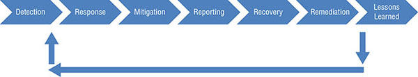

## Managing Incident Response

Regardless of best efforts incident do occur. The primary goal of incident response is to minimize the impact on the organization.

### Defining an Incident

A computer security incident (sometimes called just security incident) commonly refers to an incident that is the result of an attack, or the result of malicious or intentional actions on the part of users. For example, request for comments (RFC) 2350, “Expectations for Computer Security Incident Response,” defines both a security incident and a computer security incident as “**any adverse event which compromises some aspect of computer or network security.**” National Institute of Standards and Technology (NIST) special publication (SP) 800-61 “Computer Security Incident Handling Guide” defines a computer security incident as “**a violation or imminent threat of violation of computer security policies, acceptable use policies, or standard security practices.**” [NIST documents, including SP 800-61, can be accessed from the NIST publications page](https://csrc.nist.gov/Publications).

Within the CISSP Security Operations domain, the “Conduct incident management” objective is clearly referring to computer security incidents.

An organization normally classify security incidents as:
* Any attempted network intrusion
* Any attempted denial-of-service attack
* Any detection of malicious software
* Any unauthorized access of data
* Any violation of security policies

### Incident response steps

As per CISSP objective below are steps involved:

Note: Incident response does not include a counterattack against the attacker, as most of the time its illegal and plus attacker would be spoofing identity behind a innocent user.

#### Detection

Common technique to detect potential threats are:

* Intrusion detection and prevention systems - Alert admins
* Anti-malware software
* Many automated tools regularly scan audit logs looking for predefined events, such as the use of special privileges
* End user report an event

First responder of the threat is like first responder for medical emergency. They need to have skills to understand difference between major and minor event and should know what should be the action plan for each type of incidents.

#### Response

  * After detecting and verifying an incident, the next step is response. The response varies depending on the severity of the incident. Many organizations have a designated incident response team—sometimes called a computer incident response team (CIRT), or computer security incident response team (CSIRT)

  *  The quicker an organization can respond to an incident, the better chance they have at limiting the damage.

#### Mitigation

  * Mitigation steps attempt to contain an incident. One of the primary goals of an effective incident response is to limit the effect or scope of an incident. **For example**, if an infected computer is sending data out its network interface card (NIC), a technician can disable the NIC or disconnect the cable to the NIC.

  * Sometimes isolating the problematic device is better and solve the problem later. 

#### Reporting
  
  * Reporting refers to reporting an incident within the organization and to organizations and individuals outside the organization. Although there’s no need to report a minor malware infection to a company’s chief executive officer (CEO), upper-level management does need to know about serious security breaches.

  * Sometimes organization have legal requirement to report the incident. 

  * In response to serious security incidents, the organization should consider reporting the incident to official agencies. In US that means notify FBI etc, in Europe its International Criminal Police Organization (INTERPOL)
  
  * Training should teach individuals how to recognize incidents, what to do in the initial response, and how to report an incident.

#### Recovery 

  * After investigators collect all appropriate evidence from a system, the next step is to recover the system, or return it to a fully functioning state. This can be very simple for minor incidents and may only require a reboot. However, a major incident may require completely rebuilding a system. Rebuilding the system includes restoring all data from the most recent backup.

  * Make sure that the secure state of the system is as it was before the incident. If proper change management system is allowed then it would be documented.

#### Remediation

  * In the remediation stage, personnel look at the incident and attempt to identify what allowed it to occur, and then implement methods to prevent it from happening again. This includes performing a root cause analysis.

  * Suggestion could be vulnerability patches and/or infrastructure changes.

#### Lesson Learned

  * During the lessons learned stage, personnel examine the incident and the response to see if there are any lessons to be learned. The incident response team will be involved in this stage, but other employees who are knowledgeable about the incident will also participate.

  * The output of this stage can be fed back to the detection stage of incident management. 

## Implementing Detective and Preventive Measures

This section covers several preventive security controls that can prevent many attacks and describes many common well-known attacks.

### Basic Preventive Measures 

There is no one single step you can take to avoid all attacks but here is few key measures:

  * Keep systems and applications up-to-date.
  * Remove or disable unneeded services and protocols
  * Use intrusion detection and prevention systems.
  * Use up-to-date anti-malware software
  * Use firewalls
  * Implement configuration and system management processes

### Understanding Attacks

