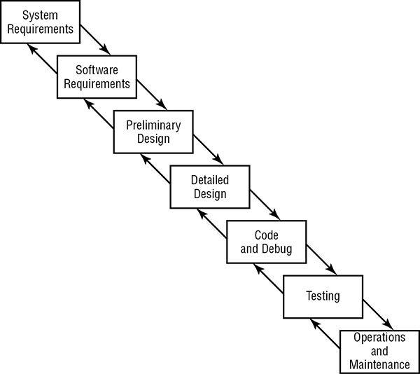
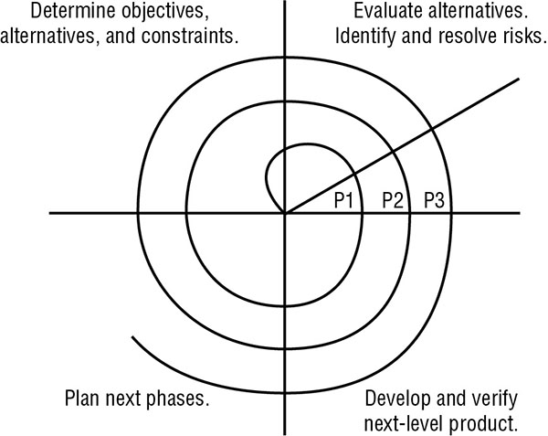

<h3>What is the problem we are trying to solve</h3>

<p>Careless developers who can create backdoors, buffer overflow vulnerabilities or weakness that will leave the system.</p>

<h3>Software Development</h3>

<blockquote class="wp-block-quote"><p>Its much easier to build security into the system than it is to add security to an existing system.</p></blockquote>

<h4>Programing Language</h4>

<p><em>Programing language that computer can understand</em></p>

<ul><li><strong>Machine language</strong>: Computer instructions are in 0's and 1's</li><li><strong>Assembly language</strong>: High-level language that uses mnemonics to represent basic instruction set for CPU.</li></ul>

<p><em>Once programmer choose their language two options available to them <strong>compilation</strong> and <strong>interpretation</strong> .</em></p>

<ul><li>Compiled Language
<ul>
<li>C, Java, and FORTRAN are compiled languages.</li>
<li><em>Compiler</em> is used to convert high-level language into executable files.</li>
<li>It's not possible to directly view or modify the software instructions.</li>
<li><em>Decompiler</em> is required to reverse engineer the software which is used to perform <code>malware analysis</code> or <code>competitive intelligence</code>.</li>
<li>As original instructions are not visible to the end user so its easier for the programmer to embed back doors and/or other security flaws.</li>
</ul>
</li><li>Interpreted Language
<ul>
<li>Python, R JavaScript, and VBScript are interpreted language.</li>
<li>End-user uses an interpreter to execute the source code.</li>
<li>Original instruction/code is visible to the end user</li>
<li>These languages are less prone to programmer embed weakness as the end code is visible to the end user.</li>
<li>But everyone has access to the source code so end-user can modify the instructions.</li>
</ul>
</li></ul>

<p><em>Object-Oriented Programming(OOP)</em></p>

<ul><li>Example Languages: C++, Java, and .NET</li><li>It focuses on <em>objects</em> involved in an interaction</li><li>From a <em>security point of view</em>, OOP provides a black-box approach to abstraction, the user only needs to know the details of an object's interface, which are input, output, and action corresponding to each object. User need not know the inner working of the object to use it.</li></ul>

<h4>Assurance</h4>

<ul><li>Ensure security control mechanism built into the new application.</li><li><em>Assurance procedures</em> are processes by which trust is built into the lifecycle of the system.</li><li><em>Common Criteria</em> provides a standardized approach to assurance use in government settings.</li></ul>

<h4>Avoiding and Mitigating System Failure</h4>

<ul><li><strong>Input Validation</strong> It verifies that the values provided by a user match the programmer's exception before allowing further processing. <em>Controls/example</em>, available to programmers are <code>limit check</code> (check if the value is in a certain range, eg. months should be limited to 1-12.), check for unusual character and if need be replace them with safe values, the process is called <code>escaping input</code>.</li><li><strong>Authentication and Session Management</strong> User should be properly <code>authenticated</code> so they can perform only <code>authorized</code> action and user <code>session</code> is tracked from start to finish. Level or type of authentication method that should be used is dictated by the level of sensitivity of that application.</li><li><strong>Error Handling</strong> Developer should disable detailed error messaging (<code>debugging mode</code>) on any servers and application that will display internal information to the attacker.</li><li><strong>Logging</strong> The application should be configured to send detailed logging of errors and other security events to a centralized log repository. Open Web Application Security Project (<a title="OWASP" href="https://www.owasp.org/index.php/OWASP_Secure_Coding_Practices_Checklist#Error_Handling_and_Logging">OWASP</a>) Secure Coding Guidelines suggest logging the following events:
<ul>
<li>Input validation failures</li>
<li>Authentication attempts, especially failures</li>
<li>Access control failures</li>
<li>Tampering attempts</li>
<li>Use of invalid or expired session tokens</li>
<li>Exceptions raised by the operating system or applications</li>
<li>Use of administrative privileges</li>
<li>Transport Layer Security (TLS) failures</li>
<li>Cryptographic errors</li>
</ul>
</li><li><strong>Fail-Secure and Fail-Open</strong> <code>Fail-Secure</code> failure state puts the system into a high level of security (or disable the system) until an admin can diagnose the issue and restore the system to normal operation. Example, Blue screen of death (BSOD) when Windows (OS) put a system to halt with STOP error. <code>Fail-Open</code> states allow users to bypass failed security controls. This option should be used with extreme caution and ideally, alternative controls should be in place to protect the resources.</li></ul>

<h4>Systems Development Lifecycle</h4>

<p>Core activities are (<code>__</code> showcase keywords to keep in mind):</p>

<ul><li>Conceptual definition: <code>Purpose</code> <code>System Requirement</code></li><li>Functional requirements determination: <code>Specific System functionalties</code></li><li>Control specifications development: <code>From Security prespective</code> <code>aduquate access control</code> <code>maintain confidentiality</code> <code>done proactivily</code></li><li>Design review</li><li>Code review walk-through</li><li>System test review: <code>User Acceptance Testing</code></li><li>Maintenance and change management</li></ul>

<h4>Lifecycle Models</h4>

<blockquote class="wp-block-quote"><p>Software development lifecycle (SDLC)

</p></blockquote>

<p><strong>Waterfall Model</strong></p>

<ul><li>Winston Royce in 1970</li><li>Series of iterative activities</li><li>Seven Stages</li><li>As each stage is completed, the project moves into the next phase</li><li><em>Modern</em> waterfall model does allow developers to return to the previous phase to correct defects discovered during the subsequent phase. This is often known as the <code>feedback loop characteristic</code> of the waterfall model.</li><li>Major criticisms: Allows to step back only one phase, which does not allow correction of a defect detected in later phases.</li></ul>

<figure class="wp-block-image is-resized"></figure>

<p><strong>Spiral Model</strong></p>

* 1988, Barry Boehm created Sprial Model
* Multiple iterations of a waterfall-style process.
* Its also called metamodel, or a “model of models.” 

<figure class="wp-block-image"></figure>

* At each round a prototype is created (P1, P2 .. ) so product mature with every round.

<p><strong>Agile Software Development</strong></p>

* One of the most propular development models of modern times, which helps developers to develop new functionality that meets those needs in an iterative fashion. Many variants are available, including Scrum, Agile Unified Process (AUP), the Dynamic Systems Development Model (DSDM), and Extreme Programming (XP).

* Values:
  * **Individuals and interactions** over processes and tools
  * **Working software** over comprehensive documentation
  * **Customer collaboration** over contract negotiation
  * **Responding to change** over following a plan

* [Principles](http://agilemanifesto.org/principles.html):
```
Our highest priority is to satisfy the customer through early and continuous delivery of valuable software.

Welcome changing requirements, even late in development. Agile processes harness change for the customer's competitive advantage.

Deliver working software frequently, from a couple of weeks to a couple of months, with a preference to the shorter timescale.

Business people and developers must work together daily throughout the project.

Build projects around motivated individuals. Give them the environment and support they need, and trust them to get the job done.

The most efficient and effective method of conveying information to and within a development team is face-to-face conversation.

Working software is the primary measure of progress.

Agile processes promote sustainable development. The sponsors, developers, and users should be able to maintain a constant pace indefinitely.

Continuous attention to technical excellence and good design enhances agility.

Simplicity--the art of maximizing the amount of work not done--is essential.

The best architectures, requirements, and designs emerge from self-organizing teams.

At regular intervals, the team reflects on how to become more effective, then tunes and adjusts its behavior accordingly.
```

<p><strong>Software Capability Maturity Model</strong></p>

<p><strong>IDEAL Model</strong></p>

