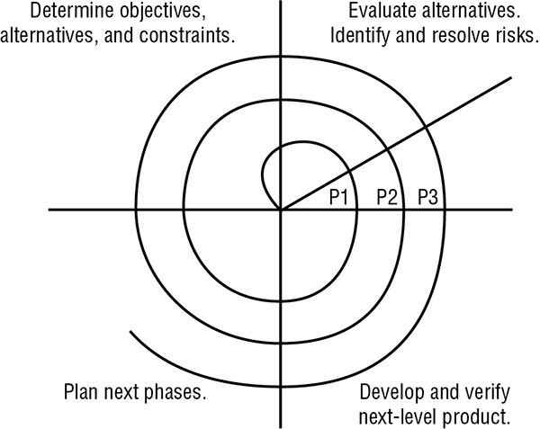

# Table of Content
------------------
* [What is the problem we are trying to solve](#what-is-the-problem-we-are-trying-to-solve)
 * [Software Development](#software-development)
    * [Programing Language](#programing-language)
    * [Assurance](#assurance)
    * [Avoiding and Mitigating System Failure](#avoiding-and-mitigating-system-failure)
    * [Systems Development Lifecycle](#systems-development-lifecycle)
    * [Lifecycle Models](#lifecycle-models)
    * [Gantt Charts and PERT](#gantt-charts-and-pert)
    * [Change and Configuration Management](#change-and-configuration-management)
    * [The DevOps Approach (Development and Operations)](#the-devops-approach-development-and-operations)
    * [Application programing interfaces (API)](#application-programing-interfaces-api)
    * [Software testing](#software-testing)
    * [Code Repositories](#code-repositories)
    * [Service Level Agreements](#service-level-agreements)
    * [Software Acquisition](#software-acquisition)
   * [Complete this](#complete-this)
 * [Establishing Databases and Data Warehousing](#establishing-databases-and-data-warehousing)
    * [Database Management System Architecture](#database-management-system-architecture)
    * [Security for multilevel databases](#security-for-multilevel-databases)
    * [Open Database Connectivity](#open-database-connectivity)

<h3>What is the problem we are trying to solve</h3>

<p>Careless developers who can create backdoors, buffer overflow vulnerabilities or weakness that will leave the system.</p>

<h3>Software Development</h3>

<blockquote class="wp-block-quote"><p>Its much easier to build security into the system than it is to add security to an existing system.</p></blockquote>

<h4>Programing Language</h4>

<p><em>Programing language that computer can understand</em></p>

<ul><li><strong>Machine language</strong>: Computer instructions are in 0's and 1's</li><li><strong>Assembly language</strong>: High-level language that uses mnemonics to represent basic instruction set for CPU.</li></ul>

<p><em>Once programmer choose their language two options available to them <strong>compilation</strong> and <strong>interpretation</strong> .</em></p>

<ul><li>Compiled Language
<ul>
<li>C, Java, and FORTRAN are compiled languages.</li>
<li><em>Compiler</em> is used to convert high-level language into executable files.</li>
<li>It's not possible to directly view or modify the software instructions.</li>
<li><em>Decompiler</em> is required to reverse engineer the software which is used to perform <code>malware analysis</code> or <code>competitive intelligence</code>.</li>
<li>As original instructions are not visible to the end user so its easier for the programmer to embed back doors and/or other security flaws.</li>
</ul>
</li><li>Interpreted Language
<ul>
<li>Python, R JavaScript, and VBScript are interpreted language.</li>
<li>End-user uses an interpreter to execute the source code.</li>
<li>Original instruction/code is visible to the end user</li>
<li>These languages are less prone to programmer embed weakness as the end code is visible to the end user.</li>
<li>But everyone has access to the source code so end-user can modify the instructions.</li>
</ul>
</li></ul>

<p><em>Object-Oriented Programming(OOP)</em></p>

<ul><li>Example Languages: C++, Java, and .NET</li><li>It focuses on <em>objects</em> involved in an interaction</li><li>From a <em>security point of view</em>, OOP provides a black-box approach to abstraction, the user only needs to know the details of an object's interface, which are input, output, and action corresponding to each object. User need not know the inner working of the object to use it.</li></ul>

<h4>Assurance</h4>

<ul><li>Ensure security control mechanism built into the new application.</li><li><em>Assurance procedures</em> are processes by which trust is built into the lifecycle of the system.</li><li><em>Common Criteria</em> provides a standardized approach to assurance use in government settings.</li></ul>

<h4>Avoiding and Mitigating System Failure</h4>

<ul><li><strong>Input Validation</strong> It verifies that the values provided by a user match the programmer's exception before allowing further processing. <em>Controls/example</em>, available to programmers are <code>limit check</code> (check if the value is in a certain range, eg. months should be limited to 1-12.), check for unusual character and if need be replace them with safe values, the process is called <code>escaping input</code>.</li><li><strong>Authentication and Session Management</strong> User should be properly <code>authenticated</code> so they can perform only <code>authorized</code> action and user <code>session</code> is tracked from start to finish. Level or type of authentication method that should be used is dictated by the level of sensitivity of that application.</li><li><strong>Error Handling</strong> Developer should disable detailed error messaging (<code>debugging mode</code>) on any servers and application that will display internal information to the attacker.</li><li><strong>Logging</strong> The application should be configured to send detailed logging of errors and other security events to a centralized log repository. Open Web Application Security Project (<a title="OWASP" href="https://www.owasp.org/index.php/OWASP_Secure_Coding_Practices_Checklist#Error_Handling_and_Logging">OWASP</a>) Secure Coding Guidelines suggest logging the following events:
<ul>
<li>Input validation failures</li>
<li>Authentication attempts, especially failures</li>
<li>Access control failures</li>
<li>Tampering attempts</li>
<li>Use of invalid or expired session tokens</li>
<li>Exceptions raised by the operating system or applications</li>
<li>Use of administrative privileges</li>
<li>Transport Layer Security (TLS) failures</li>
<li>Cryptographic errors</li>
</ul>
</li><li><strong>Fail-Secure and Fail-Open</strong> <code>Fail-Secure</code> failure state puts the system into a high level of security (or disable the system) until an admin can diagnose the issue and restore the system to normal operation. Example, Blue screen of death (BSOD) when Windows (OS) put a system to halt with STOP error. <code>Fail-Open</code> states allow users to bypass failed security controls. This option should be used with extreme caution and ideally, alternative controls should be in place to protect the resources.</li></ul>

<h4>Systems Development Lifecycle</h4>

<p>Core activities are (<code>__</code> showcase keywords to keep in mind):</p>

<ul><li>Conceptual definition: <code>Purpose</code> <code>System Requirement</code></li><li>Functional requirements determination: <code>Specific System functionalties</code></li><li>Control specifications development: <code>From Security prespective</code> <code>aduquate access control</code> <code>maintain confidentiality</code> <code>done proactivily</code></li><li>Design review</li><li>Code review walk-through</li><li>System test review: <code>User Acceptance Testing</code></li><li>Maintenance and change management</li></ul>

<h4>Lifecycle Models</h4>

<blockquote class="wp-block-quote"><p>Software development lifecycle (SDLC)

</p></blockquote>

<p><strong>Waterfall Model</strong></p>

<ul><li>Winston Royce in 1970</li><li>Series of iterative activities</li><li>Seven Stages</li><li>As each stage is completed, the project moves into the next phase</li><li><em>Modern</em> waterfall model does allow developers to return to the previous phase to correct defects discovered during the subsequent phase. This is often known as the <code>feedback loop characteristic</code> of the waterfall model.</li><li>Major criticisms: Allows to step back only one phase, which does not allow correction of a defect detected in later phases.</li></ul>

<figure class="wp-block-image is-resized"></figure>

<p><strong>Spiral Model</strong></p>

* 1988, Barry Boehm created Sprial Model
* Multiple iterations of a waterfall-style process.
* Its also called metamodel, or a “model of models.” 

<figure class="wp-block-image"></figure>

* At each round a prototype is created (P1, P2 .. ) so product mature with every round.

<p><strong>Agile Software Development</strong></p>

* One of the most propular development models of modern times, which helps developers to develop new functionality that meets those needs in an iterative fashion. Many variants are available, including Scrum, Agile Unified Process (AUP), the Dynamic Systems Development Model (DSDM), and Extreme Programming (XP).

* Values:
  * **Individuals and interactions** over processes and tools
  * **Working software** over comprehensive documentation
  * **Customer collaboration** over contract negotiation
  * **Responding to change** over following a plan

* [Principles](http://agilemanifesto.org/principles.html):
```
Our highest priority is to satisfy the customer through early and 
continuous delivery of valuable software.

Welcome changing requirements, even late in development. Agile 
processes harness change for the customer's competitive advantage.

Deliver working software frequently, from a couple of weeks to 
a couple of months, with a preference to the shorter timescale.

Business people and developers must work together daily throughout 
the project.

Build projects around motivated individuals. Give them the environment
 and support they need, and trust them to get the job done.

The most efficient and effective method of conveying information to
 and within a development team is face-to-face conversation.

Working software is the primary measure of progress.

Agile processes promote sustainable development. The sponsors, 
developers, and users should be able to maintain a constant pace indefinitely.

Continuous attention to technical excellence and good design 
enhances agility.

Simplicity--the art of maximizing the amount of work not done--is
 essential.

The best architectures, requirements, and designs emerge from
 self-organizing teams.

At regular intervals, the team reflects on how to become more 
effective, then tunes and adjusts its behavior accordingly.
```

<p><strong>Software Capability Maturity Model</strong></p>

* Capability Maturity Model for Software, also known as the Software Capability Maturity Model (abbreviated as SW-CMM, CMM, or SCMM)
* Mantra: maturity phases in sequential fashion.
* The idea behind the SW-CMM is that the quality of software depends on the quality of its development process.
* Stages:


<p><strong>IDEAL Model</strong></p>

* It implements many of the SW-CMM attributes
* Five Phases: *Initiating > Diagnosing > Establishing > Acting > Learning*


> For Memorization: To help you remember the initial letters of each of the 10 level names of the SW-CMM and IDEAL models (II DR ED AM LO), imagine yourself sitting on the couch in a psychiatrist’s office saying, “I…I, Dr. Ed, am lo(w).” If you can remember that phrase, then you can extract the 10 initial letters of the level names. If you write the letters out into two columns, you can reconstruct the level names in order of the two systems. The left column is the IDEAL model, and the right represents the levels of the SW-CMM. 

IDEAL | SW-CMM
--- | ---
Initiating | Initiating
Diagnosing | Repeatable
Establishing | Defined
Acting | Managed
Learning | Optimized

#### Gantt Charts and PERT

* Gantt Charts is a bar chart that shows the interrelationships over time between projects and schedules.
* It provides a graphical illustration of a schedule that helps to plan, coordinate, and track specific tasks in a project


* Program Evaluation Review Technique (**PERT**) is a project-scheduling tool used to judge the size of a software product in development and calculate the standard deviation (SD) for risk assessment. 
* PERT is used to direct improvements to project management and software coding in order to produce more efficient software. 


#### Change and Configuration Management

* Organization must put a procedure in place to manage changes in an organized fashion. 

* CThose changes should then be logged to a central repository to support future auditing, investigation, and analysis requirements.

* CHANGE MANAGEMENT AS A SECURITY TOOL: **Example situation**: System administrators receive an alert only if the security team identifies a change that does not appear to correlate with an approved change request. **Example tool**,`Tripwire`

* Three basic components:
  * Request Control: `Organized Framework` `Request Modification`
  * Change Control: `Reproduce Situation` `Come up with a solution` `Testing` `Quality control` 
  * Release Control: `Double Check the impact (if any) of the change`

* Configuration management: This process is used to control the version(s) of software used throughout an organization and formally track and control changes to the software configuration. Four main components:
  * Configuration Identification
  * Configuration Control 
  * Configuration Status Accounting
  * Configuration Audit

#### The DevOps Approach (Development and Operations)

* *Issue:*  Disconnect between the major IT functions of software development, quality assurance, and technology operations.

* Resolution to this issue: Bringing the three functions together in a single operational model. 

* DevOps model is closely aligned with the *Agile development* approach.

* Aim: Decrease the time required to develop, test, and deploy software changes.

#### Application programing interfaces (API)

* Cross-site functions to work properly, the websites must interact with each other. Many organizations offer application programming interfaces (APIs) for this purpose.

* **For example**, a social media API might include some of the following API function calls:

  * Post status
  * Follow user
  * Unfollow user
  * Like/Favorite a post

* **Security:** `Authentication` `Verify authentication and authorization of every API call` `Complex API key` `Keep it safe`


#### Software testing

* One of the tests you should perform is a **reasonableness check**. The reasonableness check ensures that values returned by software match specified criteria that are within reasonable bounds. **Example**, query of the weight of an human being returns 600 pounds which should fail reasonableness check.

* Check how the product handles normal and valid input data, incorrect types, out-of-range values, and other bounds and/or conditions. Live workloads provide the best stress testing possible.

* Do not use live or actual field data for testing, especially in the early development stages, since a flaw or error could result in the violation of integrity or confidentiality of the test data.

* Separation of duties should be used to enable testing, someone other than programmer should perform testing. Why? To avoid a conflict of interest and assure a more secure and functional finished product.

* Third party tester should be used for objective and nonbiased examination. They would do broader and more thorough test and prevents the bias and inclinations of the programmers from affecting the results of the test.

* Three software testing methods:

  * White-Box Testing: `Examines the internal logical structures of a program (Code)`
  * Black-Box Testing: `Examines the program from a user perspective (Functional)` `No code access`
  * Gray-Box Testing: `Combines the two approaches` `Testers examine the software from a user perspective` `access to the source code to design their tests` `do not analyze the inner workings of the program`

 * Two categories of testing used specifically to evaluate application security:

   * Static Testing: `Evaluates security without running it by analyzing either the source code or the compiled application` `Automated tools designed to detect common software flaws, such as buffer overflows`

   * Dynamic Testing: `Evaluates the security of software in a runtime environment` 

#### Code Repositories

* Code repositories from high level is a collaborative tool.

* **Examples:** GitHub, Bitbucket, and SourceForge

* Features included version control, bug tracking, web hosting, release management, and communications functions.

* **Security**: Repository owners must carefully design access controls to only allow appropriate users read and/or write access.

* **Example of a breach:** AWS API Keys getting published on Github etc

#### Service Level Agreements

* Providing services to internal and/or external customers maintain an appropriate level of service agreed on by both the service provider and the vendor.

* Service-level agreements can have financial clauses, **for example**, if a critical circuit is down for more than 15 minutes, the service provider might agree to waive all charges on that circuit for one week.

#### Software Acquisition 

From security perspective:

  * Security professionals must understand the proper configuration of that software to meet security objectives. 
  * Keep track of security bulletins and patches that correct newly discovered vulnerabilities.
  * In SaaS environments, security professionals should monitoring the vendor’s security via audits, assessments, vulnerability scans, and other measures designed to verify that the vendor maintains proper controls.

### Establishing Databases and Data Warehousing

#### Database Management System Architecture

Vast majority of contemporary systems implement a technology known as *relational database management systems (RDBMSs)*.

**Hierarchical and Distributed Databases**

* Hierarchical data model: `logical tree structure` `one-to-many data model`


* Other examples of hierarchical data models include the NCAA March Madness bracket system and the hierarchical distribution of Domain Name System (DNS) records used on the internet. 

* Distributed data model has data stored in more than one database, but those databases are logically connected. 

* The data mapping relationship for distributed databases is many-to-many.

**Relational Databases**

* A relational database consists of flat two-dimensional tables made up of rows and columns. 

* one-to-one data relationship

* The number of rows in the relation is referred to as *cardinality*, and the number of columns is the *degree*. 


In this example, the table has a cardinality of 3 (corresponding to the three rows in the table) and a degree of 8 (corresponding to the eight columns). 

*  The *domain* of an attribute is the set of allowable values that the attribute can take.

> To remember the concept of cardinality, think of a deck of cards on a desk, with each card (the first four letters of cardinality) being a row. To remember the concept of degree, think of a wall thermometer as a column (in other words, the temperature in degrees as measured on a thermometer).

* Records are identified using a variety of *keys*. Quite simply, keys are a subset of the fields of a table and are used to uniquely identify records. 

* **Candidate Keys** A candidate key is a subset of attributes that can be used to uniquely identify any record in a table. No two records in the same table will ever contain the same values for all attributes composing a candidate key. Each table may have one or more candidate keys, which are chosen from column headings.

* **Primary Keys** A primary key is selected from the set of candidate keys for a table to be used to uniquely identify the records in a table. Each table has only one primary key, selected by the database designer from the set of candidate keys. The RDBMS enforces the uniqueness of primary keys by disallowing the insertion of multiple records with the same primary key. Example, Customer ID would likely be the primary key.

* **Foreign Keys** A foreign key is used to enforce relationships between two tables, also known as `referential integrity`. Referential integrity ensures that if one table contains a foreign key, it corresponds to a still-existing primary key in the other table in the relationship. It makes certain that no record/tuple/row contains a reference to a primary key of a nonexistent record/tuple/row. Example, Sales Rep field shown is a foreign key referencing the primary key of the Sales Reps table.

* Database normalization:

Database developers strive to create well-organized and efficient databases. To assist with this effort, they’ve defined several levels of database organization known as `normal forms`. The process of bringing a database table into compliance with normal forms is known as *normalization*.

Three most common are `first normal form (1NF), second normal form (2NF), and third normal form (3NF)`. Each of these forms adds requirements to reduce redundancy in the tables, eliminating misplaced data and performing a number of other housekeeping tasks. 

* SQL itself is divided into two distinct components: the `Data Definition Language (DDL),` which allows for the creation and modification of the database’s structure (known as the `schema`), and the `Data Manipulation Language (DML)`, which allows users to interact with the data contained within that schema.

#### Database Transaction

Each transaction is a discrete set of SQL instructions that will either succeed or fail as a group. You might use the following SQL code to first add $250 to account 1001 and then subtract $250 from account 2002:

```
BEGIN TRANSACTION
UPDATE accounts
SET balance = balance + 250
WHERE account_number = 1001;
 
UPDATE accounts
SET balance = balance – 250
WHERE account_number = 2002
 
END TRANSACTION
```

When a transaction successfully finishes, it is said to be committed to the database and cannot be undone. Transaction committing may be explicit, using SQL’s `COMMIT` command, or it can be implicit if the end of the transaction is successfully reached. If a transaction must be aborted, it can be rolled back explicitly using the `ROLLBACK` command or implicitly if there is a hardware or software failure. 

All database transactions have four required characteristics: atomicity, consistency, isolation, and durability. Together, these attributes are known as the *ACID model*

**Atomicity** Database transactions must be atomic—that is, they must be an “all-or-nothing” affair.

**Consistency** All transactions must begin (or complete) operating in an environment that is consistent with all of the database’s rules (for example, all records have a unique primary key).

**Isolation** If a database receives two SQL transactions that modify the same data, one transaction must be completed in its entirety before the other transaction is allowed to modify the same data.

**Durability** Database transactions must be durable. That is, once they are committed to the database, they must be preserved. Databases ensure durability through the use of backup mechanisms, such as transaction logs.

#### Security for multilevel databases

* Multilevel security databases contain information at a number of different classification levels

* Mixing data with different classification levels and/or need-to-know requirements is known as *database contamination* and is a significant security challenge.

* Administrators will deploy a trusted front end to add multilevel security to a legacy or insecure DBMS and another method is to use `database views`. 

**Concurrency** 

Concurrency, or edit control, is a preventive security mechanism that endeavors to make certain that the information stored in the database is always correct or at least has its integrity and availability protected. This feature can be employed on a single-level or multilevel database.

Databases that fail to implement concurrency correctly may suffer from the following issues:

*Lost updates* occur when two different processes make updates to a database unaware of each other’s activity
*Dirty reads* occur when a process reads a record from a transaction that did not successfully commit.

Concurrency uses a `“lock”` feature to allow one user to make changes but deny other users access to views or make changes to data elements at the same time. 

In some instances, administrators will use concurrency with auditing mechanisms to track document and/or field changes. When this recorded data is reviewed, concurrency becomes a `detective control`.

#### Other Security Mechanisms

*Semantic integrity* ensures that user actions don’t violate any structural rules. It also checks that all stored data types are within valid domain ranges, ensures that only logical values exist, and confirms that the system complies with any and all uniqueness constraints.

Employ *time and date* stamps to maintain data integrity and availability.

Objects can be controlled granularly within the database; this can also improve security control. `Content-dependent access control` is an example of granular object control. ` increases processing overhead`.  Another form of granular control is *cell suppression*. Cell suppression is the concept of hiding individual database fields or cells or imposing more security restrictions on them.

Employ *database partitioning* to subvert aggregation and inference vulnerabilities.

*Polyinstantiation*, in the context of databases, occurs when two or more rows in the same relational database table appear to have identical primary key elements but contain different data for use at differing classification levels

Finally, administrators can insert false or misleading data into a DBMS in order to redirect or thwart information confidentiality attacks. This is a concept known as *noise and perturbation*.

### Open Database Connectivity 

Open Database Connectivity (ODBC) acts as a proxy between applications and backend database drivers, giving application programmers greater freedom in creating solutions without having to worry about the backend database system:


### NOSQL

NoSQL databases are a class of databases that use models other than the relational model to store data.

These are the three major classes of NoSQL database:

* *Key/value stores*
* *Graph databases*
* *Document stores* Common document types used in document stores include Extensible Markup Language (XML) and JavaScript Object Notation (JSON).

## Storing Data and Information

### Types of Storage

* *Primary (or “real”) memory* `volatile` `random-access memory (RAM)`
* *Secondary storage* `nonvolatile` `magnetic and optical media (CD, DVD etc)`
* *Virtual memory* `simulate additional primary memory`
* *Virtual storage*  `simulate secondary storage resources`
* *Random access storage*  allows the operating system to request contents from any point within the media. `RAM and hard drives`
* *Sequential access storage* requires scanning through the entire media from the beginning to reach a specific address. `magnetic tape`
* *Volatile storage* loses its contents when power is removed from the resource
* *Nonvolatile storage* does not depend upon the presence of power to maintain its contents.

### Storage threat

* The threat of illegitimate access to storage. 
* fail-safe controls
* encrypted filesystem
* Example, AWS S3 exposure 
* Covert channel attacks pose the second primary threat against data storage resources. 

## Understanding Knowledge-Based Systems

The following sections examine two types of knowledge-based artificial intelligence systems: expert systems and neural networks. We’ll also take a look at their potential applications to computer security problems.

### Expert Systems

* Expert systems seek to embody the accumulated knowledge of experts on a particular subject and apply it in a consistent fashion to future decisions.
* Two main components: the knowledge base and the inference engine.
* The `knowledge base` contains the rules known by an expert system. The knowledge base seeks to codify the knowledge of human experts in a series of “if/then” statements.
* The `inference engine`—analyzes information in the knowledge base to arrive at the appropriate decision.
* Expert systems are not infallible—they’re only as good as the data in the knowledge base and the decision-making algorithms implemented in the inference engine.

### Machine Learning 

* Machine learning techniques use analytic capabilities to develop knowledge from datasets without the direct application of human insight.
* Two major categories:

  * *Supervised learning* techniques use labeled data for training. The analyst creating a machine learning model provides a dataset along with the correct answers and allows the algorithm to develop a model that may then be applied to future cases.

  * *Unsupervised learning* techniques use unlabeled data for training. The dataset provided to the algorithm does not contain the “correct” answers; instead, the algorithm is asked to develop a model independently.

### Neural Networks

* In a neural network, a long chain of computational decisions that feed into each other and eventually sum to produce the desired output is set up. Neural networks are an extension of machine learning techniques and are also commonly referred to as *deep learning* or cognitive systems.

`Delta rule or learning rule`

### Security Applications

Knowledge-based analytic techniques have great applications in the field of computer security. One of the major advantages offered by these systems is their capability to rapidly make consistent decisions. One of the major problems in computer security is the inability of system administrators to consistently and thoroughly analyze massive amounts of log and audit trail data to look for anomalies
